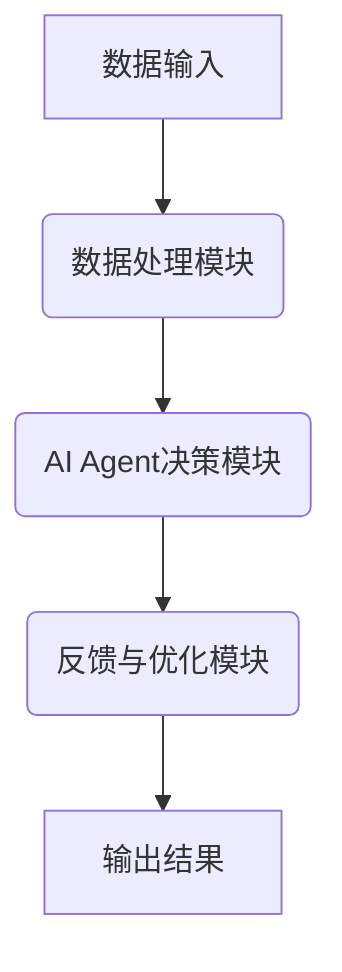
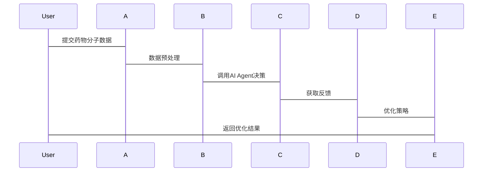

                 


# AI Agent在新药研发中的应用实践

**关键词**：AI Agent、新药研发、人工智能、药物发现、强化学习、生成模型

**摘要**：本文探讨AI Agent在新药研发中的应用，涵盖其核心概念、算法原理、系统架构设计及实际案例分析。通过详细的技术解析和实例，展示AI Agent如何提升药物研发的效率和精准度，为读者提供全面的技术视角。

---

## 目录大纲

1. [AI Agent与新药研发概述](#ai-agent与新药研发概述)
2. [AI Agent的核心原理](#ai-agent的核心原理)
3. [AI Agent的系统架构与实现](#ai-agent的系统架构与实现)
4. [AI Agent在新药研发中的项目实战](#ai-agent在新药研发中的项目实战)
5. [总结与展望](#总结与展望)

---

## 第1章 AI Agent与新药研发概述

### 1.1 AI Agent的基本概念

- **定义**：AI Agent是一种智能体，能够感知环境、自主决策并执行任务，具备学习和适应能力。
- **核心特征**：
  - 自主性：无需外部干预，自主完成任务。
  - 反应性：根据环境反馈调整行为。
  - 学习能力：通过经验优化决策策略。

### 1.2 新药研发的挑战与机遇

- **挑战**：
  - 时间长：从药物发现到上市平均需10-12年。
  - 成本高：研发费用动辄数十亿美元。
  - 成功率低：临床试验失败率高达90%。
- **机遇**：
  - AI技术加速分子设计与优化。
  - 数据驱动的方法提高药物筛选效率。

### 1.3 AI Agent在新药研发中的应用场景

- **分子设计与优化**：
  - 利用生成模型设计新型化合物。
  - 优化药物分子的物理化学性质。
- **药物筛选与预测**：
  - 预测化合物的药代动力学性质。
  - 预测药物对特定靶点的作用。
- **药理学研究与临床试验辅助**：
  - 帮助设计临床试验方案。
  - 预测患者群体的反应。

---

## 第2章 AI Agent的核心原理

### 2.1 AI Agent的决策机制

- **状态空间与动作空间**：
  - 状态：环境中的当前情况，如分子结构。
  - 动作：AI Agent可执行的操作，如生成新分子。
- **奖励函数与目标函数**：
  - 奖励：根据行为的好坏给予反馈，如生成有效化合物的奖励。
  - 目标：最大化累积奖励。

### 2.2 强化学习在AI Agent中的应用

- **Q-learning算法原理**：
  - 通过Q表记录状态-动作对的期望奖励。
  - 更新公式：$$ Q(s,a) = Q(s,a) + \alpha [r + \gamma \max Q(s',a') - Q(s,a)] $$
- **Deep Q-Networks (DQN)实现**：
  - 使用神经网络近似Q值函数。
  - 解决高维状态空间问题。
- **策略梯度方法**：
  - 直接优化策略，如Actor-Critic算法。

### 2.3 AI Agent的数学模型

- **Q-learning数学公式**：
  $$ Q(s,a) = Q(s,a) + \alpha [r + \gamma \max Q(s',a') - Q(s,a)] $$
- **策略梯度数学模型**：
  $$ \nabla \theta \log \pi(a|s) \cdot Q(s,a) $$

### 2.4 实例分析：AI Agent在药物筛选中的应用

- **分子生成案例**：
  - 使用生成对抗网络（GAN）生成潜在的新药分子。
- **药物优化案例**：
  - 利用强化学习优化药物分子的药代动力学性质。

---

## 第3章 AI Agent的系统架构与实现

### 3.1 系统功能模块划分

- **数据输入模块**：
  - 接收药物分子数据和实验结果。
- **智能决策模块**：
  - 执行AI Agent的决策过程。
- **反馈与优化模块**：
  - 根据实验结果优化AI Agent的策略。

### 3.2 系统架构图



### 3.3 系统接口设计

- **输入接口**：
  - 接收药物分子数据和实验结果。
- **输出接口**：
  - 提供优化后的药物分子和预测结果。

### 3.4 系统交互流程图



---

## 第4章 AI Agent在新药研发中的项目实战

### 4.1 环境安装

```bash
pip install numpy matplotlib tensorflow
```

### 4.2 核心代码实现

```python
import numpy as np
import tensorflow as tf

# 定义Q-learning网络
class QNetwork:
    def __init__(self, state_size, action_size, hidden_size=64):
        self.model = tf.keras.Sequential([
            tf.keras.layers.Dense(hidden_size, activation='relu', input_shape=(state_size,)),
            tf.keras.layers.Dense(action_size)
        ])
        self.optimizer = tf.keras.optimizers.Adam(lr=0.001)

    def call(self, state):
        return self.model(state)

    def update(self, state, action, target):
        with tf.GradientTape() as tape:
            prediction = self.model(state)
            loss = tf.reduce_mean(tf.square(target - prediction))
        gradients = tape.gradient(loss, self.model.trainable_weights)
        self.optimizer.apply_gradients(zip(gradients, self.model.trainable_weights))
```

### 4.3 实际案例分析

- **案例背景**：寻找抗肿瘤药物分子。
- **代码应用**：
  ```python
  state_size = 100  # 示例分子特征维度
  action_size = 50   # 示例可能的药物分子数量
  q_network = QNetwork(state_size, action_size)
  # 训练过程略
  ```

### 4.4 项目小结

- **经验总结**：AI Agent能够显著提高药物研发效率。
- **注意事项**：数据质量和模型训练至关重要。

---

## 第5章 总结与展望

### 5.1 总结

- AI Agent通过强化学习和生成模型，显著提升新药研发的效率和精准度。
- 在分子设计、药物筛选等方面展现出巨大潜力。

### 5.2 展望

- **多模态数据整合**：结合基因组学、蛋白质组学等多源数据。
- **可解释性增强**：提高AI决策的透明度，便于监管和临床应用。
- **伦理与安全**：确保AI Agent的应用符合伦理规范，避免潜在风险。

---

## 作者信息

作者：AI天才研究院/AI Genius Institute & 禅与计算机程序设计艺术 /Zen And The Art of Computer Programming

---

这篇文章系统地介绍了AI Agent在新药研发中的应用，从理论到实践，为读者提供了全面的技术视角。通过详细的技术解析和实际案例分析，展示了AI Agent如何提升药物研发的效率和精准度。希望本文能够为相关领域的研究人员和从业者提供有价值的参考和启发。

