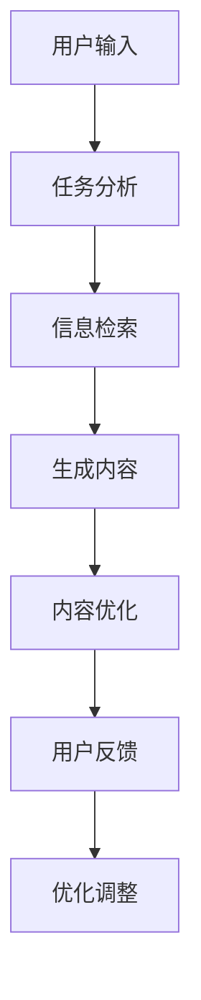
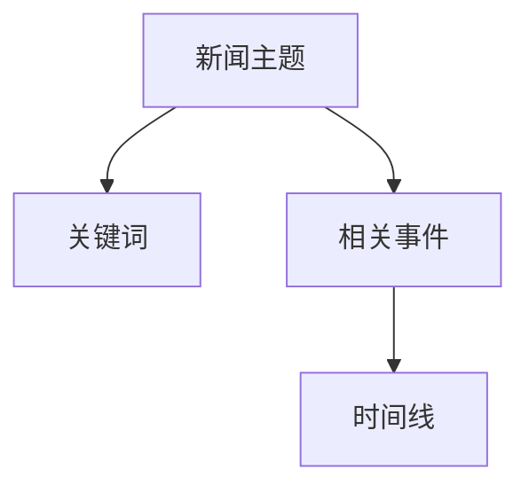
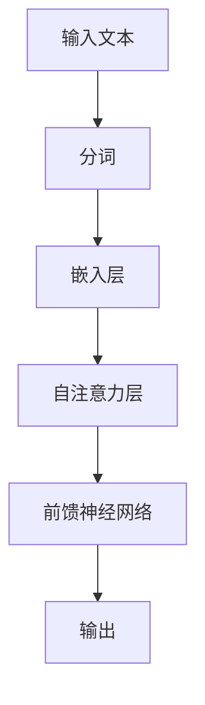
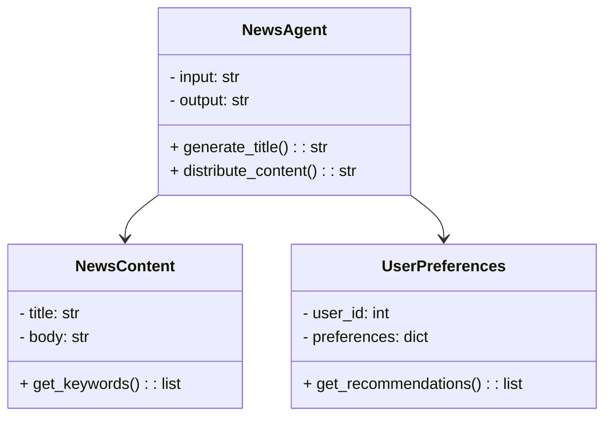
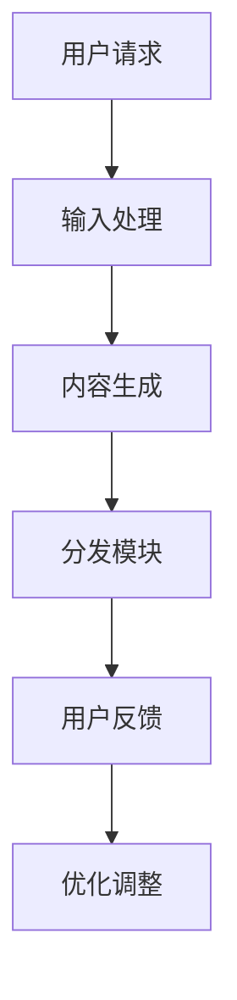

                 


# AI Agent在新闻媒体中的应用：自动写作与内容分发

---

## 关键词：
AI Agent、新闻媒体、自动写作、内容分发、生成式AI、自然语言处理、知识图谱

---

## 摘要：
本文探讨AI Agent在新闻媒体中的应用，重点分析其在自动写作和内容分发中的技术原理、系统架构和实际案例。文章从背景介绍出发，详细阐述AI Agent的核心概念与原理，包括生成式AI的数学模型和自然语言处理技术。随后，通过系统分析与架构设计，展示AI Agent在新闻媒体中的应用场景。最后，通过项目实战和最佳实践，为读者提供具体的实现方法和优化建议。

---

## 第1章: AI Agent与新闻媒体的结合

### 1.1 AI Agent的定义与特点
AI Agent是一种能够感知环境、执行任务并做出决策的智能实体。它具备以下特点：
- **自主性**：能够在没有人工干预的情况下完成任务。
- **反应性**：能够根据环境变化动态调整行为。
- **学习能力**：通过数据和经验不断优化性能。

### 1.2 新闻媒体行业的现状与挑战
新闻行业正面临以下挑战：
- **内容生产压力**：传统新闻生产效率低，难以满足海量需求。
- **分发效率低下**：内容分发依赖人工干预，效率不高。
- **个性化需求**：用户对个性化内容的需求日益增长，传统分发方式难以满足。

### 1.3 AI Agent在新闻媒体中的应用前景
AI Agent在新闻媒体中的应用前景广阔：
- **自动化写作**：生成新闻标题、导语和正文。
- **智能分发**：根据用户偏好推荐内容。
- **实时更新**：快速响应新闻事件，及时更新内容。

---

## 第2章: AI Agent的核心概念与原理

### 2.1 任务分解与自然语言处理
任务分解是将复杂任务拆解为简单子任务的过程，而自然语言处理（NLP）是理解并生成人类语言的技术。两者的结合使AI Agent能够高效处理新闻内容。

**任务分解与自然语言处理的对比分析**：

| 特性               | 任务分解                     | 自然语言处理                 |
|--------------------|------------------------------|-----------------------------|
| **目标**           | 将复杂任务拆解为简单任务     | 理解和生成人类语言           |
| **应用场景**       | 新闻内容生成                 | 自动摘要、关键词提取         |
| **技术实现**       | 分割算法、优先级排序         | 词袋模型、词嵌入、注意力机制 |

### 2.2 推理与决策机制
推理是基于已有信息做出推论，决策是根据推理结果选择最优行动。AI Agent通过这些机制实现内容生成和分发的智能化。

**推理与决策机制的流程图**：



### 2.3 知识表示与知识图谱
知识图谱是结构化的知识表示，帮助AI Agent更好地理解上下文关系。

**知识图谱的实体关系图**：



---

## 第3章: AI Agent的算法原理

### 3.1 生成式AI的数学模型
生成式AI的核心是Transformer模型，其自注意力机制使模型能够捕捉上下文信息。

**自注意力机制公式**：

$$
\text{Attention}(Q, K, V) = \text{softmax}\left(\frac{QK^T}{\sqrt{d_k}}\right)V
$$

### 3.2 Transformer模型的实现
以下是使用Python实现简单Transformer模型的代码示例：

```python
import torch
import torch.nn as nn

class Transformer(nn.Module):
    def __init__(self, d_model, nhead, dropout=0.1):
        super(Transformer, self).__init__()
        self.encoder = nn.TransformerEncoder(
            nn.TransformerEncoderLayer(d_model=d_model, nhead=nhead, dropout=dropout),
            num_layers=2
        )
    
    def forward(self, x):
        return self.encoder(x)

# 初始化模型
model = Transformer(d_model=512, nhead=8)
# 假设输入x的形状为 (seq_len, d_model)
x = torch.randn(10, 512)
output = model(x)
print(output.shape)  # 输出形状为 (10, 512)
```

### 3.3 自然语言处理技术
自然语言处理技术如BERT和GPT用于生成高质量的新闻内容。

**BERT模型的应用流程图**：



---

## 第4章: 系统分析与架构设计

### 4.1 应用场景
AI Agent在新闻媒体中的应用场景包括：
- **新闻标题生成**：根据新闻内容自动生成标题。
- **内容分发**：根据用户偏好推荐新闻。
- **实时更新**：快速响应新闻事件，及时更新内容。

### 4.2 系统功能设计
**系统功能模块的类图**：



### 4.3 系统架构设计
**系统架构图**：



---

## 第5章: 项目实战

### 5.1 环境搭建
- **工具安装**：
  - Python 3.8+
  - PyTorch 1.9+
  - transformers库

### 5.2 核心功能实现
**新闻标题生成代码示例**：

```python
from transformers import AutoTokenizer, AutoModelForMaskedLM

# 初始化模型和tokenizer
model_name = 'bert-base-uncased'
tokenizer = AutoTokenizer.from_pretrained(model_name)
model = AutoModelForMaskedLM.from_pretrained(model_name)

def generate_title(text):
    # 分词
    inputs = tokenizer(text, return_tensors='np')
    # 生成标题
    outputs = model.generate(**inputs, max_length=10)
    title = tokenizer.decode(outputs[0].tolist()[0])
    return title

# 示例
text = "Scientists discover new species of butterfly in Amazon rainforest"
print(generate_title(text))  # 输出生成的标题
```

### 5.3 实际案例分析
通过具体案例展示AI Agent如何生成新闻标题和内容，并根据用户反馈优化分发策略。

---

## 第6章: 最佳实践与小结

### 6.1 最佳实践
- **数据质量**：确保训练数据的多样性和代表性。
- **模型可解释性**：提升用户对生成内容的信任。
- **实时性**：及时更新内容，保持新闻的时效性。

### 6.2 注意事项
- 避免生成虚假或不准确的内容。
- 定期更新模型，适应语言的变化。
- 保护用户隐私，遵守数据安全规范。

### 6.3 小结
本文详细探讨了AI Agent在新闻媒体中的应用，从技术原理到系统架构，再到项目实战，为读者提供了全面的视角。AI Agent的应用将推动新闻行业向更高效、更智能化的方向发展。

---

## 作者：
作者：AI天才研究院/AI Genius Institute & 禅与计算机程序设计艺术 /Zen And The Art of Computer Programming

--- 

通过上述思考，我可以系统地构建这篇文章的结构，确保每一部分都符合用户的需求，同时保持内容的深度和可读性。

