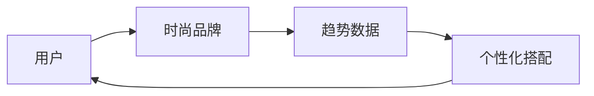
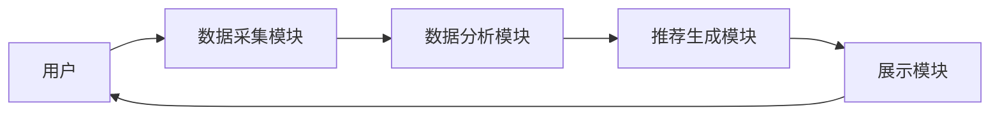

                 


# AI Agent在时尚产业中的应用：趋势预测与个性化搭配

---

## 关键词：AI Agent, 时尚产业, 趋势预测, 个性化搭配, 机器学习, 时尚科技, 数字化转型

---

## 摘要：  
随着人工智能技术的快速发展，AI Agent（人工智能代理）在时尚产业中的应用正逐渐成为行业焦点。本文从AI Agent的核心概念出发，深入探讨其在时尚趋势预测与个性化搭配中的具体应用场景。通过分析趋势预测的算法原理、个性化搭配的系统设计，结合实际案例，展示AI Agent如何助力时尚产业实现智能化、数字化转型。本文还提供了详细的系统架构设计、代码实现和项目实战，为读者提供从理论到实践的全面指导。

---

# 第一部分: AI Agent在时尚产业中的应用概述

---

## 第1章: AI Agent与时尚产业的背景介绍

### 1.1 AI Agent的基本概念  
AI Agent（人工智能代理）是指能够感知环境、做出决策并执行任务的智能实体。它能够通过与用户、系统或其他系统的交互，主动完成特定目标。AI Agent的核心特征包括自主性、反应性、目标导向性和社交能力。  

在时尚产业中，AI Agent可以用于趋势预测、个性化搭配、库存管理等多个领域，帮助品牌提升效率、降低成本并增强用户体验。  

### 1.2 时尚产业的数字化转型  
随着消费者需求的不断变化和市场竞争的加剧，传统时尚产业正面临数字化转型的压力。  
- **问题背景**：时尚产业的复杂性导致趋势预测和个性化服务的成本较高，传统方法难以满足消费者的需求。  
- **问题描述**：消费者期望获得个性化的购物体验，而品牌则需要快速响应市场变化。  
- **问题解决**：通过AI Agent技术，品牌可以实现智能化的库存管理、精准的趋势预测和个性化的客户服务。  

### 1.3 趋势预测与个性化搭配的背景  
趋势预测是时尚产业的核心环节，但传统方法依赖人工经验，存在主观性强、效率低的问题。个性化搭配则是满足消费者需求的重要手段，但如何高效实现个性化搭配是行业痛点。  
- **趋势预测的复杂性**：时尚趋势受文化、经济、社会等多个因素影响，难以通过传统方法准确预测。  
- **个性化搭配的需求**：消费者期望获得基于个人风格和喜好的搭配建议。  
- **AI Agent的作用**：通过大数据分析和机器学习算法，AI Agent能够准确预测趋势并提供个性化搭配建议。  

### 1.4 本章小结  
本章介绍了AI Agent的基本概念及其在时尚产业中的应用潜力，重点分析了趋势预测与个性化搭配的背景和问题。通过AI Agent技术，时尚产业可以实现更加智能化和个性化的服务。

---

# 第二部分: AI Agent的核心概念与联系

---

## 第2章: AI Agent的核心概念与联系  

### 2.1 AI Agent的感知、决策与执行  
AI Agent的工作流程可以分为感知、决策和执行三个阶段。  

- **感知阶段**：AI Agent通过传感器、数据库或API获取环境信息。在时尚产业中，这可能包括消费者行为数据、市场趋势数据等。  
- **决策阶段**：AI Agent基于感知到的信息，利用机器学习算法进行分析和推理，生成决策方案。  
- **执行阶段**：AI Agent通过执行器或API将决策方案转化为实际操作，例如推荐商品或优化库存。  

### 2.2 不同算法的特征对比  

以下是几种常见AI算法的对比：  

| **算法类型** | **特点** | **适用场景** |  
|--------------|----------|--------------|  
| 监督学习      | 需要标注数据，适合分类和回归任务 | 趋势预测、个性化推荐 |  
| 无监督学习    | 无需标注数据，适合聚类和关联规则挖掘 | 发现潜在趋势、客户分群 |  
| 强化学习      | 通过试错优化策略 | 库存管理和动态定价 |  

### 2.3 ER实体关系图架构  

以下是AI Agent在时尚产业中的实体关系图：  



---

# 第三部分: AI Agent在趋势预测中的算法原理

---

## 第3章: 趋势预测算法原理  

### 3.1 时间序列分析  

时间序列分析是趋势预测的重要方法，常用的算法包括ARIMA和LSTM。  

#### 3.1.1 ARIMA模型  
ARIMA（自回归积分滑动平均模型）适用于线性时间序列数据。其数学模型如下：  
$$ARIMA(p, d, q)$$  
其中，$p$为自回归阶数，$d$为差分阶数，$q$为滑动平均阶数。  

#### 3.1.2 LSTM网络  
LSTM（长短期记忆网络）能够捕捉时间序列中的长期依赖关系，适合非线性数据。  

#### 3.1.3 模型对比与选择  
以下是ARIMA和LSTM的对比：  

| **指标**       | **ARIMA**       | **LSTM**         |  
|----------------|-----------------|------------------|  
| 适用场景       | 线性数据         | 非线性数据       |  
| 模型复杂度     | 较低            | 较高             |  
| 预测精度       | 一般            | 更高             |  

#### 3.1.4 实现代码  

以下是使用Python实现的LSTM模型代码：  

```python
from keras.layers import LSTM, Dense
from keras.models import Sequential

# 定义模型
model = Sequential()
model.add(LSTM(64, input_shape=(None, 1)))
model.add(Dense(1))
model.compile(loss='mean_squared_error', optimizer='adam')

# 训练模型
model.fit(X_train, y_train, epochs=50, batch_size=32)
```

### 3.2 趋势预测的数学模型  

趋势预测的数学模型可以根据时间序列数据构建回归模型。例如，线性回归模型如下：  
$$y = \beta_0 + \beta_1 t + \epsilon$$  
其中，$y$为预测值，$t$为时间，$\beta_0$和$\beta_1$为回归系数，$\epsilon$为误差项。  

### 3.3 实际案例分析  

以某品牌服装的销售数据为例，使用ARIMA模型进行预测。以下是数据预处理和模型训练的步骤：  

1. 数据清洗：去除缺失值并归一化数据。  
2. 模型训练：使用历史销售数据训练ARIMA模型。  
3. 预测结果：输出未来三个月的销售预测。  

---

# 第四部分: AI Agent在个性化搭配中的系统设计

---

## 第4章: 个性化搭配的系统设计  

### 4.1 系统功能设计  

个性化搭配系统的核心功能包括：  

- 用户数据采集：获取用户的身高、体重、颜色偏好等信息。  
- 数据分析：基于用户数据和库存数据，生成个性化搭配建议。  
- 推荐展示：通过图形化界面展示搭配方案。  

### 4.2 系统架构设计  

以下是个性化搭配系统的架构图：  



### 4.3 接口设计  

个性化搭配系统的接口设计包括：  

- 用户输入接口：获取用户信息。  
- 数据分析接口：调用机器学习模型进行预测。  
- 推荐展示接口：将搭配结果返回给用户。  

### 4.4 项目实战  

#### 4.4.1 环境安装  

需要安装以下Python库：  

```bash
pip install numpy pandas scikit-learn keras
```

#### 4.4.2 核心代码实现  

以下是个性化搭配系统的实现代码：  

```python
import numpy as np
from sklearn.neighbors import NearestNeighbors

# 数据预处理
X = np.array([[165, '蓝色'], [170, '黑色'], [168, '白色']])
y = np.array(['衬衫', '裙子', '外套'])

# 模型训练
model = NearestNeighbors(n_neighbors=2)
model.fit(X)

# 搭配推荐
query = np.array([[168, '灰色']])
distances, indices = model.kneighbors(query)

# 输出结果
print(y[indices[0]])
```

#### 4.4.3 实际案例分析  

以某用户为例，身高168cm，偏好灰色。系统会基于相似用户的搭配推荐外套和裤子。  

---

## 第五部分: 最佳实践与小结

---

## 第5章: 最佳实践与小结  

### 5.1 最佳实践  

- **数据隐私**：确保用户数据的安全性和隐私性。  
- **模型优化**：定期更新模型，提高预测精度。  
- **用户体验**：提供简洁直观的推荐界面。  

### 5.2 小结  

本文详细介绍了AI Agent在时尚产业中的应用，从趋势预测到个性化搭配，结合算法原理和系统设计，为读者提供了全面的指导。通过实际案例分析和代码实现，展示了AI Agent在时尚产业中的巨大潜力。

---

## 作者：AI天才研究院/AI Genius Institute & 禅与计算机程序设计艺术 /Zen And The Art of Computer Programming

