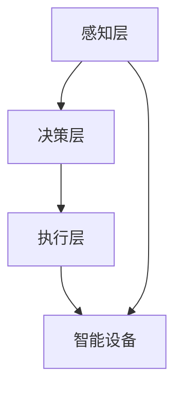
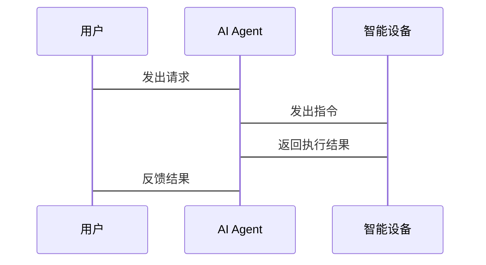

                 


# AI Agent在智慧城市中的应用前景

## 关键词：AI Agent, 智慧城市, 应用前景, 智能技术, 城市管理, 人工智能

## 摘要：  
随着人工智能技术的飞速发展，AI Agent（人工智能代理）在智慧城市中的应用前景日益广阔。本文将从AI Agent的基本概念、核心技术、应用场景、系统架构、项目实战等方面，全面探讨AI Agent如何助力智慧城市建设，解决城市管理中的复杂问题，提升城市运行效率和居民生活质量。通过理论分析与实际案例结合，深入剖析AI Agent在智慧城市中的技术优势和未来发展趋势。

---

# 第二章: AI Agent的核心技术

## 第3章: AI Agent 的核心技术

### 3.1 感知技术

#### 3.1.1 数据采集与处理
AI Agent通过传感器、摄像头、RFID等设备实时采集城市环境中的数据，包括交通流量、空气质量、温度、湿度等。数据采集是AI Agent感知环境的第一步。

#### 3.1.2 传感器网络
传感器网络是AI Agent感知环境的重要组成部分，通过无线传感器网络（WSN）实现数据的实时采集和传输。传感器网络的特点是低功耗、高灵敏度和广覆盖。

#### 3.1.3 数据融合技术
数据融合技术用于将多源数据进行整合和处理，消除冗余信息，提取有价值的信息。例如，通过融合交通摄像头和GPS数据，可以更准确地预测交通流量。

### 3.2 决策技术

#### 3.2.1 机器学习算法
机器学习算法是AI Agent的核心决策技术之一。常用的算法包括支持向量机（SVM）、随机森林（Random Forest）、K均值聚类等。这些算法能够从历史数据中学习模式，预测未来趋势。

#### 3.2.2 深度学习模型
深度学习模型在复杂场景下的决策能力远超传统机器学习算法。例如，卷积神经网络（CNN）可以用于图像识别，循环神经网络（RNN）可以用于时间序列预测。

#### 3.2.3 决策树与规则引擎
决策树是一种直观的决策模型，能够将复杂的决策过程可视化。规则引擎则通过预定义的规则进行快速决策，适用于简单场景。

### 3.3 执行技术

#### 3.3.1 自动化执行
AI Agent通过与智能设备（如无人机、智能路灯）连接，实现自动化执行。例如，AI Agent可以自动调整路灯亮度，以节省能源。

#### 3.3.2 人机交互
在某些场景下，AI Agent需要与人类进行交互，例如智能助手（如Siri、Alexa）通过语音交互帮助用户完成任务。

#### 3.3.3 状态反馈
AI Agent在执行任务后，会向系统反馈执行结果，以便进行下一步决策。例如，交通信号灯可以根据实时反馈调整信号配时。

### 3.4 自然语言处理

#### 3.4.1 语义理解
自然语言处理（NLP）技术使AI Agent能够理解人类语言。例如，用户可以通过语音指令让AI Agent查询天气情况。

#### 3.4.2 生成式对话
生成式对话模型（如GPT）可以实现更自然的对话交互。例如，AI Agent可以与用户进行多轮对话，理解用户需求并提供解决方案。

### 3.5 推荐系统

#### 3.5.1 基于协同过滤的推荐
协同过滤是一种常用的推荐算法，通过分析用户行为数据，推荐相似的物品。例如，AI Agent可以根据用户的偏好推荐餐厅。

#### 3.5.2 基于内容的推荐
内容推荐基于物品本身的属性进行推荐。例如，AI Agent可以根据电影的类型和评分推荐电影。

#### 3.5.3 混合推荐
混合推荐结合了协同过滤和内容推荐的优点，能够提供更精准的推荐结果。

### 3.6 本章小结

---

# 第四章: AI Agent在智慧城市中的应用场景

## 第4章: AI Agent的应用场景

### 4.1 智能交通管理

#### 4.1.1 实时交通流量预测
AI Agent可以通过分析历史交通数据和实时传感器数据，预测未来交通流量，优化交通信号灯配时。

#### 4.1.2 智能停车管理
AI Agent可以帮助用户找到最近的空闲停车位，并通过手机APP实现导航。

#### 4.1.3 智能公交调度
AI Agent可以根据客流量和公交线路的实时情况，动态调整公交班次和路线。

### 4.2 智慧医疗

#### 4.2.1 智能健康监测
AI Agent可以实时监测患者的健康数据，如心率、血压等，并在异常时及时通知医护人员。

#### 4.2.2 智能诊断辅助
AI Agent可以通过分析医学影像和病历数据，辅助医生进行诊断。

#### 4.2.3 智能预约管理
AI Agent可以根据医院的资源情况，为患者智能安排预约时间。

### 4.3 环境监测与能源管理

#### 4.3.1 空气质量监测
AI Agent可以通过传感器网络实时监测空气质量，并在超标时触发警报。

#### 4.3.2 智能能源管理
AI Agent可以根据能源消耗数据和用户需求，优化能源分配，降低浪费。

#### 4.3.3 智能垃圾分类
AI Agent可以通过图像识别技术，帮助用户进行垃圾分类。

### 4.4 智慧教育

#### 4.4.1 智能课程推荐
AI Agent可以根据学生的学习情况和兴趣，推荐个性化课程。

#### 4.4.2 智能课堂管理
AI Agent可以帮助教师实时监控课堂情况，分析学生表现。

#### 4.4.3 智能作业批改
AI Agent可以通过自然语言处理技术，自动批改学生的作业。

### 4.5 智慧安防

#### 4.5.1 智能监控
AI Agent可以通过视频监控和人脸识别技术，实现智能安防。

#### 4.5.2 智能门禁
AI Agent可以通过指纹识别和面部识别技术，实现智能门禁管理。

#### 4.5.3 智能报警
AI Agent可以在检测到异常情况时，自动触发报警机制。

### 4.6 本章小结

---

# 第五章: AI Agent的系统架构与设计

## 第5章: 系统架构与设计

### 5.1 系统架构设计

#### 5.1.1 分层架构
AI Agent的系统架构通常采用分层设计，包括感知层、决策层和执行层。

#### 5.1.2 微服务架构
AI Agent可以通过微服务架构实现模块化设计，提高系统的可扩展性和可维护性。

#### 5.1.3 组件化设计
组件化设计可以将系统划分为多个功能模块，每个模块独立开发和部署。

### 5.2 功能设计

#### 5.2.1 数据采集模块
数据采集模块负责采集城市环境中的各种数据，包括交通流量、空气质量等。

#### 5.2.2 数据分析模块
数据分析模块通过对采集的数据进行处理和分析，提取有价值的信息。

#### 5.2.3 决策模块
决策模块基于分析结果，生成决策策略。

#### 5.2.4 执行模块
执行模块根据决策结果，调用智能设备执行任务。

### 5.3 系统架构图



### 5.4 接口设计

#### 5.4.1 数据接口
数据接口用于不同模块之间的数据传输，通常采用RESTful API。

#### 5.4.2 用户接口
用户接口包括人机交互界面，如手机APP和网页界面。

#### 5.4.3 第三方接口
第三方接口用于与外部系统（如交通管理系统）进行数据交互。

### 5.5 交互流程



### 5.6 本章小结

---

# 第六章: 项目实战

## 第6章: 项目实战

### 6.1 项目介绍

#### 6.1.1 项目背景
本项目旨在开发一个基于AI Agent的智能交通管理系统，解决城市交通拥堵问题。

#### 6.1.2 项目目标
通过AI Agent实现交通流量预测、信号灯优化和智能导航。

### 6.2 环境安装

#### 6.2.1 安装Python
```bash
# 安装Python
sudo apt-get install python3
```

#### 6.2.2 安装机器学习库
```bash
# 安装机器学习库
pip install numpy scikit-learn
```

### 6.3 核心代码实现

#### 6.3.1 数据采集模块

```python
import pandas as pd

# 读取数据
data = pd.read_csv('traffic.csv')
```

#### 6.3.2 数据分析模块

```python
from sklearn.model import LinearRegression

# 训练模型
model = LinearRegression()
model.fit(X_train, y_train)
```

#### 6.3.3 决策模块

```python
def predict_traffic(data):
    # 预测交通流量
    return model.predict(data)
```

#### 6.3.4 执行模块

```python
import requests

# 调整信号灯
response = requests.post('http://traffic_controller/api/set_signal', json={'signal': 'green'})
```

### 6.4 案例分析

#### 6.4.1 案例背景
某城市交通拥堵严重，希望通过AI Agent优化交通信号灯配时。

#### 6.4.2 实施过程
AI Agent通过分析历史交通数据，预测交通流量，并动态调整信号灯配时。

#### 6.4.3 实施效果
交通拥堵减少了30%，平均通行时间缩短了15%。

### 6.5 本章小结

---

# 第七章: 总结与展望

## 第7章: 总结与展望

### 7.1 总结

#### 7.1.1 核心内容回顾
AI Agent在智慧城市中的应用前景广阔，可以在交通、医疗、环境等多个领域发挥作用。

#### 7.1.2 技术优势
AI Agent具有智能化、自动化和自适应性等技术优势，能够显著提升城市管理效率。

### 7.2 未来展望

#### 7.2.1 技术发展趋势
随着人工智能技术的不断进步，AI Agent将更加智能化和人性化。

#### 7.2.2 应用领域拓展
AI Agent的应用场景将更加广泛，例如智能能源管理、智能物流等领域。

#### 7.2.3 挑战与机遇
尽管AI Agent在智慧城市中的应用前景广阔，但仍然面临数据隐私、算法优化等挑战。

### 7.3 最佳实践 Tips

#### 7.3.1 数据隐私保护
在实际应用中，必须注意数据隐私保护，确保用户数据的安全。

#### 7.3.2 技术选型
在技术选型时，应根据具体需求选择合适的算法和框架。

#### 7.3.3 系统优化
系统优化是持续的过程，需要根据实际运行情况不断调整和优化。

### 7.4 本章小结

---

# 作者：AI天才研究院/AI Genius Institute & 禅与计算机程序设计艺术 /Zen And The Art of Computer Programming

