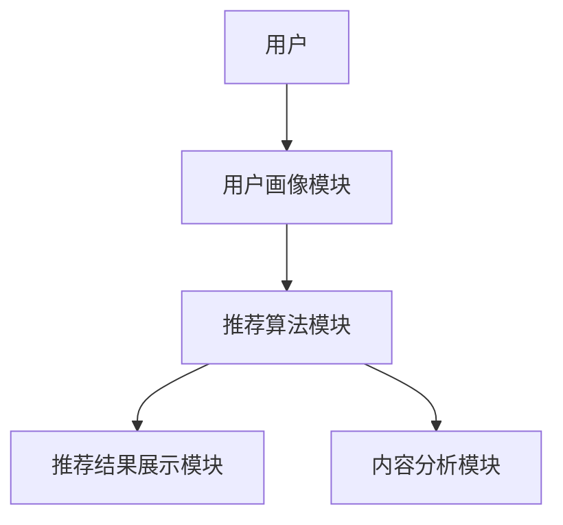
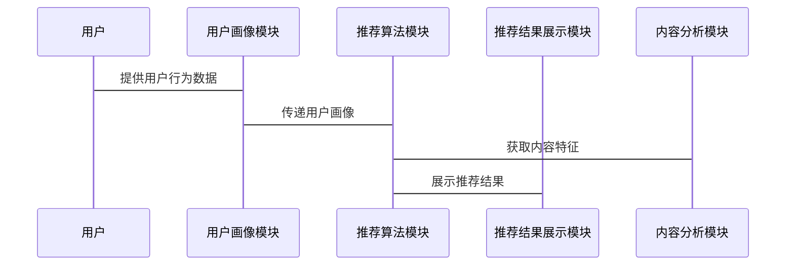

                 


# AI Agent在智能个性化内容推荐中的应用

## 关键词
AI Agent, 个性化推荐, 智能推荐系统, 机器学习, 用户画像, 内容推荐

## 摘要
本文探讨了AI Agent在智能个性化内容推荐中的应用，分析了AI Agent的核心概念、算法原理、系统架构设计以及实际项目案例。文章从背景介绍开始，逐步深入，结合数学公式、mermaid图表和实际代码，详细阐述了AI Agent如何提升个性化推荐的准确性和用户体验。最后，本文总结了最佳实践和未来的发展方向。

---

## 第一部分: AI Agent与智能个性化内容推荐概述

## 第1章: AI Agent与个性化推荐的背景介绍

### 1.1 AI Agent的基本概念

#### 1.1.1 AI Agent的定义与特点
AI Agent（人工智能代理）是指能够感知环境并采取行动以实现目标的智能实体。AI Agent具有以下特点：
- **自主性**：能够自主决策和行动。
- **反应性**：能实时感知环境并做出反应。
- **目标导向**：所有行动都以实现特定目标为导向。
- **学习能力**：能够通过经验改进自身行为。

#### 1.1.2 AI Agent的核心要素与组成
AI Agent的核心要素包括：
- **感知模块**：负责收集环境中的数据和信息。
- **推理模块**：通过逻辑推理或机器学习模型处理感知数据。
- **行动模块**：根据推理结果执行相应操作。
- **知识库**：存储AI Agent所需的知识和经验。

#### 1.1.3 AI Agent与个性化推荐的关系
个性化推荐是AI Agent的重要应用场景之一。AI Agent能够通过分析用户行为、偏好和历史数据，为用户提供个性化的推荐内容，从而提升用户体验和满意度。

### 1.2 智能个性化内容推荐的背景与问题

#### 1.2.1 个性化推荐的背景与现状
随着互联网的快速发展，用户每天接触到的信息量急剧增加。如何在海量信息中筛选出符合用户兴趣的内容，成为了个性化推荐的核心问题。

#### 1.2.2 个性化推荐的核心问题与挑战
个性化推荐的核心问题包括：
- **数据稀疏性**：用户数据量不足导致推荐准确性下降。
- **实时性**：如何在实时场景下快速生成推荐结果。
- **模型可解释性**：推荐结果需要清晰的解释以增强用户信任。

#### 1.2.3 AI Agent在个性化推荐中的应用价值
AI Agent能够通过实时感知用户行为和环境变化，动态调整推荐策略，从而显著提升推荐系统的个性化和准确性。

---

## 第2章: AI Agent与个性化推荐的核心概念

### 2.1 AI Agent的类型与应用场景

#### 2.1.1 基于规则的AI Agent
基于规则的AI Agent通过预定义的规则和条件来生成推荐内容。例如，基于用户的购买历史推荐相似产品。

#### 2.1.2 基于学习的AI Agent
基于学习的AI Agent通过机器学习模型（如协同过滤、深度学习）来学习用户偏好，并生成推荐内容。这种方法能够处理复杂的数据关系，推荐准确性更高。

#### 2.1.3 基于混合模型的AI Agent
基于混合模型的AI Agent结合了多种推荐方法的优势，能够在不同场景下动态调整推荐策略，从而实现更精准的推荐。

### 2.2 个性化推荐的核心算法与AI Agent的结合

#### 2.2.1 协同过滤算法
协同过滤算法通过分析用户行为和偏好，找到相似的用户群体，进而推荐相似内容。

#### 2.2.2 基于内容的推荐算法
基于内容的推荐算法通过分析内容本身的特征（如文本、标签）来生成推荐结果。

#### 2.2.3 深度学习模型在推荐系统中的应用
深度学习模型（如神经网络、序列模型）能够处理复杂的用户行为模式，生成更个性化的推荐内容。

---

## 第三部分: AI Agent推荐系统的算法原理

## 第3章: AI Agent推荐系统的算法原理

### 3.1 协同过滤算法的实现与优化

#### 3.1.1 协同过滤算法的数学模型
协同过滤算法的核心是计算用户之间的相似度，公式如下：
$$ sim(u, v) = \frac{\sum_{i} (r_{u,i} - \bar{r_u})(r_{v,i} - \bar{r_v})}{\sqrt{\sum_{i} (r_{u,i} - \bar{r_u})^2} \cdot \sqrt{\sum_{i} (r_{v,i} - \bar{r_v})^2}}} $$
其中，$sim(u, v)$ 表示用户u和用户v的相似度，$\bar{r_u}$ 和 $\bar{r_v}$ 分别表示用户u和v的平均评分。

#### 3.1.2 协同过滤算法的实现步骤
1. 收集用户行为数据。
2. 计算用户相似度或物品相似度。
3. 根据相似度生成推荐列表。

#### 3.1.3 协同过滤算法的优化策略
- **基于矩阵分解的优化**：通过矩阵分解技术（如SVD）降低计算复杂度。
- **基于邻居选择的优化**：选择最相关的邻居进行推荐。

### 3.2 基于内容的推荐算法

#### 3.2.1 基于内容的推荐算法实现
基于内容的推荐算法通过分析内容特征生成推荐结果。例如，通过文本挖掘技术分析商品描述，生成推荐结果。

#### 3.2.2 基于内容的推荐算法优缺点
- **优点**：推荐结果具有较高的可解释性。
- **缺点**：对数据稀疏性敏感，推荐结果可能不够个性化。

### 3.3 深度学习模型在推荐系统中的应用

#### 3.3.1 基于神经网络的推荐模型
神经网络模型（如DNN、RNN）能够处理复杂的用户行为模式，生成更个性化的推荐内容。

#### 3.3.2 基于深度学习的推荐模型实现
1. 收集用户行为数据和内容特征。
2. 构建神经网络模型，训练模型参数。
3. 根据模型预测结果生成推荐列表。

---

## 第四部分: AI Agent推荐系统的系统架构设计

## 第4章: AI Agent推荐系统的系统架构设计

### 4.1 系统功能模块设计

#### 4.1.1 用户画像模块
用户画像模块通过分析用户行为数据，生成用户画像。用户画像包括用户的兴趣、偏好和行为特征。

#### 4.1.2 内容分析模块
内容分析模块通过对内容特征进行分析，生成内容标签和特征向量。

#### 4.1.3 推荐算法模块
推荐算法模块根据用户画像和内容分析结果，生成推荐列表。

#### 4.1.4 推荐结果展示模块
推荐结果展示模块将推荐结果以用户友好的形式展示给用户。

### 4.2 系统架构设计

#### 4.2.1 系统架构设计图


#### 4.2.2 系统交互设计


---

## 第五部分: AI Agent推荐系统的项目实战

## 第5章: AI Agent推荐系统的项目实战

### 5.1 环境安装与配置

#### 5.1.1 环境配置
安装必要的Python库，如numpy、pandas、scikit-learn、tensorflow等。

#### 5.1.2 数据准备
收集用户行为数据和内容特征数据，进行数据清洗和预处理。

### 5.2 核心代码实现

#### 5.2.1 协同过滤算法实现
```python
import numpy as np

def compute_similarity(user_matrix):
    # 计算用户相似度矩阵
    user_matrix = np.array(user_matrix)
    mean_rating = np.mean(user_matrix, axis=1).reshape(-1, 1)
    centered_matrix = user_matrix - mean_rating
    similarity_matrix = centered_matrix.T.dot(centered_matrix)
    similarity_matrix = similarity_matrix / np.sqrt(np.diag(similarity_matrix))
    return similarity_matrix

# 示例数据
user_matrix = [[3, 2, 0], [4, 5, 0], [1, 0, 2]]
similarity_matrix = compute_similarity(user_matrix)
print(similarity_matrix)
```

#### 5.2.2 基于深度学习的推荐模型实现
```python
import tensorflow as tf
from tensorflow.keras import layers

model = tf.keras.Sequential([
    layers.Dense(64, activation='relu'),
    layers.Dense(1, activation='sigmoid')
])

model.compile(optimizer='adam', loss='binary_crossentropy', metrics=['accuracy'])
model.fit(x_train, y_train, epochs=10, batch_size=32)
```

### 5.3 项目实战总结

#### 5.3.1 项目实现的关键点
- 数据预处理和特征提取。
- 推荐算法的选择和优化。
- 系统架构设计和模块协作。

#### 5.3.2 项目实现的注意事项
- 数据隐私和安全保护。
- 模型的可解释性和用户体验。
- 系统的实时性和扩展性。

---

## 第六部分: 最佳实践与未来展望

## 第6章: 最佳实践与未来展望

### 6.1 最佳实践

#### 6.1.1 数据处理与模型优化
- 数据清洗和特征工程。
- 模型调优和超参数优化。

#### 6.1.2 系统设计与架构优化
- 模块化设计和微服务架构。
- 异常处理和容错机制。

### 6.2 未来展望

#### 6.2.1 多模态推荐
结合文本、图像、视频等多种模态信息，提升推荐系统的准确性和多样性。

#### 6.2.2 实时推荐
通过流数据处理和实时计算，实现毫秒级的实时推荐。

#### 6.2.3 可解释性推荐
提升推荐系统的可解释性，增强用户信任和满意度。

---

## 作者：AI天才研究院 & 禅与计算机程序设计艺术

---

以上是《AI Agent在智能个性化内容推荐中的应用》的完整目录大纲和文章内容。文章内容涵盖了AI Agent的核心概念、算法原理、系统架构设计、项目实战以及最佳实践，旨在为读者提供全面的技术指导和实践参考。

