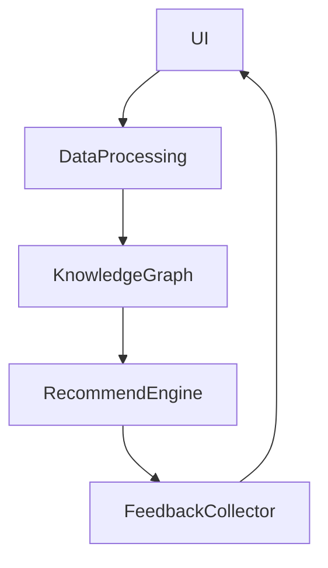
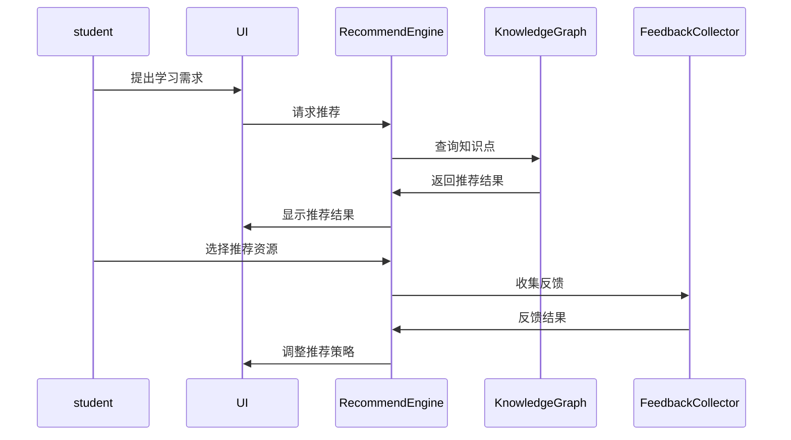

                 


# AI Agent在智能个性化学习中的应用：从原理到实践

> 关键词：AI Agent, 个性化学习, 自适应学习, 教育技术, 机器学习, 自然语言处理

> 摘要：本文深入探讨了AI Agent在智能个性化学习中的应用，从核心概念、算法原理到系统架构，结合实际案例，详细分析了AI Agent在教育领域的优势与挑战。文章旨在为教育技术开发者和研究者提供理论与实践相结合的指导，帮助他们更好地理解和应用AI Agent技术，推动个性化学习的未来发展。

---

## 第1章: AI Agent的基本概念与背景介绍

### 1.1 AI Agent的核心概念

#### 1.1.1 什么是AI Agent
AI Agent（人工智能代理）是一种智能系统，能够感知环境、做出决策并执行动作，以实现特定目标。在教育领域，AI Agent可以用于自适应学习、个性化推荐和实时反馈，帮助学生实现高效学习。

#### 1.1.2 AI Agent的基本特征
| 特性 | 描述 |
|------|------|
| 感知能力 | 能够收集和理解环境中的数据（如学生的学习行为、进度等）。 |
| 决策能力 | 基于收集的数据，通过算法生成个性化建议或学习计划。 |
| 执行能力 | 根据决策结果，执行具体的动作（如推荐学习资源、调整学习路径等）。 |
| 自适应能力 | 能够根据反馈动态调整策略，适应学生的学习需求变化。 |

#### 1.1.3 AI Agent与传统算法的区别
AI Agent不仅仅是执行预设任务的工具，它具备自主性、反应性和目标导向性。与传统算法相比，AI Agent能够通过与用户的交互不断优化自身行为，实现动态适应。

---

### 1.2 智能个性化学习的背景

#### 1.2.1 个性化学习的定义与特点
个性化学习是一种以学生为中心的教学模式，强调根据学生的兴趣、能力、学习风格等因素，制定个性化的学习计划和资源推荐。其特点包括：
- **动态性**：根据学生的学习情况实时调整。
- **针对性**：针对学生的薄弱环节提供精准支持。
- **交互性**：通过人机交互实现个性化指导。

#### 1.2.2 当前教育中的个性化学习需求
传统教育模式往往采用统一的教学方法，难以满足学生的个性化需求。随着AI技术的发展，个性化学习逐渐成为教育领域的热点，尤其是在K-12教育和在线学习平台中。

#### 1.2.3 AI Agent在个性化学习中的作用
AI Agent能够通过数据分析和机器学习算法，为学生提供个性化的学习路径和资源推荐，帮助学生更高效地掌握知识。

---

## 第2章: AI Agent的核心概念与原理

### 2.1 AI Agent的感知模块

#### 2.1.1 数据采集与处理
AI Agent需要收集学生的学习数据，包括：
- 学生的学习进度。
- 学生的答题记录。
- 学生的偏好和兴趣。

#### 2.1.2 用户行为分析
通过对用户行为数据的分析，AI Agent可以识别学生的学习习惯和偏好。例如，通过分析学生的答题速度和错误率，判断学生的知识掌握程度。

#### 2.1.3 知识图谱构建
知识图谱是一种结构化的知识表示方法，AI Agent可以利用知识图谱来理解知识点之间的关系，从而为学生推荐相关的学习资源。

---

### 2.2 AI Agent的决策模块

#### 2.2.1 个性化推荐算法
AI Agent需要根据学生的学习数据，生成个性化的学习推荐。常见的推荐算法包括：
- **基于协同过滤的推荐**：根据其他学生的相似行为推荐资源。
- **基于内容的推荐**：根据学习内容的相似性推荐资源。

#### 2.2.2 动态调整策略
AI Agent需要根据学生的反馈动态调整推荐策略。例如，如果学生对推荐的资源反应积极，AI Agent可以增加类似资源的推荐；如果学生反应消极，AI Agent则减少类似资源的推荐。

#### 2.2.3 多目标优化
在个性化学习中，AI Agent需要同时优化多个目标，例如：
- 提高学生的知识掌握程度。
- 提高学生的学习兴趣。
- 减少学生的学习时间。

---

### 2.3 AI Agent的执行模块

#### 2.3.1 个性化学习路径生成
AI Agent可以根据学生的学习数据和知识图谱，生成个性化的学习路径。例如，为学生推荐最适合的学习顺序和学习资源。

#### 2.3.2 自适应教学资源分配
AI Agent可以根据学生的学习情况，动态分配教学资源。例如，为学生推荐适合其当前学习阶段的练习题。

#### 2.3.3 实时反馈与调整
AI Agent可以实时监控学生的学习进度，并根据反馈结果动态调整推荐策略。例如，如果学生在某一知识点上出现错误，AI Agent可以立即推荐相关知识点的复习资源。

---

## 第3章: AI Agent在个性化学习中的算法原理

### 3.1 基于机器学习的个性化推荐

#### 3.1.1 监督学习与非监督学习
- **监督学习**：基于标注数据进行训练，例如分类任务。
- **非监督学习**：基于无标注数据进行聚类或降维。

#### 3.1.2 协作过滤算法
协作过滤是一种基于用户相似性推荐算法。例如，基于协同过滤的推荐算法可以为学生推荐与他们相似的学生喜欢的资源。

#### 3.1.3 基于深度学习的推荐系统
深度学习模型（如神经网络）可以更好地捕捉数据中的复杂关系。例如，基于深度学习的推荐系统可以通过嵌入层将知识点和学生特征映射到同一空间，从而生成推荐结果。

---

### 3.2 基于自然语言处理的对话系统

#### 3.2.1 NLP基础
自然语言处理（NLP）是AI Agent实现对话系统的核心技术。例如，AI Agent可以通过NLP技术理解学生的语言输入，并生成相应的回应。

#### 3.2.2 对话生成模型
对话生成模型（如GPT）可以生成自然流畅的对话。例如，AI Agent可以利用对话生成模型为学生提供个性化的学习建议。

#### 3.2.3 对话理解模型
对话理解模型（如BERT）可以理解对话的上下文和意图。例如，AI Agent可以利用对话理解模型理解学生的提问，并生成相应的回答。

---

### 3.3 基于强化学习的自适应策略

#### 3.3.1 强化学习的基本原理
强化学习是一种基于奖励机制的算法。例如，AI Agent可以通过强化学习不断优化其推荐策略，以最大化学生的满意度。

#### 3.3.2 在个性化学习中的应用
例如，AI Agent可以利用强化学习动态调整推荐策略，以提高学生的知识掌握程度。

#### 3.3.3 实验与效果评估
通过实验可以验证强化学习算法在个性化学习中的有效性。例如，可以通过A/B测试比较不同推荐策略的效果。

---

## 第4章: AI Agent系统的架构设计

### 4.1 系统功能模块设计

#### 4.1.1 用户数据采集模块
负责收集学生的学习数据，例如学习进度、答题记录等。

#### 4.1.2 知识图谱构建模块
负责构建知识点之间的关系图谱。

#### 4.1.3 个性化推荐模块
基于用户数据和知识图谱，生成个性化的学习推荐。

#### 4.1.4 对话交互模块
负责与学生进行实时对话，提供个性化的学习建议。

---

### 4.2 系统架构设计

#### 4.2.1 系统功能设计
- **用户交互界面**：学生与AI Agent的交互界面。
- **数据处理模块**：负责数据的采集、存储和处理。
- **推荐引擎**：基于机器学习算法生成推荐结果。
- **反馈机制**：实时收集学生反馈并动态调整推荐策略。

#### 4.2.2 系统架构图


---

### 4.3 系统接口设计

#### 4.3.1 数据接口
- **输入接口**：接收学生的学习数据。
- **输出接口**：输出推荐结果。

#### 4.3.2 对话接口
- **输入接口**：接收学生的对话输入。
- **输出接口**：输出AI Agent的对话回应。

---

### 4.4 系统交互流程

#### 4.4.1 交互流程图


---

## 第5章: 项目实战与案例分析

### 5.1 项目环境配置

#### 5.1.1 安装必要的库
```bash
pip install numpy
pip install scikit-learn
pip install transformers
```

---

### 5.2 核心代码实现

#### 5.2.1 数据预处理
```python
import numpy as np
from sklearn.preprocessing import StandardScaler

# 示例数据：学生的学习成绩
data = np.array([[70, 80], [65, 75], [80, 85]])
scaler = StandardScaler()
scaled_data = scaler.fit_transform(data)
print(scaled_data)
```

#### 5.2.2 基于机器学习的推荐系统
```python
from sklearn.neighbors import NearestNeighbors

# 示例数据：学生的学习兴趣
X = np.array([[0.5, 0.6], [0.7, 0.8], [0.4, 0.3]])
nbrs = NearestNeighbors(n_neighbors=2).fit(X)
distances, indices = nbrs.kneighbors([0.5, 0.6])
print(indices[0])
```

---

### 5.3 案例分析

#### 5.3.1 案例背景
假设我们有一个在线学习平台，希望为学生推荐个性化的学习资源。

#### 5.3.2 案例实现
```python
import pandas as pd
from sklearn.cluster import KMeans

# 示例数据：学生的学习风格
data = pd.DataFrame({
    '学习风格': ['视觉型', '听觉型', '动觉型'],
    '兴趣领域': ['数学', '物理', '化学']
})

# 基于聚类算法推荐学习资源
model = KMeans(n_clusters=3)
model.fit(data)
print(model.labels_)
```

#### 5.3.3 案例总结
通过聚类算法，我们可以将学生分为不同的学习风格，并为每个学生推荐适合其学习风格的资源。

---

## 第6章: 总结与展望

### 6.1 总结
本文详细探讨了AI Agent在智能个性化学习中的应用，从核心概念到算法原理，再到系统架构和项目实战，全面分析了AI Agent在教育领域的优势与挑战。

### 6.2 最佳实践 Tips
- 在实际应用中，建议结合具体场景选择合适的算法。
- 数据的准确性和完整性对推荐效果有重要影响。
- 及时收集学生反馈，动态调整推荐策略。

### 6.3 未来展望
随着AI技术的不断发展，AI Agent在个性化学习中的应用将更加广泛和深入。例如，结合增强学习和元学习，可以进一步提高推荐系统的智能性和自适应性。

---

## 作者信息

作者：AI天才研究院/AI Genius Institute & 禅与计算机程序设计艺术/Zen And The Art of Computer Programming

---

本文通过系统化的分析和实践，为教育技术开发者和研究者提供了AI Agent在智能个性化学习中的理论与实践指导。希望本文能够为推动个性化学习的未来发展提供有价值的参考。

