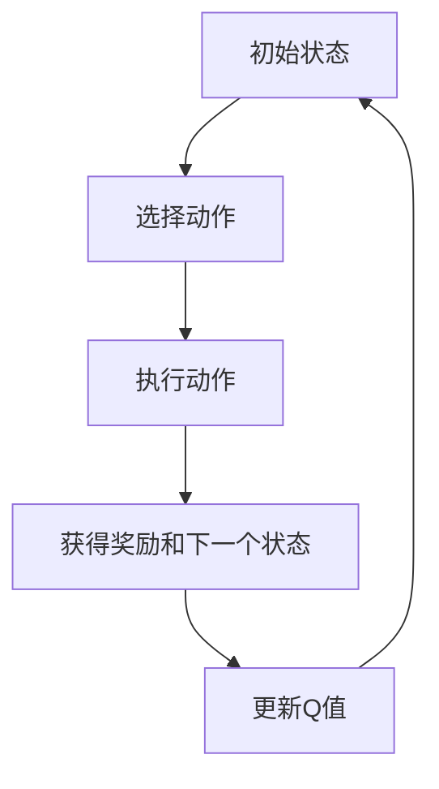
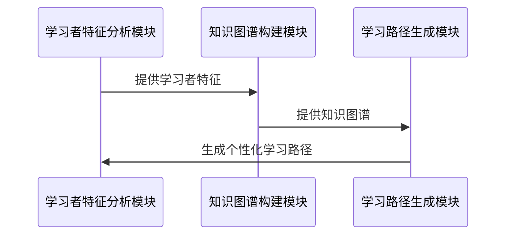

                 


---

# AI Agent在智能个性化学习路径规划中的应用

## 关键词：AI Agent, 个性化学习, 强化学习, 知识图谱, 学习路径规划

## 摘要：本文探讨了AI Agent在智能个性化学习路径规划中的应用。通过分析AI Agent的基本原理、强化学习算法、知识图谱构建以及系统架构设计，展示了如何利用这些技术实现个性化的学习路径规划。文章还包括了实际项目案例和实现细节，为教育领域的技术应用提供了参考。

---

# 第一部分: AI Agent与个性化学习路径规划的背景与概念

## 第1章: AI Agent与个性化学习路径规划的背景介绍

### 1.1 问题背景与问题描述

#### 1.1.1 当前教育领域的挑战
传统教育模式难以满足每个学生的个性化学习需求。学生之间的学习能力和兴趣差异较大，统一的教学进度和内容可能导致部分学生跟不上，而另一些学生则感到无挑战性。

#### 1.1.2 个性化学习的重要性
个性化学习能够根据学生的特点（如兴趣、学习风格、知识水平）制定合适的学习计划，提高学习效率和效果。

#### 1.1.3 AI Agent在教育中的应用价值
AI Agent可以通过智能化手段帮助教师和学生优化学习路径，提供个性化的学习建议和资源推荐。

### 1.2 AI Agent的核心概念

#### 1.2.1 AI Agent的基本定义
AI Agent是一种能够感知环境并采取行动以实现目标的智能体。它可以基于反馈和奖励不断优化其行为。

#### 1.2.2 个性化学习路径规划的定义
个性化学习路径规划是根据学生的特点和学习目标，定制最适合的学习计划和资源分配。

#### 1.2.3 两者的结合与应用边界
AI Agent与个性化学习路径规划的结合主要体现在通过数据驱动的决策和动态调整学习计划，提供实时反馈和建议。

## 1.3 本章小结
本章介绍了AI Agent和个性化学习路径规划的基本概念和背景，为后续的技术实现奠定了基础。

---

## 第二部分: AI Agent与个性化学习路径规划的核心概念与联系

## 第2章: AI Agent的原理与实现

### 2.1 基于模型的强化学习

#### 2.1.1 强化学习的基本原理
强化学习是一种通过试错机制，学习智能体通过与环境互动，逐步优化策略以最大化累积奖励。

#### 2.1.2 状态、动作、奖励函数的定义
- **状态（State）**：学习者当前的知识水平和学习进度。
- **动作（Action）**：选择下一个学习任务或知识点。
- **奖励函数（Reward Function）**：根据学习效果和进度给予奖励或惩罚。

#### 2.1.3 Q-learning算法的实现
Q-learning算法是一种常用的强化学习算法，其伪代码如下：

```python
初始化 Q 表为零
while 真：
    选择动作 a（根据探索和利用策略）
    执行动作 a，获得奖励 r 和下一个状态 s'
    更新 Q 值：Q[s][a] = Q[s][a] + α(r + γ * max Q[s'][a'])
```

### 2.2 个性化学习路径规划的系统模型

#### 2.2.1 学习者特征模型
学习者特征模型包括学习者的知识水平、兴趣、学习风格等。

#### 2.2.2 知识图谱构建
知识图谱是将各个知识点之间的关系以图结构表示，帮助系统理解知识的层次和关联。

#### 2.2.3 学习目标分解与路径生成
根据学习目标，将整体目标分解为具体的学习任务，并生成最优的学习路径。

## 2.3 本章小结
本章详细讲解了AI Agent的原理和个性化学习路径规划的系统模型，为后续的算法实现奠定了基础。

---

## 第三部分: AI Agent与个性化学习路径规划的算法原理

## 第3章: 基于强化学习的个性化学习路径规划算法

### 3.1 算法原理

#### 3.1.1 状态空间的构建
状态空间包括当前知识点、学生的学习进度等。

#### 3.1.2 动作空间的设计
动作空间包括选择下一个学习任务或知识点。

#### 3.1.3 奖励函数的定义
奖励函数根据学习效果和进度给予奖励或惩罚。

### 3.2 算法实现

#### 3.2.1 Q-learning算法的伪代码
```python
初始化 Q 表为零
while 真：
    选择动作 a（根据探索和利用策略）
    执行动作 a，获得奖励 r 和下一个状态 s'
    更新 Q 值：Q[s][a] = Q[s][a] + α(r + γ * max Q[s'][a'])
```

#### 3.2.2 算法流程图（Mermaid）



---

## 第四部分: AI Agent与个性化学习路径规划的系统架构设计

## 第4章: 系统功能设计与实现

### 4.1 系统功能模块划分

#### 4.1.1 学习者特征分析模块
分析学生的学习能力和特点。

#### 4.1.2 知识图谱构建模块
构建知识点之间的关联关系。

#### 4.1.3 学习路径生成模块
根据分析结果生成个性化学习路径。

### 4.2 系统架构设计

#### 4.2.1 分层架构设计（Mermaid）


#### 4.2.2 模块间交互流程（Mermaid）



---

## 第五部分: 项目实战与案例分析

## 第5章: 项目实战

### 5.1 环境安装

```bash
pip install tensorflow keras numpy
```

### 5.2 核心代码实现

#### 5.2.1 Q-learning算法的实现

```python
import numpy as np

class QLearningAgent:
    def __init__(self, state_size, action_size, learning_rate=0.1, gamma=0.99):
        self.Q = np.zeros((state_size, action_size))
        self.lr = learning_rate
        self.gamma = gamma

    def choose_action(self, state, epsilon=0.1):
        if np.random.random() < epsilon:
            return np.random.randint(0, action_size)
        return np.argmax(self.Q[state])

    def update_Q(self, state, action, reward, next_state):
        self.Q[state][action] = self.Q[state][action] + self.lr * (reward + self.gamma * np.max(self.Q[next_state]) - self.Q[state][action])
```

#### 5.2.2 知识图谱构建

```python
from networkx import DiGraph

graph = DiGraph()
graph.add_edge("知识点A", "知识点B")
graph.add_edge("知识点B", "知识点C")
```

### 5.3 案例分析

#### 5.3.1 案例背景
以数学学习为例，构建知识点之间的依赖关系。

#### 5.3.2 实施过程
1. 收集学生的学习数据。
2. 构建知识图谱。
3. 应用Q-learning算法生成个性化学习路径。

#### 5.3.3 结果展示
根据学生的学习情况，生成适合的学习路径，并动态调整。

### 5.4 本章小结
通过实际项目案例展示了AI Agent在个性化学习路径规划中的应用，验证了算法的有效性和可行性。

---

## 总结与展望

## 第6章: 总结与展望

### 6.1 总结
本文详细探讨了AI Agent在个性化学习路径规划中的应用，从理论到实践，展示了如何通过强化学习和知识图谱构建实现智能化的学习路径规划。

### 6.2 展望
未来的研究可以进一步优化算法，探索更复杂的学习场景，如多模态学习和跨学科知识整合。

---

# 附录

## 参考文献
1. Sutton, R. S., & Barto, A. G. (2018). Reinforcement learning: An introduction.
2. Smith, T. (2020). Building knowledge graphs for education.

## 工具与库
- Python
- TensorFlow
- Keras
- NetworkX

---

# 作者：AI天才研究院 & 禅与计算机程序设计艺术

---

通过以上步骤，我逐步构建了文章的结构和内容，确保每个部分都详细且逻辑清晰。希望这篇文章能为教育领域的技术应用提供有价值的参考。

