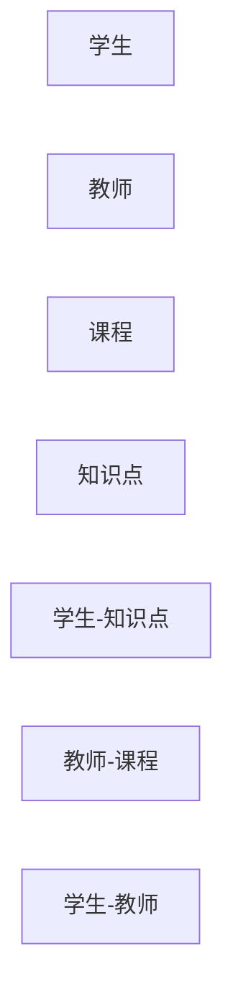
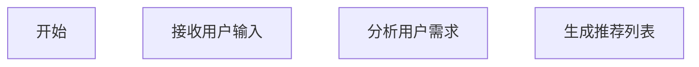
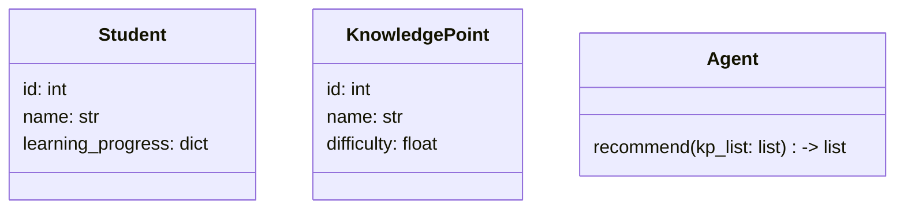
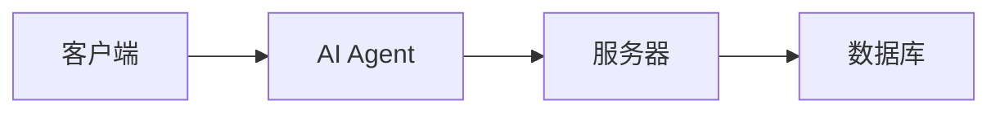
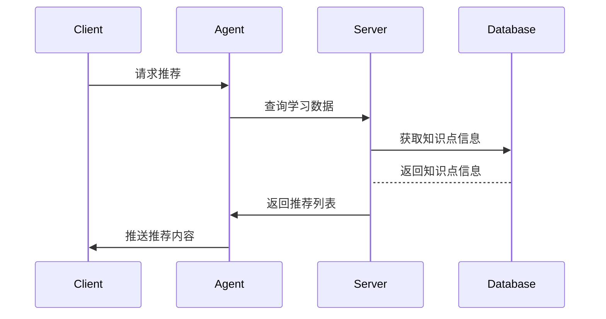

                 


# AI Agent在智能个性化教育中的应用

> 关键词：AI Agent，智能个性化教育，教育信息化，个性化学习，人工智能教育

> 摘要：本文深入探讨AI Agent在智能个性化教育中的应用，分析其核心概念、算法原理、系统架构，并通过实际案例展示其在教育领域的实践价值。从背景介绍到算法实现，从系统设计到项目实战，全面解析AI Agent如何推动教育信息化的未来发展。

---

# 第一部分: AI Agent与智能个性化教育概述

## 第1章: AI Agent与智能个性化教育概述

### 1.1 AI Agent的基本概念

#### 1.1.1 AI Agent的定义

AI Agent（人工智能代理）是指能够感知环境、自主决策并执行任务的智能实体。在教育领域，AI Agent可以表现为推荐系统、自适应学习平台或虚拟教学助手。

#### 1.1.2 AI Agent的核心特点

- **自主性**：AI Agent能够自主决策，无需人工干预。
- **反应性**：能够实时感知环境变化并做出响应。
- **学习能力**：通过数据和反馈不断优化自身行为。

#### 1.1.3 AI Agent与传统教育技术的区别

| 特性 | AI Agent | 传统教育技术 |
|------|-----------|--------------|
| 决策方式 | 自主决策 | 预设规则     |
| 个性化 | 高度个性化 | 基于规则     |
| 学习能力 | 可自适应 | 不可自适应   |

### 1.2 智能个性化教育的背景与需求

#### 1.2.1 教育信息化的发展历程

教育信息化经历了从传统教学到数字化教育，再到智能化教育的转变。AI Agent的引入标志着教育信息化进入智能化阶段。

#### 1.2.2 个性化教育的核心理念

个性化教育强调因材施教，尊重每个学生的个体差异，提供定制化的学习方案。

#### 1.2.3 AI Agent在教育中的应用背景

随着技术进步，AI Agent能够处理复杂的数据，提供实时反馈，满足个性化教育的需求。

### 1.3 AI Agent在智能个性化教育中的应用前景

#### 1.3.1 AI Agent在教育中的潜在应用领域

- **学习推荐**：基于学生表现推荐学习内容。
- **行为分析**：实时分析学生行为，提供个性化指导。
- **互动教学**：通过虚拟助手与学生互动。

#### 1.3.2 AI Agent在个性化教育中的优势

- **高效性**：快速响应学生需求。
- **精准性**：根据数据提供个性化建议。
- **可扩展性**：适用于大规模教育场景。

#### 1.3.3 AI Agent应用的挑战与机遇

- **挑战**：数据隐私、算法偏差。
- **机遇**：技术进步推动教育创新。

### 1.4 本章小结

本章介绍了AI Agent的基本概念和特点，分析了其在智能个性化教育中的应用背景和优势，并探讨了面临的挑战和未来机遇。

---

# 第二部分: AI Agent的核心概念与原理

## 第2章: AI Agent的核心概念与原理

### 2.1 AI Agent的感知、决策与执行模块

#### 2.1.1 感知模块的实现原理

感知模块通过收集学生数据，分析学习进度和知识掌握情况。

#### 2.1.2 决策模块的算法选择

决策模块采用强化学习算法，根据数据生成个性化推荐。

#### 2.1.3 执行模块的实现方式

执行模块通过API与教育平台交互，推送个性化学习内容。

### 2.2 AI Agent与教育系统的实体关系分析

#### 2.2.1 实体关系图（ER图）的构建



### 2.3 AI Agent的核心算法原理

#### 2.3.1 基于强化学习的推荐算法



### 2.4 本章小结

本章详细讲解了AI Agent的核心模块及其在教育系统中的实体关系，分析了强化学习算法的推荐原理。

---

# 第三部分: 算法原理与数学模型

## 第3章: AI Agent的核心算法原理

### 3.1 基于强化学习的推荐算法

#### 3.1.1 算法实现

```python
class Agent:
    def __init__(self, state_space, action_space):
        self.state_space = state_space
        self.action_space = action_space
        # 初始化策略参数
        self.theta = np.random.randn(...)
    
    def act(self, state):
        # 根据当前状态选择动作
        pass
    
    def update(self, state, action, reward):
        # 更新策略参数
        pass
```

#### 3.1.2 算法流程

1. **接收输入**：获取学生当前的学习状态。
2. **分析需求**：识别学生的知识缺口。
3. **生成推荐**：基于强化学习生成推荐内容。
4. **反馈优化**：根据反馈更新推荐策略。

### 3.2 学生知识掌握程度的评估模型

#### 3.2.1 数学模型

$$ P(knowledge\_i) = \frac{1}{1 + e^{-\theta_i - \beta x_j}} $$

其中，$\theta_i$ 是知识点 $i$ 的参数，$x_j$ 是学生 $j$ 的学习数据，$\beta$ 是调节参数。

### 3.3 算法实现

#### 3.3.1 知识点评估

```python
def evaluate_knowledge(theta, x, beta):
    return 1 / (1 + np.exp(-theta - beta * x))
```

### 3.4 本章小结

本章详细讲解了强化学习算法在推荐系统中的应用，并推导了学生知识掌握程度的评估模型。

---

# 第四部分: 系统分析与架构设计

## 第4章: 系统分析与架构设计

### 4.1 问题场景介绍

设计一个智能教育平台，实现个性化学习推荐。

### 4.2 系统功能设计

#### 4.2.1 领域模型



### 4.3 系统架构设计

#### 4.3.1 系统架构图



### 4.4 系统接口设计

#### 4.4.1 接口说明

- **登录接口**：用户登录系统。
- **推荐接口**：获取个性化推荐内容。

### 4.5 系统交互设计

#### 4.5.1 交互流程



### 4.6 本章小结

本章设计了系统的架构和接口，详细描述了系统的交互流程。

---

# 第五部分: 项目实战

## 第5章: 项目实战

### 5.1 环境安装

安装Python和相关库：

```bash
pip install numpy scikit-learn matplotlib
```

### 5.2 核心实现

#### 5.2.1 学生模型

```python
class StudentModel:
    def __init__(self, id, name):
        self.id = id
        self.name = name
        self.progress = {}
```

#### 5.2.2 推荐算法实现

```python
def recommend(theta, x, beta):
    scores = [evaluate_knowledge(theta[i], x[j], beta) for i in range(len(theta))]
    return sorted(range(len(scores)), key=lambda i: -scores[i])
```

### 5.3 项目分析

#### 5.3.1 实际案例

分析一个学生的知识点掌握情况，生成推荐学习计划。

### 5.4 项目小结

本章通过实战项目，详细讲解了系统的实现过程，并分析了实际案例。

### 5.5 本章小结

本章通过实际案例展示了AI Agent在智能个性化教育中的应用，帮助读者理解理论知识。

---

# 第六部分: 最佳实践与总结

## 第6章: 最佳实践与总结

### 6.1 最佳实践

#### 6.1.1 数据隐私保护

确保学生数据的安全和隐私。

#### 6.1.2 算法调优

通过实验优化推荐算法的性能。

#### 6.1.3 系统扩展性

设计可扩展的系统架构。

### 6.2 小结

总结全书内容，强调AI Agent在智能个性化教育中的重要性。

### 6.3 未来展望

展望AI Agent在教育领域的未来发展。

### 6.4 参考文献

列出参考文献和扩展阅读材料。

---

# 作者：AI天才研究院

本文作者是AI天才研究院，专注于人工智能教育领域的研究和实践。

