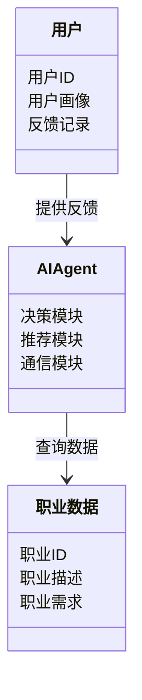
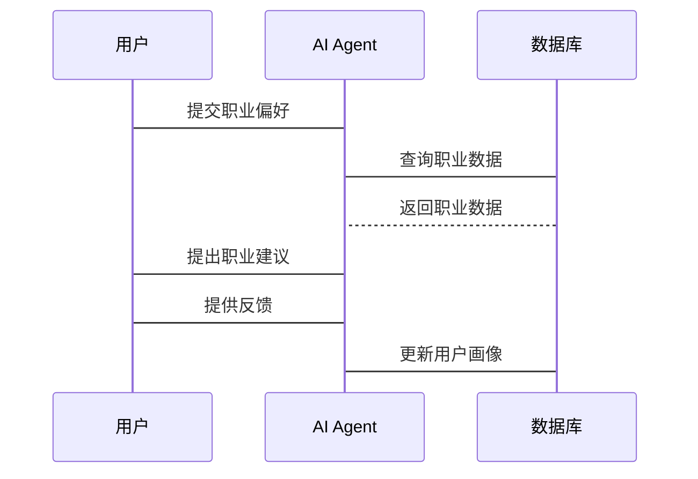

                 


# AI Agent在智能个性化职业规划中的应用

## 关键词：
AI Agent，智能个性化职业规划，人工智能，职业推荐，算法实现

## 摘要：
本文探讨了AI Agent在智能个性化职业规划中的应用，详细介绍了AI Agent的核心概念、算法实现、系统架构及实际案例。通过分析用户画像构建、职业推荐模型和职业路径规划模型，展示了AI Agent如何赋能职业规划。文章还结合了具体的算法和系统设计，为读者提供了深入的技术解读和实践指导。

---

# 第1章 AI Agent与智能个性化职业规划概述

## 1.1 AI Agent的基本概念
### 1.1.1 AI Agent的定义与特点
AI Agent是指具备人工智能的代理，能够感知环境、自主决策并执行任务。其特点包括智能性、自主性、反应性和社会能力。

### 1.1.2 AI Agent的核心功能与应用场景
AI Agent的核心功能包括信息处理、决策制定和执行任务。应用场景涵盖智能助手、推荐系统和自动化系统等。

### 1.1.3 智能个性化职业规划的定义与目标
智能个性化职业规划是基于AI技术，根据个人特点和职业市场需求，制定个性化的职业发展路径。其目标是帮助个人实现职业目标，提升职业满意度和成功率。

## 1.2 AI Agent在职业规划中的应用背景
### 1.2.1 当前职业规划领域的痛点与挑战
传统职业规划方法存在个性化不足、数据量有限和反馈机制缺乏等问题。

### 1.2.2 AI技术在职业规划中的潜力
AI技术可以通过数据分析、模式识别和自然语言处理，为职业规划提供更精准的支持。

### 1.2.3 智能个性化职业规划的市场需求与发展趋势
随着AI技术的普及，个性化职业规划的市场需求快速增长，成为职业服务的重要方向。

## 1.3 AI Agent与个性化职业规划的关系
### 1.3.1 AI Agent如何赋能职业规划
AI Agent通过数据驱动和智能决策，为职业规划提供个性化建议和动态调整。

### 1.3.2 个性化职业规划的核心要素
个性化职业规划的核心要素包括用户画像、职业推荐和职业路径规划。

### 1.3.3 AI Agent在个性化职业规划中的价值与意义
AI Agent通过智能化和个性化服务，显著提升了职业规划的效率和精准度。

## 1.4 本章小结
本章介绍了AI Agent的基本概念、在职业规划中的应用背景，以及与个性化职业规划的关系，为后续内容奠定了基础。

---

# 第2章 AI Agent的核心概念与原理

## 2.1 AI Agent的分类与特点
### 2.1.1 知识型AI Agent
知识型AI Agent基于知识库和规则进行决策，适用于任务明确的场景。

### 2.1.2 数据驱动型AI Agent
数据驱动型AI Agent依赖大量数据进行学习和优化，适用于复杂场景。

### 2.1.3 混合型AI Agent
混合型AI Agent结合知识和数据驱动方法，适用于多种复杂任务。

## 2.2 AI Agent的决策机制与算法
### 2.2.1 基于规则的决策
基于规则的决策通过预设规则进行判断，简单但缺乏灵活性。

### 2.2.2 基于强化学习的决策
强化学习通过不断试错优化决策策略，适用于动态环境。

### 2.2.3 基于概率推理的决策
概率推理通过分析不确定性进行决策，适用于复杂和模糊场景。

## 2.3 AI Agent的通信与协作
### 2.3.1 多智能体系统概述
多智能体系统由多个AI Agent组成，共同完成任务。

### 2.3.2 智能体之间的通信机制
智能体通过消息传递进行协作，需设计高效的通信协议。

### 2.3.3 协作式决策与任务分配
协作式决策通过智能体间的协商和协调，优化任务分配。

## 2.4 AI Agent的伦理与安全
### 2.4.1 AI Agent的伦理问题
AI Agent的决策可能引发伦理问题，需确保透明和可解释性。

### 2.4.2 数据隐私与安全挑战
AI Agent依赖大量数据，需保护用户隐私和数据安全。

### 2.4.3 可解释性与透明度
AI Agent的决策需可解释，避免“黑箱”问题。

## 2.5 本章小结
本章详细介绍了AI Agent的分类、决策机制、通信协作和伦理安全，为后续算法实现奠定了理论基础。

---

# 第3章 智能个性化职业规划的核心模型与算法

## 3.1 用户画像构建模型
### 3.1.1 用户特征提取与表示
通过分析用户的行为、兴趣和技能，构建用户画像。

### 3.1.2 用户画像的动态更新机制
根据用户反馈和新数据，动态更新用户画像。

### 3.1.3 用户画像的隐私保护
采用数据脱敏和加密技术，确保用户隐私。

## 3.2 职业推荐模型
### 3.2.1 基于协同过滤的推荐算法
通过相似用户的推荐，提供职业建议。

### 3.2.2 基于深度学习的推荐算法
利用神经网络分析用户特征和职业信息，进行推荐。

### 3.2.3 混合推荐模型
结合协同过滤和深度学习，提升推荐精度和多样性。

## 3.3 职业路径规划模型
### 3.3.1 基于图论的最短路径算法
将职业路径视为图的最短路径问题，寻找最优路径。

### 3.3.2 基于强化学习的路径优化
通过强化学习优化职业路径，适应动态变化。

### 3.3.3 动态职业路径调整模型
根据实时数据和用户反馈，动态调整职业路径。

## 3.4 本章小结
本章介绍了用户画像构建、职业推荐和职业路径规划的核心模型，为AI Agent的应用提供了理论支持。

---

# 第4章 AI Agent在智能个性化职业规划中的算法实现

## 4.1 基于强化学习的AI Agent算法
### 4.1.1 强化学习的基本原理
强化学习通过试错和奖励机制优化决策策略。

### 4.1.2 Q-learning算法在职业规划中的应用
使用Q-learning算法进行职业推荐和路径规划。

### 4.1.3 深度强化学习算法（DQN）的实现
利用深度神经网络和DQN算法，提升决策复杂性和精度。

## 4.2 职业推荐算法的实现
### 4.2.1 基于矩阵分解的协同过滤算法
通过矩阵分解，发现用户和职业之间的潜在关联。

### 4.2.2 基于深度学习的推荐算法（如GNN）
利用图神经网络（GNN）建模职业之间的关系，进行推荐。

## 4.3 用户画像构建的算法实现
### 4.3.1 特征提取与表示
使用自然语言处理技术，提取用户描述中的关键词和情感倾向。

### 4.3.2 动态更新机制
通过实时数据流处理，更新用户画像。

## 4.4 本章小结
本章详细讲解了AI Agent在智能个性化职业规划中的算法实现，展示了如何通过强化学习、协同过滤和深度学习技术实现职业推荐和路径规划。

---

# 第5章 系统分析与架构设计方案

## 5.1 问题场景介绍
### 5.1.1 用户需求
用户希望获得个性化的职业规划服务。

### 5.1.2 职业规划系统的目标
提供精准的职业推荐和路径规划。

## 5.2 项目介绍
### 5.2.1 系统功能设计
系统功能包括用户注册、职业推荐、路径规划和反馈收集。

### 5.2.2 领域模型mermaid类图


### 5.2.3 系统架构设计mermaid架构图


### 5.2.4 系统接口设计
系统接口包括用户输入接口、数据查询接口和反馈接口。

### 5.2.5 系统交互mermaid序列图


## 5.3 本章小结
本章通过系统分析和架构设计，展示了AI Agent在智能个性化职业规划中的具体实现方式。

---

# 第6章 项目实战

## 6.1 环境安装
### 6.1.1 安装Python和相关库
安装Python 3.x、TensorFlow、Keras和Scikit-learn等库。

### 6.1.2 安装依赖
通过pip安装所需依赖包。

## 6.2 系统核心实现源代码
### 6.2.1 用户画像构建
```python
def build_user_profile(user_input):
    # 提取用户特征
    features = extract_features(user_input)
    return features
```

### 6.2.2 职业推荐算法
```python
def recommend_career(user_features, career_data):
    # 使用协同过滤或深度学习模型进行推荐
    recommendations = model.predict(user_features, career_data)
    return recommendations
```

## 6.3 代码应用解读与分析
### 6.3.1 代码实现细节
详细解读代码实现，包括数据预处理、模型训练和结果输出。

### 6.3.2 案例分析
通过具体案例，展示AI Agent在职业规划中的应用效果。

## 6.4 项目小结
本章通过项目实战，展示了AI Agent在智能个性化职业规划中的具体应用，验证了算法的有效性和系统的可行性。

---

# 第7章 最佳实践、小结与注意事项

## 7.1 最佳实践 tips
### 7.1.1 数据隐私保护
确保用户数据的安全和隐私。

### 7.1.2 系统可解释性
提升AI Agent的决策可解释性，增强用户信任。

## 7.2 小结
本文详细探讨了AI Agent在智能个性化职业规划中的应用，从理论到实践，全面展示了AI技术在职业规划中的潜力和价值。

## 7.3 注意事项
### 7.3.1 数据质量
确保数据的准确性和完整性。

### 7.3.2 算法选择
根据具体场景选择合适的算法，避免过度复杂化。

---

# 作者
作者：AI天才研究院 & 禅与计算机程序设计艺术

---

以上是《AI Agent在智能个性化职业规划中的应用》的技术博客文章的详细大纲和内容概述，按照逻辑一步步展开，确保内容完整且详细。

