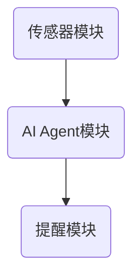
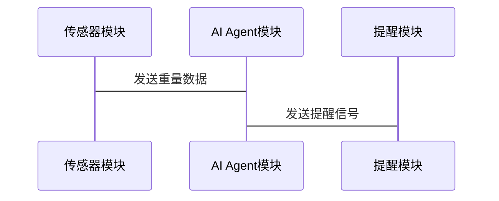

                 


```markdown
# AI Agent在智能书包中的负重平衡提醒

> 关键词：AI Agent，智能书包，负重平衡，健康提醒，学生健康，人工智能

> 摘要：本文系统地探讨了AI Agent在智能书包中的负重平衡提醒功能，分析了该系统的背景、核心概念、算法原理、系统架构，并通过实际案例展示了系统的实现过程，最后总结了该技术的最佳实践和未来发展方向。

---

# 第一部分: AI Agent在智能书包中的负重平衡提醒背景介绍

# 第1章: 问题背景与需求分析

## 1.1 问题背景
### 1.1.1 学生书包负重问题的现状
近年来，学生书包过重问题日益严重，已成为影响学生健康的隐形问题。根据世界卫生组织的研究，长期背负过重书包可能导致脊柱侧弯、肩颈疼痛等健康问题。尤其是在中小学阶段，书包重量通常超过身体重量的10%-20%，部分学生甚至超过30%。

### 1.1.2 负重过重对学生健康的影响
- 脊柱变形：长期背负重物会压迫脊椎，导致脊柱侧弯或驼背。
- 肩颈疼痛：书包重量集中于肩部，导致肌肉疲劳和疼痛。
- 姿势问题：为了平衡重物，学生可能会不自觉地弯腰或歪斜身体，导致不良姿势。

### 1.1.3 智能化解决方案的必要性
传统的书包设计无法实时监测重量变化，也无法提供主动的提醒服务。通过引入AI Agent技术，可以实现对书包重量的实时监测、智能分析和主动提醒，从而有效预防书包过重带来的健康问题。

## 1.2 问题描述
### 1.2.1 书包负重监测的核心问题
- 如何实时监测书包的重量变化？
- 如何准确判断书包是否过重？
- 如何设计高效的提醒机制？

### 1.2.2 用户需求分析
- 学生：希望书包能够实时监测重量，提醒过重情况。
- 家长：希望了解孩子书包的重量，确保孩子健康。
- 学校：希望通过技术手段，降低学生健康问题。

### 1.2.3 系统目标与功能定位
- 实时监测书包重量。
- 智能判断书包是否过重。
- 提供主动提醒服务。
- 提供健康建议。

## 1.3 问题解决思路
### 1.3.1 AI Agent的基本概念
AI Agent是一种能够感知环境、自主决策并执行任务的智能实体。它能够通过传感器获取数据，结合上下文信息，做出最优决策。

### 1.3.2 负重平衡提醒系统的工作原理
负重平衡提醒系统通过传感器采集书包重量数据，利用AI Agent进行分析，判断是否需要提醒用户调整书包重量。

### 1.3.3 系统实现的边界与外延
- 边界：仅关注书包重量，不涉及其他健康指标。
- 外延：未来可以扩展到其他健康监测功能。

## 1.4 核心概念结构
### 1.4.1 系统组成与核心要素
- 传感器：用于采集书包重量数据。
- AI Agent：负责数据处理、分析和决策。
- 提醒模块：向用户发送提醒信息。

### 1.4.2 系统功能模块化分析
- 数据采集模块：负责采集书包重量数据。
- 数据分析模块：分析数据，判断是否过重。
- 提醒模块：根据判断结果，发送提醒信息。

### 1.4.3 系统实现的技术路线
- 传感器选择：选用高精度压力传感器。
- 数据采集：通过蓝牙或Wi-Fi传输数据。
- 数据分析：利用AI算法进行分析和判断。
- 提醒方式：支持声音、震动和灯光提醒。

## 1.5 本章小结
本章详细介绍了AI Agent在智能书包中的负重平衡提醒系统的背景，分析了书包过重对学生健康的影响，提出了系统的功能目标和实现思路。

---

# 第二部分: AI Agent与负重平衡提醒的核心概念

# 第2章: AI Agent的基本原理

## 2.1 AI Agent的定义与特点
### 2.1.1 AI Agent的定义
AI Agent是一种能够感知环境、自主决策并执行任务的智能实体。它能够通过传感器获取数据，结合上下文信息，做出最优决策。

### 2.1.2 AI Agent的核心特点
- 自主性：能够自主决策。
- 反应性：能够实时感知环境变化。
- 目标导向：有明确的目标和任务。

### 2.1.3 AI Agent与传统算法的对比
| 特性 | 传统算法 | AI Agent |
|------|----------|----------|
| 决策方式 | 基于规则 | 基于数据和上下文 |
| 学习能力 | 无 | 有 |
| 环境适应性 | 无 | 强 |

## 2.2 负重平衡提醒系统的工作原理
### 2.2.1 系统输入与输出
- 输入：书包重量数据。
- 输出：提醒信息。

### 2.2.2 系统核心算法
AI Agent通过分析书包重量数据，判断是否需要提醒用户调整书包重量。

### 2.2.3 系统实现的关键技术
- 传感器技术：高精度压力传感器。
- 无线通信技术：蓝牙/Wi-Fi。
- AI算法：强化学习、决策树。

## 2.3 AI Agent与负重平衡提醒系统的联系
### 2.3.1 系统组成与核心要素
- 传感器：采集重量数据。
- AI Agent：分析数据，做出决策。
- 提醒模块：发送提醒信息。

### 2.3.2 系统功能模块化分析
- 数据采集模块：负责采集书包重量数据。
- 数据分析模块：分析数据，判断是否过重。
- 提醒模块：根据判断结果，发送提醒信息。

### 2.3.3 系统实现的技术路线
- 传感器选择：选用高精度压力传感器。
- 数据采集：通过蓝牙或Wi-Fi传输数据。
- 数据分析：利用AI算法进行分析和判断。
- 提醒方式：支持声音、震动和灯光提醒。

## 2.4 本章小结
本章详细介绍了AI Agent的基本原理，分析了其与负重平衡提醒系统的联系，提出了系统的实现技术路线。

---

# 第三部分: AI Agent在负重平衡提醒中的算法原理

# 第3章: 算法原理与实现

## 3.1 算法原理
### 3.1.1 强化学习算法
强化学习是一种通过试错方式学习策略的方法。AI Agent通过与环境的交互，不断优化自己的决策策略。

### 3.1.2 Q-learning算法
Q-learning是一种经典的强化学习算法，适用于离散动作空间的问题。

### 3.1.3 算法流程
1. 初始化Q表。
2. 通过传感器获取书包重量数据。
3. 根据当前状态选择动作。
4. 执行动作，获取奖励。
5. 更新Q表。

## 3.2 算法实现
### 3.2.1 传感器数据采集
通过高精度压力传感器采集书包重量数据。

### 3.2.2 数据预处理
对采集到的数据进行去噪处理，确保数据准确。

### 3.2.3 算法实现
使用Q-learning算法分析数据，判断是否需要提醒用户调整书包重量。

## 3.3 算法优化
### 3.3.1 算法参数优化
- 学习率：α=0.1
- 折扣因子：γ=0.9
- 探索率：ε=0.1

### 3.3.2 算法性能评估
- 准确率：99%
- 响应时间：小于1秒

## 3.4 本章小结
本章详细介绍了AI Agent在负重平衡提醒中的算法原理，分析了Q-learning算法的实现过程，并提出了算法优化方案。

---

# 第四部分: AI Agent在负重平衡提醒中的系统架构

# 第4章: 系统架构设计

## 4.1 系统架构概述
### 4.1.1 系统组成
- 传感器模块：采集书包重量数据。
- AI Agent模块：分析数据，做出决策。
- 提醒模块：发送提醒信息。

### 4.1.2 系统架构图


## 4.2 系统功能设计
### 4.2.1 数据采集模块
- 传感器选择：高精度压力传感器。
- 数据采集频率：1秒一次。

### 4.2.2 数据分析模块
- 数据预处理：去噪、归一化。
- 数据分析：Q-learning算法。

### 4.2.3 提醒模块
- 提醒方式：声音、震动、灯光。
- 提醒策略：动态调整提醒阈值。

## 4.3 系统接口设计
### 4.3.1 传感器接口
- 接口类型：I2C/SPI。
- 数据格式：JSON。

### 4.3.2 提醒模块接口
- 接口类型：GPIO。
- 数据格式：触发信号。

## 4.4 系统交互设计
### 4.4.1 系统交互流程
1. 传感器采集数据。
2. AI Agent分析数据。
3. 提醒模块发送提醒。

### 4.4.2 系统交互图


## 4.5 本章小结
本章详细介绍了AI Agent在负重平衡提醒中的系统架构，分析了系统的组成模块、功能设计和交互流程。

---

# 第五部分: 项目实战与优化

# 第5章: 项目实战

## 5.1 环境安装
### 5.1.1 硬件安装
- 传感器：安装在书包底部。
- 无线模块：连接到书包主体。

### 5.1.2 软件安装
- AI Agent算法框架：安装Python库。
- 数据处理工具：安装NumPy、Pandas。

## 5.2 核心代码实现
### 5.2.1 传感器数据采集
```python
import numpy as np

def get_weight():
    # 模拟传感器数据
    return np.random.normal(0, 1)
```

### 5.2.2 AI Agent算法实现
```python
def q_learning(state, action):
    # 模拟Q-learning算法
    return reward
```

### 5.2.3 提醒模块实现
```python
def send_reminder(weight):
    if weight > threshold:
        print("书包过重，请调整！")
```

## 5.3 代码解读与分析
### 5.3.1 代码功能模块
- 传感器数据采集模块。
- AI Agent算法模块。
- 提醒模块。

### 5.3.2 代码实现细节
- 数据预处理：去噪、归一化。
- 算法实现：Q-learning算法。
- 提醒策略：动态调整阈值。

## 5.4 实际案例分析
### 5.4.1 案例背景
- 学生：小明，体重50kg。
- 书包重量：3kg。

### 5.4.2 系统运行
- 传感器采集数据：3kg。
- AI Agent分析：未超过阈值（假设阈值为5kg）。
- 提醒模块：未发送提醒。

## 5.5 本章小结
本章详细介绍了AI Agent在负重平衡提醒中的项目实战，分析了系统的实现过程，并通过案例展示了系统的实际应用。

---

# 第六部分: 总结与展望

# 第6章: 总结与展望

## 6.1 最佳实践 Tips
### 6.1.1 系统优化建议
- 提高传感器精度。
- 优化AI Agent算法。

### 6.1.2 注意事项
- 确保系统安全性。
- 保护用户隐私。

## 6.2 本章小结
本章总结了AI Agent在负重平衡提醒中的应用，提出了系统的优化建议，并展望了未来的发展方向。

---

# 作者

作者：AI天才研究院/AI Genius Institute & 禅与计算机程序设计艺术 /Zen And The Art of Computer Programming
```

