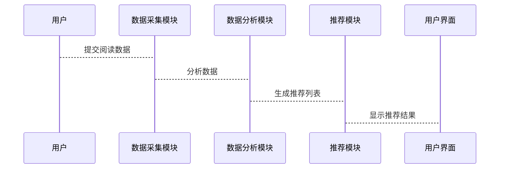

                 


# AI Agent在智能书立中的阅读习惯分析

> 关键词：AI Agent, 阅读习惯分析, 智能书立, 自然语言处理, 机器学习

> 摘要：本文探讨AI Agent在智能书立中的应用，分析阅读习惯的原理、算法及系统架构，结合实际案例，详细讲解如何利用AI技术优化阅读体验。

---

## 正文

### 第一部分: AI Agent与智能书立基础

#### 第1章: AI Agent与智能书立概述

##### 1.1 AI Agent的基本概念

- **1.1.1 AI Agent的定义与特点**
  AI Agent是一种智能体，能够感知环境、执行任务并做出决策。其特点包括自主性、反应性、目标导向和学习能力。

- **1.1.2 智能书立的概念与功能**
  智能书立是结合AI技术的数字图书馆，能根据用户行为推荐书籍，优化阅读体验。

- **1.1.3 AI Agent在智能书立中的作用**
  AI Agent通过分析用户行为，提供个性化推荐，提升阅读效率和体验。

##### 1.2 阅读习惯分析的背景与意义

- **1.2.1 阅读习惯分析的必要性**
  理解用户的阅读模式有助于优化内容推荐，提升用户满意度。

- **1.2.2 AI技术在阅读习惯分析中的优势**
  AI能够处理大量数据，发现模式，提供精准的推荐。

- **1.2.3 智能书立的应用场景**
  包括个性化推荐、阅读进度跟踪、内容过滤等。

### 第二部分: AI Agent的核心概念与原理

#### 第2章: AI Agent的核心概念

##### 2.1 AI Agent的感知层

- **2.1.1 数据采集与处理**
  通过日志记录用户行为，提取阅读时间、频率等特征。

- **2.1.2 用户行为分析**
  利用自然语言处理技术分析用户的阅读偏好。

##### 2.2 AI Agent的决策层

- **2.2.1 算法选择与优化**
  使用协同过滤、矩阵分解等算法，预测用户的阅读兴趣。

- **2.2.2 阅读习惯预测模型**
  基于机器学习构建模型，预测用户的阅读行为。

##### 2.3 AI Agent的执行层

- **2.3.1 行为推荐与反馈**
  根据预测结果推荐书籍，并收集用户反馈进行优化。

- **2.3.2 系统优化与迭代**
  持续更新模型，提升推荐的准确性和用户体验。

##### 2.4 核心概念对比表

| 比较维度       | 基于规则的AI Agent | 基于机器学习的AI Agent |
|----------------|--------------------|------------------------|
| 准确性         | 中等               | 高                     |
| 可解释性       | 高                 | 中等                   |
| 实时性         | 低                 | 高                     |

##### 2.5 ER实体关系图

```mermaid
erd
  User
  Reading_Habit
  Book
  Reading_Session
  Reading_Session.-->Book: reads
  User.-->Reading_Habit: has
  Reading_Habit.-->Book: prefers
```

### 第三部分: 阅读习惯分析的算法原理

#### 第3章: 阅读习惯分析的算法原理

##### 3.1 数据预处理

- **3.1.1 数据清洗与特征提取**
  清洗噪声数据，提取有用的特征，如用户ID、书籍ID、阅读时间等。

- **3.1.2 数据标准化与归一化**
  将数据转换为统一格式，便于模型训练。

##### 3.2 算法选择与实现

- **3.2.1 协同过滤算法**

  ```python
  def collaborative_filtering(user_data, user):
      similar_users = find_similar_users(user_data, user)
      weighted_ratings = calculate_weighted_ratings(similar_users)
     推荐书籍 = select_top_books(weighted_ratings)
      return 推荐书籍
  ```

- **3.2.2 矩阵分解算法**

  ```latex
  假设评分矩阵R，矩阵分解为U和V，使得R ≈ UV^T
  ```

##### 3.3 数学模型与公式

- 协同过滤公式：

  $$相似度 = \frac{\sum_{i}(r_{ui} - \bar{r_u})(r_{vi} - \bar{r_v})}{\sqrt{\sum_{i}(r_{ui} - \bar{r_u})^2} \sqrt{\sum_{i}(r_{vi} - \bar{r_v})^2}}$$

- 矩阵分解公式：

  $$\arg\min_{U,V} \sum_{i,j} (R_{ij} - U_i V_j^T)^2 + \lambda (||U||^2 + ||V||^2)$$

### 第四部分: 系统分析与架构设计

#### 第4章: 系统分析与架构设计

##### 4.1 问题场景介绍

- 用户登录、书籍推荐、阅读记录等核心功能。

##### 4.2 项目介绍

- 开发一个基于AI Agent的智能书立系统，实现个性化阅读推荐。

##### 4.3 系统功能设计

- **数据采集模块**: 收集用户的阅读数据。
- **分析模块**: 处理数据，生成推荐列表。
- **推荐模块**: 根据分析结果推荐书籍。

##### 4.4 系统架构设计


##### 4.5 接口设计与交互流程图



### 第五部分: 项目实战

#### 第5章: 项目实战

##### 5.1 环境搭建

- 安装Python、机器学习库（如scikit-learn）和可视化工具（如Matplotlib）。

##### 5.2 核心代码实现

- 预处理代码：

  ```python
  import pandas as pd
  data = pd.read_csv('reading_data.csv')
  data = data.dropna()
  ```

- 训练模型代码：

  ```python
  from sklearn.model_selection import train_test_split
  from sklearn.metrics import accuracy_score
  model.fit(X_train, y_train)
  ```

##### 5.3 代码解读与测试案例

- 测试代码：

  ```python
  def test_model(model, X_test, y_test):
      y_pred = model.predict(X_test)
      print(accuracy_score(y_test, y_pred))
  ```

##### 5.4 实际案例分析

- 分析用户数据，优化推荐算法，提升推荐准确率。

### 第六部分: 最佳实践与总结

#### 第6章: 最佳实践

##### 6.1 小结

- AI Agent在智能书立中的应用前景广阔，能够显著提升用户体验。

##### 6.2 注意事项

- 注意数据隐私保护，确保用户数据安全。

##### 6.3 拓展阅读

- 推荐阅读《机器学习实战》和《自然语言处理入门》。

---

作者：AI天才研究院 & 禅与计算机程序设计艺术

