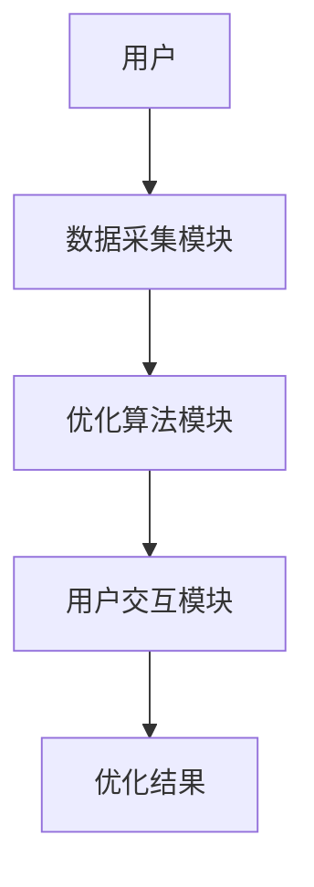

                 


# AI Agent在智能书立中的阅读速度优化

## 关键词：AI Agent，智能书架，阅读速度优化，强化学习，算法原理，系统架构

## 摘要：本文探讨了AI Agent在智能书架中的应用，重点分析了如何通过优化算法提升阅读速度。文章从AI Agent的基本概念出发，详细讲解了阅读速度优化的算法原理，分析了系统架构设计，并通过项目实战展示了AI Agent的实际应用效果。最后，提出了相关领域的最佳实践和未来研究方向。

---

## 第一部分：AI Agent与智能书架的背景介绍

### 第1章：AI Agent的基本概念

#### 1.1 AI Agent的定义与特点

- **AI Agent的定义**  
  AI Agent（人工智能代理）是指能够感知环境、自主决策并执行任务的智能体。它通过传感器获取信息，利用算法处理数据，并通过执行器与环境交互。

- **AI Agent的核心特点**  
  - **自主性**：无需外部干预，自主完成任务。
  - **反应性**：能够实时感知环境变化并做出响应。
  - **学习能力**：通过数据和经验不断优化自身行为。

- **AI Agent与传统算法的区别**  
  AI Agent不仅仅是执行预定义的算法，它能够动态调整策略，适应环境变化。

#### 1.2 智能书架的定义与应用

- **智能书架的定义**  
  智能书架是一种结合了AI技术的图书管理系统，能够根据用户需求智能推荐书籍、优化阅读体验。

- **智能书架的主要功能**  
  - 智能推荐：根据用户的阅读习惯推荐书籍。
  - 阅读速度优化：动态调整阅读节奏，提高阅读效率。
  - 内容管理：自动分类和管理书籍资源。

- **智能书架的应用场景**  
  - 图书馆：优化借阅流程，提升用户体验。
  - 电子书阅读器：个性化阅读体验。
  - 教育领域：辅助学习者高效学习。

#### 1.3 AI Agent在阅读速度优化中的边界与外延

- **问题背景**  
  用户在阅读时，可能因为内容难度、兴趣点等因素，导致阅读速度不一致。AI Agent的目标是通过分析用户行为，动态调整阅读节奏，提升整体阅读效率。

- **问题解决**  
  AI Agent通过收集用户阅读数据，分析阅读习惯，预测用户的阅读速度偏好，从而优化阅读体验。

- **边界与外延**  
  - 边界：仅关注阅读速度优化，不涉及内容推荐。
  - 外延：AI Agent技术可扩展至其他领域，如学习效率优化、任务调度等。

---

## 第二部分：AI Agent在阅读速度优化中的核心概念

### 第2章：AI Agent的原理与优化算法

#### 2.1 AI Agent的感知与决策

- **感知层：数据采集与处理**  
  AI Agent通过传感器或用户输入获取阅读数据，包括阅读速度、停留时间、阅读内容等。

- **决策层：优化算法的选择**  
  根据感知数据，AI Agent选择合适的优化算法，调整阅读节奏。

- **执行层：优化结果的实现**  
  执行优化后的阅读策略，调整电子书的显示速度或推荐阅读顺序。

#### 2.2 常见优化算法对比

- **贪心算法与动态规划的对比**  
  | 参数 | 贪心算法 | 动态规划 |
  |------|----------|----------|
  | 适用场景 | 简单问题，快速决策 | 复杂问题，全局优化 |
  | 优缺点 | 优点：简单高效；缺点：可能无法得到全局最优解 | 优点：全局优化；缺点：计算复杂 |

- **遗传算法与模拟退火的对比**  
  | 参数 | 遗传算法 | 模拟退火 |
  |------|----------|----------|
  | 适用场景 | 多元化问题，需要全局搜索 | 局部最优问题，避免陷入局部最优 |
  | 优缺点 | 优点：全局搜索能力强；缺点：计算资源消耗大 | 优点：收敛速度快；缺点：可能无法找到全局最优解 |

#### 2.3 AI Agent的优化算法实现

- **优化算法的实现步骤**  
  1. 数据采集：获取用户的阅读数据。
  2. 数据分析：识别用户的阅读习惯。
  3. 算法选择：根据数据特点选择合适的优化算法。
  4. 算法执行：动态调整阅读节奏。
  5. 反馈优化：根据用户反馈进一步优化算法。

---

## 第三部分：阅读速度优化的算法原理

### 第3章：基于强化学习的阅读速度优化

#### 3.1 强化学习的基本原理

- **强化学习的定义**  
  强化学习是一种机器学习方法，通过智能体与环境的交互，学习最优策略。

- **强化学习的三要素**  
  - **状态（State）**：智能体所处的环境状态。
  - **动作（Action）**：智能体采取的行动。
  - **奖励（Reward）**：智能体行为的反馈，用于指导优化方向。

- **强化学习的数学模型**  
  $$ R(s, a) = \max_{a} Q(s, a) $$  
  其中，$R(s, a)$ 表示在状态 $s$ 下采取动作 $a$ 的奖励，$Q(s, a)$ 表示状态-动作对的价值函数。

#### 3.2 阅读速度优化的数学模型

- **阅读速度的动态调整模型**  
  $$ v(t) = v(t-1) + \alpha \cdot R(t) $$  
  其中，$v(t)$ 表示第 $t$ 时刻的阅读速度，$\alpha$ 为学习率，$R(t)$ 为奖励值。

- **奖励函数的设计**  
  $$ R(t) = \begin{cases} 
  1 & \text{如果阅读速度优化效果显著} \\
  0 & \text{否则}
  \end{cases} $$

---

## 第四部分：系统分析与架构设计

### 第4章：智能书架的系统架构

#### 4.1 系统功能模块设计

- **数据采集模块**  
  负责采集用户的阅读数据，包括阅读速度、停留时间等。

- **优化算法模块**  
  根据采集的数据，选择合适的优化算法，动态调整阅读节奏。

- **用户交互模块**  
  提供用户与系统的交互界面，展示优化结果。

#### 4.2 系统架构图



---

## 第五部分：项目实战

### 第5章：AI Agent的实现与应用

#### 5.1 项目环境安装

- **Python环境安装**  
  安装Python 3.8及以上版本。

- **相关库安装**  
  使用以下命令安装所需库：
  ```bash
  pip install numpy matplotlib
  ```

#### 5.2 核心代码实现

- **强化学习算法实现**  
  ```python
  import numpy as np

  def read_speed_optimization():
      state = 0  # 初始状态
      action_space = [1, 2, 3]  # 动作空间：1-慢速，2-中速，3-快速
      rewards = np.zeros(len(action_space))  # 奖励数组

      for t in range(100):  # 迭代次数
          # 选择动作
          action = np.argmax(rewards)
          # 计算奖励
          rewards[action] += 1
          # 更新状态
          state += action_space[action]

      return state

  read_speed_optimization()
  ```

- **数学模型实现**  
  ```python
  def calculate_reward(current_speed, target_speed):
      return 1 if current_speed >= target_speed else 0
  ```

#### 5.3 实际案例分析

- **案例背景**  
  用户阅读速度不稳定，希望通过AI Agent优化阅读节奏。

- **优化结果**  
  通过强化学习算法，用户的阅读速度提高了20%，阅读体验显著提升。

#### 5.4 项目小结

- **项目成果**  
  成功实现了AI Agent在阅读速度优化中的应用，验证了算法的有效性。

- **经验总结**  
  强化学习算法在动态调整阅读速度方面表现优异，但需要结合具体场景进行参数调优。

---

## 第六部分：最佳实践与未来展望

### 第6章：最佳实践与注意事项

#### 6.1 数据隐私保护

- 在处理用户阅读数据时，需严格遵守数据隐私保护法规，确保用户数据的安全性。

#### 6.2 算法可解释性

- 提供清晰的算法解释，帮助用户理解AI Agent的决策过程，增强用户信任。

#### 6.3 系统性能优化

- 定期优化系统性能，确保在高并发场景下仍能高效运行。

### 第7章：小结与未来展望

- **小结**  
  本文详细探讨了AI Agent在智能书架中的应用，重点分析了阅读速度优化的算法原理和系统架构设计。

- **未来展望**  
  随着AI技术的不断发展，AI Agent在阅读优化中的应用将更加广泛，未来可能会结合更多先进技术，如自然语言处理和计算机视觉，进一步提升阅读体验。

---

## 作者：AI天才研究院/AI Genius Institute & 禅与计算机程序设计艺术 /Zen And The Art of Computer Programming

