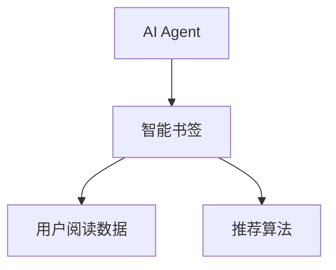
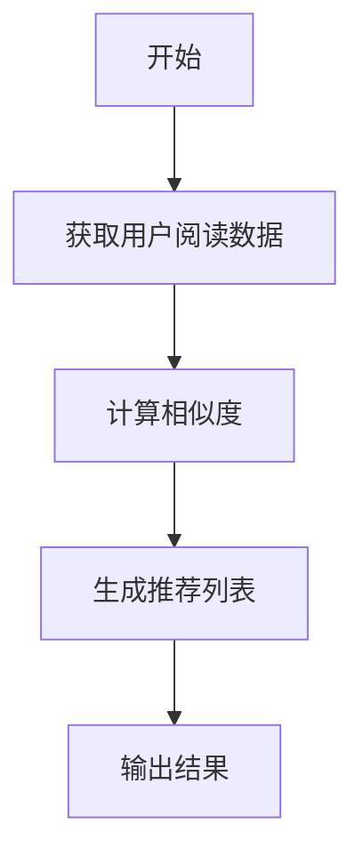
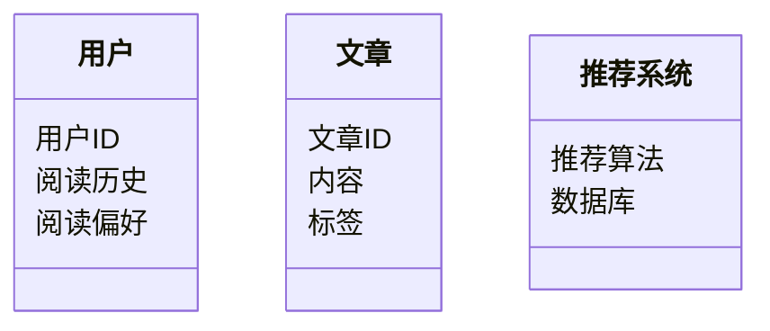
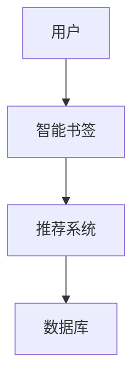
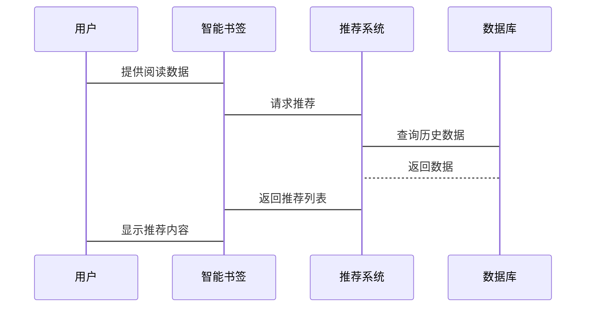

                 


# AI Agent在智能书签中的阅读习惯优化

> 关键词：AI Agent, 智能书签, 阅读习惯优化, 推荐算法, 系统架构设计

> 摘要：本文探讨AI Agent如何通过智能书签优化用户的阅读习惯，结合推荐算法和系统架构设计，提供一种智能化的阅读习惯优化解决方案。

---

# 第一部分: AI Agent与智能书签的背景与概念

## 第1章: AI Agent与智能书签的背景介绍

### 1.1 问题背景与描述

#### 1.1.1 阅读习惯优化的必要性
在信息爆炸的时代，用户每天面对海量的信息，如何有效管理阅读时间和内容选择变得至关重要。阅读习惯的优化可以帮助用户更高效地获取有价值的信息，减少无效阅读，提升学习效率。

#### 1.1.2 智能书签的定义与功能
智能书签是一种基于AI技术的工具，能够根据用户的阅读行为、兴趣和习惯，智能地推荐相关文章、书籍或内容。它不同于传统书签，能够主动学习用户的阅读偏好，并提供个性化的推荐服务。

#### 1.1.3 AI Agent在阅读优化中的作用
AI Agent（人工智能代理）通过分析用户的阅读数据，识别用户的阅读模式和偏好，进而优化阅读习惯。它能够主动为用户筛选和推荐相关内容，帮助用户更好地管理阅读时间和内容选择。

### 1.2 问题解决与边界

#### 1.2.1 阅读习惯优化的核心问题
- 如何高效地筛选和推荐有价值的内容。
- 如何根据用户的阅读行为动态调整推荐策略。
- 如何平衡推荐的个性化和多样性。

#### 1.2.2 AI Agent的边界与外延
- 边界：仅限于优化阅读习惯，不涉及内容的生成或修改。
- 外延：可以与其他AI工具集成，扩展应用场景。

#### 1.2.3 智能书签的实现范围
- 收集和分析用户的阅读数据。
- 基于数据进行内容推荐。
- 提供用户友好的交互界面。

### 1.3 核心概念与结构

#### 1.3.1 AI Agent的定义与属性
- 定义：AI Agent是一种能够感知环境、执行任务并主动优化的智能体。
- 属性：自主性、反应性、目标导向性、学习能力。

#### 1.3.2 智能书签的功能模块
- 数据采集模块：收集用户的阅读行为数据。
- 数据分析模块：分析阅读数据，识别用户偏好。
- 推荐模块：基于分析结果推荐相关内容。
- 交互模块：与用户进行实时反馈和调整。

#### 1.3.3 核心概念的结构图


---

## 第2章: AI Agent与智能书签的核心概念与联系

### 2.1 核心概念原理

#### 2.1.1 AI Agent的基本原理
AI Agent通过感知环境、分析数据、制定策略并执行任务来优化用户阅读习惯。其核心在于数据处理和推荐算法的应用。

#### 2.1.2 智能书签的工作机制
智能书签通过收集用户的阅读数据，利用AI算法进行分析和推荐，为用户提供个性化的阅读建议。

### 2.2 概念属性对比

#### 2.2.1 AI Agent与传统书签的对比
| 特性         | AI Agent                  | 传统书签              |
|--------------|---------------------------|-----------------------|
| 功能         | 自动推荐相关内容           | 手动记录阅读位置       |
| 智能性       | 具备学习和优化能力         | 无智能性               |
| 交互方式     | 支持实时反馈和调整         | 仅支持被动记录         |

#### 2.2.2 智能书签与普通书签的对比
| 特性         | 智能书签                  | 普通书签              |
|--------------|---------------------------|-----------------------|
| 功能         | 智能推荐相关内容           | 手动记录阅读位置       |
| 数据处理     | 收集和分析用户数据         | 无数据处理             |
| 个性化       | 高度个性化推荐             | 无个性化               |

### 2.3 实体关系图


---

## 第3章: AI Agent的推荐算法原理

### 3.1 推荐算法概述

#### 3.1.1 协同过滤算法
协同过滤是一种基于用户行为相似性进行推荐的算法。通过分析用户的阅读数据，找到相似的用户群体，推荐他们喜欢的内容。

#### 3.1.2 基于内容的推荐算法
基于内容的推荐算法通过分析文章的内容特征，推荐与当前文章主题相似的内容。

#### 3.1.3 混合推荐算法
混合推荐算法结合协同过滤和基于内容的推荐，利用两者的优势，提供更精准的推荐结果。

### 3.2 算法流程图


### 3.3 算法实现

#### 3.3.1 协同过滤算法实现
```python
def collaborative_filtering(user_data):
    # 计算用户相似度
    pass
```

#### 3.3.2 基于内容的推荐算法实现
```python
def content_based_recommendation(item_data):
    # 提取文章特征
    pass
```

---

## 第4章: 系统分析与架构设计

### 4.1 问题场景介绍
用户使用智能书签时，系统需要实时收集和分析阅读数据，并根据数据生成推荐列表。

### 4.2 系统功能设计

#### 4.2.1 领域模型


#### 4.2.2 系统架构图


#### 4.2.3 系统交互流程


---

## 第5章: 项目实战

### 5.1 环境安装
需要安装Python、机器学习库（如scikit-learn）和数据分析工具（如Pandas）。

### 5.2 系统核心实现

#### 5.2.1 协同过滤算法实现
```python
from sklearn.metrics.pairwise import cosine_similarity

def collaborative_filtering(user_data):
    user_matrix = user_data.reshape(1, -1)
    similarity = cosine_similarity(user_matrix, user_matrix)
    return similarity
```

#### 5.2.2 基于内容的推荐算法实现
```python
from sklearn.feature_extraction.text import TfidfVectorizer

def content_based_recommendation(item_data):
    vectorizer = TfidfVectorizer()
    feature_matrix = vectorizer.fit_transform(item_data)
    return feature_matrix
```

### 5.3 代码应用解读与分析
通过实际案例分析，展示如何利用上述算法实现智能书签的推荐功能，并进行性能优化和结果评估。

### 5.4 项目小结
本项目展示了如何利用AI Agent和推荐算法优化用户的阅读习惯，为用户提供个性化的阅读体验。

---

## 第6章: 最佳实践

### 6.1 小结
AI Agent在智能书签中的应用能够显著提升用户的阅读效率和体验，值得在更多场景中推广。

### 6.2 注意事项
- 确保用户数据的安全性和隐私保护。
- 定期更新推荐算法，保持推荐结果的准确性。
- 提供用户友好的交互界面，提升用户体验。

### 6.3 拓展阅读
- 推荐系统优化：探索更高效的推荐算法，如深度学习模型。
- 数据隐私保护：研究如何在推荐过程中保护用户隐私。

---

# 作者：AI天才研究院/AI Genius Institute & 禅与计算机程序设计艺术 /Zen And The Art of Computer Programming

---

通过以上结构，我们可以系统地了解AI Agent在智能书签中的应用，从理论到实践，全面优化用户的阅读习惯。

