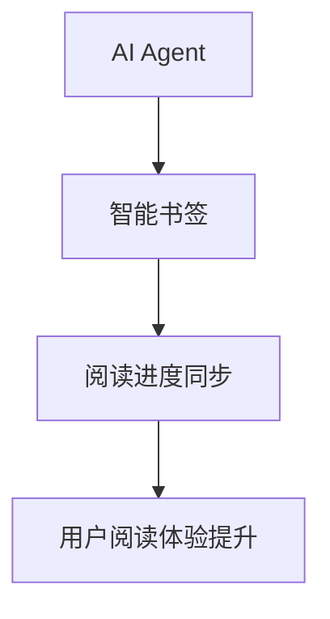
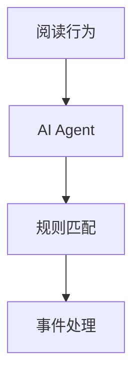
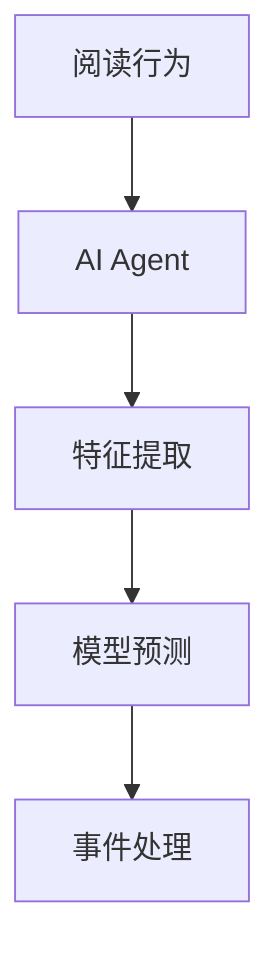
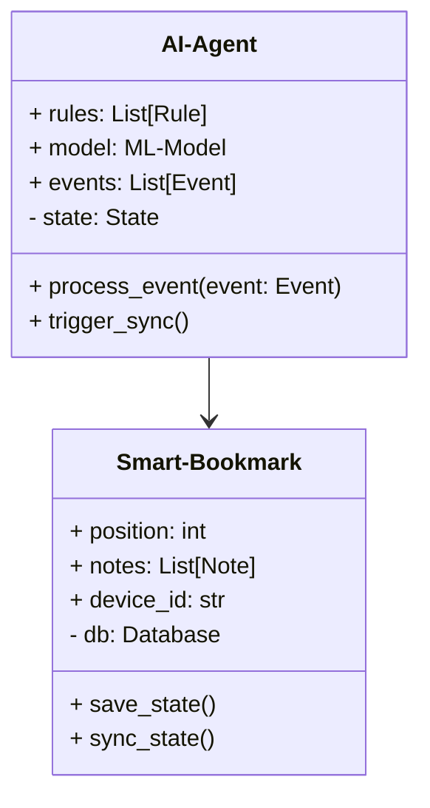
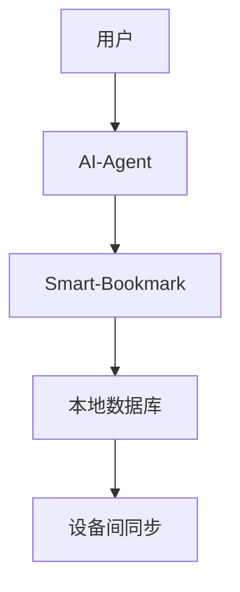
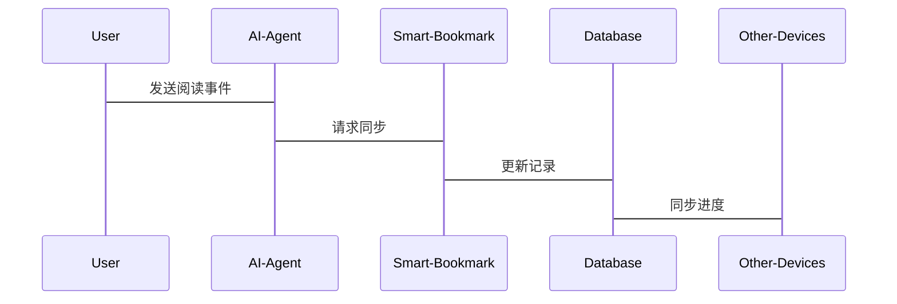

                 


# AI Agent在智能书签中的阅读进度同步

## 关键词：AI Agent, 智能书签, 阅读进度同步, 事件驱动, 自适应学习, 多设备同步

## 摘要：  
本文探讨了AI Agent在智能书签中的应用，重点分析了如何利用AI技术实现阅读进度的同步。通过详细讲解AI Agent的核心算法、系统架构设计以及项目实战，本文展示了如何利用AI技术提升阅读体验，解决传统阅读同步工具的局限性。文章还提供了丰富的代码示例和系统交互图，帮助读者深入理解AI Agent在智能书签中的实现细节。

---

## 第一部分：背景介绍

### 第1章：AI Agent与智能书签概述

#### 1.1 问题背景
- **1.1.1 阅读进度同步的痛点**  
  在多设备阅读场景中，用户常常需要在手机、平板、电脑等设备间同步阅读进度，传统方法依赖手动记录或第三方工具，效率低下且容易出错。  
- **1.1.2 AI Agent在阅读辅助中的应用潜力**  
  AI Agent可以通过自动化学习和推理，帮助用户记录和同步阅读进度，提升阅读体验。  
- **1.1.3 智能书签的核心概念与目标**  
  智能书签是一种结合AI技术的阅读辅助工具，旨在通过AI Agent实现阅读进度的自动化同步、个性化推荐和多设备协调。

#### 1.2 问题描述
- **1.2.1 阅读进度同步的定义**  
  阅读进度同步是指在不同设备上保持一致的阅读位置、笔记和标记。  
- **1.2.2 当前阅读进度同步的局限性**  
  - 手动记录易出错，效率低。  
  - 第三方工具依赖网络，隐私性差。  
  - 缺乏个性化推荐，用户体验单一。  
- **1.2.3 AI Agent如何解决阅读同步问题**  
  AI Agent可以通过本地化学习和推理，实现无网络依赖的阅读进度同步，并提供个性化阅读建议。

#### 1.3 问题解决
- **1.3.1 AI Agent在阅读进度同步中的作用**  
  AI Agent通过事件驱动机制，实时记录用户的阅读行为，并在不同设备间同步进度。  
- **1.3.2 智能书签的设计目标与实现路径**  
  - 设计目标：实现跨设备阅读进度同步、个性化阅读推荐和无网络依赖的功能。  
  - 实现路径：结合AI算法和本地存储技术，构建智能书签系统。  
- **1.3.3 阅读进度同步的边界与外延**  
  - 边界：仅支持文本阅读进度同步，不涉及视频或音频内容。  
  - 外延：未来可扩展至多模态阅读体验。

#### 1.4 核心概念与要素
- **1.4.1 AI Agent的基本定义与属性**  
  AI Agent是一种能够感知环境并自主决策的智能体，具备学习、推理和执行能力。  
- **1.4.2 智能书签的功能特点与技术要求**  
  - 功能特点：自动化记录、实时同步、个性化推荐。  
  - 技术要求：支持多设备、低功耗、本地化存储。  
- **1.4.3 阅读进度同步的核心要素与实现机制**  
  - 核心要素：阅读位置记录、笔记存储、进度同步。  
  - 实现机制：基于AI Agent的事件驱动模型，结合本地数据库实现同步。

---

## 第二部分：核心概念与联系

### 第2章：AI Agent与智能书签的关系

#### 2.1 AI Agent的核心原理
- **2.1.1 基于规则的推理机制**  
  AI Agent通过预设规则对用户的阅读行为进行分类和处理，例如识别页面翻转事件并记录位置。  
- **2.1.2 基于机器学习的自适应能力**  
  AI Agent可以学习用户的阅读习惯，优化同步策略和推荐算法。  
- **2.1.3 AI Agent的事件驱动模型**  
  AI Agent通过订阅设备事件（如页面翻转、笔记创建）来触发同步操作。

#### 2.2 智能书签的功能特点
- **2.2.1 阅读进度记录的自动化**  
  智能书签能够自动记录用户的阅读位置和笔记内容。  
- **2.2.2 多设备间的同步能力**  
  智能书签支持将阅读进度同步至所有关联设备。  
- **2.2.3 个性化阅读建议的生成**  
  AI Agent根据用户的阅读历史推荐相关书籍或内容。

#### 2.3 AI Agent与智能书签的关系图


---

## 第三部分：算法原理讲解

### 第3章：AI Agent的核心算法

#### 3.1 基于规则



```python
def rule_based_agent(event):
    if event.type == 'page_flip':
        record_position(event.position)
        trigger_sync()
    elif event.type == 'note_created':
        store_note(event.note)
```

#### 3.2 基于机器学习的自适应



```python
def model_predict(agent, features):
    return agent.model.predict(features)
```

#### 3.3 算法数学模型与公式

阅读进度同步的概率模型：

$$ P(\text{同步成功}) = 1 - \frac{d}{n} $$

其中，$d$ 是设备间的偏差，$n$ 是最大允许偏差。

---

## 第四部分：系统分析与架构设计

### 第4章：系统架构设计

#### 4.1 问题场景介绍
- 用户在多个设备上阅读电子书，需要同步阅读进度。  
- AI Agent需要实时记录用户的阅读行为并同步到云端或本地数据库。

#### 4.2 系统功能设计


#### 4.3 系统架构设计


#### 4.4 系统交互设计


---

## 第五部分：项目实战

### 第5章：项目实战

#### 5.1 环境安装
- Python 3.8+
- Mermaid CLI
- Jupyter Notebook

#### 5.2 核心实现
```python
class AI-Agent:
    def __init__(self):
        self.rules = []
        self.model = None
        self.events = []

    def process_event(self, event):
        for rule in self.rules:
            if rule.matches(event):
                rule.execute(event)
```

#### 5.3 代码解读
- **AI-Agent类**：负责处理事件和执行规则。  
- **Smart-Bookmark类**：负责存储和同步阅读进度。  
- **Database类**：用于持久化存储。

#### 5.4 案例分析
- 用户在Kindle上阅读一本书，AI Agent记录页面翻转事件，同步到手机端。

---

## 第六部分：总结与展望

### 第6章：总结与展望

#### 6.1 最佳实践 Tips
- 使用本地数据库避免网络依赖。  
- 定期备份数据防止丢失。  
- 结合机器学习提升推荐精度。

#### 6.2 小结
本文详细探讨了AI Agent在智能书签中的应用，展示了如何通过算法和系统设计实现阅读进度的同步。

#### 6.3 注意事项
- 确保数据安全和隐私保护。  
- 定期优化AI模型以提升用户体验。  
- 支持多语言和多平台扩展。

#### 6.4 拓展阅读
- 推荐阅读《强化学习入门》和《事件驱动架构》。

---

## 作者：AI天才研究院 & 禅与计算机程序设计艺术

通过本文的详细分析，我们可以看到AI Agent在智能书签中的应用潜力。未来，随着AI技术的不断发展，阅读体验将更加智能化和个性化。

