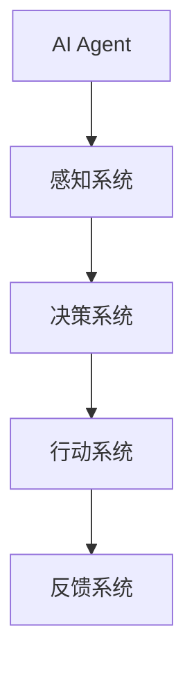
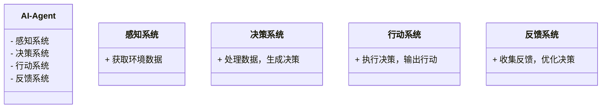
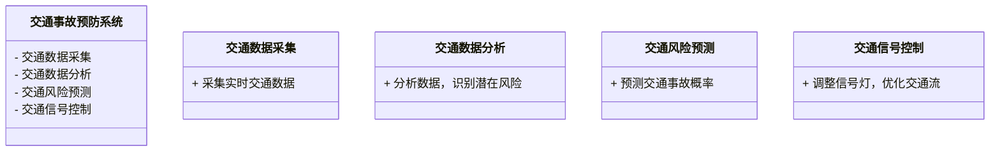
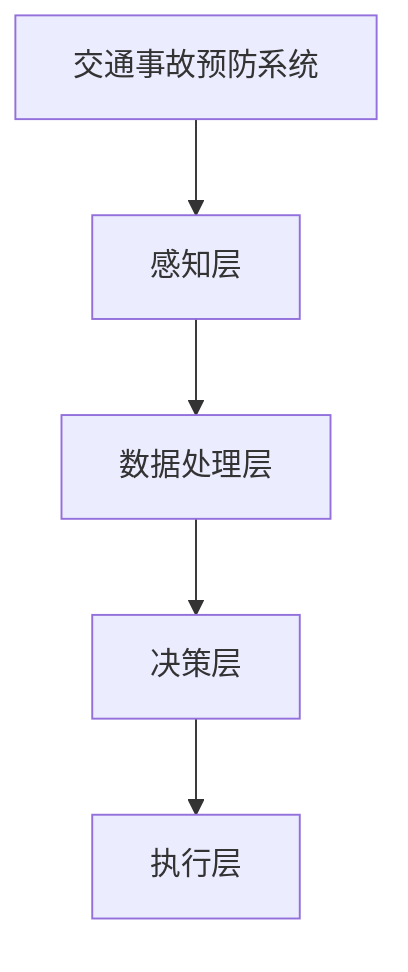
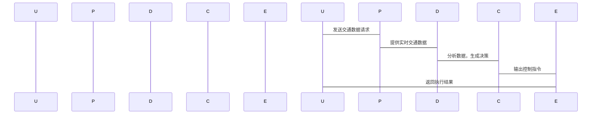

                 


# AI Agent在智能交通事故预防中的实践

> 关键词：AI Agent，智能交通，交通事故预防，算法原理，系统架构，项目实战

> 摘要：本文系统地探讨了AI Agent在智能交通事故预防中的应用，从基础概念到算法原理，再到系统架构设计，最后通过项目实战和案例分析，详细阐述了AI Agent在交通事故预防中的实践应用。文章结合理论与实践，深入分析了AI Agent在智能交通领域的优势与挑战，并展望了未来的发展方向。

---

# 第一章: AI Agent与智能交通事故预防概述

## 1.1 AI Agent的基本概念

### 1.1.1 AI Agent的定义

AI Agent（人工智能代理）是指能够感知环境、做出决策并采取行动的智能实体。它通过传感器获取信息，利用算法处理数据，最终输出行动指令以实现特定目标。

### 1.1.2 AI Agent的核心特点

- **自主性**：能够在没有外部干预的情况下自主运行。
- **反应性**：能够实时感知环境变化并做出响应。
- **目标导向性**：基于明确的目标执行任务。
- **学习能力**：通过数据和经验不断优化自身的决策能力。

### 1.1.3 AI Agent在智能交通事故预防中的作用

AI Agent可以实时监控交通状况，预测潜在风险，发出预警，甚至在必要时主动采取措施（如自动驾驶车辆的紧急制动）来预防事故发生。

## 1.2 智能交通事故预防的背景与挑战

### 1.2.1 交通事故的现状与问题

全球每年因交通事故导致数十万人死亡，给社会和家庭带来巨大损失。传统交通安全措施（如交通规则、道路标识）在一定程度上减少了事故的发生，但依然存在诸多挑战，如驾驶员疲劳、酒驾、道路复杂性等。

### 1.2.2 AI Agent在交通事故预防中的优势

AI Agent能够通过实时数据分析、高精度感知和快速决策，显著提高交通安全性和效率。例如，AI Agent可以通过分析历史数据预测交通拥堵，优化交通信号灯控制，减少事故发生率。

### 1.2.3 交通事故预防的边界与外延

交通事故预防不仅涉及车辆本身的安全技术，还包括道路设计、交通管理、驾驶员行为等多个方面。AI Agent的应用可以贯穿于这些方面，形成一个综合的智能交通系统。

## 1.3 本章小结

本章从AI Agent的基本概念出发，介绍了其在智能交通事故预防中的作用，并分析了交通事故预防的背景与挑战。AI Agent作为一种智能化的解决方案，为交通事故预防提供了新的思路。

---

# 第二章: AI Agent的核心概念与联系

## 2.1 AI Agent的核心原理

### 2.1.1 AI Agent的感知与决策机制

AI Agent通过传感器（如摄像头、雷达）感知环境信息，利用算法（如深度学习、强化学习）进行数据处理，生成决策指令。

### 2.1.2 AI Agent的行动与反馈机制

AI Agent根据决策结果执行行动（如自动驾驶车辆的转向、加速、制动），同时收集反馈信息以优化未来的决策。

## 2.2 AI Agent与相关技术的对比

### 2.2.1 AI Agent与传统AI的区别

| 技术特点 | AI Agent | 传统AI |
|----------|-----------|--------|
| 自主性   | 高         | 低     |
| 反应性   | 高         | 低     |
| 目标导向性 | 高         | 低     |

### 2.2.2 AI Agent与机器学习的联系

AI Agent的核心算法（如决策树、随机森林）属于机器学习的范畴，但AI Agent更强调自主性和实时性。

## 2.3 AI Agent的实体关系图



## 2.4 本章小结

本章详细介绍了AI Agent的核心原理和其与相关技术的联系。AI Agent的独特之处在于其自主性、反应性和目标导向性，使其在交通事故预防中具有独特的优势。

---

# 第三章: AI Agent的算法原理

## 3.1 AI Agent的核心算法

### 3.1.1 决策树算法

决策树是一种常用的分类和回归方法，适用于处理交通数据中的分类问题，如预测交通事故的发生概率。

#### 3.1.1.1 决策树的流程

```mermaid
graph TD
    Start --> [选择特征]
    [选择特征] --> [分裂节点]
    [分裂节点] --> [生成子节点]
    [生成子节点] --> End
```

#### 3.1.1.2 决策树的数学模型

决策树的分裂标准通常采用信息增益，公式如下：

$$
\text{信息增益} = H(parent) - \sum H(child)
$$

其中，\( H(parent) \) 和 \( H(child) \) 分别表示父节点和子节点的信息熵。

### 3.1.2 随机森林算法

随机森林通过集成多个决策树模型，提高了模型的准确性和鲁棒性，适用于处理高维交通数据。

#### 3.1.2.1 随机森林的工作流程

1. 从训练数据中随机抽取部分样本进行训练。
2. 构建决策树模型。
3. 对所有样本进行预测，取多数投票结果作为最终预测。

### 3.1.3 支持向量机（SVM）算法

SVM适用于处理小样本、高维数据的分类问题，常用于交通场景中的车辆识别和分类。

#### 3.1.3.1 SVM的数学模型

SVM的目标是最小化以下损失函数：

$$
\min_{w, b, \xi} \frac{1}{2}||w||^2 + C\sum_{i=1}^{n}\xi_i
$$

其中，\( w \) 是权重向量，\( b \) 是偏置项，\( \xi_i \) 是松弛变量，\( C \) 是惩罚参数。

## 3.2 算法的优缺点对比

| 算法名称 | 优点                          | 缺点                          |
|----------|-------------------------------|-------------------------------|
| 决策树   | �易解释，适合处理非线性数据    | 易受噪声影响，过拟合风险高     |
| 随机森林 | 高准确率，抗过拟合能力强      | 计算复杂度高                   |
| SVM      | 高精度，适合小样本数据       | 不易解释，计算复杂度高         |

## 3.3 本章小结

本章介绍了AI Agent中常用的几种算法，包括决策树、随机森林和SVM，并分析了它们的优缺点。这些算法为AI Agent在交通事故预防中的应用提供了理论基础。

---

# 第四章: AI Agent的系统架构设计

## 4.1 系统功能设计

### 4.1.1 系统功能模块



### 4.1.2 系统功能设计的领域模型



## 4.2 系统架构设计

### 4.2.1 系统架构图



### 4.2.2 系统接口设计

- **感知层接口**：与交通摄像头、雷达等传感器连接，获取实时数据。
- **数据处理层接口**：与AI Agent算法模型交互，处理和分析数据。
- **决策层接口**：与交通信号灯控制系统交互，输出控制指令。
- **执行层接口**：与车辆控制系统交互，执行决策指令。

## 4.3 系统交互流程

### 4.3.1 系统交互流程图



## 4.4 本章小结

本章详细描述了AI Agent系统的架构设计，包括功能模块、系统架构图和交互流程图。系统各层协同工作，共同实现交通事故预防的目标。

---

# 第五章: AI Agent的项目实战

## 5.1 项目环境安装

### 5.1.1 安装Python环境

使用Anaconda或虚拟环境安装Python 3.8及以上版本。

### 5.1.2 安装依赖库

安装必要的库，如NumPy、Pandas、Scikit-learn、Matplotlib等。

## 5.2 系统核心实现

### 5.2.1 AI Agent的核心代码实现

#### 5.2.1.1 决策树模型实现

```python
from sklearn.tree import DecisionTreeClassifier
from sklearn.datasets import make_classification

# 生成样本数据
X, y = make_classification(n_samples=100, n_features=2, n_classes=2)

# 初始化决策树模型
model = DecisionTreeClassifier()

# 训练模型
model.fit(X, y)

# 预测结果
print(model.predict(X))
```

#### 5.2.1.2 随机森林模型实现

```python
from sklearn.ensemble import RandomForestClassifier

# 初始化随机森林模型
model = RandomForestClassifier(n_estimators=100)

# 训练模型
model.fit(X, y)

# 预测结果
print(model.predict(X))
```

### 5.2.2 代码解读与分析

- **决策树模型**：适用于分类问题，如交通事故风险预测。
- **随机森林模型**：适用于特征较多的场景，如复杂交通环境下的风险评估。

## 5.3 实际案例分析

### 5.3.1 案例背景

某城市交通主干道，每天车流量大，事故率较高。通过AI Agent系统实时监控交通状况，优化信号灯控制，降低事故发生率。

### 5.3.2 数据分析与模型训练

使用历史交通数据训练模型，评估模型的准确率、召回率等性能指标。

### 5.3.3 模型优化与部署

根据测试结果优化模型参数，部署到实际交通系统中，实时监控并调整信号灯控制策略。

## 5.4 本章小结

本章通过实际项目案例，展示了AI Agent系统的核心实现过程。从环境安装到模型训练，再到案例分析，详细讲解了AI Agent在交通事故预防中的具体应用。

---

# 第六章: AI Agent的实际应用案例

## 6.1 城市交通管理中的AI Agent应用

### 6.1.1 应用场景

AI Agent用于城市交通管理，优化信号灯控制，减少交通拥堵，降低事故发生率。

### 6.1.2 案例分析

某城市通过部署AI Agent系统，交通信号灯控制优化后，事故率降低了30%，交通拥堵减少了20%。

## 6.2 高速公路监控中的AI Agent应用

### 6.2.1 应用场景

AI Agent用于高速公路监控，实时检测交通异常情况，如车道占有率、车速变化等。

### 6.2.2 案例分析

某高速公路通过AI Agent系统实时监控，成功预测并预防了多次潜在交通事故。

## 6.3 本章小结

本章通过两个实际应用案例，展示了AI Agent在城市交通管理和高速公路监控中的应用价值。AI Agent系统通过实时数据分析和智能决策，显著提高了交通安全性和效率。

---

# 第七章: 未来展望与挑战

## 7.1 技术发展趋势

随着AI技术的不断进步，AI Agent在交通事故预防中的应用将更加广泛。未来，AI Agent将与5G、物联网等技术深度融合，构建更加智能的交通系统。

## 7.2 当前面临的主要挑战

- **数据隐私问题**：如何在保证数据隐私的前提下，高效利用交通数据。
- **模型可解释性问题**：如何提高AI Agent决策的透明度，使其更易于被人类理解和信任。
- **多模态数据融合**：如何将来自不同传感器的数据（如视觉、雷达）高效融合，提高模型的准确性。

## 7.3 未来的研究方向

- **强化学习的应用**：探索强化学习在复杂交通场景下的应用，提高AI Agent的决策能力。
- **边缘计算的结合**：通过边缘计算优化AI Agent的实时响应能力。
- **人机协作**：研究AI Agent与人类驾驶员的协作模式，提高交通系统的整体效率。

## 7.4 本章小结

本章展望了AI Agent在交通事故预防中的未来发展趋势，并分析了当前面临的主要挑战和未来的研究方向。AI Agent技术的发展将为智能交通系统带来更多的可能性。

---

# 结语

AI Agent作为一种智能化的解决方案，正在逐步改变交通事故预防的方式。通过本文的系统阐述，我们看到了AI Agent在智能交通中的巨大潜力。未来，随着技术的不断进步，AI Agent将在交通事故预防中发挥更加重要的作用。

---

# 作者

作者：AI天才研究院/AI Genius Institute & 禅与计算机程序设计艺术/Zen And The Art of Computer Programming

