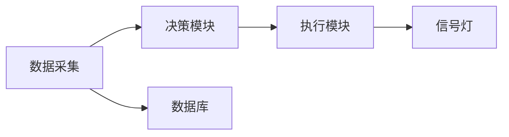

                 


# AI Agent在智能交通信号控制中的实践

> 关键词：AI Agent，智能交通信号控制，强化学习，多智能体系统，交通优化，实时控制

> 摘要：本文详细探讨了AI Agent在智能交通信号控制中的应用，从理论基础到实际案例，分析了AI Agent如何通过强化学习和多智能体系统优化交通信号控制，提高道路通行效率。文章内容涵盖AI Agent的基本概念、算法原理、系统架构设计、项目实战及最佳实践，旨在为交通工程和技术人员提供理论支持和实践指导。

---

# 第一部分：AI Agent在智能交通信号控制中的背景与基础

## 第1章：AI Agent与智能交通信号控制概述

### 1.1 AI Agent的基本概念

#### 1.1.1 AI Agent的定义
AI Agent（人工智能代理）是指能够感知环境、自主决策并采取行动以实现特定目标的智能实体。它可以在复杂环境中自主学习和优化，以适应不同的场景需求。

#### 1.1.2 AI Agent的核心特征
- **自主性**：AI Agent能够自主决策，无需外部干预。
- **反应性**：能够实时感知环境变化并做出反应。
- **目标导向性**：通过目标驱动进行决策和行动。
- **学习能力**：能够通过经验优化自身行为。

#### 1.1.3 AI Agent与传统控制方法的区别
传统的交通信号控制方法通常基于预设的规则或周期性模式，而AI Agent能够根据实时数据动态调整策略，具备更强的适应性和优化能力。

---

### 1.2 智能交通信号控制的背景

#### 1.2.1 传统交通信号控制的局限性
- **固定周期**：传统信号控制方法依赖固定的周期表，难以应对交通流量的动态变化。
- **缺乏实时性**：无法实时感知交通状况，导致资源浪费和效率低下。
- **单点优化**：传统方法通常只优化单个交叉口，缺乏全局优化。

#### 1.2.2 智能交通信号控制的发展现状
随着人工智能技术的发展，基于AI Agent的智能交通信号控制逐渐成为研究热点。通过强化学习和多智能体系统，AI Agent能够实现全局优化和动态调整。

#### 1.2.3 AI Agent在智能交通信号控制中的作用
AI Agent能够通过实时感知、决策和行动，优化交通信号控制策略，提高道路通行效率，减少拥堵和排放。

---

### 1.3 问题背景与目标

#### 1.3.1 交通拥堵问题的现状
交通拥堵是城市化进程中面临的重大问题，不仅浪费时间，还增加了能源消耗和环境污染。

#### 1.3.2 AI Agent解决交通信号控制问题的核心思路
通过AI Agent实现动态、智能的信号控制，优化交通流量分配，减少拥堵和延误。

#### 1.3.3 本书的研究目标与范围
本文旨在探讨AI Agent在智能交通信号控制中的理论、算法和应用，提供可落地的解决方案。

---

## 第2章：AI Agent的核心原理与技术基础

### 2.1 多智能体系统概述

#### 2.1.1 多智能体系统的定义
多智能体系统是指多个智能体协同工作的系统，每个智能体都具有一定的自主性和目标导向性。

#### 2.1.2 多智能体系统的分类
- **协作型**：智能体协同完成任务。
- **竞争型**：智能体之间存在竞争关系。

#### 2.1.3 多智能体系统在交通控制中的应用
通过多个AI Agent协作，优化交通信号控制策略，实现全局最优。

---

### 2.2 强化学习基础

#### 2.2.1 强化学习的基本概念
强化学习是一种机器学习方法，通过智能体与环境的交互，学习最优策略以最大化累积奖励。

#### 2.2.2 Q-learning算法
Q-learning是一种经典的强化学习算法，通过更新Q值表来学习最优动作。

#### 2.2.3 多智能体强化学习的挑战
多智能体强化学习需要解决通信、协作和决策协调问题。

---

### 2.3 AI Agent的决策与推理

#### 2.3.1 基于模型的决策方法
通过建立交通模型进行预测和决策。

#### 2.3.2 基于数据驱动的决策方法
利用历史数据进行学习和预测。

#### 2.3.3 融合模型与数据的混合方法
结合模型和数据驱动的方法，提高决策的准确性和鲁棒性。

---

## 第3章：交通信号控制的理论基础

### 3.1 交通信号控制的基本原理

#### 3.1.1 传统交通信号控制方法
基于固定周期或感应式的控制方法。

#### 3.1.2 智能交通信号控制方法
基于AI Agent的动态控制方法。

#### 3.1.3 AI Agent控制的优势
能够实时感知和动态优化。

---

### 3.2 基于强化学习的信号控制

#### 3.2.1 强化学习在信号控制中的应用
通过强化学习优化信号配时策略。

#### 3.2.2 基于Q-learning的信号控制算法
通过状态-动作-奖励机制进行优化。

#### 3.2.3 基于深度强化学习的信号控制
利用深度神经网络进行复杂决策。

---

## 第4章：系统架构设计

### 4.1 问题场景介绍
以一个城市交叉路口的信号控制为例，设计AI Agent系统。

### 4.2 项目介绍
设计一个基于AI Agent的智能交通信号控制系统。

### 4.3 系统功能设计

#### 4.3.1 数据采集模块
实时采集交通流量、车辆位置等数据。

#### 4.3.2 决策模块
基于强化学习算法进行信号控制决策。

#### 4.3.3 执行模块
根据决策结果调整信号灯状态。

### 4.4 系统架构设计

#### 4.4.1 系统模块划分
- 数据采集模块
- 决策模块
- 执行模块
- 通信模块

#### 4.4.2 系统架构图


---

## 第5章：项目实战

### 5.1 环境安装
安装Python、TensorFlow、Keras等开发环境。

### 5.2 核心代码实现

#### 5.2.1 强化学习算法实现
```python
import numpy as np

class Agent:
    def __init__(self, state_space, action_space):
        self.state_space = state_space
        self.action_space = action_space
        self.q_table = np.zeros((state_space, action_space))
    
    def act(self, state):
        return np.argmax(self.q_table[state])
    
    def learn(self, state, action, reward):
        self.q_table[state][action] += reward
```

#### 5.2.2 交通信号控制实现
```python
class TrafficController:
    def __init__(self, agents):
        self.agents = agents
    
    def control_signals(self, states):
        actions = []
        for i, state in enumerate(states):
            actions.append(self.agents[i].act(state))
        return actions
```

---

## 第6章：总结与展望

### 6.1 本章总结
本文详细探讨了AI Agent在智能交通信号控制中的应用，从理论到实践，展示了如何通过强化学习和多智能体系统优化交通控制。

### 6.2 未来展望
未来，随着AI技术的进步，AI Agent将在交通信号控制中发挥更大作用，实现更智能、更高效的交通管理。

---

# 作者：AI天才研究院 & 禅与计算机程序设计艺术

---

通过以上内容，您可以逐步撰写详细的技术博客文章，确保每一部分都涵盖理论、算法、系统设计和项目实战等内容。

