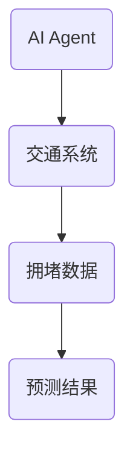
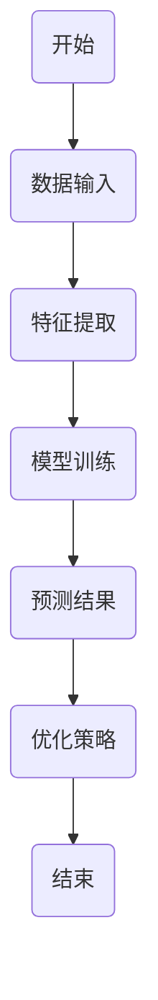
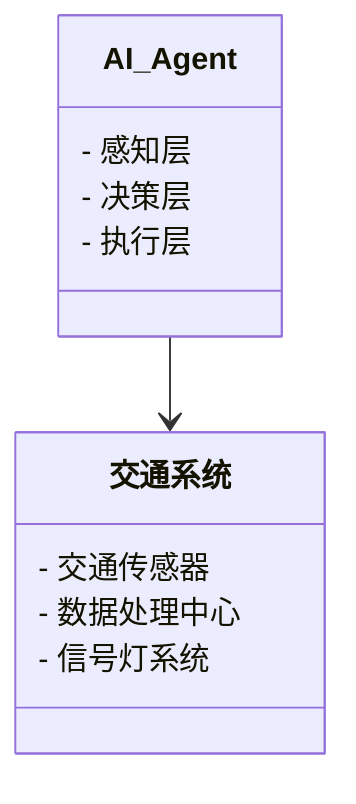
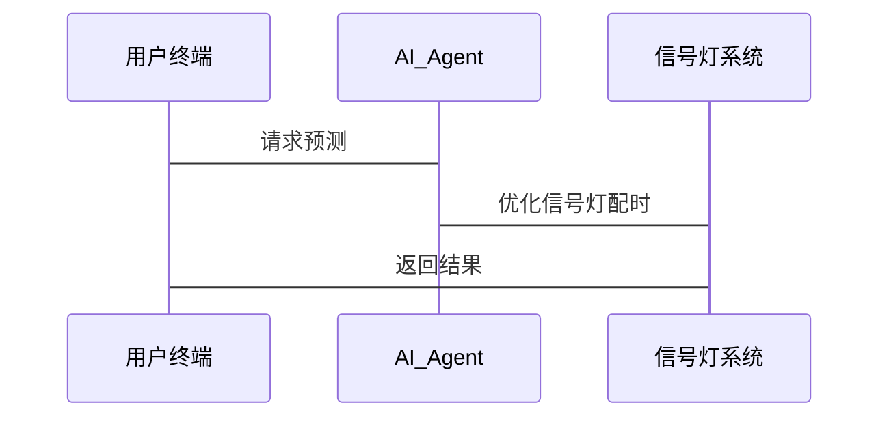

                 


# AI Agent在智能交通拥堵预测中的实践

> **关键词**：AI Agent，智能交通，拥堵预测，算法原理，系统架构  
> **摘要**：本文详细探讨了AI Agent在智能交通拥堵预测中的应用，从背景到实践，涵盖算法原理、系统架构设计及项目实战。通过技术性的语言和图表，深入分析了AI Agent在交通管理中的潜力和实现方式。

---

# 第一部分: AI Agent与智能交通拥堵预测的背景介绍

## 第1章: AI Agent与交通拥堵预测的背景

### 1.1 问题背景与挑战

#### 1.1.1 传统交通拥堵问题的局限性
传统交通管理系统依赖人工监控和简单的交通信号控制，难以应对复杂的城市交通流量变化。例如，高峰期车流激增时，人工调整信号灯周期往往滞后，导致拥堵加剧。

#### 1.1.2 智能交通系统的发展需求
随着城市化进程加快，交通拥堵问题日益严重。智能交通系统（ITS）成为解决这一问题的重要手段，而AI Agent作为 ITS 的核心组件，能够实时分析和预测交通流量。

#### 1.1.3 AI Agent在交通管理中的潜力
AI Agent能够通过实时数据处理和自我学习，优化交通信号灯配时，预测拥堵点，从而提高道路使用效率。

### 1.2 问题描述与目标

#### 1.2.1 交通拥堵预测的核心问题
预测交通流量波动，识别潜在拥堵点，优化交通信号控制，减少交通延误。

#### 1.2.2 AI Agent在拥堵预测中的作用
AI Agent通过实时数据处理和机器学习模型，提供准确的拥堵预测，并制定优化策略。

#### 1.2.3 实际应用场景与目标设定
应用场景包括城市主干道、交叉路口和高速公路。目标是通过AI Agent实现实时预测和动态优化，提高交通效率。

### 1.3 问题解决与边界

#### 1.3.1 AI Agent如何解决交通拥堵问题
AI Agent通过实时数据分析和强化学习，优化信号灯配时，动态调整交通流。

#### 1.3.2 系统的边界与适用范围
系统适用于城市交通网络，处理交通流量数据，但受限于数据质量和传感器覆盖范围。

#### 1.3.3 系统的局限性与限制条件
数据不足可能导致预测精度下降，传感器故障会影响实时性。

### 1.4 概念结构与核心要素

#### 1.4.1 AI Agent的基本构成
包括感知层、决策层和执行层，分别处理数据输入、模型计算和策略输出。

#### 1.4.2 智能交通系统的组成要素
涵盖交通传感器、数据处理中心、信号灯系统和用户终端。

#### 1.4.3 拥堵预测的核心要素与关系
数据源、预测模型和优化策略三者相互关联，构成完整的预测系统。

## 1.5 本章小结
本章介绍了AI Agent在交通拥堵预测中的背景、问题和目标，分析了其潜力和局限性。

---

# 第二部分: AI Agent的核心概念与联系

## 第2章: AI Agent的核心概念与原理

### 2.1 AI Agent的基本原理

#### 2.1.1 AI Agent的定义与分类
AI Agent是具有感知、决策和执行能力的智能体，分为简单反射型、基于模型的反应型和效用驱动型。

#### 2.1.2 AI Agent的核心算法与技术
包括强化学习、监督学习和无监督学习，用于处理动态交通数据。

#### 2.1.3 AI Agent的决策机制
基于实时数据和预测模型，优化交通信号配时，减少拥堵。

### 2.2 AI Agent与交通系统的关联

#### 2.2.1 AI Agent在交通管理中的角色
作为智能交通系统的决策核心，实时分析数据，优化交通流。

#### 2.2.2 交通数据的采集与处理
使用传感器和摄像头采集交通数据，通过数据清洗和特征提取进行处理。

#### 2.2.3 拥堵预测的数学模型
构建基于机器学习的回归模型，预测拥堵概率和严重程度。

### 2.3 核心概念对比表

| 概念 | 定义 | 属性 | 示例 |
|------|------|------|------|
| AI Agent | 智能代理 | 学习能力、决策能力 | 路况预测 |
| 交通拥堵 | 交通阻塞 | 时间、空间 | 车流量激增 |

### 2.4 实体关系图



## 2.5 本章小结
本章详细阐述了AI Agent的核心概念和其在交通系统中的作用，分析了数据处理和模型构建的关键步骤。

---

# 第三部分: AI Agent的算法原理与数学模型

## 第3章: AI Agent的算法原理

### 3.1 算法原理概述

#### 3.1.1 强化学习在AI Agent中的应用
强化学习通过状态、动作和奖励机制，优化信号灯配时策略。

#### 3.1.2 机器学习模型的选择
使用LSTM神经网络处理时间序列数据，预测拥堵趋势。

#### 3.1.3 算法的优化与调优
通过超参数调整和模型集成，提升预测精度和计算效率。

### 3.2 算法流程图



### 3.3 核心算法的Python实现

```python
import numpy as np
from sklearn.metrics import mean_squared_error

# 示例数据
X_train = np.random.rand(100, 10)
y_train = np.random.rand(100, 1)

# 训练模型
model = Sequential()
model.add(Dense(64, activation='relu', input_dim=10))
model.add(Dense(1, activation='linear'))
model.compile(optimizer='adam', loss='mean_squared_error')
model.fit(X_train, y_train, epochs=100, batch_size=32)

# 预测结果
X_test = np.random.rand(20, 10)
y_pred = model.predict(X_test)
print(mean_squared_error(y_test, y_pred))
```

### 3.4 数学模型与公式

预测模型使用LSTM网络，损失函数为均方误差：

$$ \text{Loss} = \frac{1}{n}\sum_{i=1}^{n}(y_i - \hat{y_i})^2 $$

优化器采用Adam算法，学习率为0.001：

$$ \alpha = 0.001 $$

## 3.5 本章小结
本章通过算法流程图和代码示例，详细讲解了AI Agent的算法原理和数学模型，展示了如何通过强化学习和机器学习模型优化交通拥堵预测。

---

# 第四部分: 系统分析与架构设计

## 第4章: 系统分析与架构设计

### 4.1 问题场景介绍
城市交通网络中，AI Agent实时监控交通流量，预测拥堵点，并优化信号灯配时。

### 4.2 系统功能设计

#### 4.2.1 领域模型


### 4.3 系统架构设计

#### 4.3.1 系统架构图


#### 4.3.2 接口设计
系统接口包括数据采集接口、预测结果输出接口和优化策略执行接口。

#### 4.3.3 交互流程图


## 4.4 本章小结
本章详细描述了AI Agent系统的架构设计，包括功能模块、接口设计和交互流程，为实际应用提供了指导。

---

# 第五部分: 项目实战

## 第5章: 项目实战

### 5.1 环境安装

安装Python、TensorFlow、Keras和Mermaid工具。

### 5.2 核心代码实现

#### 5.2.1 数据处理代码
```python
import pandas as pd

# 加载数据
data = pd.read_csv('traffic_data.csv')

# 数据预处理
data = data.dropna()
```

#### 5.2.2 模型训练代码
```python
from tensorflow.keras.models import Sequential
from tensorflow.keras.layers import LSTM, Dense

# 构建模型
model = Sequential()
model.add(LSTM(64, input_shape=(10, 1)))
model.add(Dense(1))
model.compile(optimizer='adam', loss='mean_squared_error')
model.fit(data, labels, epochs=100, batch_size=32)
```

### 5.3 代码解读与分析
数据预处理包括清洗和特征提取，模型训练使用LSTM网络，预测结果用于优化信号灯配时。

### 5.4 实际案例分析
通过实际交通数据，展示AI Agent如何预测拥堵点并优化信号灯，减少交通延误。

## 5.5 本章小结
本章通过项目实战，详细讲解了AI Agent的环境配置、代码实现和实际应用，展示了其在交通拥堵预测中的有效性。

---

# 第六部分: 最佳实践与总结

## 第6章: 最佳实践与总结

### 6.1 最佳实践

- 数据质量：确保数据的完整性和准确性。
- 模型优化：通过超参数调整和模型集成提升预测精度。
- 系统维护：定期更新模型，处理传感器故障。

### 6.2 小结

AI Agent在智能交通拥堵预测中具有巨大潜力，通过实时数据分析和智能决策，优化交通流量。

### 6.3 注意事项

- 数据隐私保护
- 系统实时性要求
- 硬件资源限制

### 6.4 拓展阅读

- 《强化学习入门》
- 《机器学习实战》

---

# 作者：AI天才研究院/AI Genius Institute & 禅与计算机程序设计艺术 /Zen And The Art of Computer Programming

---

本文通过详细的背景介绍、算法原理和系统设计，全面探讨了AI Agent在智能交通拥堵预测中的应用。从理论到实践，为读者提供了丰富的知识和实用的指导，帮助他们在实际应用中优化交通管理，提升道路使用效率。

