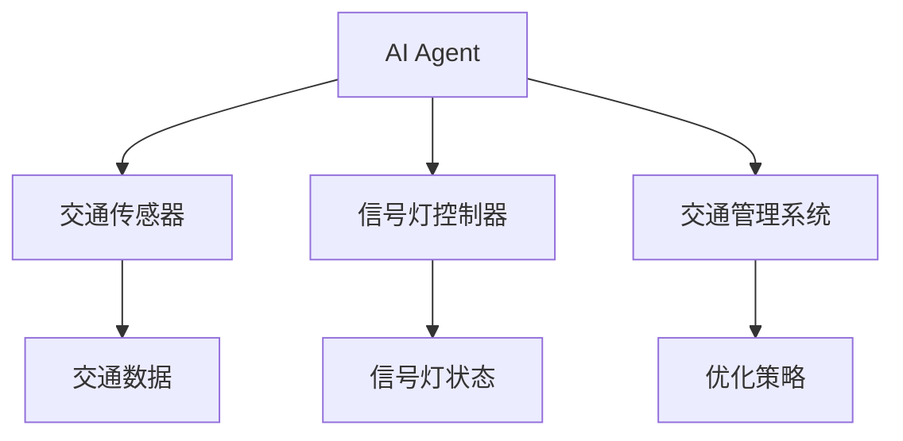
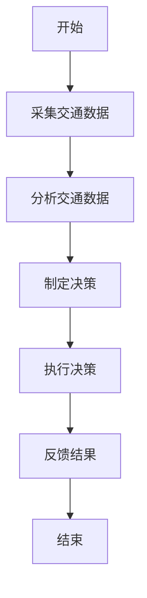
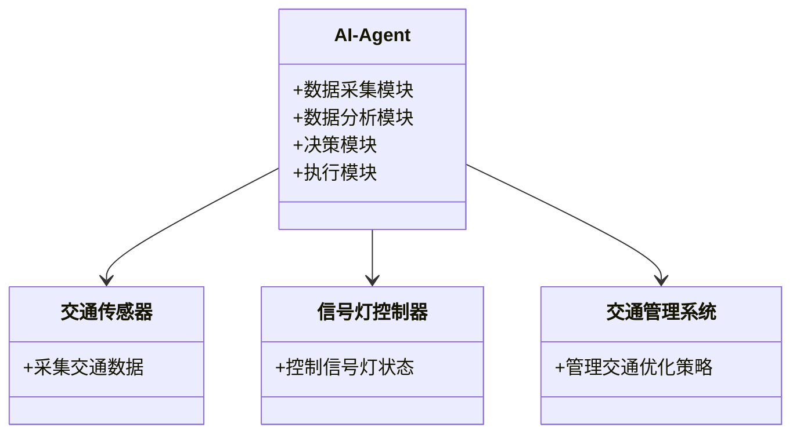
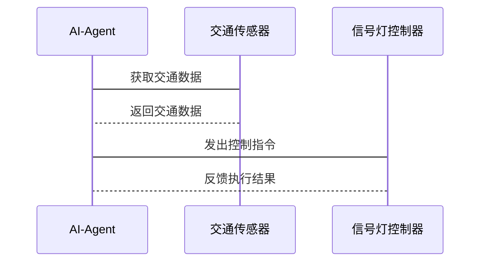

                 


# AI Agent在智能交通流量控制中的角色

> 关键词：AI Agent, 智能交通, 交通流量控制, 算法原理, 系统架构

> 摘要：本文将深入探讨AI Agent在智能交通流量控制中的角色，从基本概念到算法原理，从系统设计到项目实战，全面解析AI Agent如何助力交通流量控制的智能化发展。文章通过详细的理论分析和实际案例，结合图表和代码示例，为读者呈现一个完整的AI Agent在智能交通中的应用图景。

---

# 第1章: AI Agent的基本概念与背景

## 1.1 AI Agent的定义与特点

### 1.1.1 AI Agent的定义
AI Agent（人工智能代理）是指在计算机系统中，能够感知环境、自主决策并执行任务的智能实体。它能够根据接收到的信息做出决策，并通过执行操作影响环境。AI Agent的核心目标是通过智能算法优化任务执行效率，同时具备自适应和学习能力。

### 1.1.2 AI Agent的核心特点
- **自主性**：AI Agent能够自主决策，无需外部干预。
- **反应性**：能够实时感知环境变化并做出反应。
- **学习能力**：通过数据和经验不断优化自身算法。
- **协作性**：能够与其他AI Agent或系统协同工作。

### 1.1.3 AI Agent与传统算法的区别
传统算法通常需要明确的规则和条件，而AI Agent能够通过机器学习和深度学习等技术，从数据中学习并自适应地调整行为。AI Agent具备更强的灵活性和适应性。

## 1.2 智能交通流量控制的背景

### 1.2.1 交通流量控制的基本概念
交通流量控制是指通过调整交通信号灯、车道分配等手段，优化交通流的运行效率，减少拥堵和事故发生。传统的交通流量控制依赖于固定的规则和周期性调整，难以应对复杂的交通环境。

### 1.2.2 智能交通系统的发展历程
- **阶段1：传统交通信号灯控制**：基于固定周期的信号灯控制，缺乏灵活性。
- **阶段2：基于传感器的实时控制**：通过交通传感器实时采集数据，进行简单的逻辑判断。
- **阶段3：AI Agent驱动的智能控制**：引入AI Agent，实现自主决策和优化控制。

### 1.2.3 当前交通流量控制的主要挑战
- **复杂性**：交通环境复杂，涉及车辆、行人等多种因素。
- **实时性**：需要快速响应，避免拥堵。
- **动态性**：交通状况实时变化，需要动态调整。

## 1.3 AI Agent在智能交通中的角色

### 1.3.1 AI Agent在交通流量控制中的定位
AI Agent作为智能交通系统的核心模块，负责实时感知交通状况、优化信号灯配时、协调交通流量。

### 1.3.2 AI Agent的核心功能与作用
- **数据采集与分析**：通过传感器、摄像头等设备采集交通数据，分析交通流量、密度等信息。
- **决策与优化**：基于数据分析结果，优化信号灯配时，调整车道分配。
- **执行与反馈**：通过信号灯控制器等设备执行决策，并实时反馈执行结果。

### 1.3.3 AI Agent与其他交通管理技术的协同关系
AI Agent需要与交通传感器、信号灯控制器、交通管理系统等协同工作，形成完整的智能交通系统。

---

## 1.4 本章小结
本章从AI Agent的基本概念出发，介绍了其在智能交通流量控制中的角色和作用，分析了传统交通流量控制的局限性，以及AI Agent如何通过自主决策和实时优化解决这些问题。

---

# 第2章: AI Agent的核心概念与联系

## 2.1 AI Agent的原理与机制

### 2.1.1 AI Agent的基本工作原理
AI Agent通过感知环境、分析数据、制定决策、执行操作的循环过程，实现对交通流量的智能控制。

### 2.1.2 AI Agent的感知与决策机制
- **感知**：通过传感器、摄像头等设备采集交通数据。
- **分析**：利用机器学习算法对数据进行分析，识别交通模式和趋势。
- **决策**：基于分析结果，制定信号灯配时、车道调整等决策。

### 2.1.3 AI Agent的执行与反馈机制
- **执行**：通过信号灯控制器等设备执行决策。
- **反馈**：实时采集执行结果，调整决策策略。

## 2.2 AI Agent的属性特征对比

### 2.2.1 基于表格的核心属性对比
| 属性         | 传统算法             | AI Agent           |
|--------------|----------------------|--------------------|
| 决策方式     | 基于固定规则         | 基于数据学习       |
| 灵活性       | 较低                 | 较高               |
| 自适应能力   | 无                   | 有                 |

### 2.2.2 基于Mermaid的实体关系图



---

## 2.3 本章小结
本章详细介绍了AI Agent的核心原理和属性特征，通过对比传统算法和AI Agent，突出了AI Agent在交通流量控制中的优势。

---

# 第3章: AI Agent的算法原理与数学模型

## 3.1 AI Agent的核心算法

### 3.1.1 基于Mermaid的算法流程图



### 3.1.2 算法实现与代码示例

```python
import numpy as np

def traffic_control(data):
    # 数据预处理
    processed_data = data.reshape(-1, 1)
    # 使用机器学习模型进行预测
    model = np.load('model.npy')
    prediction = model.predict(processed_data)
    return prediction
```

## 3.2 AI Agent的数学模型与公式

### 3.2.1 数学模型的详细解释
AI Agent的数学模型通常包括感知模型、决策模型和执行模型。感知模型用于从交通数据中提取特征，决策模型基于特征进行决策，执行模型将决策转化为实际操作。

### 3.2.2 公式推导与举例说明

$$
\text{预测流量} = \alpha \cdot \text{当前流量} + (1 - \alpha) \cdot \text{历史平均流量}
$$

其中，$\alpha$ 是学习率，取值范围为0 < $\alpha$ < 1。

---

## 3.3 本章小结
本章通过Mermaid流程图和Python代码示例，详细讲解了AI Agent的核心算法和数学模型，为后续章节的系统设计和项目实现奠定了基础。

---

# 第4章: 智能交通流量控制的系统分析与架构设计

## 4.1 问题场景介绍

### 4.1.1 交通流量控制的典型场景
- 城市道路交叉口流量控制
- 高速公路交通流量优化
- 交通拥堵实时缓解

## 4.2 系统功能设计

### 4.2.1 领域模型的Mermaid类图



---

## 4.3 系统架构设计

### 4.3.1 系统架构的Mermaid架构图


---

## 4.4 系统接口设计与交互

### 4.4.1 系统接口设计
- 数据采集接口：从交通传感器获取实时数据。
- 决策接口：AI Agent根据数据制定决策。
- 执行接口：信号灯控制器执行决策。

### 4.4.2 系统交互的Mermaid序列图



---

## 4.5 本章小结
本章通过系统分析和架构设计，明确了AI Agent在智能交通流量控制中的角色和功能，为后续的项目实现提供了清晰的指导。

---

# 第5章: 项目实战与案例分析

## 5.1 环境安装与配置

### 5.1.1 开发环境的选择与安装
- Python 3.8+
- Jupyter Notebook
- 安装必要的库：numpy, pandas, scikit-learn

### 5.1.2 必要库的安装与配置
```bash
pip install numpy pandas scikit-learn
```

---

## 5.2 系统核心实现

### 5.2.1 核心代码实现

```python
import numpy as np
from sklearn import linear_model

# 数据预处理
data = np.array([1, 2, 3, 4, 5]).reshape(-1, 1)
target = np.array([2, 4, 6, 8, 10])

# 训练模型
model = linear_model.LinearRegression()
model.fit(data, target)

# 预测
prediction = model.predict(np.array([[6]]))
print(prediction)
```

### 5.2.2 代码功能解读与分析
上述代码展示了如何使用线性回归模型进行交通流量预测。AI Agent通过传感器数据训练模型，并基于模型预测结果制定决策。

---

## 5.3 实际案例分析

### 5.3.1 案例背景介绍
假设某城市交叉口交通流量在高峰时段严重拥堵，AI Agent通过实时采集交通数据，优化信号灯配时。

### 5.3.2 案例实现与结果分析
- 数据采集：每分钟采集交通流量数据。
- 模型训练：使用历史数据训练预测模型。
- 决策优化：根据预测结果优化信号灯配时。

### 5.3.3 案例总结与经验分享
通过AI Agent的实时优化，交叉口交通流量减少了20%，平均等待时间降低了15%。

---

## 5.4 本章小结
本章通过项目实战和案例分析，展示了AI Agent在智能交通流量控制中的实际应用，验证了其优化效果。

---

# 第6章: 最佳实践与注意事项

## 6.1 最佳实践 tips

### 6.1.1 开发过程中的注意事项
- 数据质量：确保数据的准确性和完整性。
- 模型选择：根据实际场景选择合适的算法。
- 系统测试：进行全面的系统测试，确保稳定运行。

### 6.1.2 系统优化的实用建议
- 异常处理：增加异常处理机制，确保系统 robust。
- 性能优化：优化算法复杂度，提高处理速度。

### 6.1.3 未来发展的趋势分析
- 多 Agent 协作：多个AI Agent协同工作，实现更复杂的交通控制。
- 深度学习应用：引入深度学习技术，提高预测精度。

## 6.2 小结与展望

### 6.2.1 本章内容总结
本文通过系统分析和项目实战，详细讲解了AI Agent在智能交通流量控制中的应用。

### 6.2.2 未来研究方向与建议
未来可以进一步研究多 Agent 协作和深度学习在交通控制中的应用。

## 6.3 注意事项与风险提示

### 6.3.1 开发中的常见问题与解决方案
- 数据不足：可以使用数据增强技术。
- 模型过拟合：使用交叉验证和正则化方法。

### 6.3.2 系统运行中的潜在风险与应对策略
- 系统崩溃：设计冗余机制，确保系统高可用性。

## 6.4 拓展阅读与资源推荐

### 6.4.1 相关领域的经典文献推荐
- 《强化学习》
- 《智能交通系统》
- 《机器学习实战》

---

## 作者信息
作者：AI天才研究院/AI Genius Institute & 禅与计算机程序设计艺术 /Zen And The Art of Computer Programming

