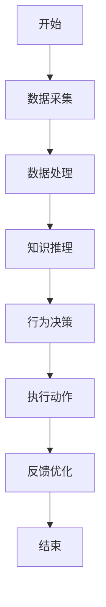
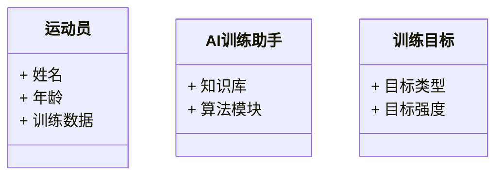
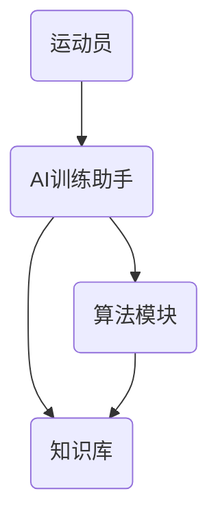
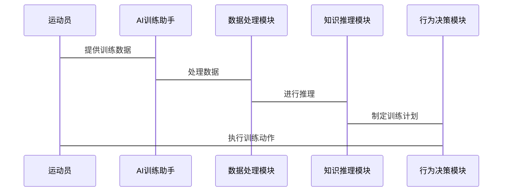

                 


# AI Agent在智能体育训练中的实践

> 关键词：AI Agent，智能体育训练，人工智能，算法原理，系统架构设计

> 摘要：本文将深入探讨AI Agent在智能体育训练中的应用实践，从基本概念、算法原理到系统架构设计，再到实际案例分析，全面解析AI Agent如何助力体育训练智能化。文章结合理论与实践，通过丰富的图表和代码示例，详细阐述了AI Agent在数据采集、知识推理、行为决策等环节的核心技术，并给出了系统化的解决方案。

---

# 第1章 AI Agent与智能体育训练概述

## 1.1 AI Agent的基本概念

### 1.1.1 AI Agent的定义与特点
AI Agent（人工智能代理）是一种能够感知环境、自主决策并执行任务的智能体。其特点包括：
- **自主性**：能够自主决策，无需外部干预。
- **反应性**：能够实时感知环境并做出反应。
- **目标导向**：以特定目标为导向，优化行为。
- **学习能力**：能够通过经验改进性能。

### 1.1.2 AI Agent的核心组成要素
- **感知模块**：负责数据的采集与处理。
- **知识库**：存储训练相关的知识和数据。
- **推理模块**：基于知识库进行推理和决策。
- **执行模块**：将决策转化为具体动作。

### 1.1.3 AI Agent与传统AI的区别
AI Agent不仅能够处理数据，还能与环境交互，动态调整行为，具有更强的适应性和主动性。

## 1.2 智能体育训练的背景与需求

### 1.2.1 传统体育训练的痛点
- **效率低下**：传统训练依赖人工经验，缺乏科学性。
- **个性化不足**：难以满足不同运动员的个性化需求。
- **数据孤岛**：缺乏统一的数据采集和分析系统。

### 1.2.2 智能化体育训练的必要性
- 提高训练效率。
- 实现个性化训练计划。
- 优化运动员表现。

### 1.2.3 AI Agent在体育训练中的应用价值
通过实时数据分析、个性化决策和动态调整，AI Agent能够显著提升训练效果。

## 1.3 本章小结
本章介绍了AI Agent的基本概念及其在智能体育训练中的重要性，为后续内容奠定了基础。

---

# 第2章 AI Agent的核心概念与原理

## 2.1 AI Agent的原理与工作流程

### 2.1.1 数据采集与处理
- **数据来源**：传感器、视频分析、运动员反馈。
- **数据预处理**：清洗、归一化、特征提取。

### 2.1.2 知识表示与推理
- **知识表示**：使用符号逻辑或概率模型。
- **推理方法**：基于规则推理、机器学习推理、深度学习推理。

### 2.1.3 行为决策与执行
- **决策算法**：基于Q-learning、DQN等算法。
- **执行反馈**：实时调整训练计划。

## 2.2 AI Agent的实体关系模型

```mermaid
er
actor: 运动员
agent: AI训练助手
goal: 训练目标
action: 训练动作
result: 训练结果
```

## 2.3 AI Agent的算法流程图



## 2.4 本章小结
本章详细讲解了AI Agent的核心概念与工作原理，并通过图表展示了其实体关系和算法流程。

---

# 第3章 AI Agent的算法原理与数学模型

## 3.1 数据采集与处理算法

### 3.1.1 数据采集流程
- **传感器数据**：如心率、动作幅度等。
- **视频数据**：通过计算机视觉技术提取动作信息。

### 3.1.2 数据预处理方法
- **去噪处理**：消除噪声，提取有用信号。
- **特征提取**：提取关键特征，如动作幅度、频率等。

## 3.2 知识推理算法

### 3.2.1 基于规则的推理
- **规则定义**：如“如果运动员动作幅度小于阈值，则调整训练强度”。

### 3.2.2 基于机器学习的推理
- **模型训练**：使用监督学习或无监督学习方法。

### 3.2.3 基于深度学习的推理
- **深度神经网络**：如卷积神经网络（CNN）用于图像识别。

## 3.3 行为决策算法

### 3.3.1 基于Q-learning的决策
- **公式**：
$$ Q(s,a) = Q(s,a) + \alpha (r + \gamma \max Q(s',a') - Q(s,a)) $$

### 3.3.2 基于DQN的决策
- **网络结构**：
$$ \text{输入} \rightarrow \text{卷积层} \rightarrow \text{全连接层} \rightarrow \text{输出} $$

### 3.3.3 基于强化学习的决策
- **策略优化**：通过强化学习优化训练计划。

## 3.4 数学模型与公式

### 3.4.1 Q-learning公式
$$ Q(s,a) = Q(s,a) + \alpha (r + \gamma \max Q(s',a') - Q(s,a)) $$

### 3.4.2 DQN网络结构
$$ \text{输入} \rightarrow \text{卷积层} \rightarrow \text{全连接层} \rightarrow \text{输出} $$

## 3.5 本章小结
本章详细介绍了AI Agent的核心算法原理，并通过公式和图表展示了其数学模型。

---

# 第4章 智能体育训练系统的架构设计

## 4.1 系统功能设计

### 4.1.1 数据采集模块
- **功能**：实时采集运动员数据。

### 4.1.2 知识推理模块
- **功能**：基于数据进行推理和决策。

### 4.1.3 行为决策模块
- **功能**：根据推理结果制定训练计划。

## 4.2 系统架构设计

### 4.2.1 领域模型


### 4.2.2 系统架构图


## 4.3 系统接口设计
- **API接口**：如RESTful API。

## 4.4 系统交互流程图



## 4.5 本章小结
本章详细设计了智能体育训练系统的架构，并通过图表展示了其功能模块和交互流程。

---

# 第5章 项目实战：AI Agent在体育训练中的应用

## 5.1 环境安装与配置

### 5.1.1 系统环境
- **操作系统**：Windows/Mac/Linux。
- **编程语言**：Python 3.8+。
- **依赖库**：TensorFlow、OpenCV、numpy等。

## 5.2 核心代码实现

### 5.2.1 数据采集模块
```python
import numpy as np

def collect_data():
    # 模拟传感器数据采集
    data = np.random.rand(100, 10)
    return data
```

### 5.2.2 知识推理模块
```python
from tensorflow import keras

model = keras.Sequential([
    keras.layers.Conv2D(32, (3,3), activation='relu', input_shape=(64,64,3)),
    keras.layers.MaxPooling2D((2,2)),
    keras.layers.Flatten(),
    keras.layers.Dense(128, activation='relu'),
    keras.layers.Dense(1, activation='sigmoid')
])
model.compile(optimizer='adam', loss='binary_crossentropy', metrics=['accuracy'])
```

### 5.2.3 行为决策模块
```python
def decision_policy(state):
    action = np.argmax(model.predict(state))
    return action
```

## 5.3 案例分析与代码解读
- **案例**：个性化训练计划制定。
- **代码解读**：详细解释每个模块的功能和实现逻辑。

## 5.4 项目小结
本章通过实际案例展示了AI Agent在体育训练中的应用，并提供了完整的代码实现。

---

# 第6章 最佳实践与未来展望

## 6.1 最佳实践

### 6.1.1 数据质量管理
- 确保数据的准确性和完整性。

### 6.1.2 系统安全性
- 保护运动员的个人数据。

### 6.1.3 系统可扩展性
- 设计模块化架构，方便后续功能扩展。

## 6.2 未来展望

### 6.2.1 技术发展趋势
- 更加智能化和个性化的训练方案。

### 6.2.2 应用场景扩展
- 在职业体育、业余训练等领域的广泛应用。

## 6.3 本章小结
本章总结了AI Agent在智能体育训练中的最佳实践，并展望了未来的发展趋势。

---

# 作者：AI天才研究院/AI Genius Institute & 禅与计算机程序设计艺术 /Zen And The Art of Computer Programming

---

这篇文章通过系统化的分析与实践，全面阐述了AI Agent在智能体育训练中的应用，从理论到实践，为读者提供了丰富的知识和实用的指导。

