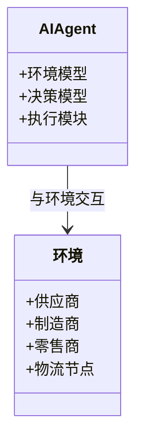
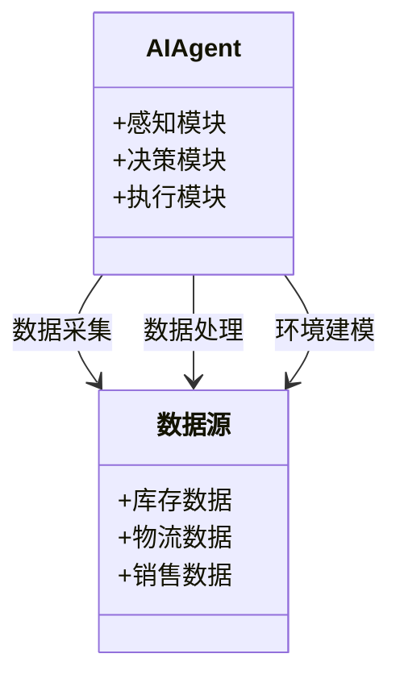
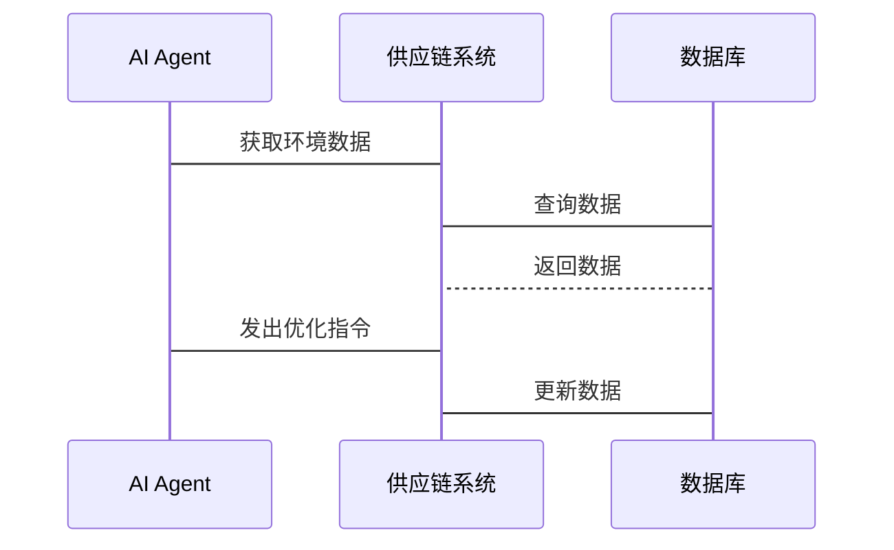
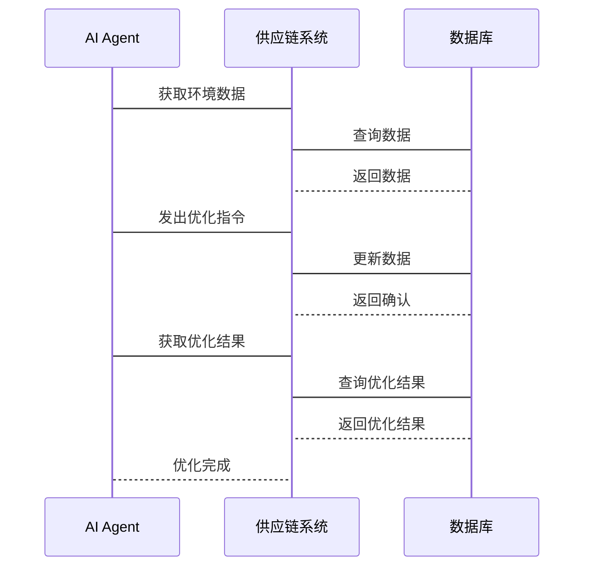

                 


# AI Agent在智能供应链优化中的应用

> 关键词：AI Agent，智能供应链，优化算法，强化学习，供应链管理

> 摘要：随着人工智能技术的飞速发展，AI Agent在供应链优化中的应用越来越广泛。本文从AI Agent的基本概念出发，详细探讨了其在智能供应链优化中的核心原理、算法实现、系统架构设计以及实际应用案例。通过分析AI Agent在供应链优化中的优势与挑战，本文为读者提供了一种全新的视角，帮助企业在复杂多变的市场环境中实现更高效的供应链管理。

---

# 第一部分: AI Agent与智能供应链优化的背景

## 第1章: AI Agent与智能供应链优化概述

### 1.1 AI Agent的基本概念

#### 1.1.1 AI Agent的定义与特点
AI Agent（人工智能代理）是一种能够感知环境、自主决策并执行任务的智能实体。其特点包括：
1. **自主性**：AI Agent能够在没有外部干预的情况下独立完成任务。
2. **反应性**：能够实时感知环境变化并做出响应。
3. **目标导向性**：基于预设目标或动态目标进行决策。
4. **学习能力**：通过数据和经验不断优化自身的决策能力。

#### 1.1.2 AI Agent的核心功能与类型
AI Agent的核心功能包括感知、决策和执行。根据应用场景的不同，可以将AI Agent分为以下几类：
1. **简单反射型**：基于预设规则进行简单决策。
2. **基于模型的反应型**：通过内部模型模拟环境并做出决策。
3. **目标驱动型**：以实现特定目标为导向进行决策。
4. **实用驱动型**：通过最大化效用函数实现最优决策。

#### 1.1.3 AI Agent在供应链优化中的作用
AI Agent能够通过实时数据分析、智能预测和自主决策，帮助企业在供应链管理中实现：
1. **库存优化**：通过预测需求减少库存积压。
2. **路径优化**：优化物流路径以降低运输成本。
3. **风险控制**：通过实时监控预测潜在风险并制定应对策略。

### 1.2 智能供应链优化的背景

#### 1.2.1 传统供应链优化的局限性
传统供应链优化方法主要依赖于数学模型和人工经验，存在以下问题：
1. **静态性**：难以应对市场环境的动态变化。
2. **计算复杂性**：大规模问题的计算效率较低。
3. **缺乏自主性**：依赖人工干预进行调整。

#### 1.2.2 智能化供应链优化的必要性
随着市场竞争的加剧和客户需求的多样化，企业需要更加灵活和高效的供应链管理方式。AI Agent通过实时数据分析和自主决策，能够显著提升供应链的响应速度和决策效率。

#### 1.2.3 AI技术在供应链优化中的应用趋势
AI技术在供应链优化中的应用正呈现以下趋势：
1. **智能化**：通过AI Agent实现智能化决策。
2. **数据驱动化**：利用大数据分析优化供应链各环节。
3. **协同化**：与物联网、区块链等技术协同优化供应链生态。

### 1.3 AI Agent在供应链优化中的应用前景

#### 1.3.1 AI Agent的核心优势
AI Agent在供应链优化中的核心优势包括：
1. **实时性**：能够快速响应环境变化。
2. **灵活性**：适用于多种复杂的供应链场景。
3. **高效性**：通过算法优化提升决策效率。

#### 1.3.2 AI Agent在供应链优化中的潜在应用场景
AI Agent在供应链优化中的应用场景包括：
1. **库存管理**：通过预测需求优化库存水平。
2. **物流规划**：优化运输路径和配送时间。
3. **供应商选择**：基于多维度评估选择最优供应商。

#### 1.3.3 企业采用AI Agent的挑战与机遇
**挑战**：
1. **技术复杂性**：AI Agent的开发和部署需要较高的技术门槛。
2. **数据依赖性**：依赖大量高质量数据进行训练和推理。
3. **成本问题**：AI Agent的开发和维护成本较高。

**机遇**：
1. **提升竞争力**：通过AI Agent实现更高效的供应链管理。
2. **降低运营成本**：通过优化决策降低企业运营成本。
3. **开拓新市场**：通过智能化供应链更好地满足客户需求。

### 1.4 本章小结
本章主要介绍了AI Agent的基本概念、核心功能与类型，以及其在供应链优化中的作用。同时，分析了传统供应链优化的局限性和智能化供应链优化的必要性，并展望了AI Agent在供应链优化中的应用前景。

---

# 第二部分: AI Agent的核心概念与原理

## 第2章: AI Agent的核心概念与原理

### 2.1 AI Agent的基本原理

#### 2.1.1 AI Agent的感知机制
AI Agent的感知机制包括数据采集、数据处理和环境建模三个步骤：
1. **数据采集**：通过传感器、API等接口获取环境数据。
2. **数据处理**：对采集到的数据进行清洗、转换和特征提取。
3. **环境建模**：基于处理后的数据构建环境模型，用于后续决策。

#### 2.1.2 AI Agent的决策机制
AI Agent的决策机制包括状态评估、动作选择和决策执行三个步骤：
1. **状态评估**：基于当前环境状态评估可能的决策选项。
2. **动作选择**：通过算法选择最优动作。
3. **决策执行**：将选择的动作转化为具体的操作指令。

#### 2.1.3 AI Agent的执行机制
AI Agent的执行机制包括任务分解、动作执行和结果反馈三个步骤：
1. **任务分解**：将复杂任务分解为多个子任务。
2. **动作执行**：通过调用相关服务或接口执行具体动作。
3. **结果反馈**：收集执行结果并更新环境模型。

### 2.2 AI Agent与传统供应链优化方法的对比

#### 2.2.1 传统供应链优化方法的优缺点
传统供应链优化方法的优点在于其数学模型的精确性和可解释性，但其局限性在于缺乏灵活性和实时性。

#### 2.2.2 AI Agent在供应链优化中的创新点
AI Agent通过引入强化学习、深度学习等技术，能够实现动态优化和自主决策。

#### 2.2.3 AI Agent与传统优化方法的结合
AI Agent可以与传统优化方法结合，形成混合优化策略，以充分发挥两者的优势。

### 2.3 AI Agent的核心算法与技术

#### 2.3.1 强化学习算法
强化学习算法通过与环境的交互不断优化决策策略。常用的强化学习算法包括Q-learning和深度强化学习（DQN）。

#### 2.3.2 遗传算法
遗传算法通过模拟生物进化过程，不断优化解的结构。适用于复杂的组合优化问题。

#### 2.3.3 深度学习算法
深度学习算法通过多层神经网络模型，能够自动提取数据特征并进行分类或回归预测。

### 2.4 本章小结
本章主要介绍了AI Agent的核心概念与原理，包括感知、决策和执行机制。同时，分析了AI Agent与传统供应链优化方法的对比，并介绍了AI Agent的核心算法与技术。

---

# 第三部分: AI Agent的算法原理与数学模型

## 第3章: AI Agent的算法原理

### 3.1 强化学习算法

#### 3.1.1 强化学习的基本原理
强化学习通过智能体与环境的交互，逐步学习最优策略。其基本原理包括状态、动作、奖励和策略四个核心要素。

#### 3.1.2 Markov决策过程（MDP）的定义与特点
Markov决策过程（MDP）是强化学习的核心模型，由状态空间、动作空间、转移概率和奖励函数四个部分组成。

#### 3.1.3 Q-learning算法的实现与应用
Q-learning算法通过不断更新Q值表，实现最优策略的逼近。其算法流程如下：

1. 初始化Q值表为零。
2. 选择当前状态下的动作。
3. 执行动作并获得奖励。
4. 更新Q值表：$Q(s,a) = Q(s,a) + \alpha (r + \gamma \max Q(s',a'))$。
5. 重复上述步骤直到收敛。

#### 3.1.4 强化学习在供应链优化中的应用
强化学习可以应用于库存管理、物流路径优化等场景。

### 3.2 遗传算法

#### 3.2.1 遗传算法的基本原理
遗传算法通过模拟生物进化过程，包括选择、交叉和变异三个基本操作。

#### 3.2.2 遗传算法的步骤与实现
1. 初始化种群。
2. 计算适应度值。
3. 进行选择、交叉和变异操作，生成新的种群。
4. 重复上述步骤直到满足终止条件。

#### 3.2.3 遗传算法在供应链优化中的应用
遗传算法适用于复杂的组合优化问题，如供应商选择、路径优化等。

### 3.3 深度学习算法

#### 3.3.1 深度学习的基本原理
深度学习通过多层神经网络模型，能够自动提取数据特征并进行分类或回归预测。

#### 3.3.2 卷积神经网络（CNN）的应用
CNN适用于图像识别、时序数据分析等场景。

#### 3.3.3 循环神经网络（RNN）的应用
RNN适用于时间序列数据的预测，如需求预测、库存管理等。

### 3.4 算法的数学模型与公式

#### 3.4.1 强化学习的数学模型
$$ V(s) = \max_{a} [r(s,a) + \gamma V(s')] $$

其中：
- $V(s)$表示状态$s$的价值。
- $r(s,a)$表示状态$s$下动作$a$的奖励。
- $\gamma$表示折扣因子。
- $s'$表示下一个状态。

#### 3.4.2 遗传算法的数学模型
$$ f(x) = \sum_{i=1}^{n} w_i x_i $$

其中：
- $x_i$表示决策变量。
- $w_i$表示权重系数。

#### 3.4.3 深度学习的数学模型
深度学习的数学模型通常包括多个层次的神经网络，具体形式根据应用场景而定。

---

# 第四部分: AI Agent在智能供应链优化中的系统架构设计

## 第4章: 系统分析与架构设计

### 4.1 问题场景介绍
本章将通过一个具体的供应链优化问题，介绍AI Agent在系统设计中的应用。假设我们有一个包含多个供应商、制造商和零售商的供应链网络，目标是通过AI Agent实现库存优化和物流路径优化。

### 4.2 系统功能设计

#### 4.2.1 领域模型
以下是供应链优化系统的领域模型：



#### 4.2.2 系统架构设计
以下是供应链优化系统的架构设计：



#### 4.2.3 系统接口设计
以下是供应链优化系统的接口设计：



### 4.3 系统交互流程
以下是供应链优化系统的交互流程：



### 4.4 本章小结
本章通过具体的供应链优化问题，介绍了AI Agent的系统设计，包括领域模型、系统架构设计和系统交互流程。

---

# 第五部分: AI Agent在智能供应链优化中的项目实战

## 第5章: 项目实战

### 5.1 环境安装与配置
本项目需要以下环境：
1. Python 3.8+
2. TensorFlow 2.0+
3. Scikit-learn 0.24+
4. Mermaid CLI
5. Jupyter Notebook

### 5.2 系统核心实现源代码

#### 5.2.1 AI Agent核心代码
以下是AI Agent的核心代码：

```python
class AI-Agent:
    def __init__(self):
        self.environment_model = None
        self.decision_model = None
        self.execution_module = None

    def perceive(self, data):
        # 数据处理和环境建模
        pass

    def decide(self, state):
        # 基于当前状态做出决策
        pass

    def execute(self, action):
        # 执行具体动作
        pass
```

#### 5.2.2 强化学习算法实现
以下是强化学习算法的实现代码：

```python
class QLearning:
    def __init__(self, state_space, action_space):
        self.q_table = np.zeros(state_space + action_space)
        self.alpha = 0.1
        self.gamma = 0.9

    def choose_action(self, state):
        if np.random.random() < 0.9:
            return np.argmax(self.q_table[state])
        else:
            return np.random.randint(0, action_space)

    def learn(self, state, action, reward, next_state):
        self.q_table[state + action] = self.q_table[state + action] + self.alpha * (reward + self.gamma * np.max(self.q_table[next_state])) - self.q_table[state + action])
```

### 5.3 代码应用解读与分析
1. **AI-Agent类**：实现了AI Agent的基本功能，包括感知、决策和执行。
2. **QLearning类**：实现了Q-learning算法，用于强化学习场景。
3. **数据处理**：对采集到的数据进行清洗和特征提取。
4. **模型训练**：通过强化学习算法训练AI Agent的决策模型。

### 5.4 实际案例分析
假设我们有一个包含三个供应商和五个零售商的供应链网络，目标是通过AI Agent优化库存管理和物流路径。

### 5.5 项目小结
本章通过具体的项目实战，展示了AI Agent在供应链优化中的实现过程，包括环境安装、核心代码实现和实际案例分析。

---

# 第六部分: AI Agent在智能供应链优化中的最佳实践

## 第6章: 最佳实践

### 6.1 小结
通过本文的介绍，我们可以看到AI Agent在智能供应链优化中的巨大潜力。AI Agent能够通过实时数据分析和自主决策，显著提升供应链的效率和响应速度。

### 6.2 注意事项
1. **数据质量**：AI Agent的性能依赖于数据的质量和数量。
2. **算法选择**：根据具体问题选择合适的算法。
3. **系统安全性**：确保AI Agent系统的安全性和稳定性。

### 6.3 未来展望
随着AI技术的不断发展，AI Agent在供应链优化中的应用将更加广泛和深入。未来的优化方向包括：
1. **多智能体协同**：通过多个AI Agent协同优化供应链各环节。
2. **边缘计算**：通过边缘计算提升AI Agent的实时性和响应速度。
3. **自适应优化**：通过自适应算法实现动态优化。

---

# 结语

通过本文的详细介绍，我们深入探讨了AI Agent在智能供应链优化中的核心原理、算法实现和系统设计。希望本文能够为读者提供有价值的参考，帮助企业更好地应用AI技术优化供应链管理。

---

# 作者：AI天才研究院/AI Genius Institute & 禅与计算机程序设计艺术 /Zen And The Art of Computer Programming

