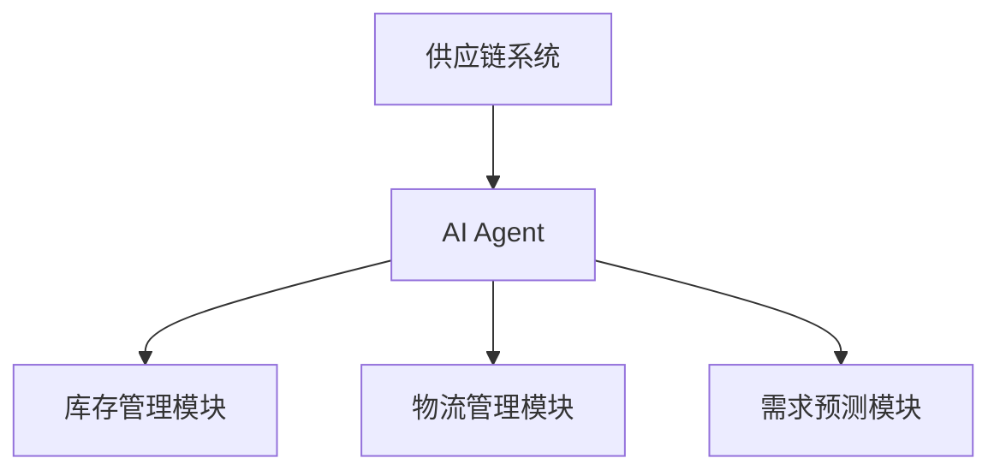
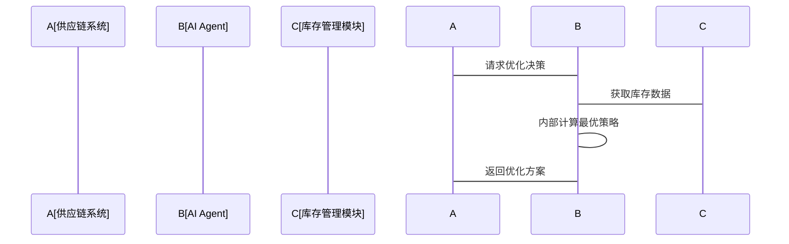

                 


# AI Agent在智能供应链优化决策中的应用

> 关键词：AI Agent，智能供应链，优化决策，强化学习，深度学习，供应链管理

> 摘要：随着人工智能技术的快速发展，AI Agent在智能供应链优化决策中的应用日益广泛。本文从AI Agent的基本概念出发，详细探讨其在供应链优化中的核心原理、应用场景、系统架构设计以及项目实战等内容，帮助读者深入了解AI Agent如何助力供应链优化决策。

---

# 第一部分: AI Agent与智能供应链优化决策概述

## 第1章: AI Agent的基本概念与应用背景

### 1.1 AI Agent的核心概念
- **定义与特点**: AI Agent是一种能够感知环境、自主决策并采取行动的智能体，具备自主性、反应性、目标导向性和学习能力。
- **核心属性**: 包括感知能力、决策能力、执行能力和学习能力。
- **分类**: 基于任务类型可分为任务型AI Agent和学习型AI Agent。

### 1.2 智能供应链优化决策的背景与挑战
- **传统供应链优化的局限性**: 依赖人工经验，难以应对复杂多变的市场环境。
- **智能化供应链优化的必要性**: 利用AI技术提高决策效率和准确性。
- **AI Agent在供应链中的作用**: 通过实时数据感知和智能决策优化供应链各个环节。

### 1.3 AI Agent在供应链优化中的边界与外延
- **边界**: 专注于供应链中的具体决策问题，如库存管理和物流优化。
- **外延**: 可扩展至供应链生态中的合作伙伴协同优化。

---

## 第2章: AI Agent的核心原理与技术

### 2.1 AI Agent的基本原理
- **感知与决策机制**: 通过传感器或数据输入感知环境状态，利用算法进行决策。
- **状态空间与动作空间**: 定义问题的状态和可能的动作，构建决策模型。
- **强化学习原理**: 通过奖励机制优化决策策略。

### 2.2 AI Agent与传统优化算法的对比
- **传统优化算法的特点**: 确定性、基于规则、计算复杂。
- **AI Agent的优势**: 灵活性、实时性、自适应性。
- **结合方式**: 将AI Agent与传统算法结合，互补优势。

### 2.3 AI Agent的核心技术
- **强化学习**: 基于Q-learning或DQN算法，用于动态决策。
- **深度学习**: 用于复杂模式识别和预测。
- **贝叶斯网络**: 用于不确定性推理和风险评估。

---

## 第3章: AI Agent在供应链优化中的应用

### 3.1 库存管理中的AI Agent应用
- **问题背景**: 库存过多或不足的问题。
- **AI Agent解决方案**: 基于强化学习的库存优化算法。
- **案例分析**: 某公司通过AI Agent实现库存周转率提升30%。

### 3.2 物流优化中的AI Agent应用
- **路径优化**: 利用AI Agent优化配送路径，降低物流成本。
- **资源分配**: 实时调整运输资源，提高效率。

### 3.3 需求预测中的AI Agent应用
- **数据驱动预测**: 利用历史数据和深度学习模型预测需求。
- **动态调整**: 根据市场变化实时调整预测模型。

---

## 第4章: AI Agent的系统架构与设计

### 4.1 系统功能设计
- **需求分析**: 确定系统需要实现的功能模块。
- **系统架构设计**: 绘制系统架构图，展示各模块之间的关系。
- **接口设计**: 定义系统与外部模块的接口。

### 4.2 系统架构图


### 4.3 系统交互流程图


---

## 第5章: 项目实战

### 5.1 环境安装
- **工具安装**: 安装Python、TensorFlow、Keras等工具。
- **数据准备**: 收集供应链相关数据。

### 5.2 核心代码实现
```python
import numpy as np
from tensorflow.keras import models, layers

# 定义AI Agent模型
class AI_Agent:
    def __init__(self, state_space, action_space):
        self.model = self.build_model(state_space, action_space)
    
    def build_model(self, state_space, action_space):
        model = models.Sequential()
        model.add(layers.Dense(32, activation='relu', input_dim=state_space))
        model.add(layers.Dense(16, activation='relu'))
        model.add(layers.Dense(action_space, activation='linear'))
        model.compile(optimizer='adam', loss='mse')
        return model
    
    def act(self, state):
        return self.model.predict(np.array([state]))[0]
```

### 5.3 案例分析与解读
- **案例背景**: 某公司库存积压问题。
- **算法实现**: 使用强化学习算法优化库存决策。
- **结果分析**: 库存周转率提升，成本降低。

### 5.4 项目小结
- **经验总结**: AI Agent在供应链优化中的优势和局限。
- **改进建议**: 结合更多数据源和业务规则提升模型性能。

---

## 第6章: 总结与展望

### 6.1 总结
- **核心内容回顾**: AI Agent在供应链优化中的原理、技术和应用。
- **主要收获**: 了解如何利用AI技术提升供应链效率。

### 6.2 展望
- **未来发展方向**: 结合边缘计算和物联网技术，实现更实时的优化决策。
- **研究热点**: 多智能体协同优化、强化学习与供应链结合。

---

作者：AI天才研究院/AI Genius Institute & 禅与计算机程序设计艺术 /Zen And The Art of Computer Programming

