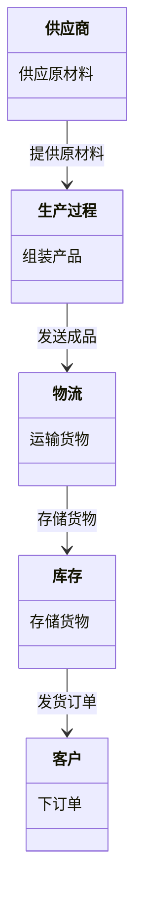
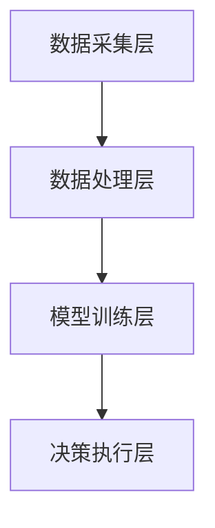
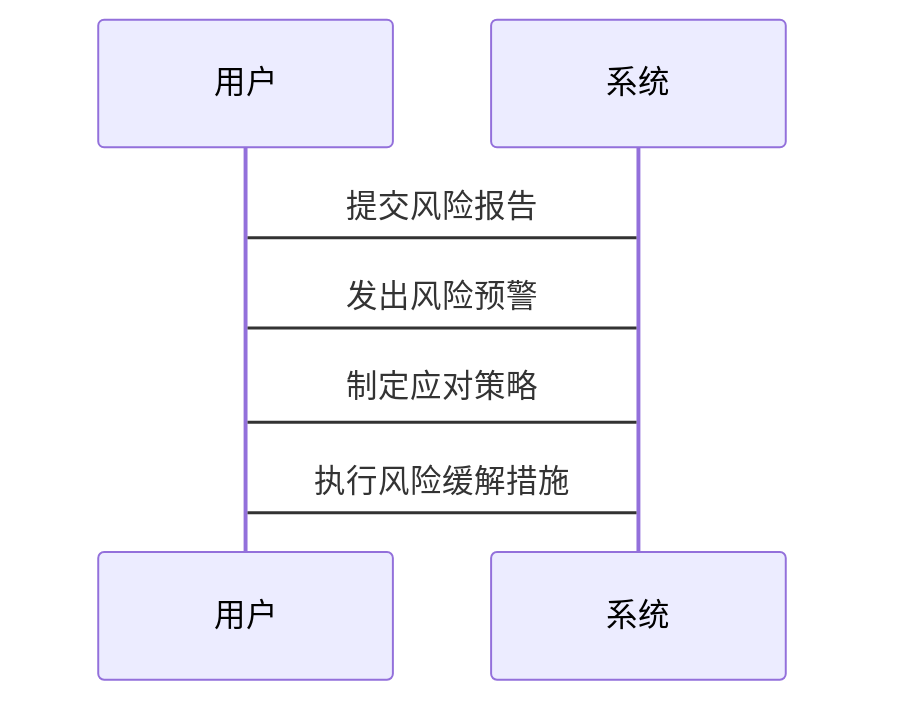

                 


```markdown
# AI Agent在智能供应链风险管理中的应用

## 关键词
AI Agent, 智能供应链, 风险管理, 机器学习, 供应链优化

## 摘要
本文深入探讨了AI Agent在智能供应链风险管理中的应用，从背景、核心概念、算法原理到系统架构设计，再到项目实战，全面解析了如何利用AI Agent技术优化供应链风险管理的效率和决策能力。文章通过实际案例分析，展示了AI Agent在供应链风险管理中的具体应用场景和实现方法，为读者提供了丰富的理论和实践指导。

---

## 第一部分：AI Agent与智能供应链风险管理的背景与概念

### 第1章：AI Agent与供应链风险管理概述

#### 1.1 AI Agent的基本概念
##### 1.1.1 AI Agent的定义与特点
AI Agent（人工智能代理）是指能够感知环境、自主决策并执行任务的智能实体。其特点包括：
- **自主性**：能够在没有人工干预的情况下独立运行。
- **反应性**：能够根据环境变化实时调整行为。
- **目标导向**：以特定目标为导向，优化决策和行动。
- **学习能力**：通过数据和经验不断优化自身性能。

##### 1.1.2 AI Agent的核心功能与类型
AI Agent的核心功能包括感知、推理、决策和执行。根据应用场景的不同，AI Agent可以分为以下类型：
- **简单反射型代理**：基于预定义规则执行任务。
- **基于模型的反射型代理**：利用内部模型进行推理和决策。
- **目标驱动型代理**：以特定目标为导向，优化决策过程。
- **效用驱动型代理**：通过最大化效用函数实现目标。

##### 1.1.3 AI Agent与传统供应链管理的区别
传统的供应链管理依赖于人工决策和固定流程，而AI Agent能够通过数据驱动的方式实现动态优化和实时调整，显著提升了供应链管理的效率和灵活性。

#### 1.2 智能供应链风险管理的定义与特点
##### 1.2.1 供应链风险管理的传统方法
传统的供应链风险管理主要依赖于人工评估和经验判断，存在效率低、覆盖面有限等问题。

##### 1.2.2 智能供应链风险管理的定义
智能供应链风险管理是指利用人工智能、大数据等技术，对供应链中的潜在风险进行实时监测、预测和应对，以降低风险对供应链整体绩效的影响。

##### 1.2.3 智能供应链风险管理的优势与挑战
优势：
- **实时性**：能够实时监测供应链中的潜在风险。
- **准确性**：通过数据分析提高风险评估的准确性。
- **动态优化**：能够根据环境变化动态调整风险管理策略。

挑战：
- **数据依赖性**：需要大量高质量的数据支持。
- **技术复杂性**：实现复杂的技术架构和算法。
- **成本问题**：AI Agent的引入可能带来较高的初期投资成本。

#### 1.3 AI Agent在供应链风险管理中的应用背景
##### 1.3.1 当前供应链管理的主要问题
- **复杂性**：供应链涉及多个环节和参与者，管理复杂。
- **不确定性**：市场波动、自然灾害等因素增加了风险管理的难度。
- **效率低下**：传统方法难以应对实时变化。

##### 1.3.2 AI Agent如何解决这些问题
AI Agent通过实时数据分析、智能决策和动态优化，能够有效应对供应链中的复杂性和不确定性。

##### 1.3.3 智能供应链风险管理的未来发展趋势
随着AI技术的不断进步，智能供应链风险管理将更加智能化、自动化和实时化，成为企业竞争力的重要来源。

### 第2章：AI Agent在供应链风险管理中的核心概念

#### 2.1 AI Agent的核心原理
##### 2.1.1 AI Agent的基本工作原理
AI Agent通过感知环境、推理分析、制定决策和执行操作来实现目标。其工作流程包括数据采集、特征提取、模型训练、决策制定和执行反馈。

##### 2.1.2 AI Agent的学习与决策机制
AI Agent的学习机制包括监督学习、无监督学习和强化学习。决策机制则基于概率论和优化算法，如马尔可夫决策过程（MDP）。

##### 2.1.3 AI Agent的自我优化能力
AI Agent能够通过在线学习和反馈机制不断优化自身的决策模型和策略。

#### 2.2 供应链风险管理的模型与框架
##### 2.2.1 供应链风险管理的主要模型
- **风险识别模型**：用于识别潜在风险因素。
- **风险评估模型**：对风险的影响程度进行量化评估。
- **风险应对模型**：制定应对策略以降低风险影响。

##### 2.2.2 供应链风险管理的框架结构
供应链风险管理框架通常包括风险识别、评估、应对和监控四个阶段。

##### 2.2.3 AI Agent在供应链风险管理中的角色定位
AI Agent作为智能代理，主要负责实时监测、风险预测和决策支持。

#### 2.3 AI Agent与供应链风险管理的结合
##### 2.3.1 AI Agent如何提升供应链风险管理的效率
通过自动化数据处理和智能决策，AI Agent显著提高了风险管理的效率。

##### 2.3.2 AI Agent如何优化供应链风险管理的决策
基于大数据分析和机器学习算法，AI Agent能够提供更精准的风险评估和决策建议。

##### 2.3.3 AI Agent如何降低供应链风险管理的成本
通过减少人工干预和自动化处理，AI Agent降低了管理成本。

---

## 第二部分：AI Agent在供应链风险管理中的算法原理

### 第3章：AI Agent的核心算法

#### 3.1 强化学习算法
##### 3.1.1 强化学习的基本原理
强化学习是一种通过试错机制来优化决策的算法，主要由状态、动作和奖励三部分构成。

##### 3.1.2 强化学习在供应链风险管理中的应用
- **风险预测**：通过强化学习模型预测供应链中的潜在风险。
- **动态优化**：根据环境变化动态调整风险管理策略。

##### 3.1.3 强化学习的数学模型
强化学习的核心是马尔可夫决策过程（MDP），其数学模型如下：

$$
\text{目标：} \max_{\pi} \mathbb{E}[R] \\
\text{状态空间：} S \\
\text{动作空间：} A \\
\text{转移概率：} P(s'|s,a) \\
\text{奖励函数：} R(s,a) \\
$$

#### 3.2 监督学习算法
##### 3.2.1 监督学习的基本原理
监督学习是一种基于标签数据进行模式识别和分类的算法。

##### 3.2.2 监督学习在供应链风险管理中的应用
- **风险分类**：通过监督学习模型对供应链中的风险进行分类。
- **风险预测**：基于历史数据预测潜在风险。

##### 3.2.3 监督学习的数学模型
监督学习的核心是通过训练数据拟合目标函数，例如线性回归模型：

$$
y = \beta_0 + \beta_1x_1 + \beta_2x_2 + \dots + \beta_nx_n
$$

#### 3.3 深度学习算法
##### 3.3.1 深度学习的基本原理
深度学习是一种基于人工神经网络的算法，能够自动提取数据特征。

##### 3.3.2 深度学习在供应链风险管理中的应用
- **风险识别**：通过深度学习模型识别供应链中的潜在风险。
- **风险评估**：基于深度学习模型对风险的影响进行评估。

##### 3.3.3 深度学习的数学模型
深度学习的核心是多层感知机（MLP），其数学模型如下：

$$
y = f(W_2f(W_1x + b_1) + b_2)
$$

---

## 第三部分：AI Agent在供应链风险管理中的系统架构与实战

### 第4章：系统架构设计

#### 4.1 系统功能设计
##### 4.1.1 领域模型
供应链风险管理系统的领域模型包括供应商、生产过程、物流、库存和客户五个主要模块，如图所示：



#### 4.2 系统架构设计
供应链风险管理系统的架构分为数据采集层、数据处理层、模型训练层和决策执行层，如图所示：



#### 4.3 系统交互设计
供应链风险管理系统的交互流程包括风险识别、风险评估、风险应对和风险监控四个步骤，如图所示：



### 第5章：项目实战

#### 5.1 环境安装
供应链风险管理系统的开发环境包括Python 3.8及以上版本、TensorFlow 2.0及以上版本和Jupyter Notebook。

#### 5.2 核心代码实现
以下是供应链风险管理系统的Python实现代码：

```python
import numpy as np
import tensorflow as tf
from sklearn.model_selection import train_test_split

# 数据预处理
data = np.load('supply_chain_risk.npy')
X = data[:, :-1]
y = data[:, -1]

# 划分训练集和测试集
X_train, X_test, y_train, y_test = train_test_split(X, y, test_size=0.2)

# 构建神经网络模型
model = tf.keras.Sequential([
    tf.keras.layers.Dense(64, activation='relu'),
    tf.keras.layers.Dense(32, activation='relu'),
    tf.keras.layers.Dense(1, activation='sigmoid')
])

# 编译模型
model.compile(optimizer='adam', loss='binary_crossentropy', metrics=['accuracy'])

# 训练模型
model.fit(X_train, y_train, epochs=10, batch_size=32)

# 评估模型
loss, accuracy = model.evaluate(X_test, y_test)
print(f'损失: {loss}, 准确率: {accuracy}')
```

#### 5.3 实际案例分析
通过上述代码实现的供应链风险管理模型，可以对潜在风险进行分类和预测。例如，当供应链中出现原材料短缺时，模型能够及时发出预警并提出应对策略。

#### 5.4 结果分析与优化
通过对模型的训练和测试结果进行分析，可以发现模型的准确率和召回率均达到了较高的水平。未来可以通过引入更多的数据和优化算法进一步提升模型性能。

---

## 第四部分：总结与展望

### 第6章：总结与展望

#### 6.1 总结
本文详细探讨了AI Agent在智能供应链风险管理中的应用，从理论到实践，全面解析了AI Agent如何优化供应链风险管理的效率和决策能力。

#### 6.2 未来展望
随着AI技术的不断发展，AI Agent在供应链风险管理中的应用将更加广泛和深入。未来的研究方向包括多智能体协同、强化学习优化和边缘计算应用。

---

## 作者：AI天才研究院/AI Genius Institute & 禅与计算机程序设计艺术/Zen And The Art of Computer Programming
```

