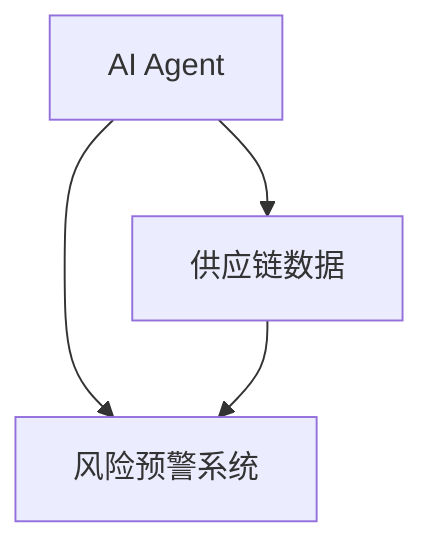
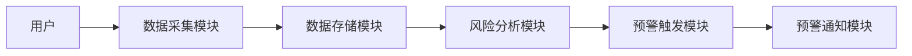
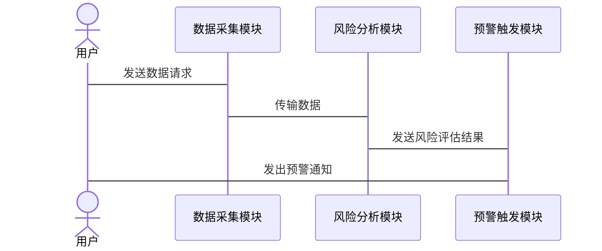

                 


# AI Agent在智能供应链风险预警中的应用

## 关键词：AI Agent，智能供应链，风险预警，算法原理，系统架构，项目实战

## 摘要：本文详细探讨了AI Agent在智能供应链风险预警中的应用，从背景介绍、核心概念、算法原理到系统架构和项目实战，系统地分析了AI Agent如何通过感知和决策机制实现供应链风险的智能预警。通过实际案例分析和系统设计，本文为读者提供了从理论到实践的全面指导，帮助读者理解并应用AI Agent技术来优化供应链风险管理。

---

# 目录大纲

## 第一部分: AI Agent与智能供应链风险预警的背景与基础

### 第1章: AI Agent与智能供应链风险预警的背景介绍

#### 1.1 AI Agent的基本概念与核心原理
- 1.1.1 什么是AI Agent
- 1.1.2 AI Agent的核心特征
- 1.1.3 AI Agent的分类与应用场景

#### 1.2 智能供应链的基本概念
- 1.2.1 供应链的定义与组成
- 1.2.2 智能供应链的特点
- 1.2.3 智能供应链的核心技术

#### 1.3 供应链风险预警的重要性
- 1.3.1 供应链风险的主要来源
- 1.3.2 风险预警的必要性
- 1.3.3 AI Agent在供应链风险预警中的作用

#### 1.4 本章小结

---

## 第二部分: AI Agent在供应链风险预警中的核心概念与联系

### 第2章: AI Agent与供应链风险预警的核心概念与联系

#### 2.1 AI Agent与供应链风险预警的核心概念
- 2.1.1 AI Agent在供应链中的角色
- 2.1.2 供应链风险预警的流程
- 2.1.3 AI Agent与供应链风险预警的关系

#### 2.2 核心概念的原理与联系
- 2.2.1 AI Agent的感知与决策机制
- 2.2.2 供应链数据的采集与分析
- 2.2.3 风险预警的触发条件与反馈机制

#### 2.3 核心概念的ER实体关系图


---

## 第三部分: AI Agent的算法原理与数学模型

### 第3章: AI Agent的算法原理与数学模型

#### 3.1 AI Agent的感知与决策算法
- 3.1.1 强化学习算法
  - Q-Learning算法
  - Deep Q-Network (DQN)
- 3.1.2 监督学习算法
  - 支持向量机 (SVM)
  - 随机森林 (Random Forest)

#### 3.2 供应链风险预警的数学模型
- 3.2.1 风险评估的贝叶斯模型
  - 贝叶斯定理：$P(A|B) = \frac{P(B|A)P(A)}{P(B)}$
- 3.2.2 时间序列分析模型
  - ARIMA模型
  - LSTM网络

#### 3.3 算法实现的Python代码示例
```python
import numpy as np
from sklearn.svm import SVC

# 示例：使用SVM进行供应链风险分类
def train_svm(X_train, y_train):
    model = SVC()
    model.fit(X_train, y_train)
    return model

# 示例：使用LSTM进行时间序列预测
def lstm_model(input_shape):
    model = Sequential()
    model.add(LSTM(50, input_shape=input_shape))
    model.add(Dense(1))
    model.compile(loss='mean_squared_error', optimizer='adam')
    return model
```

---

## 第四部分: 智能供应链风险预警系统的架构设计

### 第4章: 智能供应链风险预警系统的架构设计

#### 4.1 系统功能设计
- 4.1.1 数据采集模块
- 4.1.2 风险分析模块
- 4.1.3 预警触发模块

#### 4.2 系统架构设计


#### 4.3 系统接口设计
- API接口定义
- 数据格式规范

#### 4.4 系统交互设计


---

## 第五部分: 项目实战与案例分析

### 第5章: 项目实战与案例分析

#### 5.1 项目背景与目标
- 项目背景
- 项目目标

#### 5.2 环境搭建
- 安装Python与相关库
- 安装TensorFlow、Keras、Scikit-learn等

#### 5.3 系统核心实现
- 数据预处理
- 模型训练与优化
- 系统集成与测试

#### 5.4 案例分析
- 数据分析结果
- 预警系统的效果评估
- 成功案例与失败案例分析

#### 5.5 本章小结

---

## 第六部分: 总结与展望

### 第6章: 总结与展望

#### 6.1 全文总结
- AI Agent在供应链风险预警中的作用
- 本文的主要贡献

#### 6.2 研究的不足与改进方向
- 当前研究的局限性
- 未来研究方向

#### 6.3 最佳实践与注意事项
- 项目实施的关键点
- 使用AI Agent技术的注意事项

#### 6.4 未来展望
- 新技术的应用前景
- 供应链风险管理的未来趋势

---

## 作者：AI天才研究院/AI Genius Institute & 禅与计算机程序设计艺术 /Zen And The Art of Computer Programming

