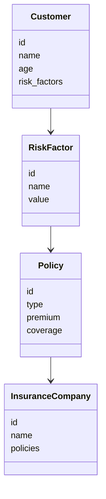
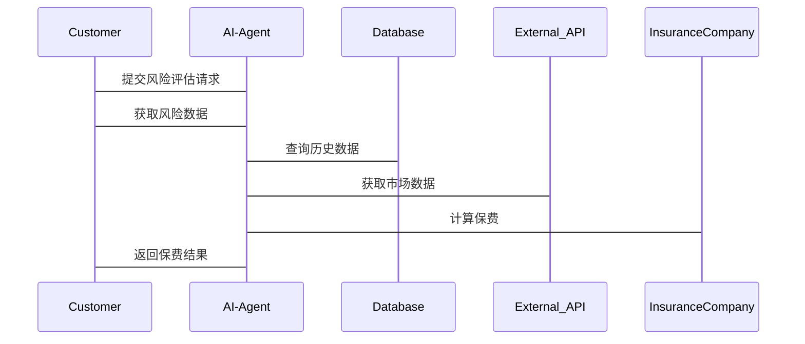

                 


# AI Agent在智能保险定价中的应用

> 关键词：AI Agent，保险定价，智能定价，人工智能，强化学习，保险系统架构

> 摘要：本文深入探讨了AI Agent在智能保险定价中的应用，分析了AI Agent的核心概念、算法原理及其在保险定价中的具体应用。通过详细的系统设计与架构分析、项目实战案例以及最佳实践，展示了如何利用AI Agent技术提升保险定价的效率与准确性。

---

# 第一部分: AI Agent与保险定价概述

# 第1章: AI Agent与保险定价的背景介绍

## 1.1 AI Agent的基本概念
### 1.1.1 AI Agent的定义
AI Agent（人工智能代理）是一种能够感知环境、执行任务并做出决策的智能实体。它能够通过传感器获取信息，利用算法进行分析和推理，并通过执行器与环境交互。AI Agent的核心目标是通过智能化手段优化特定任务的执行效率。

### 1.1.2 AI Agent的核心特征
- **自主性**：能够在没有外部干预的情况下自主执行任务。
- **反应性**：能够实时感知环境变化并做出响应。
- **学习能力**：通过数据和经验不断优化自身的决策能力。
- **协作性**：能够与其他AI Agent或系统协同工作。

### 1.1.3 AI Agent与传统保险定价的区别
传统保险定价主要依赖精算师的经验和统计模型，而AI Agent能够通过实时数据、动态调整模型参数，并结合外部环境变化，实现更精准和个性化的定价。

## 1.2 保险定价的基本原理
### 1.2.1 保险定价的定义
保险定价是指根据风险评估和成本分析，确定保险产品的价格和保费的过程。传统保险定价主要基于历史数据、精算模型和经验判断。

### 1.2.2 保险定价的关键因素
- **风险评估**：评估投保人的风险程度，如健康状况、驾驶记录等。
- **成本分析**：包括保险公司的运营成本、理赔成本等。
- **市场环境**：市场供需关系、竞争状况等。

### 1.2.3 传统保险定价的局限性
- **数据依赖性**：过于依赖历史数据，难以捕捉实时变化。
- **主观性**：精算师的经验和判断可能影响定价的准确性。
- **效率低下**：传统定价过程耗时长，难以快速响应市场需求。

## 1.3 AI Agent在保险定价中的应用现状
### 1.3.1 AI Agent在保险行业中的应用领域
- **风险评估**：通过AI Agent分析投保人的风险特征。
- **保费计算**：利用机器学习模型动态调整保费。
- **市场预测**：预测保险产品的市场需求和价格走势。

### 1.3.2 当前保险定价中的技术挑战
- **数据隐私**：保险数据涉及大量个人隐私信息，如何保护数据安全是一个重要问题。
- **模型解释性**：复杂的AI模型可能导致定价决策缺乏透明性。
- **实时性要求**：保险定价需要快速响应市场变化，这对AI Agent的实时性提出了更高要求。

### 1.3.3 AI Agent在保险定价中的优势
- **高效性**：AI Agent能够快速处理大量数据，提高定价效率。
- **准确性**：通过机器学习算法，AI Agent能够发现传统方法难以察觉的定价规律。
- **个性化**：AI Agent可以根据个体特征提供更加个性化的定价方案。

## 1.4 本章小结
本章介绍了AI Agent的基本概念及其在保险定价中的应用背景，分析了传统保险定价的局限性和AI Agent的优势。接下来的章节将深入探讨AI Agent的核心概念、算法原理以及在保险定价中的具体应用。

---

# 第二部分: AI Agent的核心概念与原理

# 第2章: AI Agent的核心概念与联系

## 2.1 AI Agent的核心概念
### 2.1.1 AI Agent的定义与属性
AI Agent是一种能够感知环境、执行任务并做出决策的智能实体。它的核心属性包括自主性、反应性、学习能力和协作性。

### 2.1.2 AI Agent的分类与特征
AI Agent可以根据功能和应用场景分为多种类型，如：
- **感知型AI Agent**：通过传感器获取环境信息。
- **决策型AI Agent**：基于环境信息做出决策。
- **执行型AI Agent**：根据决策执行具体任务。

### 2.1.3 AI Agent与保险定价的关系
在保险定价中，AI Agent可以通过实时数据分析、风险评估和动态调整定价策略，帮助保险公司实现更精准和高效的定价。

## 2.2 AI Agent与保险定价的实体关系图
### 2.2.1 ER实体关系图的构建
通过构建ER实体关系图，我们可以清晰地展示保险定价中的关键实体及其关系。

```mermaid
erd
    customer
    policy
    risk_factor
    premium
    insurer
    insurance_company
    customer -[1..n]-> policy
    policy -[1]-> insurer
    customer -[1]-> risk_factor
    risk_factor -[1]-> premium
```

### 2.2.2 保险定价中的关键实体
- **Customer**：投保人，需要评估其风险特征。
- **Policy**：保险政策，包括保费、承保范围等。
- **Risk Factor**：风险因素，如健康状况、驾驶记录等。
- **Premium**：保费，根据风险评估确定。

### 2.2.3 AI Agent在实体关系中的作用
AI Agent可以通过分析Customer的风险特征，动态调整Policy的保费，并与Insurance Company的系统进行交互，优化定价策略。

## 2.3 本章小结
本章详细介绍了AI Agent的核心概念及其在保险定价中的实体关系，通过ER图展示了关键实体之间的关系。接下来的章节将探讨AI Agent的算法原理及其在保险定价中的具体应用。

---

# 第三部分: AI Agent的算法原理

# 第3章: AI Agent的算法原理

## 3.1 AI Agent的主要算法
### 3.1.1 强化学习算法
强化学习是一种通过试错机制优化决策的算法。AI Agent通过与环境交互，学习最优策略。

### 3.1.2 监督学习算法
监督学习通过训练数据，学习输入与输出之间的映射关系，常用于分类和回归任务。

### 3.1.3 聚类算法
聚类算法用于将数据分成不同的类别，帮助识别潜在的客户群体。

## 3.2 AI Agent算法的数学模型
### 3.2.1 强化学习的数学模型
$$ V(s) = \max_a Q(s,a) $$
其中，$V(s)$是状态$s$的价值函数，$Q(s,a)$是状态$s$下动作$a$的价值函数。

### 3.2.2 监督学习的数学模型
$$ y = f(x) $$
其中，$y$是输出，$x$是输入，$f$是模型的预测函数。

## 3.3 AI Agent算法的流程图
### 3.3.1 强化学习流程图


### 3.3.2 监督学习流程图


## 3.4 本章小结
本章介绍了AI Agent的主要算法及其数学模型，并通过流程图展示了算法的执行过程。接下来的章节将探讨AI Agent在保险定价中的系统设计与实现。

---

# 第四部分: AI Agent在保险定价中的系统设计与实现

# 第4章: AI Agent在保险定价中的系统设计

## 4.1 保险定价的场景介绍
保险定价是一个复杂的过程，涉及多个因素，如客户风险特征、市场环境、公司成本等。AI Agent可以通过实时数据分析和动态调整，优化定价策略。

## 4.2 系统功能设计
### 4.2.1 领域模型


### 4.2.2 系统架构


### 4.2.3 系统接口设计
- **输入接口**：接收客户信息、风险因素等数据。
- **输出接口**：输出保费计算结果。

### 4.2.4 系统交互流程


## 4.3 项目实战
### 4.3.1 环境安装
安装所需的依赖包：
```
pip install numpy pandas scikit-learn tensorflow
```

### 4.3.2 核心实现
```python
import numpy as np
from sklearn.model_selection import train_test_split
from tensorflow.keras.models import Sequential
from tensorflow.keras.layers import Dense

# 数据预处理
X = ...  # 输入特征
y = ...  # 输出目标

X_train, X_test, y_train, y_test = train_test_split(X, y, test_size=0.2)

# 模型构建
model = Sequential()
model.add(Dense(64, activation='relu', input_dim=X.shape[1]))
model.add(Dense(1, activation='linear'))

model.compile(optimizer='adam', loss='mean_squared_error')
model.fit(X_train, y_train, epochs=100, batch_size=32)

# 预测
y_pred = model.predict(X_test)
```

### 4.3.3 案例分析
以车险定价为例，通过训练好的模型，AI Agent可以根据客户的驾驶记录、车辆信息等数据，动态计算保费。

## 4.4 本章小结
本章通过系统设计与实现，展示了AI Agent在保险定价中的具体应用。通过领域模型、系统架构和交互流程图，详细描述了系统的实现过程。

---

# 第五部分: 总结与展望

# 第5章: 总结与展望

## 5.1 最佳实践
- 数据预处理是关键，确保数据质量和完整性。
- 选择合适的算法，根据具体场景选择强化学习、监督学习或聚类算法。
- 注重模型的解释性，确保定价决策的透明性。

## 5.2 本章小结
本文深入探讨了AI Agent在智能保险定价中的应用，从核心概念、算法原理到系统设计与实现，全面分析了AI Agent在保险定价中的优势与挑战。

## 5.3 注意事项
- 数据隐私保护是重中之重，确保合规性。
- 模型的可解释性是用户信任的基础，需重点关注。
- 实时性要求高，需优化系统性能。

## 5.4 拓展阅读
- 《机器学习实战》
- 《深度学习》
- 《强化学习入门》

---

# 作者：AI天才研究院/AI Genius Institute & 禅与计算机程序设计艺术 /Zen And The Art of Computer Programming

---

本文通过详细分析AI Agent在保险定价中的应用，从理论到实践，全面展示了如何利用AI技术优化保险定价过程。希望本文能为相关领域的研究者和实践者提供有价值的参考和启示。

