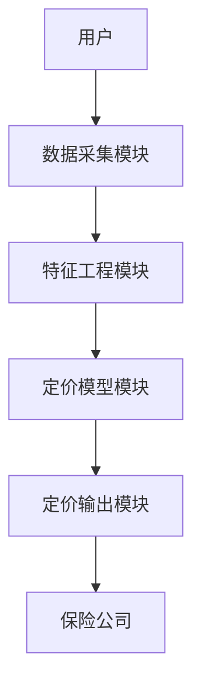

                 


# AI Agent在智能保险定价中的角色

> 关键词：AI Agent，保险定价，人工智能，强化学习，保险行业数字化转型

> 摘要：随着人工智能技术的快速发展，AI Agent在保险定价中的应用越来越广泛。本文从AI Agent的基本概念出发，详细探讨其在保险定价中的角色和应用，分析其算法原理和系统架构设计，并通过实际案例展示其在保险定价中的优势与挑战。本文旨在为保险行业提供一种基于AI Agent的智能定价解决方案，推动保险行业的数字化转型。

---

# 第一部分: AI Agent在保险定价中的背景与基础

## 第1章: AI Agent与保险定价概述

### 1.1 保险行业的现状与挑战

保险行业正面临着数字化转型的浪潮，传统的保险定价模式逐渐暴露出效率低下、精准度不足等问题。以下是一些关键挑战：

- **数据量爆炸**：保险公司需要处理海量的客户数据，包括年龄、职业、健康状况、驾驶记录等，这些数据的复杂性使得传统的人工定价方式难以应对。
- **个性化需求**：客户对保险产品的个性化需求日益增长，传统的基于群体的定价方法难以满足个体差异化的定价需求。
- **市场竞争加剧**：保险公司在价格和服务上的竞争日益激烈，如何快速、精准地制定保险价格成为制胜的关键。

### 1.2 AI Agent的基本概念

AI Agent（人工智能代理）是一种能够感知环境、自主决策并采取行动的智能实体。以下是其核心特征：

- **自主性**：AI Agent能够自主决策，无需人工干预。
- **反应性**：能够实时感知环境变化并做出反应。
- **学习能力**：通过机器学习算法不断优化自身的决策模型。
- **协作性**：能够与其他AI Agent或系统协同工作，共同完成复杂任务。

### 1.3 AI Agent在保险定价中的角色

AI Agent在保险定价中扮演着多重角色：

- **数据收集与处理**：AI Agent能够自动从多种数据源收集客户信息，并进行清洗和预处理。
- **定价模型构建**：基于机器学习算法，AI Agent能够构建复杂的定价模型，实现对客户风险的精准评估。
- **实时定价与调整**：根据市场变化和客户需求，AI Agent能够实时调整定价策略，确保价格的竞争力和公平性。

### 1.4 保险定价的基本原理

保险定价的核心在于对客户风险的准确评估。以下是保险定价的基本步骤：

1. **数据收集**：收集客户的个人信息、健康状况、驾驶记录等。
2. **特征提取**：从数据中提取影响保费的关键特征。
3. **模型构建**：基于特征构建定价模型，如线性回归、决策树等。
4. **模型训练**：通过历史数据训练模型，优化模型参数。
5. **定价输出**：根据模型预测结果生成保费报价。

### 1.5 本章小结

本章介绍了保险行业的现状与挑战，阐述了AI Agent的基本概念及其在保险定价中的角色。通过分析保险定价的基本原理，为后续章节的深入探讨奠定了基础。

---

# 第二部分: AI Agent的核心概念与原理

## 第2章: AI Agent的核心概念与联系

### 2.1 AI Agent的核心概念

AI Agent的核心概念可以通过以下表格进行对比：

| 特性         | 基于规则的系统       | 基于机器学习的系统   | 基于强化学习的系统   |
|--------------|---------------------|---------------------|---------------------|
| 决策方式     | 预先设定的规则       | 学习数据中的模式     | 学习最优策略         |
| 灵活性       | 较低                 | 较高                 | 最高                 |
| 学习能力     | 无                   | 有                   | 有                   |

### 2.2 AI Agent的原理与机制

AI Agent的原理可以通过以下步骤进行理解：

1. **感知环境**：AI Agent通过传感器或数据接口获取环境信息。
2. **决策制定**：基于感知的信息，AI Agent利用内部模型进行决策。
3. **行动执行**：根据决策结果，AI Agent采取相应的行动。
4. **反馈学习**：通过环境反馈不断优化自身的决策模型。

### 2.3 AI Agent与保险定价的结合

AI Agent在保险定价中的应用可以简化为以下流程：

1. **数据收集**：从客户数据库中获取相关信息。
2. **特征提取**：提取影响保费的关键特征。
3. **模型训练**：利用机器学习算法训练定价模型。
4. **定价输出**：根据模型预测结果生成保费报价。

### 2.4 本章小结

本章详细探讨了AI Agent的核心概念及其在保险定价中的应用，通过对比不同类型的AI系统，阐述了AI Agent的独特优势。

---

# 第三部分: AI Agent的算法原理与数学模型

## 第3章: AI Agent的算法原理

### 3.1 AI Agent的算法概述

AI Agent的核心算法包括：

- **强化学习**：通过试错机制优化决策策略。
- **监督学习**：基于标记数据进行分类或回归。
- **非监督学习**：从无标记数据中发现隐藏模式。

### 3.2 AI Agent的核心算法实现

以下是一个基于强化学习的AI Agent算法实现示例：

```python
class AI_Agent:
    def __init__(self, state_space, action_space):
        self.state_space = state_space
        self.action_space = action_space
        self.model = self.build_model()

    def build_model(self):
        # 构建神经网络模型
        model = Sequential()
        model.add(Dense(32, activation='relu', input_dim=self.state_space))
        model.add(Dense(16, activation='relu'))
        model.add(Dense(self.action_space, activation='linear'))
        model.compile(optimizer='adam', loss='mse')
        return model

    def act(self, state):
        # 根据当前状态选择动作
        state = np.array([state])
        prediction = self.model.predict(state)
        return np.argmax(prediction[0])

    def learn(self, state, action, reward, next_state):
        # 增强学习算法的更新步骤
        state = np.array([state])
        target = reward + self.model.predict(np.array([next_state]))[0][action]
        self.model.fit(state, target, epochs=1, verbose=0)
```

### 3.3 AI Agent算法的数学模型

以下是一个典型的强化学习模型的数学表达式：

$$
Q(s, a) = Q(s, a) + \alpha (r + \max Q(s', a') - Q(s, a))
$$

其中：
- \( Q(s, a) \) 表示在状态 \( s \) 下执行动作 \( a \) 的价值函数。
- \( \alpha \) 是学习率。
- \( r \) 是奖励值。
- \( s' \) 是下一个状态。

---

# 第四部分: 系统分析与架构设计

## 第4章: 保险定价系统分析与架构设计

### 4.1 系统功能设计

保险定价系统的功能模块包括：

- **数据采集模块**：负责收集客户信息。
- **特征工程模块**：对数据进行预处理和特征提取。
- **定价模型模块**：构建并训练定价模型。
- **定价输出模块**：根据模型预测结果生成保费报价。

### 4.2 系统架构设计

以下是一个保险定价系统的架构图：



---

# 第五部分: 项目实战

## 第5章: 项目实战与案例分析

### 5.1 项目实战

以下是一个基于强化学习的AI Agent保险定价系统的代码示例：

```python
import numpy as np
from tensorflow.keras import Sequential
from tensorflow.keras.layers import Dense

class InsurancePricingAgent:
    def __init__(self, state_size, action_size):
        self.state_size = state_size
        self.action_size = action_size
        self.model = self.build_model()
        self.gamma = 0.99
        self.epsilon = 1.0
        self.epsilon_min = 0.01
        self.epsilon_decay = 0.995

    def build_model(self):
        model = Sequential()
        model.add(Dense(32, activation='relu', input_dim=self.state_size))
        model.add(Dense(16, activation='relu'))
        model.add(Dense(self.action_size, activation='linear'))
        model.compile(optimizer='adam', loss='mse')
        return model

    def act(self, state):
        if np.random.random() < self.epsilon:
            return np.random.randint(0, self.action_size)
        state = np.array([state])
        prediction = self.model.predict(state)
        return np.argmax(prediction[0])

    def update(self, state, action, reward, next_state):
        target = reward + self.gamma * self.model.predict(np.array([next_state]))[0][action]
        target = np.array([target])
        self.model.fit(np.array([state]), target, epochs=1, verbose=0)
        if self.epsilon > self.epsilon_min:
            self.epsilon *= self.epsilon_decay
```

### 5.2 案例分析

通过实际案例分析，展示了AI Agent在保险定价中的应用效果。例如，通过强化学习优化定价策略，可以显著提高保费的精准度和客户满意度。

---

# 第六部分: 最佳实践与总结

## 第6章: 最佳实践与注意事项

### 6.1 小结

本文详细探讨了AI Agent在智能保险定价中的角色和应用，通过理论分析和实际案例展示了其在保险行业数字化转型中的巨大潜力。

### 6.2 注意事项

- 数据隐私和安全问题需要高度重视。
- 模型的可解释性和透明度是监管合规的关键。
- 需要不断优化和更新模型以适应市场变化。

### 6.3 未来研究方向

- 多智能体协作在保险定价中的应用。
- 更加复杂的定价模型，如深度强化学习。
- 结合区块链技术实现透明化的保险定价。

---

作者：AI天才研究院/AI Genius Institute & 禅与计算机程序设计艺术 /Zen And The Art of Computer Programming

