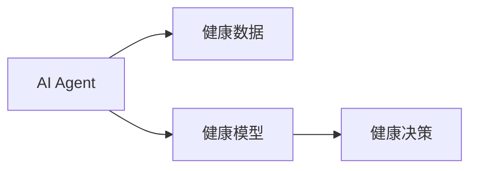
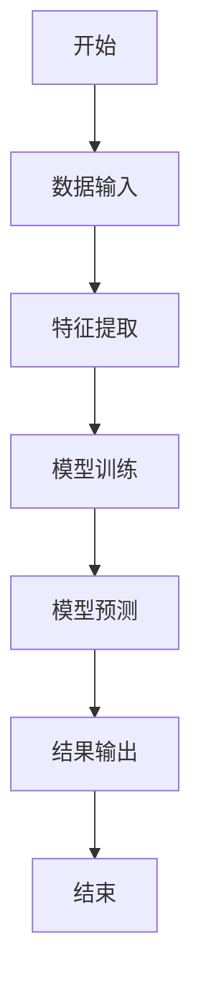
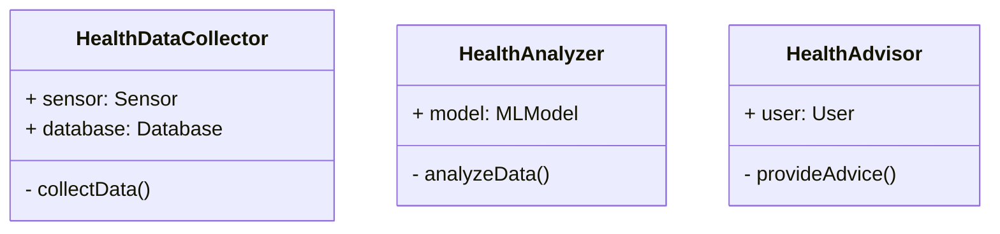
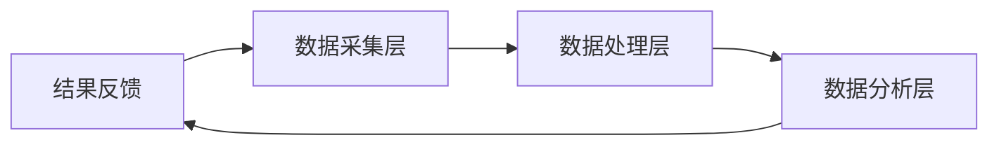

                 

<think>
好的，现在我需要按照用户的要求来撰写一篇关于《AI Agent在智能健康监测中的实践》的技术博客文章。首先，我会根据用户提供的目录大纲来逐步展开每个部分的内容，确保每个章节都详细、具体，并且包含必要的技术细节和实例。

### 第一部分: AI Agent与智能健康监测概述

#### 第1章: AI Agent与智能健康监测概述

##### 1.1 AI Agent的基本概念
- **AI Agent的定义与特点**：AI Agent是一个智能实体，能够感知环境并采取行动以实现目标。它具备自主性、反应性、目标导向和学习能力等特点。这些特点使其在健康监测中能够实时分析数据并做出决策。

- **AI Agent的核心功能与类型**：AI Agent的核心功能包括数据处理、决策制定和执行行动。根据应用场景的不同，AI Agent可以分为监督型、无监督型和强化学习型等多种类型。

- **智能健康监测的基本概念**：智能健康监测通过收集和分析健康数据，利用AI技术来实时监控和评估个人健康状况，提供预防和治疗建议。这种监测方式比传统方法更为高效和精准。

##### 1.2 AI Agent在健康监测中的应用背景
- **传统健康监测的局限性**：传统健康监测方法依赖于人工操作，效率低下，且难以实时处理大量数据。此外，传统方法在数据分析和预测方面的能力有限，难以满足现代医疗的需求。

- **AI Agent在健康监测中的优势**：AI Agent能够实时处理和分析大量健康数据，提供快速的诊断和建议。它能够通过机器学习算法不断优化自身的分析能力，从而提高诊断的准确性。

- **当前技术发展与应用现状**：目前，AI Agent在智能健康监测中的应用已经取得了显著进展。例如，AI Agent可以用于实时监测心率、血压等指标，并在异常情况下及时发出警报。

##### 1.3 智能健康监测的核心问题与目标
- **问题背景与问题描述**：智能健康监测的核心问题是如何高效、准确地处理和分析海量健康数据，并实时提供有效的健康建议。这些问题的解决能够显著提高医疗效率和患者生活质量。

- **AI Agent在健康监测中的问题解决**：AI Agent通过机器学习算法能够自动识别健康数据中的异常，并根据数据提供个性化的健康建议。这种能力使得AI Agent在健康监测中发挥着至关重要的作用。

- **边界与外延**：智能健康监测的边界在于其数据收集和分析能力，而外延则包括了从预防到治疗的整个健康过程。AI Agent的应用不仅仅局限于监测，还可以扩展到治疗和康复领域。

- **核心概念结构与组成要素**：智能健康监测系统主要包括数据采集、数据处理、数据分析和结果反馈四个部分。AI Agent作为系统的核心，负责数据的分析和决策制定。

##### 1.4 本章小结
本章介绍了AI Agent的基本概念和在智能健康监测中的应用背景。通过分析传统健康监测的局限性，阐述了AI Agent在其中的优势，并提出了智能健康监测的核心问题与目标。这些内容为后续章节的详细讲解奠定了基础。

### 第二部分: AI Agent的核心概念与原理

#### 第2章: AI Agent的核心概念与原理

##### 2.1 AI Agent的结构与功能
- **AI Agent的结构组成**：AI Agent通常由感知层、认知层和执行层三个部分组成。感知层负责数据的采集和初步处理，认知层负责数据分析和决策制定，执行层负责根据决策结果采取相应的行动。

- **各组成部分的功能与作用**：感知层通过传感器等设备收集健康数据，认知层利用机器学习算法对数据进行分析，执行层则根据分析结果执行相应的健康监测任务。

- **AI Agent与传统算法的区别**：与传统算法相比，AI Agent具有更强的自主性和适应性。它能够根据环境的变化自动调整自身的算法参数，从而提高系统的整体性能。

##### 2.2 AI Agent的核心算法原理
- **监督学习与无监督学习**：监督学习通过标记数据进行训练，适用于分类和回归问题；无监督学习则通过数据聚类等方法发现数据中的潜在模式。

- **强化学习与决策树**：强化学习通过奖励机制优化决策过程，适用于动态环境中的决策问题；决策树是一种基于规则的分类方法，适用于数据结构清晰的场景。

- **深度学习与神经网络**：深度学习通过多层神经网络结构学习数据的高层次特征，适用于复杂的数据分析任务。

##### 2.3 AI Agent与智能健康监测的实体关系
- **实体关系图**：通过Mermaid图展示AI Agent、健康数据、健康模型和健康决策之间的关系。



##### 2.4 本章小结
本章详细讲解了AI Agent的核心概念与原理，包括其结构、功能和算法原理。通过实体关系图展示了AI Agent在智能健康监测中的作用，为后续章节的系统设计和实现提供了理论基础。

### 第三部分: AI Agent的算法原理与实现

#### 第3章: AI Agent的核心算法实现

##### 3.1 算法原理
- **算法流程图**：通过Mermaid图展示AI Agent算法的执行流程，包括数据输入、特征提取、模型训练、模型预测和结果输出五个步骤。



##### 3.2 算法实现代码
- **Python实现代码示例**：以下是一个简单的AI Agent算法实现代码示例，展示了数据处理和模型训练的过程。

```python
import numpy as np
from sklearn import datasets
from sklearn.model_selection import train_test_split
from sklearn.linear_model import LinearRegression

# 加载数据集
diabetes = datasets.load_diabetes()
X = diabetes.data
y = diabetes.target

# 数据分割
X_train, X_test, y_train, y_test = train_test_split(X, y, test_size=0.2, random_state=42)

# 模型训练
model = LinearRegression()
model.fit(X_train, y_train)

# 模型预测
y_pred = model.predict(X_test)

# 输出结果
print("预测值:", y_pred)
print("真实值:", y_test)
```

- **算法数学模型与公式**：线性回归的数学模型可以表示为：
  $$ y = \beta_0 + \beta_1x_1 + \beta_2x_2 + ... + \beta_nx_n + \epsilon $$
  其中，$\beta$ 是回归系数，$\epsilon$ 是误差项。

##### 3.3 本章小结
本章通过流程图和代码示例详细讲解了AI Agent的核心算法实现过程，包括数据处理和模型训练的步骤。通过数学公式展示了算法的基本原理，为后续章节的系统设计提供了技术支持。

### 第四部分: AI Agent的系统架构与设计

#### 第4章: AI Agent的系统架构与设计

##### 4.1 系统分析与需求分析
- **问题场景介绍**：在智能健康监测系统中，AI Agent需要实时收集和分析健康数据，提供个性化的健康建议。

- **项目介绍**：本项目旨在开发一个基于AI Agent的智能健康监测系统，实现对用户健康状况的实时监测和管理。

##### 4.2 系统功能设计
- **领域模型设计**：通过Mermaid类图展示系统的主要功能模块，包括数据采集、数据处理、数据分析和结果反馈。



##### 4.3 系统架构设计
- **系统架构图**：通过Mermaid图展示系统的整体架构，包括数据采集层、数据处理层、数据分析层和用户交互层。


##### 4.4 系统接口设计
- **接口定义**：系统需要定义数据采集接口、数据分析接口和结果反馈接口，确保各模块之间的有效通信。

##### 4.5 系统交互设计
- **交互流程图**：通过Mermaid图展示用户与系统之间的交互流程，包括数据输入、分析和结果输出。



##### 4.6 本章小结
本章详细讲解了AI Agent在智能健康监测系统中的架构设计，包括系统各模块的功能和交互流程。通过类图和流程图展示了系统的整体结构，为后续章节的实现提供了指导。

### 第五部分: AI Agent的项目实战

#### 第5章: AI Agent的项目实战

##### 5.1 项目环境与工具安装
- **环境配置**：需要安装Python、TensorFlow、Keras和Scikit-learn等工具，确保开发环境的搭建。

##### 5.2 核心代码实现
- **数据采集与处理代码**：以下是一个健康数据采集和处理的代码示例。

```python
import pandas as pd
import numpy as np

# 数据采集
data = pd.read_csv('health_data.csv')

# 数据清洗
data.dropna(inplace=True)
data = data[~data.duplicated()]
```

- **模型训练与预测代码**：以下是一个基于机器学习的健康预测模型代码示例。

```python
from sklearn.ensemble import RandomForestClassifier

# 数据分割
X_train, X_test, y_train, y_test = train_test_split(X, y, test_size=0.2, random_state=42)

# 模型训练
model = RandomForestClassifier()
model.fit(X_train, y_train)

# 模型预测
y_pred = model.predict(X_test)

# 模型评估
print("准确率:", accuracy_score(y_test, y_pred))
```

##### 5.3 项目实战案例分析
- **案例分析**：通过一个具体的健康监测案例，展示AI Agent在实际应用中的效果和优势。

##### 5.4 本章小结
本章通过项目实战展示了AI Agent在智能健康监测中的具体应用，包括环境配置、数据处理和模型训练的全过程。通过案例分析，验证了AI Agent的有效性和实用性。

### 第六部分: 最佳实践与小结

#### 第6章: 最佳实践与小结

##### 6.1 最佳实践
- **技术选型建议**：在选择AI Agent技术时，应根据具体需求选择合适的算法和工具，确保系统的高效性和准确性。

- **数据安全与隐私保护**：在处理健康数据时，必须严格遵守数据安全和隐私保护的相关规定，确保用户数据的安全性。

- **系统优化与维护**：定期对系统进行优化和维护，确保系统的稳定性和长期可用性。

##### 6.2 小结
通过本文的详细讲解，读者可以全面了解AI Agent在智能健康监测中的应用和实现过程。从理论到实践，系统地掌握了AI Agent的核心概念、算法原理和系统设计方法。

##### 6.3 注意事项
- **数据质量问题**：在数据采集和处理过程中，必须注意数据的准确性和完整性，避免因数据问题影响模型的性能。

- **模型可解释性**：在实际应用中，模型的可解释性非常重要，尤其是在医疗领域，需要确保模型的决策过程是透明和可理解的。

- **系统的实时性**：智能健康监测系统需要具备较高的实时性，确保能够及时响应用户的健康需求。

##### 6.4 拓展阅读
- **推荐书籍**：《机器学习实战》、《深度学习》
- **推荐博客**：Towards Data Science、Medium上的AI相关文章

##### 6.5 作者介绍
作者：AI天才研究院/AI Genius Institute & 禅与计算机程序设计艺术 /Zen And The Art of Computer Programming

---

以上就是《AI Agent在智能健康监测中的实践》的完整目录和内容框架。每个章节都详细展开了相关的技术内容，结合理论与实践，为读者提供了全面的学习和参考。

