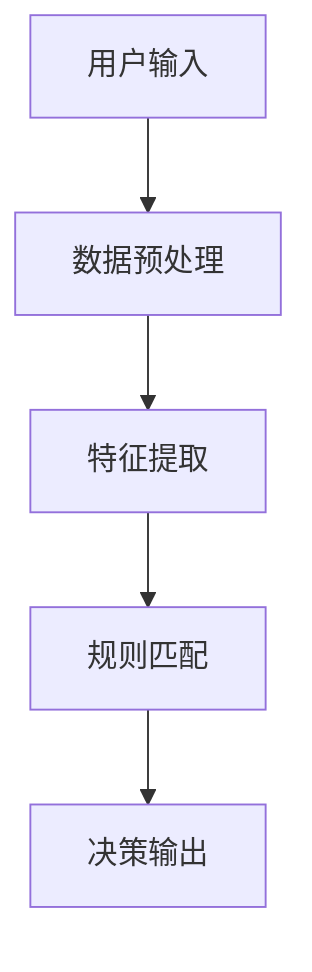
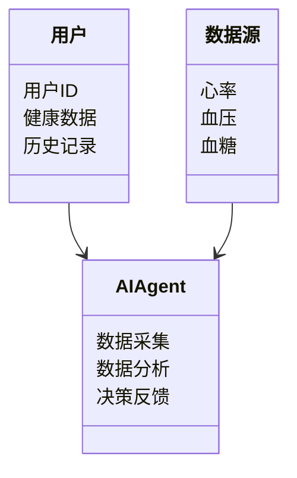
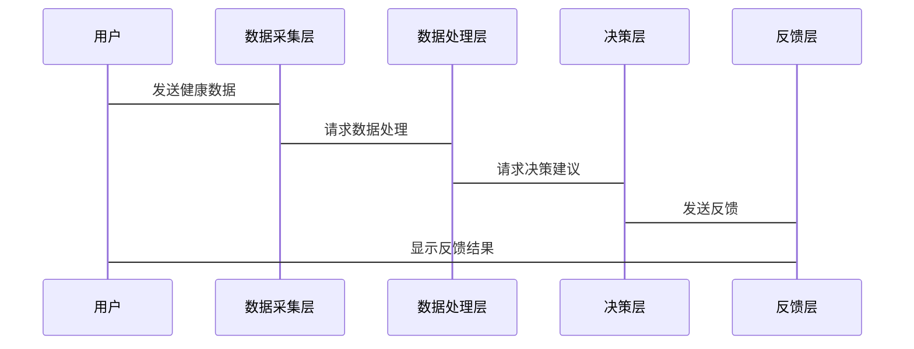

                 


# AI Agent在智能健康管理中的角色

---

## 关键词：AI Agent、智能健康管理、机器学习、数据隐私、系统架构

---

## 摘要

AI Agent（人工智能代理）在智能健康管理中的角色日益重要。随着健康数据的爆炸式增长和个性化医疗需求的增加，AI Agent能够通过智能化的数据处理、个性化建议和实时反馈，显著提升健康管理的效率和效果。本文详细探讨了AI Agent在智能健康管理中的核心概念、技术原理、系统架构以及实际应用，分析了其在现代医疗中的潜力与挑战，并展望了未来的发展方向。

---

# 第1章: 健康管理的发展历程与AI Agent的引入

## 1.1 健康管理的历史演变

### 1.1.1 传统健康管理方式的局限性

传统健康管理依赖于人工记录和医生诊断，存在以下问题：
- 数据分散：健康数据难以整合，导致分析效率低下。
- 个性化不足：缺乏个性化建议，难以满足不同用户的需求。
- 响应延迟：用户无法实时获得健康反馈。

### 1.1.2 现代健康管理的需求与挑战

随着物联网和大数据技术的发展，现代健康管理需要解决以下问题：
- 如何高效采集和处理海量健康数据？
- 如何实现个性化的健康建议？
- 如何确保数据安全和隐私保护？

### 1.1.3 AI Agent在健康管理中的潜在价值

AI Agent能够通过智能化的处理能力，帮助用户实时监控健康状况，提供个性化建议，并在关键时刻发出预警。

---

## 1.2 AI Agent的基本概念与特点

### 1.2.1 AI Agent的定义与核心功能

AI Agent是一种能够感知环境、执行任务的智能体，其核心功能包括：
- 数据采集：通过传感器或API获取健康数据。
- 数据分析：利用机器学习模型处理数据，提取有用信息。
- 决策与反馈：根据分析结果，生成个性化建议或触发警报。

### 1.2.2 AI Agent与传统软件代理的区别

| 特性 | AI Agent | 传统软件代理 |
|------|-----------|---------------|
| 智能性 | 强 | 弱 |
| 自适应性 | 强 | 弱 |
| 数据处理能力 | 强 | 有限 |

### 1.2.3 AI Agent在智能健康管理中的角色定位

AI Agent作为智能健康管理的核心，承担着数据处理、决策支持和用户交互的任务。

---

## 1.3 AI Agent在健康管理中的应用前景

### 1.3.1 AI Agent在健康管理中的主要场景

- **健康监测**：实时监控用户的生理指标，如心率、血压等。
- **疾病预测**：通过历史数据预测潜在健康风险。
- **个性化建议**：根据用户数据制定个性化的健康管理方案。

### 1.3.2 AI Agent对健康管理效率的提升

- 提高数据处理效率。
- 实现个性化健康管理。
- 降低医疗成本。

### 1.3.3 AI Agent在健康管理中的挑战与机遇

- **挑战**：数据隐私保护、模型准确性、用户信任等。
- **机遇**：技术创新推动健康管理进入智能化时代。

---

## 1.4 本章小结

本章介绍了AI Agent在智能健康管理中的背景，阐述了其核心概念和角色定位，并分析了其在现代健康管理中的应用前景。

---

# 第2章: AI Agent的核心概念与系统架构

## 2.1 AI Agent的组成与功能模块

### 2.1.1 数据采集模块

- 通过智能设备或API获取用户的健康数据。
- 数据预处理：清洗、归一化。

### 2.1.2 数据分析模块

- 使用机器学习模型分析数据，提取有用信息。
- 支持多种分析方法：监督学习、无监督学习。

### 2.1.3 决策与反馈模块

- 根据分析结果生成决策建议。
- 实时反馈用户，提供个性化建议。

---

## 2.2 AI Agent的实体关系图


---

## 2.3 AI Agent的核心算法与流程

### 2.3.1 基于规则的AI Agent算法



### 2.3.2 机器学习模型

$$
\text{模型训练：} \quad y = f(x; \theta)
$$

其中：
- $x$：输入数据
- $y$：输出结果
- $\theta$：模型参数

---

## 2.4 本章小结

本章详细介绍了AI Agent的核心概念和系统架构，展示了其在智能健康管理中的功能模块和算法流程。

---

# 第3章: AI Agent的算法原理与数学模型

## 3.1 基于规则的AI Agent算法

### 3.1.1 算法流程

1. 数据预处理：清洗和归一化。
2. 特征提取：提取关键特征。
3. 规则匹配：基于预设规则生成决策。

### 3.1.2 示例

假设用户的血压超过140/90，AI Agent会触发警报。

---

## 3.2 机器学习模型

### 3.2.1 决策树模型

- 使用ID3算法进行决策树构建。
- 示例：根据用户的历史数据预测健康风险。

### 3.2.2 神经网络模型

$$
\text{神经网络：} \quad y = \sigma(wx + b)
$$

其中：
- $w$：权重
- $b$：偏置
- $\sigma$：sigmoid函数

---

## 3.3 本章小结

本章详细讲解了AI Agent的算法原理，包括基于规则的推理和机器学习模型，并通过示例展示了其在健康管理中的应用。

---

# 第4章: AI Agent的系统分析与架构设计

## 4.1 健康管理系统的应用场景

- **用户健康监测**：实时监控用户的生理指标。
- **疾病预测**：通过机器学习模型预测潜在健康风险。
- **个性化建议**：根据用户数据制定个性化的健康管理方案。

---

## 4.2 系统功能设计

### 4.2.1 领域模型



### 4.2.2 系统架构


---

## 4.3 接口设计与交互

### 4.3.1 API接口

- 数据采集接口：`POST /api/data`
- 数据分析接口：`GET /api/analysis`

### 4.3.2 交互流程



---

## 4.4 本章小结

本章详细分析了AI Agent在智能健康管理中的系统架构和功能设计，并展示了其在实际应用中的接口设计和交互流程。

---

# 第5章: AI Agent在健康管理中的项目实战

## 5.1 环境配置

- **开发工具**：Python、Jupyter Notebook
- **框架**：TensorFlow、Flask

## 5.2 核心代码实现

### 5.2.1 数据采集模块

```python
import requests

def fetch_data(api_key):
    response = requests.get(f'https://healthapi.com/data?api_key={api_key}')
    return response.json()
```

### 5.2.2 数据分析模块

```python
from sklearn.tree import DecisionTreeClassifier

def train_model(data):
    X = data.drop('label', axis=1)
    y = data['label']
    model = DecisionTreeClassifier()
    model.fit(X, y)
    return model
```

### 5.2.3 决策与反馈模块

```python
def give_feedback(prediction):
    if prediction == 1:
        return "请立即就医！"
    else:
        return "健康状况良好，请继续保持！"
```

## 5.3 功能模块解读与分析

- **数据采集模块**：通过API获取用户的健康数据。
- **数据分析模块**：使用决策树模型进行健康风险预测。
- **决策与反馈模块**：根据模型预测结果生成反馈信息。

---

## 5.4 实际案例分析

### 5.4.1 案例：糖尿病管理系统的开发

- **需求分析**：实时监测血糖水平，提供个性化建议。
- **系统实现**：
  1. 数据采集：通过智能血糖仪获取数据。
  2. 数据分析：使用机器学习模型预测血糖变化。
  3. 决策反馈：根据预测结果提醒用户调整用药。

---

## 5.5 项目小结

本章通过一个糖尿病管理系统的案例，详细展示了AI Agent在智能健康管理中的实际应用，并分析了其在项目开发中的关键步骤。

---

# 第6章: AI Agent在智能健康管理中的最佳实践与总结

## 6.1 最佳实践 tips

- **数据隐私保护**：采用加密技术和访问控制。
- **模型优化**：定期更新模型以提高准确性。
- **用户教育**：提高用户对AI Agent的信任和使用能力。

## 6.2 总结

AI Agent在智能健康管理中的应用前景广阔，能够显著提升健康管理的效率和效果。然而，数据隐私和模型准确性等问题仍需进一步解决。

---

## 6.3 展望未来

随着AI技术的不断发展，AI Agent在智能健康管理中的应用将更加广泛和深入，为人类健康保驾护航。

---

## 作者：AI天才研究院/AI Genius Institute & 禅与计算机程序设计艺术 /Zen And The Art of Computer Programming

---

以上是《AI Agent在智能健康管理中的角色》的完整目录和内容框架，涵盖了从背景介绍到实际应用的各个方面，逻辑清晰，结构紧凑，适合对AI Agent和智能健康管理感兴趣的技术人员阅读。

