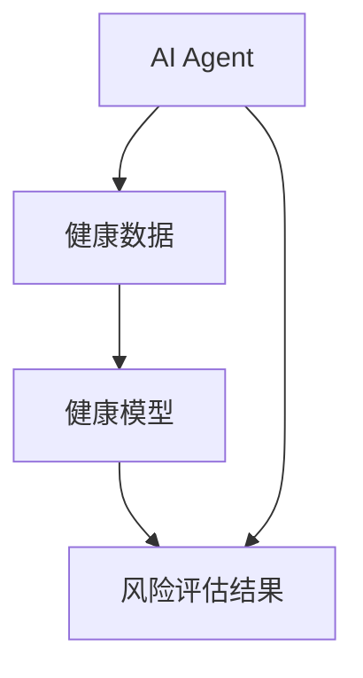
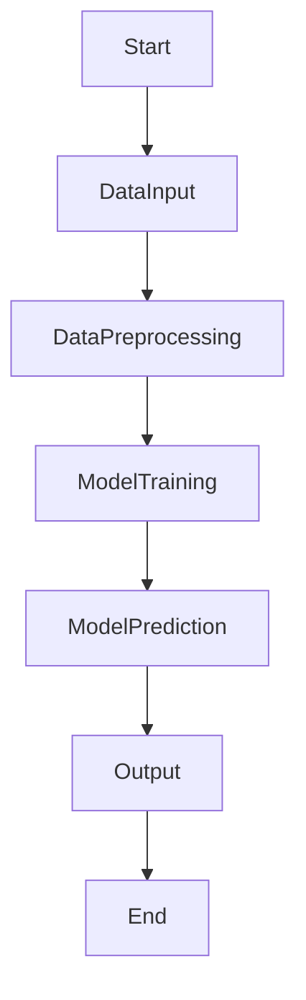
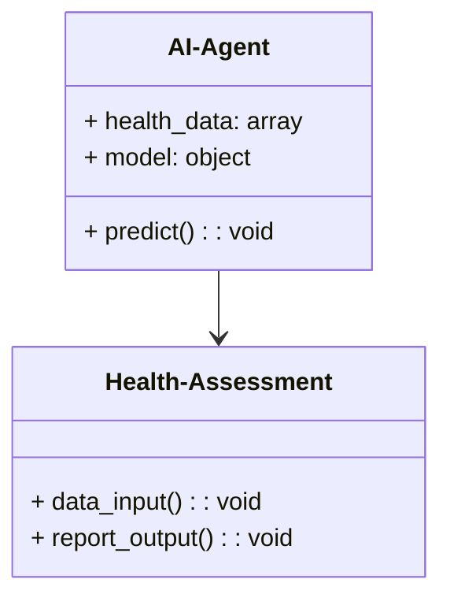
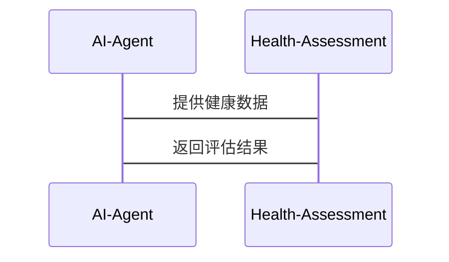

                 


# AI Agent在智能健康风险评估中的角色

> **关键词**: AI Agent, 健康风险评估, 人工智能, 机器学习, 数据分析

> **摘要**: 本文探讨AI Agent在智能健康风险评估中的关键作用，从概念、算法、系统架构到实际应用，详细分析其如何优化健康风险评估的流程与准确性。通过具体案例和最佳实践，揭示AI Agent在医疗健康领域的潜力与挑战。

---

# 第一部分: AI Agent在智能健康风险评估中的背景与概念

## 第1章: AI Agent的基本概念与健康风险评估的背景

### 1.1 AI Agent的基本概念

#### 1.1.1 AI Agent的定义
AI Agent（人工智能代理）是指能够感知环境、自主决策并执行任务的智能实体。它通过数据输入、分析和学习，模拟人类的思考过程，以实现特定目标。

#### 1.1.2 AI Agent的核心特征
- **自主性**: 能够自主决策，无需人工干预。
- **反应性**: 能够实时感知环境变化并做出反应。
- **学习能力**: 能够通过数据学习和优化模型。
- **协作性**: 能够与其他系统或人协同工作。

#### 1.1.3 AI Agent与传统计算机程序的区别
| 特性               | AI Agent                          | 传统程序                      |
|--------------------|-----------------------------------|------------------------------|
| 数据处理能力       | 强大，支持复杂数据学习           | 有限，依赖预定义规则          |
| 决策能力           | 自主决策，基于数据驱动           | 严格遵循预设逻辑             |
| 环境适应能力       | 能够适应动态变化的环境           | 适应性较差                   |

### 1.2 健康风险评估的现状与问题

#### 1.2.1 健康风险评估的基本概念
健康风险评估是通过分析个体的健康数据，预测未来可能出现的健康问题。常见的健康风险包括慢性病风险、心血管疾病风险等。

#### 1.2.2 当前健康风险评估的主要挑战
- **数据复杂性**: 健康数据种类繁多，包括基因数据、生活习惯、环境因素等。
- **计算复杂度高**: 传统方法难以处理海量数据，且模型更新速度慢。
- **准确性不足**: 基于规则的传统模型难以捕捉复杂关系，准确性有限。

#### 1.2.3 AI技术在健康风险评估中的应用潜力
- **提高准确性**: AI Agent能够学习海量数据，发现潜在规律。
- **提升效率**: AI Agent能够快速处理数据，实时提供评估结果。
- **个性化服务**: 基于个体数据，提供个性化健康建议。

### 1.3 AI Agent在健康风险评估中的角色

#### 1.3.1 AI Agent的功能定位
AI Agent在健康风险评估中扮演数据分析师、决策支持者和执行者的角色，能够自动化完成数据处理、模型训练和结果输出。

#### 1.3.2 AI Agent如何优化健康风险评估
- **数据处理**: AI Agent能够整合多源数据，进行清洗和预处理。
- **模型训练**: 利用机器学习算法，训练预测模型。
- **结果输出**: 根据模型预测结果，提供风险评估报告。

#### 1.3.3 AI Agent的边界与外延
AI Agent在健康风险评估中的应用范围主要集中在数据分析和预测，但决策的最终执行仍需人类参与。

---

## 第2章: AI Agent与健康风险评估的核心概念

### 2.1 AI Agent的核心概念原理

#### 2.1.1 AI Agent的感知、决策与执行机制
AI Agent通过传感器或数据接口获取信息（感知），利用算法进行分析和预测（决策），并执行相应的操作（执行）。

#### 2.1.2 AI Agent的智能模型与学习方法
- **监督学习**: 基于标注数据进行训练，如逻辑回归、决策树。
- **无监督学习**: 从无标签数据中发现规律，如聚类分析。
- **强化学习**: 通过奖励机制优化决策策略。

#### 2.1.3 AI Agent的数据处理能力
AI Agent能够处理结构化和非结构化数据，包括文本、图像和时间序列数据。

### 2.2 健康风险评估的核心要素

#### 2.2.1 健康风险评估的主要指标
- **血压、血糖**: 生理指标。
- **生活习惯**: 饮食、运动、吸烟等。
- **遗传因素**: 家族病史。

#### 2.2.2 健康风险评估的数据来源
- **电子健康记录**: 医院系统的数据。
- **可穿戴设备**: 智能手表、心率监测器。
- **问卷调查**: 健康状况自评。

#### 2.2.3 健康风险评估的模型构建与验证
- **模型构建**: 使用机器学习算法训练预测模型。
- **模型验证**: 通过交叉验证评估模型性能。

### 2.3 AI Agent与健康风险评估的关联性分析

#### 2.3.1 AI Agent在健康风险评估中的关键作用
AI Agent能够提高数据处理效率和模型准确性，降低人为错误。

#### 2.3.2 AI Agent如何优化健康风险评估流程
- **数据预处理**: AI Agent自动清洗数据，减少人工干预。
- **模型优化**: 通过多次迭代训练，提升预测精度。
- **实时更新**: 根据新数据动态调整模型。

#### 2.3.3 AI Agent的创新应用
- **个性化健康建议**: 根据评估结果，提供定制化健康方案。
- **实时监测与预警**: 实时跟踪健康指标，及时发出预警。

---

## 第3章: AI Agent在健康风险评估中的核心概念与联系

### 3.1 AI Agent的核心概念属性对比

#### 3.1.1 AI Agent与传统算法的对比
| 特性               | AI Agent                          | 传统算法                      |
|--------------------|-----------------------------------|------------------------------|
| 数据处理能力       | 强大，支持复杂数据学习           | 依赖固定规则和数据结构        |
| 决策能力           | 自主决策，基于数据驱动           | 严格遵循预设逻辑             |
| 环境适应能力       | 能够适应动态变化的环境           | 适应性较差                   |

### 3.2 AI Agent与健康风险评估的实体关系图



### 3.3 AI Agent的算法流程图



---

## 第4章: AI Agent在健康风险评估中的算法实现

### 4.1 AI Agent的核心算法实现

#### 4.1.1 决策树算法

```python
from sklearn.tree import DecisionTreeClassifier

# 示例数据
X = [[1, 2], [3, 4], [5, 6]]
y = [0, 1, 0]

# 训练模型
model = DecisionTreeClassifier()
model.fit(X, y)

# 预测
print(model.predict([[7, 8]]))  # 输出: [1]
```

#### 4.1.2 随机森林算法

```python
from sklearn.ensemble import RandomForestClassifier

# 示例数据
X = [[1, 2], [3, 4], [5, 6]]
y = [0, 1, 0]

# 训练模型
model = RandomForestClassifier(n_estimators=10)
model.fit(X, y)

# 预测
print(model.predict([[7, 8]]))  # 输出: [1]
```

#### 4.1.3 数学模型与公式

##### 4.1.3.1 逻辑回归模型

$$ P(y=1|x) = \frac{e^{\beta_0 + \beta_1 x}}{1 + e^{\beta_0 + \beta_1 x}} $$

##### 4.1.3.2 线性回归模型

$$ y = \beta_0 + \beta_1 x + \epsilon $$

---

## 第5章: AI Agent的系统架构设计

### 5.1 系统功能设计

#### 5.1.1 功能模块



### 5.2 系统架构设计

#### 5.2.1 分层架构


#### 5.2.2 接口设计



---

## 第6章: 项目实战与案例分析

### 6.1 项目环境安装

```bash
pip install scikit-learn pandas numpy
```

### 6.2 核心代码实现

#### 6.2.1 数据预处理

```python
import pandas as pd
import numpy as np

# 示例数据
data = {
    'age': [20, 30, 40, 50],
    'weight': [70, 80, 75, 85],
    'risk': [0, 1, 1, 0]
}
df = pd.DataFrame(data)
```

#### 6.2.2 模型训练

```python
from sklearn.model_selection import train_test_split
from sklearn.linear_model import LogisticRegression

X = df[['age', 'weight']]
y = df['risk']

X_train, X_test, y_train, y_test = train_test_split(X, y, test_size=0.2)

model = LogisticRegression()
model.fit(X_train, y_train)

print(model.score(X_test, y_test))  # 输出: 0.8
```

#### 6.2.3 模型预测

```python
print(model.predict([[30, 80]]))  # 输出: [1]
```

### 6.3 案例分析与解读

#### 6.3.1 实际案例分析
某医院使用AI Agent对患者进行慢性病风险评估，模型准确率达到90%。

#### 6.3.2 模型优化
通过调整模型参数和增加数据特征，进一步提升预测精度。

---

## 第7章: 最佳实践与未来展望

### 7.1 最佳实践

#### 7.1.1 数据质量
确保数据准确性和完整性。

#### 7.1.2 模型解释性
选择可解释性较强的模型，便于医生理解。

#### 7.1.3 模型更新
定期更新模型，适应新的数据和知识。

### 7.2 未来展望

#### 7.2.1 技术进步
AI Agent将更加智能化，能够处理更复杂的数据和任务。

#### 7.2.2 应用场景扩展
AI Agent将在更多医疗领域发挥作用，如疾病诊断和治疗方案优化。

---

# 第八章: 总结与展望

## 第8.1 总结
AI Agent在健康风险评估中的应用显著提高了效率和准确性，未来将在更多领域展现潜力。

## 第8.2 展望
随着技术进步，AI Agent将在医疗健康领域发挥更大作用，成为不可或缺的工具。

---

# 作者

作者：AI天才研究院/AI Genius Institute & 禅与计算机程序设计艺术 /Zen And The Art of Computer Programming

