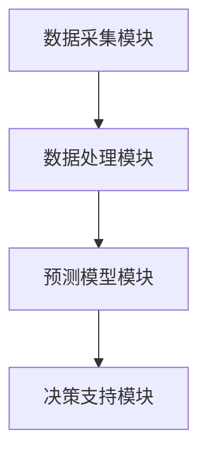
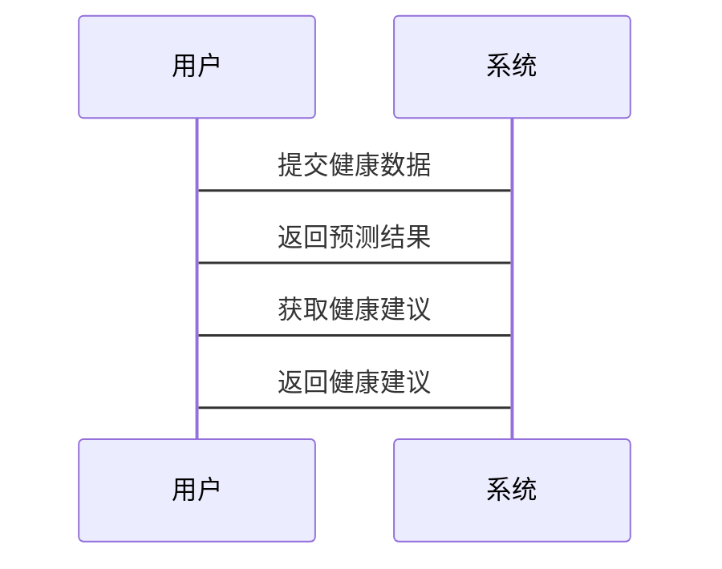

                 


# AI Agent在智能健康风险预测中的角色

## 关键词：
AI Agent, 智能健康, 风险预测, 机器学习, 健康数据分析

## 摘要：
AI Agent在智能健康风险预测中扮演着越来越重要的角色。随着人工智能技术的快速发展，AI Agent能够通过分析大量健康数据，预测潜在的健康风险，为医疗决策提供支持。本文从AI Agent的基本概念入手，详细探讨其在健康风险预测中的核心作用，包括数据处理、模型构建、决策支持等方面。文章还结合实际案例，分析了AI Agent在健康风险预测中的具体应用场景，为相关领域的研究和实践提供了有益的参考。

---

# 第1章: AI Agent与智能健康风险预测概述

## 1.1 AI Agent的基本概念

### 1.1.1 AI Agent的定义
AI Agent（人工智能代理）是指能够感知环境、自主决策并执行任务的智能实体。它可以是一个软件程序、机器人或任何能够与环境交互的智能系统。AI Agent的核心目标是通过感知和行动来优化目标函数，实现特定任务。

### 1.1.2 AI Agent的核心特征
- **自主性**：AI Agent能够在没有外部干预的情况下自主运行。
- **反应性**：能够实时感知环境变化并做出响应。
- **目标导向**：具有明确的目标，并通过行动来实现目标。
- **学习能力**：能够通过数据和经验不断优化自身的性能。

### 1.1.3 AI Agent与传统算法的区别
传统算法通常需要明确的规则和固定的流程，而AI Agent能够通过学习和适应环境，动态调整策略。AI Agent能够处理复杂和不确定的问题，而传统算法在面对复杂场景时往往表现受限。

## 1.2 智能健康风险预测的背景

### 1.2.1 健康风险预测的定义
健康风险预测是指通过分析个体的健康数据，预测其在未来可能发生的健康问题。常见的健康风险包括慢性病、传染病等。

### 1.2.2 智能健康风险预测的重要性
随着人口老龄化和医疗成本的增加，智能健康风险预测成为提高医疗效率和降低医疗成本的重要手段。通过提前预测健康风险，可以采取预防措施，减少疾病的发生。

### 1.2.3 当前健康风险预测的挑战
- 数据多样性：健康数据来源广泛，包括基因数据、生活方式数据、环境数据等。
- 数据隐私：健康数据的隐私保护是一个重要挑战。
- 模型复杂性：健康风险预测涉及复杂的非线性关系，传统的统计方法往往不够准确。

## 1.3 AI Agent在健康风险预测中的角色

### 1.3.1 AI Agent在健康数据处理中的作用
AI Agent可以自动采集、整理和分析健康数据，为预测模型提供高质量的数据支持。

### 1.3.2 AI Agent在预测模型中的应用
AI Agent能够通过机器学习算法构建预测模型，识别健康风险的关键因素，并生成预测结果。

### 1.3.3 AI Agent在决策支持中的价值
AI Agent可以根据预测结果，提供个性化的健康建议，帮助医生和患者做出更明智的决策。

## 1.4 本章小结
本章介绍了AI Agent的基本概念和健康风险预测的背景，重点分析了AI Agent在健康风险预测中的角色。AI Agent通过数据处理、模型构建和决策支持，为智能健康风险预测提供了强有力的技术支持。

---

# 第2章: AI Agent的核心概念与健康风险预测的联系

## 2.1 AI Agent的类型与特点

### 2.1.1 基于规则的AI Agent
基于规则的AI Agent通过预定义的规则进行决策，适用于规则明确的场景。

### 2.1.2 基于机器学习的AI Agent
基于机器学习的AI Agent能够通过数据学习，自动调整决策策略，适用于复杂场景。

### 2.1.3 基于强化学习的AI Agent
基于强化学习的AI Agent通过与环境的交互，不断优化决策策略，适用于动态变化的场景。

## 2.2 健康风险预测的核心要素

### 2.2.1 健康数据的来源与特征
健康数据来源包括电子健康记录（EHR）、可穿戴设备数据、基因数据等。数据特征包括连续性、离散性和时间性。

### 2.2.2 风险预测模型的构建
风险预测模型需要考虑数据的特征选择、模型训练和验证等步骤。

### 2.2.3 预测结果的解释与应用
预测结果需要可解释，以便医生和患者能够理解并采取相应的措施。

## 2.3 AI Agent与健康风险预测的结合

### 2.3.1 数据采集与处理的自动化
AI Agent可以自动采集和处理健康数据，减少人工干预。

### 2.3.2 预测模型的优化与迭代
AI Agent能够通过不断学习和优化，提高预测模型的准确性。

### 2.3.3 决策支持的智能化
AI Agent可以根据预测结果，提供个性化的健康建议，帮助医生制定治疗方案。

## 2.4 本章小结
本章分析了AI Agent的类型和特点，探讨了健康风险预测的核心要素，并详细说明了AI Agent与健康风险预测的结合方式。通过AI Agent的应用，健康风险预测的效率和准确性得到了显著提升。

---

# 第3章: 健康风险预测的算法原理与数学模型

## 3.1 健康风险预测的核心算法

### 3.1.1 逻辑回归
逻辑回归是一种常用的分类算法，适用于二分类问题。其数学模型如下：

$$ P(y=1|x) = \frac{1}{1 + e^{-\beta x}} $$

### 3.1.2 支持向量机
支持向量机（SVM）适用于小样本数据的分类问题。其数学模型如下：

$$ y = \text{sign}(\sum_{i=1}^n \alpha_i y_i x_i \cdot x + b) $$

### 3.1.3 随机森林
随机森林是一种基于决策树的集成学习算法，适用于高维数据的分类和回归问题。

## 3.2 AI Agent的算法实现

### 3.2.1 数据预处理
数据预处理包括缺失值处理、特征选择和数据标准化。

### 3.2.2 模型训练
模型训练包括选择算法、调整超参数和评估模型性能。

### 3.2.3 模型部署
模型部署包括将训练好的模型集成到AI Agent中，并实时处理健康数据。

## 3.3 算法的数学模型与实现

### 3.3.1 逻辑回归的实现
以下是一个简单的逻辑回归实现示例：

```python
import numpy as np
from sklearn.linear_model import LogisticRegression

# 生成示例数据
X = np.array([[1, 2], [3, 4], [5, 6]])
y = np.array([0, 1, 1])

# 初始化逻辑回归模型
model = LogisticRegression()

# 训练模型
model.fit(X, y)

# 预测
print(model.predict([[2, 3]]))  # 输出：array([0])
```

### 3.3.2 支持向量机的实现
以下是一个支持向量机的实现示例：

```python
from sklearn import svm

# 生成示例数据
X = np.array([[1, 2], [3, 4], [5, 6]])
y = np.array([0, 1, 1])

# 初始化SVM模型
model = svm.SVC()

# 训练模型
model.fit(X, y)

# 预测
print(model.predict([[2, 3]]))  # 输出：array([0])
```

## 3.4 本章小结
本章详细介绍了健康风险预测的核心算法，包括逻辑回归、支持向量机和随机森林。通过Python代码示例，展示了这些算法的实现过程。AI Agent通过调用这些算法，能够实现健康风险的预测和决策支持。

---

# 第4章: AI Agent的系统架构与设计

## 4.1 系统架构设计

### 4.1.1 系统功能模块
- 数据采集模块：负责采集健康数据。
- 数据处理模块：负责清洗和预处理数据。
- 预测模型模块：负责构建和训练预测模型。
- 决策支持模块：负责提供个性化的健康建议。

### 4.1.2 系统架构图


## 4.2 系统交互设计

### 4.2.1 用户界面设计
用户界面包括数据输入、预测结果展示和健康建议显示。

### 4.2.2 接口设计
系统需要与外部数据源（如医院数据库）进行交互，获取健康数据。

### 4.2.3 交互流程图


## 4.3 本章小结
本章详细描述了AI Agent的系统架构设计，包括功能模块划分和系统交互流程。通过Mermaid图展示了系统的结构和交互过程，为后续的实现提供了清晰的指导。

---

# 第5章: AI Agent在健康风险预测中的项目实战

## 5.1 项目背景

### 5.1.1 项目目标
本项目旨在开发一个基于AI Agent的健康风险预测系统，实现对慢性病的早期预测。

### 5.1.2 数据来源
数据来源包括医院电子健康记录和可穿戴设备数据。

## 5.2 核心代码实现

### 5.2.1 数据预处理
```python
import pandas as pd

# 读取数据
data = pd.read_csv('health_data.csv')

# 处理缺失值
data = data.dropna()

# 标准化数据
from sklearn.preprocessing import StandardScaler

scaler = StandardScaler()
data_scaled = scaler.fit_transform(data)
```

### 5.2.2 模型训练
```python
from sklearn.model_selection import train_test_split
from sklearn.metrics import accuracy_score

# 划分训练集和测试集
X_train, X_test, y_train, y_test = train_test_split(data_scaled, data['label'], test_size=0.2)

# 初始化逻辑回归模型
model = LogisticRegression()

# 训练模型
model.fit(X_train, y_train)

# 评估模型
print('Accuracy:', accuracy_score(y_test, model.predict(X_test)))  # 输出准确率
```

### 5.2.3 模型部署
```python
# 将模型部署到AI Agent中
class AI_Agent:
    def __init__(self):
        self.model = model

    def predict(self, input_data):
        return self.model.predict(input_data)
```

## 5.3 项目小结
本章通过一个实际项目展示了AI Agent在健康风险预测中的应用。从数据预处理到模型训练，再到模型部署，详细介绍了整个实现过程。通过该项目，我们可以看到AI Agent在实际应用中的强大能力。

---

# 第6章: 最佳实践与注意事项

## 6.1 最佳实践

### 6.1.1 数据隐私保护
健康数据的隐私保护至关重要，必须遵守相关法律法规。

### 6.1.2 模型可解释性
模型的可解释性有助于医生和患者理解预测结果，提高信任度。

### 6.1.3 系统可扩展性
系统设计应具有良好的可扩展性，以应对未来数据量的增加。

## 6.2 小结
AI Agent在健康风险预测中的应用前景广阔，但也需要我们注意数据隐私和模型可解释性等问题。通过不断优化和改进，AI Agent将为医疗行业带来更大的价值。

## 6.3 注意事项

### 6.3.1 数据隐私
确保健康数据的隐私和安全。

### 6.3.2 模型优化
不断优化模型，提高预测准确率。

### 6.3.3 系统维护
定期维护和更新系统，确保其正常运行。

---

# 作者

作者：AI天才研究院/AI Genius Institute & 禅与计算机程序设计艺术/Zen And The Art of Computer Programming

