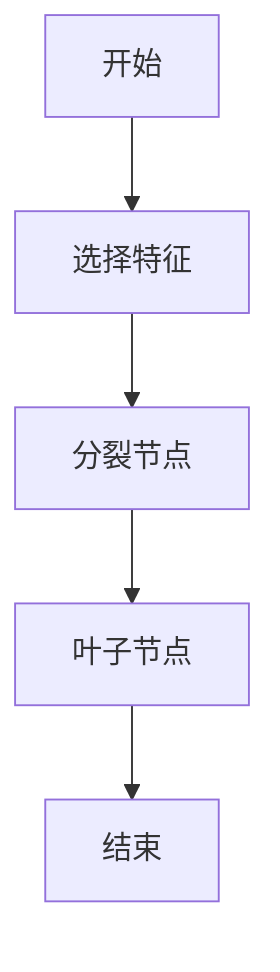
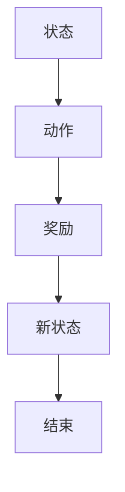
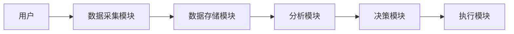
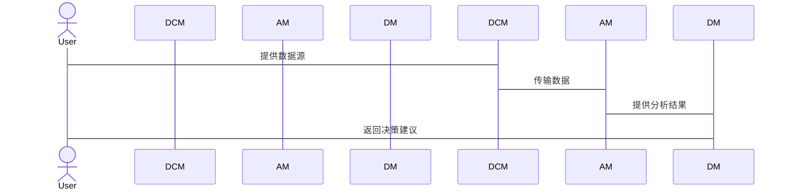

                 


# AI Agent在智能公共卫生应急中的角色

> 关键词：AI Agent, 智能公共卫生, 应急响应, 人工智能, 公共健康管理

> 摘要：本文探讨了AI Agent在智能公共卫生应急中的角色，分析了其核心概念、算法原理、系统架构及实际应用。通过详细的技术分析和案例研究，展示了AI Agent如何在疾病防控、资源分配和应急响应中发挥重要作用。

---

## 第一章: AI Agent与公共卫生应急的背景介绍

### 1.1 AI Agent的基本概念

AI Agent（人工智能代理）是指能够感知环境、自主决策并执行任务的智能实体。它不同于传统程序，具有以下核心属性：

- **自主性**：无需外部干预，自主完成任务。
- **反应性**：能够实时感知环境变化并做出反应。
- **目标导向**：基于目标驱动行为，优化决策。
- **学习能力**：通过数据和经验不断优化性能。

### 1.2 公共卫生应急的现状与挑战

公共卫生应急是指在突发公共卫生事件（如疫情、自然灾害等）中，通过一系列措施保障公众健康的过程。当前面临的主要挑战包括：

- **数据分散**：信息来源多样，难以快速整合。
- **决策延迟**：传统人工决策效率低，难以应对突发情况。
- **资源分配不均**：有限资源如何高效分配是关键问题。

AI Agent的引入为解决这些问题提供了新的思路。

---

## 第二章: AI Agent的核心概念与原理

### 2.1 AI Agent的核心概念

AI Agent的核心在于其感知与决策机制：

- **感知**：通过传感器或数据源获取环境信息。
- **决策**：基于感知信息，利用算法做出最优决策。
- **执行**：通过执行机构将决策转化为实际操作。

与传统程序相比，AI Agent的优势在于其自主性和适应性。

### 2.2 AI Agent的属性特征对比

以下表格展示了AI Agent与其他智能体的关键区别：

| 特性                | AI Agent                | 传统程序             | 人类          |
|---------------------|-------------------------|----------------------|--------------|
| 自主性              | 高                     | 低                   | 中            |
| 学习能力            | 强                     | 无                   | 强            |
| 适应性              | 强                     | 低                   | 中            |

### 2.3 AI Agent的ER实体关系图

下图展示了AI Agent在公共卫生应急中的实体关系：

```mermaid
er
actor: AI Agent
role: 信息源, 决策者, 执行者
```

---

## 第三章: AI Agent在公共卫生应急中的角色

### 3.1 公共卫生应急的场景分析

AI Agent在以下场景中发挥重要作用：

- **疾病爆发的早期预警**：通过分析社交媒体和医疗数据，提前发现潜在疫情。
- **疫情传播的预测与控制**：基于流行病学模型，预测疫情扩散趋势。
- **资源分配与调度**：优化医疗资源分配，确保关键资源的合理使用。

### 3.2 AI Agent的具体角色

AI Agent在公共卫生应急中扮演以下角色：

- **数据采集与处理**：整合多源数据，构建实时信息库。
- **风险评估与决策支持**：基于数据，提供科学决策依据。
- **应急响应与协调**：指挥资源分配，协调各部门行动。

### 3.3 AI Agent的优势

AI Agent的主要优势包括：

- **高效性与准确性**：快速处理海量数据，提供精准决策支持。
- **自适应性与灵活性**：能够根据实际情况动态调整策略。
- **可扩展性与可维护性**：易于扩展功能，维护成本低。

---

## 第四章: AI Agent的算法原理与数学模型

### 4.1 AI Agent的核心算法

#### 4.1.1 决策树算法

决策树是一种常见的分类算法，适用于疫情传播预测。其流程如下：



Python实现：

```python
from sklearn.tree import DecisionTreeClassifier

# 示例数据
X = [[...], [...]]
y = [0, 1]

model = DecisionTreeClassifier()
model.fit(X, y)
```

#### 4.1.2 强化学习算法

强化学习适用于资源分配优化。其流程如下：



Python实现：

```python
import numpy as np
import gym

env = gym.make('CartPole-v0')
model = DQN()  # 自定义DQN模型
```

### 4.2 AI Agent的数学模型

#### 4.2.1 决策树的构建与优化

决策树的构建过程涉及信息增益计算：

$$
\text{信息增益} = \text{熵}(X) - \sum \text{熵}(X_i)
$$

#### 4.2.2 强化学习的数学公式

强化学习的核心是Q-learning算法：

$$
Q(s, a) = Q(s, a) + \alpha [r + \gamma \max Q(s', a') - Q(s, a)]
$$

---

## 第五章: 系统分析与架构设计方案

### 5.1 问题场景介绍

公共卫生应急系统需要处理海量数据，包括病例数据、地理位置信息等。AI Agent在此场景中负责数据处理、风险评估和资源分配。

### 5.2 系统功能设计

系统功能模块包括：

- **数据采集模块**：整合多源数据。
- **分析模块**：处理数据并生成报告。
- **决策模块**：基于分析结果做出决策。

### 5.3 系统架构设计

系统架构如下：



### 5.4 接口设计与交互

系统交互流程如下：



---

## 第六章: 项目实战

### 6.1 环境安装

需安装以下库：

```bash
pip install numpy pandas scikit-learn gym
```

### 6.2 核心代码实现

以下是AI Agent的实现代码：

```python
class AIAgent:
    def __init__(self):
        self.models = {
            'decision_tree': DecisionTreeClassifier(),
            'dqn': DQN()
        }

    def process_data(self, data):
        # 数据预处理
        pass

    def make_decision(self, state):
        # 基于强化学习模型做出决策
        return self.models['dqn'].predict(state)
```

### 6.3 案例分析

以疫情预测为例，AI Agent通过分析历史数据和当前趋势，预测未来7天的新增病例数，并提出防控建议。

### 6.4 总结

AI Agent在公共卫生应急中的应用显著提升了响应效率和准确性，但需注意数据隐私和算法可解释性问题。

---

## 总结

本文全面探讨了AI Agent在智能公共卫生应急中的角色，从理论到实践，系统性地分析了其应用价值和实现方法。AI Agent凭借其强大的数据处理能力和智能决策能力，正在成为公共卫生应急中的重要工具。

---

## 作者

作者：AI天才研究院/AI Genius Institute & 禅与计算机程序设计艺术 /Zen And The Art of Computer Programming

