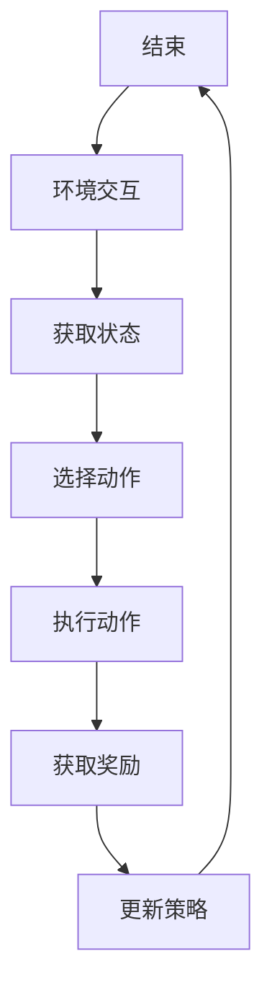
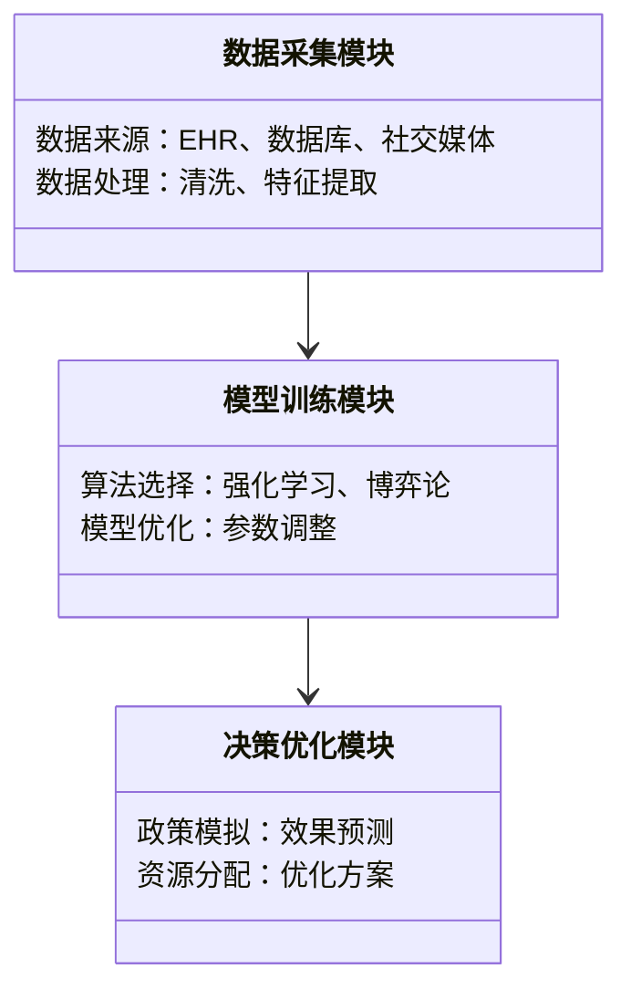
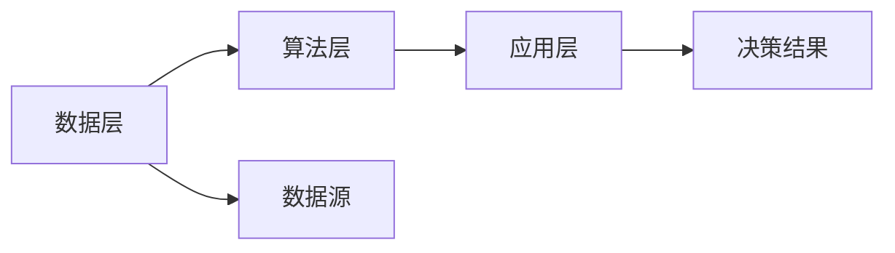

                 

# AI Agent在智能公共卫生政策制定中的角色

> 关键词：AI Agent, 公共卫生政策, 强化学习, 数据驱动, 博弈论, 系统架构

> 摘要：AI Agent在智能公共卫生政策制定中扮演着越来越重要的角色。本文从AI Agent的基本概念出发，探讨其在公共卫生政策制定中的理论基础、技术实现、实际应用和系统设计。通过分析强化学习和博弈论模型，结合具体案例，揭示AI Agent如何优化政策制定过程。最后，本文展望了AI Agent在公共卫生政策中的未来发展方向和挑战。

---

# 第一部分: AI Agent与公共卫生政策的背景与基础

## 第1章: AI Agent与公共卫生政策的概述

### 1.1 AI Agent的基本概念

#### 1.1.1 AI Agent的定义与特征
AI Agent（人工智能代理）是指能够感知环境、自主决策并执行任务的智能实体。其主要特征包括：
- **自主性**：能够独立决策和行动。
- **反应性**：能够根据环境变化实时调整行为。
- **学习性**：能够通过数据和经验不断优化自身能力。
- **社交性**：能够与其他Agent或人类进行交互协作。

#### 1.1.2 公共卫生政策的基本概念
公共卫生政策是指政府和社会为保护和促进公众健康而制定的策略、法规和行动计划。其核心目标是预防疾病、提高健康水平和优化医疗资源分配。

#### 1.1.3 AI Agent在公共卫生政策中的角色定位
AI Agent在公共卫生政策中主要扮演以下角色：
- **数据分析师**：通过大数据技术处理和分析健康数据。
- **决策支持工具**：为政策制定者提供科学的决策建议。
- **行动执行者**：在某些场景下，AI Agent可以自动执行预设的优化方案。

### 1.2 AI Agent与公共卫生政策的结合背景

#### 1.2.1 公共卫生政策的传统制定方式
传统的公共卫生政策制定过程通常依赖于专家经验和历史数据分析，存在以下问题：
- **效率低下**：政策制定周期长，难以应对突发公共卫生事件。
- **主观性较强**：决策高度依赖专家个人经验，存在主观偏差。
- **数据利用不足**：难以充分利用海量数据进行预测和优化。

#### 1.2.2 AI技术在公共卫生领域的应用现状
近年来，AI技术在公共卫生领域的应用逐渐增多，主要体现在：
- **疾病预测**：通过机器学习模型预测疾病 outbreaks。
- **资源配置优化**：利用AI算法优化医疗资源的分配。
- **政策模拟**：通过模拟不同政策的效果，辅助政策制定。

#### 1.2.3 AI Agent在公共卫生政策中的潜力与优势
AI Agent在公共卫生政策中的潜力主要体现在以下几个方面：
- **高效性**：能够快速处理海量数据，提供实时决策支持。
- **准确性**：通过数据驱动的方法，减少人为误差。
- **适应性**：能够根据环境变化动态调整政策建议。

---

## 第2章: AI Agent的核心原理与技术基础

### 2.1 AI Agent的决策模型

#### 2.1.1 基于强化学习的决策模型
强化学习是一种通过试错方式优化决策模型的方法。其基本原理是通过与环境交互，不断调整策略以最大化累积奖励。

**强化学习算法的数学模型**：
$$ Q(s, a) = Q(s, a) + \alpha (r + \max_{a'} Q(s', a') - Q(s, a)) $$
其中，\( Q(s, a) \) 表示在状态 \( s \) 下执行动作 \( a \) 的价值，\( \alpha \) 是学习率，\( r \) 是奖励，\( s' \) 是下一个状态。

#### 2.1.2 基于博弈论的决策模型
博弈论通过模拟不同主体之间的竞争与合作，帮助决策者找到最优策略。在公共卫生政策中，博弈论模型常用于模拟不同利益相关者的行为。

**博弈论模型的基本公式**：
$$ \text{收益} = \sum_{i=1}^{n} p_i \cdot v_i $$
其中，\( p_i \) 是参与者 \( i \) 的概率，\( v_i \) 是其带来的价值。

#### 2.1.3 基于知识图谱的推理模型
知识图谱是一种结构化的数据表示方式，能够帮助AI Agent进行推理和关联分析。

**知识图谱的基本结构**：
- 实体（Entity）：代表具体事物，如“疾病”、“政策”。
- 关系（Relation）：表示实体之间的关联，如“预防”、“影响”。
- 属性（Attribute）：描述实体的特征，如“传染性”。

### 2.2 数据驱动的公共卫生政策制定

#### 2.2.1 数据收集与处理
数据收集是AI Agent进行决策的基础。常见的数据来源包括：
- **电子健康记录（EHR）**：患者的医疗记录。
- **公共卫生数据库**：疾病统计数据。
- **社交媒体数据**：公众健康相关讨论。

#### 2.2.2 数据分析与建模
通过机器学习模型对数据进行分析，提取有用的信息。常用的分析方法包括：
- **时间序列分析**：预测疾病传播趋势。
- **聚类分析**：识别高风险区域。
- **分类模型**：预测患者病情。

#### 2.2.3 数据驱动的政策优化
基于数据分析结果，优化政策方案。例如：
- **资源分配优化**：根据疫情预测结果，优化疫苗分配策略。
- **政策模拟**：模拟不同政策的效果，选择最优方案。

### 2.3 AI Agent的伦理与法律问题

#### 2.3.1 AI Agent的伦理挑战
AI Agent的决策可能对公众健康产生重大影响，因此需要考虑以下伦理问题：
- **责任归属**：当AI Agent的决策导致不良后果时，责任如何划分？
- **隐私保护**：处理个人健康数据时，如何保护隐私？
- **公平性**：AI Agent的决策是否可能导致某些群体的不公平对待？

#### 2.3.2 公共卫生政策的法律框架
公共卫生政策的制定需要遵守相关法律法规，例如：
- **数据隐私法**：如GDPR（通用数据保护条例）。
- **医疗伦理法**：确保AI Agent的决策符合伦理标准。

#### 2.3.3 AI Agent在政策制定中的责任与边界
AI Agent的决策应当在政策制定者的监督下进行，明确其责任与边界：
- **决策辅助**：AI Agent提供决策支持，但最终决策权属于人类。
- **透明性**：AI Agent的决策过程应当可解释，便于审查和追溯。

---

## 第3章: AI Agent在公共卫生政策制定中的技术实现

### 3.1 AI Agent的算法与数学模型

#### 3.1.1 强化学习算法在AI Agent中的应用
强化学习算法通过与环境的交互，不断优化决策策略。例如，在疫苗分配问题中，AI Agent可以通过试错方式找到最优分配方案。

**强化学习算法的流程图**：

#### 3.1.2 基于博弈论的决策模型
博弈论模型通过模拟不同主体的行为，帮助决策者找到最优策略。例如，在资源分配问题中，AI Agent可以通过博弈论模型预测不同利益相关者的反应。

**博弈论模型的数学公式**：
$$ \text{收益} = \sum_{i=1}^{n} p_i \cdot v_i $$

#### 3.1.3 数据驱动的预测与优化模型
通过时间序列分析和分类模型，AI Agent可以预测疾病传播趋势，并优化资源配置。

**时间序列分析模型**：
$$ \text{预测值} = \sum_{i=1}^{k} w_i \cdot x_i $$
其中，\( w_i \) 是权重，\( x_i \) 是输入特征。

### 3.2 系统设计与架构

#### 3.2.1 系统功能设计
AI Agent系统主要包括以下功能模块：
- **数据采集模块**：收集和处理健康数据。
- **模型训练模块**：训练和优化决策模型。
- **决策优化模块**：根据模型结果优化政策方案。

**系统功能模块的类图**：

#### 3.2.2 系统架构设计
AI Agent系统的架构包括数据层、算法层和应用层。

**系统架构图**：

---

## 第4章: 项目实战与案例分析

### 4.1 项目背景
某城市面临流感疫情的爆发，需要制定疫苗分配方案。

### 4.2 系统实现
1. **数据采集**：收集流感疫情数据、人口分布数据。
2. **模型训练**：使用强化学习算法预测疫情发展趋势。
3. **决策优化**：优化疫苗分配方案，确保高风险区域优先接种。

### 4.3 实际案例分析
通过AI Agent模拟疫苗分配，结果表明：
- AI Agent优化的分配方案比传统方法提高了疫苗接种效率，减少了疫情扩散范围。

### 4.4 项目小结
AI Agent在流感疫苗分配中的应用，验证了其在公共卫生政策制定中的有效性。

---

## 第5章: 挑战与未来展望

### 5.1 当前应用中的挑战
1. **数据隐私**：如何保护个人健康数据的隐私？
2. **模型可解释性**：如何让政策制定者理解AI Agent的决策过程？
3. **伦理问题**：AI Agent的决策是否符合伦理标准？

### 5.2 未来发展方向
1. **多智能体协作**：研究多个AI Agent协作制定复杂政策的方法。
2. **人机协作模式**：探索AI Agent与人类专家的最佳协作方式。
3. **实时响应系统**：开发能够实时调整政策的AI Agent系统。

---

## 结语

AI Agent在公共卫生政策制定中的应用前景广阔，但也面临诸多挑战。通过不断优化算法、完善系统架构和解决伦理问题，AI Agent将能够更好地辅助政策制定者，提升公共卫生管理的效率和效果。

---

## 作者：AI天才研究院/AI Genius Institute & 禅与计算机程序设计艺术 /Zen And The Art of Computer Programming

