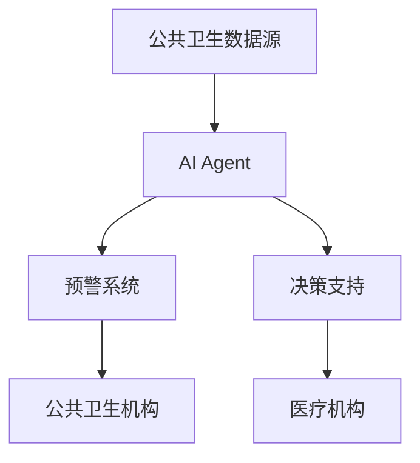
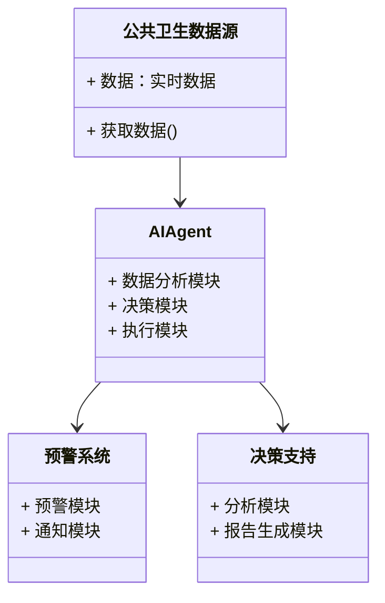

                 


# AI Agent在智能公共卫生监测中的角色

## 关键词：AI Agent，公共卫生监测，智能系统，机器学习，实时预警

## 摘要：AI Agent在公共卫生监测中的应用，通过实时数据分析、智能决策和自动化响应，提升公共卫生事件的早期预警和应对能力。本文详细探讨了AI Agent的核心概念、算法原理、系统架构及其在公共卫生监测中的实际应用案例。

---

## 第1章: 公共卫生监测的背景与挑战

### 1.1 公共卫生监测的基本概念
#### 1.1.1 公共卫生监测的定义
公共卫生监测是通过收集、分析和评估健康相关数据，识别健康问题、疾病趋势和公共卫生事件的过程。其目的是及时发现和应对威胁公众健康的事件，如传染病爆发、环境污染等。

#### 1.1.2 公共卫生监测的主要目标
- 早期发现疾病爆发
- 监测疾病传播趋势
- 评估公共卫生干预措施的效果
- 提供科学依据支持决策

#### 1.1.3 公共卫生监测的现状与发展趋势
随着信息技术的发展，公共卫生监测正从传统的人工方式向智能化、自动化方向转变。AI Agent作为人工智能的核心技术之一，正在成为公共卫生监测系统的重要组成部分。

---

### 1.2 AI Agent的基本概念
#### 1.2.1 AI Agent的定义与特点
AI Agent（人工智能代理）是一种能够感知环境、自主决策并执行任务的智能实体。其特点包括：
- **自主性**：无需外部干预，自主完成任务
- **反应性**：能够实时感知环境变化并做出反应
- **学习能力**：通过数据和经验不断优化自身行为
- **协作性**：能够与其他系统或人类协同工作

#### 1.2.2 AI Agent的工作原理
AI Agent通常由以下几个核心模块组成：
1. **感知模块**：通过传感器或数据接口获取环境信息
2. **推理模块**：基于获取的信息进行分析和推理
3. **决策模块**：根据推理结果制定行动计划
4. **执行模块**：将决策转化为具体行动

#### 1.2.3 AI Agent与传统数据处理的区别
| 特性       | AI Agent                     | 传统数据处理             |
|------------|------------------------------|--------------------------|
| 数据来源   | 多源异构数据（如传感器、数据库） | 结构化数据                |
| 处理方式   | 实时分析、自主决策          | 批量处理、规则驱动        |
| 智能性     | 高度智能化，自适应          | 低智能性，依赖人工规则    |

---

### 1.3 AI Agent在公共卫生监测中的应用
#### 1.3.1 AI Agent在公共卫生监测中的作用
AI Agent可以实时监控疾病传播趋势、预测疫情风险、优化资源配置，从而提高公共卫生事件的应对效率。

#### 1.3.2 AI Agent的核心技术与实现
- **数据采集**：通过传感器、数据库等获取实时数据
- **数据处理**：对数据进行清洗、融合和分析
- **模型训练**：使用机器学习算法训练预测模型
- **决策支持**：基于模型结果提供决策建议

---

## 第2章: AI Agent的核心概念与联系

### 2.1 AI Agent的核心概念
#### 2.1.1 AI Agent的定义与分类
AI Agent可以根据功能和应用场景分为多种类型：
- **监视型AI Agent**：用于实时监控环境状态
- **决策型AI Agent**：用于制定行动计划
- **协作型AI Agent**：用于多系统协同工作

#### 2.1.2 AI Agent的核心原理
AI Agent通过感知环境、分析数据、制定决策并执行行动，实现对公共卫生事件的实时监测和应对。

#### 2.1.3 AI Agent与公共卫生监测的关系
AI Agent作为公共卫生监测系统的核心组件，能够实时处理海量数据，快速识别异常情况，为决策者提供科学依据。

---

### 2.2 AI Agent的核心原理
#### 2.2.1 AI Agent的数据处理流程
1. 数据采集：从多种数据源获取实时数据
2. 数据清洗：去除噪声数据，确保数据质量
3. 数据分析：使用机器学习算法进行数据建模
4. 预测与决策：基于模型结果制定应对措施

#### 2.2.2 AI Agent的决策机制
AI Agent通过分析数据，利用预测模型生成决策建议，并根据实际情况动态调整行动计划。

#### 2.2.3 AI Agent的自适应能力
AI Agent能够根据环境变化和新数据不断优化自身的预测模型和决策策略。

---

### 2.3 AI Agent与公共卫生监测的实体关系


---

## 第3章: AI Agent的算法原理与实现

### 3.1 AI Agent的核心算法
#### 3.1.1 监督学习算法
- **线性回归**：用于预测疾病传播趋势
- **随机森林**：用于分类和预测

#### 3.1.2 强化学习算法
- **Q-Learning**：用于动态环境下的决策优化

#### 3.1.3 无监督学习算法
- **聚类分析**：用于识别异常数据模式

---

### 3.2 AI Agent的算法实现
#### 3.2.1 监督学习实现
```python
import numpy as np
from sklearn.linear_model import LinearRegression

# 数据准备
X = np.array([[1], [2], [3], [4]])
y = np.array([2, 4, 6, 8])

# 模型训练
model = LinearRegression()
model.fit(X, y)

# 预测
print(model.predict([[5]]))  # 输出：[[10]]
```

#### 3.2.2 强化学习实现
```python
import gym
from gym import spaces
from gym.utils import seeding

class CartPoleEnv(gym.Env):
    def __init__(self):
        self.action_space = spaces.Discrete(2)
        self.observation_space = spaces.Box(-2.4, 2.4, shape=(1,))
        self.seed()

    def step(self, action):
        # 状态更新逻辑
        pass

    def reset(self):
        # 初始化环境
        pass

    def render(self):
        # 可视化环境
        pass
```

---

## 第4章: 系统分析与架构设计

### 4.1 系统功能设计


---

## 第5章: 项目实战与案例分析

### 5.1 项目环境搭建
- **工具安装**：安装Python、TensorFlow、Flask等开发工具
- **数据准备**：收集公共卫生相关数据集

### 5.2 系统实现
```python
from flask import Flask, request, jsonify
import joblib
import numpy as np

app = Flask(__name__)
model = joblib.load('disease_prediction.pkl')

@app.route('/predict', methods=['POST'])
def predict():
    data = request.json['data']
    prediction = model.predict(np.array(data).reshape(1, -1))
    return jsonify({'result': int(prediction[0])})

if __name__ == '__main__':
    app.run(debug=True)
```

---

## 第6章: 最佳实践与注意事项

### 6.1 最佳实践
- 数据隐私保护：确保数据的安全性和隐私性
- 模型优化：定期更新模型，提高预测准确性
- 系统维护：及时修复系统漏洞，确保稳定运行

### 6.2 小结
AI Agent在公共卫生监测中的应用前景广阔，能够显著提升公共卫生事件的应对效率。

### 6.3 注意事项
- 数据质量：确保数据来源可靠，避免误判
- 模型泛化能力：避免过拟合，确保模型的普适性
- 系统可扩展性：设计灵活的架构，便于后续功能扩展

### 6.4 拓展阅读
- 推荐阅读《机器学习实战》和《深度学习入门》等书籍，深入理解AI Agent的技术细节。

---

## 作者：AI天才研究院 & 禅与计算机程序设计艺术

---

通过以上结构，文章详细介绍了AI Agent在智能公共卫生监测中的角色，从概念到实现，从理论到实践，为读者提供了全面的视角和深入的分析。

