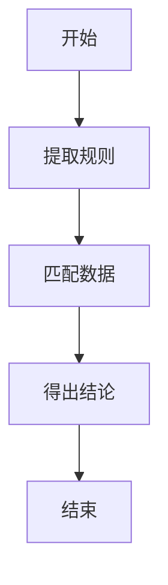
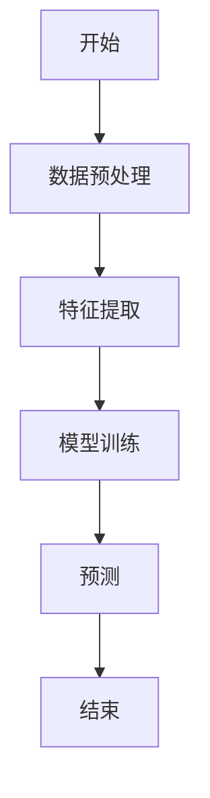
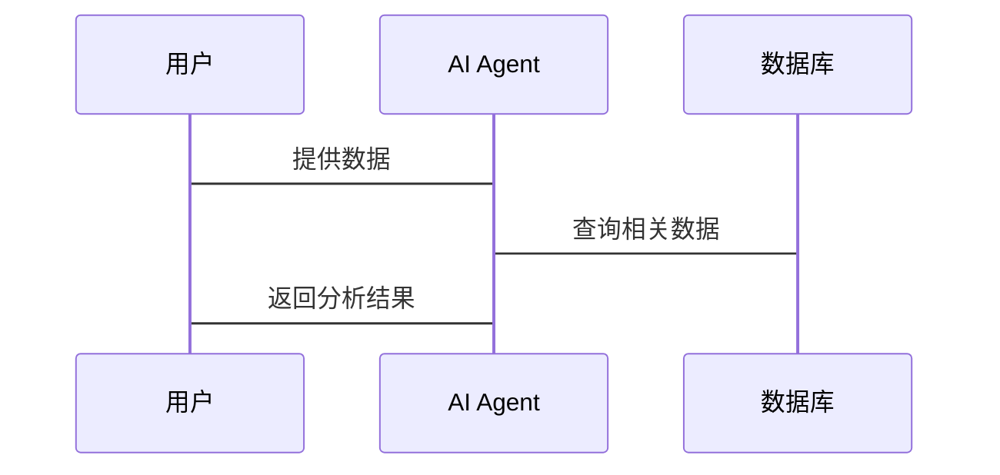

                 


# AI Agent在智能公共卫生管理中的角色

## 关键词：AI Agent，公共卫生管理，智能决策，数据处理，算法，系统架构

## 摘要：AI Agent作为人工智能领域的重要技术，正在 revolutionize 公共卫生管理的方式。通过智能决策、数据处理和高效算法，AI Agent能够显著提升公共卫生管理的效率和精准度。本文将深入探讨AI Agent在公共卫生管理中的核心角色，从背景介绍到系统架构，全面分析其应用价值和未来发展方向。

---

## 正文

### 第1章：AI Agent的基本概念与背景

#### 1.1 AI Agent的定义与核心要素

AI Agent，全称为人工智能代理，是指能够在特定环境中感知、推理、规划、学习并采取行动以实现目标的智能实体。AI Agent的核心要素包括：

- **智能性**：通过学习和推理处理复杂问题。
- **自主性**：无需外部干预，自主决策。
- **反应性**：实时响应环境变化。

#### 1.2 公共卫生管理的现状与挑战

公共卫生管理面临数据分散、决策滞后、资源分配不均等问题。AI Agent能够通过实时数据分析和智能决策，帮助解决这些挑战。

#### 1.3 AI Agent在公共卫生管理中的应用前景

AI Agent在疫情预测、资源分配、患者管理等方面具有广阔应用前景，将推动公共卫生管理的智能化转型。

---

### 第2章：AI Agent的核心原理与特点

#### 2.1 AI Agent的原理

AI Agent的原理包括基于规则的推理、机器学习和强化学习。

- **基于规则的推理**：通过预定义规则进行推理。
- **机器学习驱动的决策**：利用数据训练模型进行决策。
- **强化学习的应用**：通过试错优化决策策略。

#### 2.2 核心概念对比表

| 概念         | 特点1：智能性 | 特点2：自主性 | 特点3：反应性 |
|--------------|--------------|--------------|--------------|
| AI Agent     | 高           | 高           | 高           |
| 传统软件     | 低           | 低           | 低           |

#### 2.3 ER实体关系图

```mermaid
er
  entity AI Agent {
    id
    智能模块
    知识库
  }
  entity 公共卫生数据 {
    病例数据
    流行病学数据
    医疗资源数据
  }
  AI Agent -- 公共卫生数据: 处理与分析
```

---

### 第3章：AI Agent的核心算法

#### 3.1 基于规则的推理算法

算法流程：



代码示例：

```python
def rule_based_inference(data):
    if data['症状'] == '发热':
        return '疑似流感'
    else:
        return '无异常'
```

#### 3.2 机器学习驱动的决策算法

算法流程：



数学模型：

$$ P(class | evidence) = \frac{P(evidence | class)P(class)}{P(evidence)} $$

---

### 第4章：系统分析与架构设计

#### 4.1 系统架构设计

系统架构：


接口设计：

- 数据接口：处理数据输入输出。
- 用户接口：提供人机交互界面。

交互图：



---

### 第5章：项目实战

#### 5.1 环境安装

安装Python和相关库，如TensorFlow、Scikit-learn。

#### 5.2 核心代码实现

示例代码：

```python
import numpy as np
from sklearn import tree

# 数据准备
X = np.array([[40, 1], [35, 0], [38, 1], [32, 0]])
y = np.array(['流感', '非流感', '流感', '非流感'])

# 模型训练
model = tree.DecisionTreeClassifier()
model.fit(X, y)

# 预测
new_case = np.array([[37, 1]])
print(model.predict(new_case))
```

---

### 第6章：总结与展望

#### 6.1 总结

AI Agent在公共卫生管理中的应用前景广阔，能够显著提升管理效率。

#### 6.2 展望

未来，AI Agent将与5G、物联网等技术结合，推动公共卫生管理的智能化发展。

---

## 参考文献

1. 《人工智能：现代方法》
2. 《机器学习实战》
3. 相关学术论文

---

## 作者：AI天才研究院 & 禅与计算机程序设计艺术

---

通过上述结构，文章详细探讨了AI Agent在公共卫生管理中的应用，从理论到实践，为读者提供了全面的视角。

