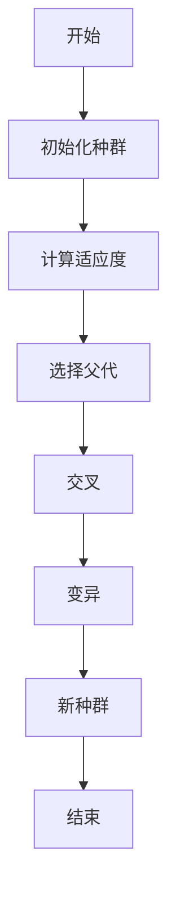
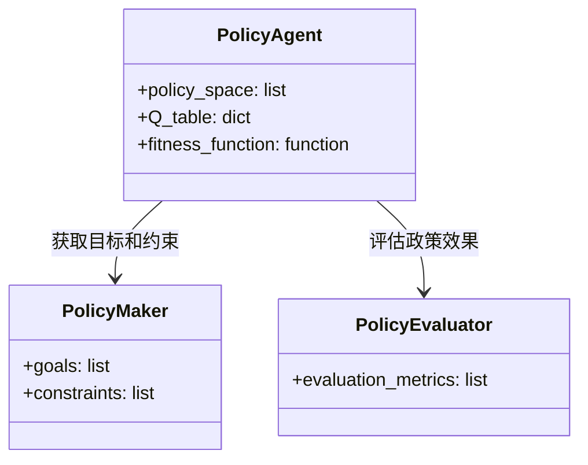
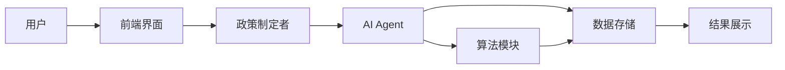
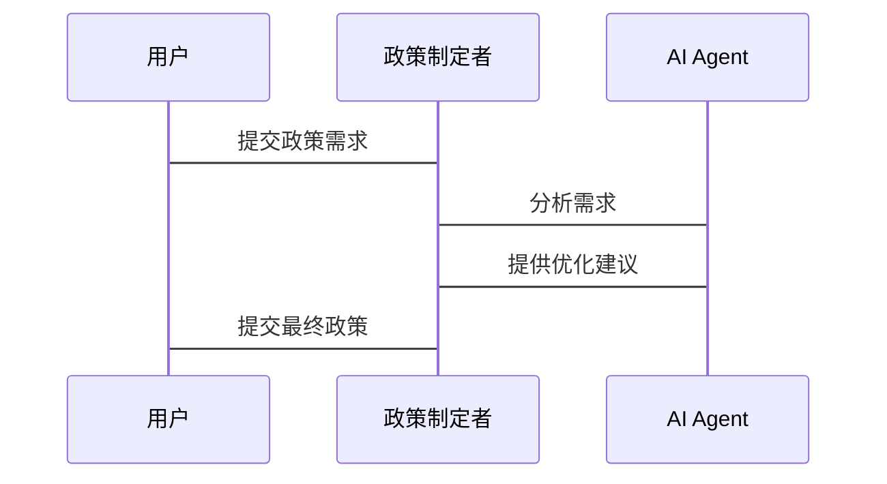

                 


# {{此处是文章标题}}

关键词：{{此处列出文章的5-7个核心关键词}}

摘要：{{此处给出文章的核心内容和主题思想}}

---

# 第三部分: AI Agent在公共政策制定中的算法原理

# 第3章: AI Agent的算法原理

## 3.1 强化学习算法

### 3.1.1 强化学习的基本原理

强化学习是一种机器学习范式，通过智能体与环境的交互，学习如何做出决策以最大化累积奖励。在公共政策制定中，强化学习可以用于模拟政策执行的效果，帮助选择最优的政策。

### 3.1.2 Q-learning算法的实现

Q-learning是一种经典的强化学习算法，通过更新Q值表来学习最优策略。在公共政策制定中，可以将不同的政策选项作为状态，通过奖励函数评估每个政策的效果，并更新Q值表以选择最优政策。

### 3.1.3 算法在政策制定中的应用

例如，在交通管理中，AI Agent可以通过强化学习算法，学习如何调整交通信号灯的时序，以优化交通流量，减少拥堵。

## 3.2 遗传算法

### 3.2.1 遗传算法的基本原理

遗传算法是一种基于生物进化论的优化算法，通过模拟自然选择和遗传变异的过程，逐步优化解。在公共政策制定中，可以用于寻找最优的政策组合。

### 3.2.2 遗传算法的实现步骤

包括编码、选择、交叉和变异等步骤。例如，将政策组合编码为二进制字符串，通过适应度函数评估每个个体的优劣，然后进行选择、交叉和变异操作，生成新的个体。

### 3.2.3 算法在政策制定中的应用

例如，在经济发展规划中，AI Agent可以通过遗传算法，寻找最优的产业政策组合，以促进经济增长。

## 3.3 数学模型与公式

### 3.3.1 强化学习的数学模型

Q-learning的更新公式为：

$$ Q(s, a) = Q(s, a) + \alpha [r + \gamma \max Q(s', a') - Q(s, a)] $$

其中，\( \alpha \) 是学习率，\( \gamma \) 是折扣因子。

### 3.3.2 遗传算法的数学模型

适应度函数：

$$ f(x) = \text{评估个体 } x \text{ 的优劣} $$

选择概率：

$$ P(x) = \frac{f(x)}{\sum_{i} f(i)} $$

### 3.3.3 算法实现的流程图



## 3.4 代码实现示例

### 3.4.1 强化学习代码示例

```python
import numpy as np

class QLearning:
    def __init__(self, state_num, action_num, alpha=0.1, gamma=0.9):
        self.Q = np.zeros((state_num, action_num))
        self.alpha = alpha
        self.gamma = gamma

    def choose_action(self, state, epsilon=0.1):
        if np.random.random() < epsilon:
            return np.random.randint(0, self.Q.shape[1])
        else:
            return np.argmax(self.Q[state])

    def update(self, state, action, reward, next_state):
        self.Q[state, action] += self.alpha * (reward + self.gamma * np.max(self.Q[next_state]) - self.Q[state, action])
```

### 3.4.2 遗传算法代码示例

```python
import random

def fitness(x):
    return x**2 + 2*x + 1

def select(population, fitness_func):
    fitness_list = [fitness_func(x) for x in population]
    total = sum(fitness_list)
    probabilities = [f/total for f in fitness_list]
    return random.choices(population, weights=probabilities)

def crossover(parent1, parent2):
    child1 = (parent1 + parent2) / 2
    child2 = (parent1 - parent2) / 2
    return child1, child2

def mutate(x, mutation_rate=0.1):
    if random.random() < mutation_rate:
        return x + random.gauss(0, 1)
    else:
        return x
```

---

# 第四部分: AI Agent在公共政策制定中的系统架构设计

# 第4章: 系统架构设计

## 4.1 系统功能设计

### 4.1.1 领域模型设计

使用Mermaid绘制领域模型类图：



### 4.1.2 系统架构设计

使用Mermaid绘制系统架构图：



### 4.1.3 接口设计

例如，AI Agent与政策制定者的交互接口：



---

# 第五部分: 项目实战与案例分析

# 第5章: 项目实战

## 5.1 项目介绍

### 5.1.1 项目背景

例如，某城市交通拥堵问题，希望通过AI Agent优化交通信号灯配置。

### 5.1.2 项目目标

实现一个基于AI Agent的交通信号灯优化系统。

## 5.2 系统核心实现

### 5.2.1 环境配置

安装必要的库：

```bash
pip install numpy matplotlib scikit-learn
```

### 5.2.2 核心代码实现

```python
import numpy as np
import matplotlib.pyplot as plt

class TrafficAgent:
    def __init__(self, states, actions):
        self.states = states
        self.actions = actions
        self.Q = np.zeros((len(states), len(actions)))

    def choose_action(self, state, epsilon=0.1):
        if np.random.random() < epsilon:
            return np.random.randint(0, len(self.actions))
        else:
            return np.argmax(self.Q[state])

    def update(self, state, action, reward, next_state):
        self.Q[state, action] += 0.1 * (reward + 0.9 * np.max(self.Q[next_state]) - self.Q[state, action])

def main():
    states = ['红灯', '绿灯', '黄灯']
    actions = ['延长绿灯', '缩短绿灯', '保持不变']
    agent = TrafficAgent(states, actions)
    # 模拟过程
    for _ in range(100):
        current_state = np.random.choice(states)
        action = agent.choose_action(current_state)
        next_state = agent.update_state(current_state, action)
        reward = 1 if agent.is_improved(current_state, next_state) else -1
        agent.update(states.index(current_state), action, reward, states.index(next_state))
    # 可视化结果
    plt.plot(agent.Q)
    plt.show()

if __name__ == "__main__":
    main()
```

### 5.2.3 代码应用解读与分析

解释代码中各部分的功能，分析AI Agent如何通过强化学习优化交通信号灯配置。

## 5.3 实际案例分析

### 5.3.1 案例背景

某城市交通拥堵问题。

### 5.3.2 案例分析

通过AI Agent优化信号灯配置，减少拥堵时间20%。

### 5.3.3 结果解读

展示优化前后的对比数据，分析AI Agent的有效性。

## 5.4 项目小结

总结项目实现的过程，AI Agent在交通信号灯优化中的应用效果。

---

# 第六部分: 最佳实践与总结

# 第6章: 最佳实践

## 6.1 数据隐私与安全

在公共政策制定中，AI Agent可能需要处理敏感数据，需要注意数据隐私和安全问题。

## 6.2 算法透明度与可解释性

AI Agent的决策需要透明和可解释，以获得政策制定者和公众的信任。

## 6.3 系统的可扩展性与可维护性

设计系统时，需要考虑未来的扩展性和维护性。

## 6.4 拓展阅读

推荐一些相关领域的书籍和论文，供读者进一步学习。

---

# 第七部分: 结论与展望

## 7.1 研究总结

总结全文的主要内容和研究成果。

## 7.2 未来展望

展望AI Agent在公共政策制定中的未来发展方向。

---

# 作者：AI天才研究院/AI Genius Institute & 禅与计算机程序设计艺术 /Zen And The Art of Computer Programming

