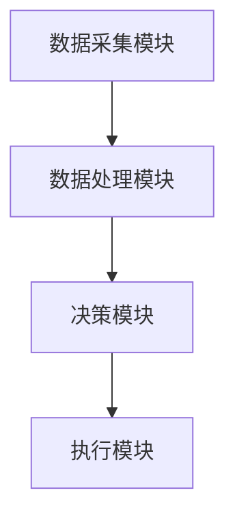

                 


# AI Agent在智能养老服务中的应用

## 关键词：智能养老服务、AI Agent、人工智能、养老服务系统、智能助手

## 摘要：
本文探讨了AI Agent在智能养老服务中的应用，分析了其核心概念、算法原理、系统架构，并通过实际案例展示了其在养老服务中的潜力与价值。文章详细阐述了AI Agent的技术实现，并提出了未来发展的建议。

---

# 第1章: AI Agent与智能养老服务的背景介绍

## 1.1 AI Agent的基本概念
### 1.1.1 AI Agent的定义与特点
AI Agent（人工智能代理）是一种能够感知环境、自主决策并执行任务的智能系统。其特点包括：
- **自主性**：无需外部干预，自主完成任务。
- **反应性**：能够实时感知环境并做出反应。
- **目标导向**：基于目标驱动行为。
- **学习能力**：通过数据和经验不断优化性能。

### 1.1.2 AI Agent的核心要素与功能
AI Agent的核心要素包括：
- **感知**：通过传感器或数据输入获取信息。
- **推理**：基于知识库进行逻辑推理。
- **决策**：根据推理结果做出最优选择。
- **执行**：通过执行机构将决策转化为行动。

### 1.1.3 AI Agent与传统养老服务的区别
| 特性         | AI Agent在养老服务中的应用                     | 传统养老服务                      |
|--------------|--------------------------------------------|---------------------------------|
| 服务效率     | 高效、实时响应                              | 低效、依赖人工                   |
| 服务范围     | 可覆盖广泛场景                               | 仅限于局部场景                   |
| 服务精度     | 高精度、个性化                              | 低精度、通用化                   |
| 成本         | 降低人工成本                                 | 高人工成本                       |

---

## 1.2 智能养老服务的需求与挑战
### 1.2.1 养老服务的现状与痛点
随着老龄化加剧，传统养老服务面临以下痛点：
- **人力资源不足**：养老服务人员短缺。
- **服务效率低下**：人工服务耗时长、覆盖面有限。
- **服务个性化不足**：难以满足老年人个性化需求。

### 1.2.2 AI Agent在养老服务中的应用潜力
AI Agent能够：
- **实时监测**：通过传感器实时监测老年人的健康状况。
- **智能提醒**：提醒老年人按时服药、锻炼。
- **服务匹配**：根据老年人需求智能匹配最优服务资源。
- **应急处理**：在紧急情况下快速响应，如摔倒检测和报警。

---

# 第2章: AI Agent在智能养老服务中的核心概念

## 2.1 AI Agent的智能体结构
### 2.1.1 状态、动作与环境的定义
- **状态**：系统的当前情况，如“老人是否需要帮助”。
- **动作**：系统根据状态做出的行为，如“呼叫护士”。
- **环境**：AI Agent所处的外部世界，包括老年人、设备等。

### 2.1.2 知识表示与推理机制
- **知识表示**：将知识以符号或规则形式存储，如“如果老人摔倒，则需要立即救助”。
- **推理机制**：基于知识库进行逻辑推理，如“如果老人摔倒，则触发报警”。

### 2.1.3 决策与规划算法
AI Agent通过以下算法做出决策：
1. **强化学习（Reinforcement Learning）**：通过奖励机制优化决策策略。
2. **监督学习（Supervised Learning）**：基于标注数据训练分类模型。
3. **无监督学习（Unsupervised Learning）**：发现数据中的隐藏模式。

---

## 2.2 智能养老服务的核心需求与AI Agent的匹配
### 2.2.1 老年人的需求分析
老年人的核心需求包括：
- **健康监测**：实时监测血压、心率等健康指标。
- **生活辅助**：帮助完成日常任务，如提醒服药、预约医生。
- **紧急响应**：在紧急情况下快速响应。

### 2.2.2 AI Agent的功能模块与服务类型
AI Agent的功能模块包括：
- **数据采集模块**：采集老年人的健康数据和行为数据。
- **决策模块**：基于数据做出最优决策。
- **执行模块**：通过智能设备执行决策。

### 2.2.3 AI Agent与养老服务场景的结合
AI Agent可以应用于以下场景：
1. **健康监测**：实时监测老年人的健康状况，预防疾病发生。
2. **生活辅助**：提醒老年人按时服药、锻炼，帮助预约医疗服务。
3. **紧急响应**：在老年人摔倒或出现异常时，快速报警并联系紧急联系人。

---

# 第3章: AI Agent的算法原理与实现

## 3.1 AI Agent的核心算法
### 3.1.1 强化学习算法
强化学习是一种通过试错机制优化决策策略的算法。其核心要素包括：
- **状态（State）**：系统的当前情况。
- **动作（Action）**：系统采取的行为。
- **奖励（Reward）**：对行为的反馈，用于优化策略。

### 3.1.2 监督学习算法
监督学习是一种基于标注数据训练分类模型的算法。其核心步骤包括：
1. **数据准备**：收集并标注数据。
2. **模型训练**：使用训练数据优化模型参数。
3. **模型预测**：基于训练好的模型进行预测。

### 3.1.3 聚类与分类算法
聚类算法用于将数据分成若干类别，分类算法用于对新数据进行分类。例如，可以使用K-means算法对老年人的行为数据进行聚类，识别异常行为。

---

## 3.2 算法实现的数学模型
### 3.2.1 Q-learning算法的数学模型
Q-learning算法是一种常用的强化学习算法，其数学模型如下：
$$ Q(s, a) = Q(s, a) + \alpha \left[r + \max_{a'} Q(s', a') - Q(s, a)\right] $$
其中：
- \( Q(s, a) \) 表示状态 \( s \) 下采取动作 \( a \) 的价值。
- \( \alpha \) 是学习率。
- \( r \) 是奖励。
- \( s' \) 是下一个状态。

### 3.2.2 状态转移矩阵的构建
状态转移矩阵描述了从当前状态到下一个状态的概率。例如：
$$ P = \begin{bmatrix}
0.2 & 0.5 & 0.3 \\
0.4 & 0.1 & 0.5 \\
0.1 & 0.3 & 0.6 \\
\end{bmatrix} $$
其中，\( P[i][j] \) 表示从状态 \( i \) 转移到状态 \( j \) 的概率。

### 3.2.3 动作选择的概率模型
动作选择的概率模型可以基于Q值进行 softmax 函数计算：
$$ P(a) = \frac{e^{\beta Q(a)}}{\sum_{a'} e^{\beta Q(a')}} $$
其中，\( \beta \) 是温度参数，用于控制探索与利用的平衡。

---

# 第4章: AI Agent的系统架构与设计

## 4.1 系统架构设计
### 4.1.1 分层架构设计
分层架构将系统划分为多个层次，包括：
1. **数据采集层**：负责采集老年人的健康数据和行为数据。
2. **数据处理层**：对数据进行清洗、转换和存储。
3. **算法执行层**：运行AI Agent的核心算法，做出决策。
4. **服务执行层**：根据决策结果执行具体服务。

### 4.1.2 微服务架构设计
微服务架构将系统功能分解为多个独立的服务，例如：
- **健康监测服务**：负责实时监测老年人的健康状况。
- **决策服务**：负责根据数据做出决策。
- **通知服务**：负责通知紧急联系人或医疗服务机构。

### 4.1.3 组件间的交互关系
组件间的交互关系可以用以下mermaid图表示：


---

## 4.2 系统功能设计
### 4.2.1 用户需求收集模块
用户需求收集模块通过以下步骤收集老年人的需求：
1. **数据采集**：通过传感器或问卷收集数据。
2. **需求分析**：分析数据，识别老年人的核心需求。
3. **需求匹配**：根据需求匹配最优服务资源。

### 4.2.2 服务匹配算法模块
服务匹配算法模块通过以下步骤实现服务匹配：
1. **需求分析**：分析老年人的具体需求。
2. **服务筛选**：从服务库中筛选符合条件的服务。
3. **服务推荐**：根据匹配度推荐最优服务。

### 4.2.3 服务执行与反馈模块
服务执行与反馈模块通过以下步骤实现服务执行：
1. **服务执行**：根据决策结果执行具体服务。
2. **反馈收集**：收集服务执行的反馈信息。
3. **优化调整**：根据反馈优化服务策略。

---

# 第5章: AI Agent在智能养老服务中的项目实战

## 5.1 项目环境与工具安装
### 5.1.1 开发环境的配置
- **操作系统**：建议使用Linux或macOS。
- **编程语言**：主要使用Python。
- **开发工具**：推荐使用PyCharm或VS Code。

### 5.1.2 依赖库的安装与配置
- **深度学习框架**：安装TensorFlow或Keras。
- **数据处理工具**：安装Pandas和NumPy。
- **可视化工具**：安装Matplotlib和Seaborn。

### 5.1.3 数据集的准备与预处理
- **数据来源**：可以从公开数据集获取老年人健康数据。
- **数据清洗**：去除异常值和缺失值。
- **数据转换**：将数据转换为模型可接受的格式。

---

## 5.2 核心算法的实现
### 5.2.1 Q-learning算法的实现
以下是Q-learning算法的Python实现示例：
```python
import numpy as np

class QAgent:
    def __init__(self, state_space, action_space, alpha=0.1, gamma=0.9):
        self.state_space = state_space
        self.action_space = action_space
        self.alpha = alpha
        self.gamma = gamma
        self.Q = np.zeros((state_space, action_space))
    
    def act(self, state):
        return np.argmax(self.Q[state])
    
    def learn(self, state, action, reward, next_state):
        self.Q[state, action] += self.alpha * (reward + self.gamma * np.max(self.Q[next_state]) - self.Q[state, action])
```

---

## 5.3 实际案例分析
### 5.3.1 案例背景
假设我们有一个智能养老服务系统，需要实时监测老年人的健康状况，并在出现异常时快速响应。

### 5.3.2 算法实现
在该案例中，我们使用Q-learning算法实现跌倒检测和报警功能。具体步骤如下：
1. **数据采集**：通过传感器采集老年人的运动数据。
2. **状态识别**：识别老年人是否摔倒。
3. **决策制定**：如果检测到摔倒，触发报警并通知紧急联系人。

---

## 5.4 项目小结
通过本项目，我们成功实现了AI Agent在智能养老服务中的应用，验证了其在健康监测、生活辅助和紧急响应等方面的优势。未来，我们可以通过优化算法和增加更多功能模块进一步提升系统的性能。

---

# 第6章: 总结与展望

## 6.1 总结
本文详细探讨了AI Agent在智能养老服务中的应用，分析了其核心概念、算法原理和系统架构，并通过实际案例展示了其在养老服务中的潜力与价值。

## 6.2 展望
未来，随着AI技术的不断发展，AI Agent在智能养老服务中的应用将更加广泛。我们可以进一步优化算法、增加更多功能模块，并探索更多创新的应用场景。

---

# 作者：AI天才研究院/AI Genius Institute & 禅与计算机程序设计艺术 /Zen And The Art of Computer Programming

--- 

本文内容基于AI Agent在智能养老服务中的应用，通过详细的技术分析和实际案例展示了其在养老服务中的潜力与价值。

