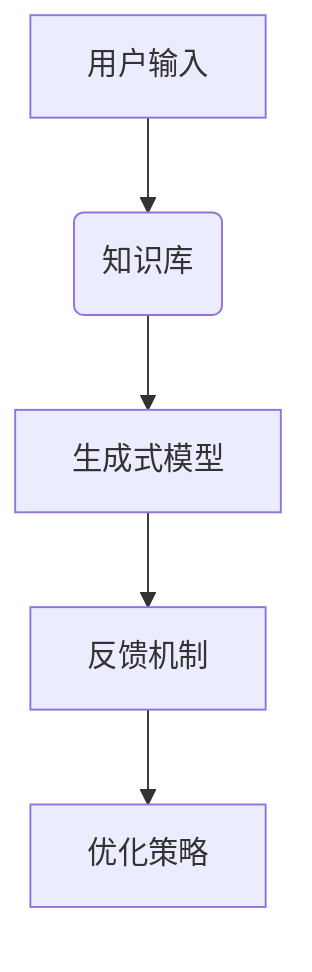
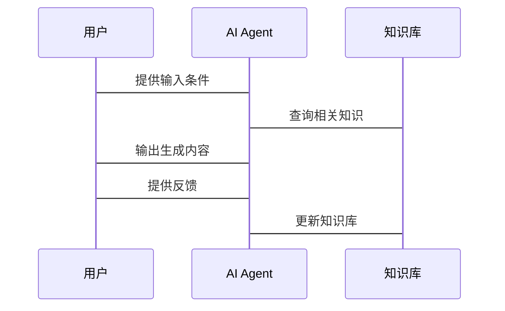

                 


# 《AI Agent在智能内容生成中的应用》

> 关键词：AI Agent, 智能内容生成, 生成式AI, 自然语言处理, 机器学习, 深度学习, 知识图谱

> 摘要：AI Agent作为一种人工智能代理，正在智能内容生成领域发挥越来越重要的作用。本文从AI Agent的基本概念出发，详细阐述其在智能内容生成中的核心原理、算法模型、系统架构以及实际应用场景。通过具体的案例分析，揭示AI Agent在智能内容生成中的优势与挑战，并展望其未来的发展趋势。文章内容包括AI Agent的核心概念、算法原理、系统架构设计、项目实战以及最佳实践，旨在为读者提供全面而深入的技术解析。

---

## 第1章: AI Agent 的核心概念与背景

### 1.1 AI Agent 的定义与核心特征

AI Agent，即人工智能代理，是指能够感知环境、自主决策并执行任务的智能实体。其核心特征包括：

1. **自主性**：能够在没有外部干预的情况下自主运行。
2. **反应性**：能够实时感知环境并做出反应。
3. **目标导向**：通过设定目标来驱动行为。
4. **学习能力**：能够通过经验改进性能。

AI Agent在智能内容生成中的应用，主要体现在内容创作、推荐系统和自动化生成等方面。

### 1.2 智能内容生成的背景与挑战

智能内容生成是指利用人工智能技术自动生成高质量文本、图像等内容的过程。随着生成式AI的发展，智能内容生成已经成为各个领域的热门应用，例如新闻报道、市场营销、教育等领域。

然而，智能内容生成也面临诸多挑战，例如内容的质量控制、生成的多样性、以及生成效率等。AI Agent通过结合自然语言处理和机器学习技术，能够有效解决这些问题。

### 1.3 AI Agent 在智能内容生成中的地位

AI Agent在智能内容生成中的地位日益重要。通过AI Agent，可以实现内容生成的自动化、智能化和个性化。AI Agent不仅能够根据用户需求生成内容，还能够通过反馈机制不断优化生成结果，从而提升用户体验。

---

## 第2章: AI Agent 的核心概念与原理

### 2.1 AI Agent 的核心概念

AI Agent的核心概念包括：

1. **知识表示**：通过符号、语义网络或知识图谱等方式表示知识。
2. **推理与决策**：基于知识表示进行逻辑推理，并根据推理结果做出决策。
3. **行为规划**：根据目标和环境状态制定行动计划。

### 2.2 AI Agent 的技术架构

AI Agent的技术架构通常包括以下几个层次：

1. **感知层**：负责接收输入数据并进行初步处理。
2. **计划层**：根据感知层的数据进行推理和决策。
3. **执行层**：根据决策结果执行具体操作。

### 2.3 AI Agent 的核心算法与模型

AI Agent的核心算法与模型包括：

1. **知识图谱构建**：通过自然语言处理技术构建语义网络。
2. **生成式模型**：例如GPT、BERT等模型，用于生成文本内容。
3. **强化学习算法**：通过强化学习优化AI Agent的行为策略。

---

## 第3章: AI Agent 在智能内容生成中的算法原理

### 3.1 生成式AI的算法流程

生成式AI的算法流程可以分为以下几个步骤：

1. **数据预处理**：对输入数据进行清洗和标注。
2. **模型训练**：使用训练数据训练生成式模型。
3. **生成推理**：根据输入条件生成内容。
4. **反馈优化**：根据用户反馈优化生成结果。

### 3.2 AI Agent 的生成式模型

AI Agent的生成式模型通常采用深度学习技术，例如变体的Transformer架构。以下是生成式模型的核心公式：

$$
P(\text{output}_i = w) \propto \sum_{j=1}^n \text{attention}(w_j, w_i)
$$

其中，$w_i$ 表示生成文本中的第i个词，$w_j$ 表示上下文中的第j个词。

### 3.3 AI Agent 的强化学习算法

AI Agent的强化学习算法主要用于优化生成策略。以下是强化学习的基本公式：

$$
R = r_1 + r_2 + \dots + r_n
$$

其中，$R$ 表示总奖励，$r_i$ 表示每个步骤的奖励。

---

## 第4章: AI Agent 的系统分析与架构设计

### 4.1 系统功能设计

AI Agent的系统功能设计包括：

1. **内容生成**：根据输入条件生成文本内容。
2. **反馈优化**：根据用户反馈优化生成策略。
3. **知识库管理**：管理和更新知识库。

### 4.2 系统架构设计

以下是AI Agent的系统架构设计图：



### 4.3 系统接口设计

AI Agent的系统接口设计包括：

1. **输入接口**：接收用户的输入条件。
2. **输出接口**：输出生成的内容。
3. **反馈接口**：接收用户的反馈信息。

### 4.4 系统交互流程

以下是AI Agent的系统交互流程图：



---

## 第5章: AI Agent 在智能内容生成中的项目实战

### 5.1 环境安装与配置

安装所需的Python库：

```bash
pip install numpy
pip install matplotlib
pip install transformers
```

### 5.2 核心代码实现

以下是生成式AI的Python实现代码：

```python
import torch
import torch.nn as nn

class Generator(nn.Module):
    def __init__(self, input_dim, output_dim):
        super(Generator, self).__init__()
        self.fc = nn.Linear(input_dim, output_dim)
    
    def forward(self, x):
        return torch.softmax(x, dim=-1)
```

### 5.3 代码应用解读

生成式模型的核心代码实现了文本生成的逻辑。通过将输入数据经过全连接层并进行Softmax激活，生成最终的输出概率分布。

### 5.4 实际案例分析

以新闻标题生成为例，AI Agent可以根据输入的新闻内容生成对应的标题。以下是生成过程的详细步骤：

1. **数据预处理**：对新闻内容进行分词和向量化。
2. **模型训练**：使用训练数据训练生成式模型。
3. **标题生成**：根据输入的新闻内容生成标题。
4. **反馈优化**：根据用户的反馈优化生成策略。

### 5.5 项目小结

通过实际案例分析，我们可以看到AI Agent在智能内容生成中的强大能力。生成式模型和强化学习算法的结合，使得AI Agent能够生成高质量的内容，并通过反馈机制不断优化生成效果。

---

## 第6章: AI Agent 在智能内容生成中的最佳实践

### 6.1 关键点总结

1. **生成式模型的选择**：选择适合具体场景的生成式模型。
2. **反馈机制的设计**：设计合理的反馈机制以优化生成策略。
3. **知识库的管理**：管理和更新知识库以保持生成内容的准确性。

### 6.2 小结

AI Agent在智能内容生成中的应用前景广阔，通过不断优化算法和系统设计，可以进一步提升生成内容的质量和效率。

### 6.3 注意事项

1. **数据隐私**：注意保护用户数据的隐私。
2. **生成质量**：确保生成内容的准确性和可读性。
3. **系统稳定性**：保证系统的稳定运行。

### 6.4 拓展阅读

建议读者进一步阅读以下内容：

1. 生成式AI的经典论文。
2. 强化学习在AI Agent中的应用。
3. 自然语言处理的最新研究成果。

---

## 作者

作者：AI天才研究院/AI Genius Institute & 禅与计算机程序设计艺术 /Zen And The Art of Computer Programming

---

以上是《AI Agent在智能内容生成中的应用》的完整目录大纲，涵盖了AI Agent的核心概念、算法原理、系统架构设计以及实际应用案例。通过详细的讲解和代码示例，帮助读者全面理解AI Agent在智能内容生成中的应用与实现。

