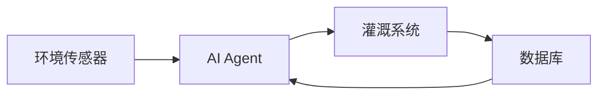
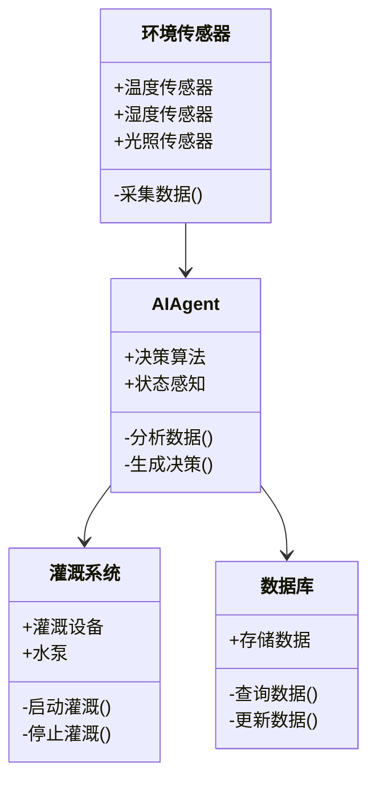
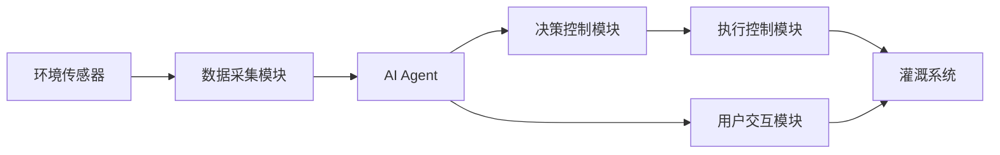
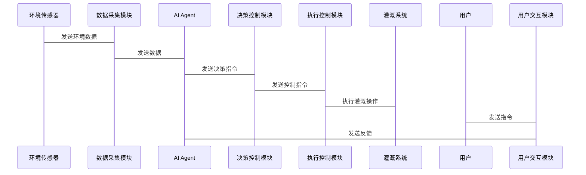

                 


# AI Agent在智能农业灌溉系统中的实践

> 关键词：AI Agent，智能农业，农业灌溉系统，强化学习，监督学习，农业智能化

> 摘要：本文将详细探讨AI Agent在智能农业灌溉系统中的实践应用。通过分析农业灌溉系统中的问题与挑战，介绍AI Agent的核心概念、算法原理、系统架构及实际项目案例。文章从背景介绍到系统设计，从算法实现到实际应用，逐步展开，旨在为读者提供一个全面、系统的技术视角，帮助理解AI Agent在农业灌溉系统中的重要作用与实现方式。

---

## 第一部分：AI Agent与智能农业灌溉系统概述

### 第1章：AI Agent与智能农业灌溉系统概述

#### 1.1 AI Agent的基本概念

AI Agent（智能体）是指在计算机系统中能够感知环境并采取行动以实现目标的实体。它具备以下特点：
- **自主性**：能够在没有外部干预的情况下自主决策。
- **反应性**：能够根据环境的变化调整自己的行为。
- **目标导向**：通过优化目标函数来实现特定目标。
- **学习能力**：能够通过数据和经验不断优化自身的决策能力。

AI Agent的核心功能包括：
1. **感知环境**：通过传感器收集环境数据（如土壤湿度、天气状况等）。
2. **决策判断**：基于收集的数据，利用算法进行分析和决策。
3. **执行操作**：根据决策结果执行相应的操作（如开启或关闭灌溉设备）。

#### 1.2 智能农业灌溉系统的背景与现状

传统农业灌溉系统存在以下问题：
1. **水资源浪费**：由于缺乏智能化的控制，灌溉系统常常无法根据实际需求进行精确调节，导致水资源浪费。
2. **人工干预过多**：传统灌溉系统需要大量人工操作，效率低下且成本高昂。
3. **环境适应性差**：传统系统难以适应复杂的环境变化，如气候变化和土壤条件的变化。

随着人工智能技术的发展，AI Agent逐渐被应用于农业灌溉系统中，通过智能化的感知、决策和执行，优化灌溉过程，提高水资源利用效率，降低人工成本。

#### 1.3 AI Agent在农业灌溉中的问题背景

AI Agent在农业灌溉中的应用背景可以总结为以下几个方面：
1. **资源优化**：通过AI Agent的智能决策，实现水资源的高效利用，减少浪费。
2. **环境适应**：AI Agent能够实时感知环境变化（如天气、土壤湿度等），并根据这些信息动态调整灌溉策略。
3. **成本降低**：通过自动化操作和优化决策，减少人工干预，降低运营成本。

---

## 第二部分：AI Agent的核心概念与原理

### 第2章：AI Agent的核心概念与联系

#### 2.1 AI Agent的核心概念

AI Agent的核心概念可以分解为以下几个方面：
1. **感知层**：通过传感器等设备感知环境信息。
2. **决策层**：利用算法对感知到的信息进行分析和判断，生成决策。
3. **执行层**：根据决策结果执行相应的操作。

#### 2.2 AI Agent的核心原理

AI Agent的核心原理主要基于以下两种学习方式：
1. **强化学习**：通过与环境的交互，不断优化自身的决策策略，以达到最大化目标函数的效果。
2. **监督学习**：通过大量的标注数据，训练模型进行分类或回归任务，从而实现对环境的准确感知和判断。

#### 2.3 AI Agent的核心属性对比

以下是不同AI Agent在感知、决策和执行能力上的对比：

| 属性        | 强化学习AI Agent | 监督学习AI Agent |
|-------------|------------------|------------------|
| 感知能力     | 高               | 中               |
| 决策能力     | 高               | 低               |
| 执行能力     | 高               | 中               |

#### 2.4 AI Agent的实体关系图

以下是AI Agent在农业灌溉系统中的实体关系图：



---

## 第三部分：AI Agent在农业灌溉中的算法原理

### 第3章：AI Agent的核心算法原理

#### 3.1 强化学习算法原理

强化学习是一种通过试错方式来优化决策策略的算法。以下是强化学习的基本流程：

1. **初始化**：设定初始状态和目标函数。
2. **感知环境**：通过传感器收集环境信息。
3. **决策选择**：根据当前状态，选择一个动作（如开启或关闭灌溉设备）。
4. **执行动作**：将选择的动作发送给灌溉系统执行。
5. **获取反馈**：观察环境变化，并获得奖励或惩罚信号。
6. **优化策略**：根据反馈调整决策策略，以最大化目标函数。

以下是强化学习的数学模型：

$$ R = r(s, a) $$
$$ s' = f(s, a) $$
$$ Q(s, a) = Q(s, a) + \alpha (r + \gamma Q(s', a') - Q(s, a)) $$

其中：
- \( R \)：奖励函数。
- \( s \)：当前状态。
- \( a \)：选择的动作。
- \( s' \)：执行动作后的新的状态。
- \( Q(s, a) \)：状态-动作值函数。
- \( \alpha \)：学习率。
- \( \gamma \)：折扣因子。

#### 3.2 监督学习算法原理

监督学习是一种通过标注数据训练模型的算法。以下是监督学习的基本流程：

1. **数据收集**：收集大量的标注数据（如土壤湿度、天气状况等）。
2. **特征提取**：对数据进行特征提取和预处理。
3. **模型训练**：利用训练数据训练模型，使其能够准确预测目标值。
4. **模型评估**：通过测试数据评估模型的性能。
5. **模型部署**：将训练好的模型部署到实际系统中进行预测和决策。

以下是监督学习的数学模型：

$$ y = f(x) $$
$$ L = \sum_{i=1}^{n} (y_i - \hat{y}_i)^2 $$ $$

其中：
- \( y \)：目标值。
- \( x \)：输入特征。
- \( f(x) \)：预测函数。
- \( L \)：损失函数。

---

## 第四部分：AI Agent在农业灌溉中的系统架构

### 第4章：AI Agent的核心系统架构

#### 4.1 系统功能设计

以下是智能农业灌溉系统的功能模块：

1. **数据采集模块**：通过传感器采集环境数据（如土壤湿度、温度、光照强度等）。
2. **决策控制模块**：利用AI算法对数据进行分析，生成灌溉策略。
3. **执行控制模块**：根据决策结果控制灌溉设备的启停。
4. **用户交互模块**：提供人机交互界面，方便用户查看和调整系统设置。

以下是系统的领域模型类图：



#### 4.2 系统架构设计

以下是智能农业灌溉系统的架构图：



#### 4.3 系统接口设计

以下是系统的接口设计：

1. **数据采集接口**：用于接收环境传感器的数据。
2. **决策控制接口**：用于接收AI Agent的决策指令。
3. **执行控制接口**：用于控制灌溉设备的启停。
4. **用户交互接口**：用于用户与系统的交互。

#### 4.4 系统交互流程图

以下是系统的交互流程图：



---

## 第五部分：AI Agent在农业灌溉中的项目实战

### 第5章：AI Agent的核心实现与案例分析

#### 5.1 环境安装

以下是环境安装步骤：

1. **安装Python**：建议使用Python 3.8及以上版本。
2. **安装依赖库**：安装必要的库，如`numpy`、`pandas`、`scikit-learn`等。

```bash
pip install numpy pandas scikit-learn
```

#### 5.2 核心代码实现

以下是AI Agent的核心代码实现：

```python
import numpy as np
from sklearn import linear_model

# 数据预处理
X = np.array([[temperature, humidity, light], ...])
y = np.array([target_value, ...])

# 模型训练
model = linear_model.LinearRegression()
model.fit(X, y)

# 模型预测
predicted = model.predict(new_data)
```

#### 5.3 案例分析

以下是AI Agent在农业灌溉系统中的实际案例分析：

1. **数据收集**：通过传感器收集土壤湿度、温度、光照强度等数据。
2. **数据分析**：利用AI算法分析数据，生成灌溉策略。
3. **系统控制**：根据决策结果，控制灌溉设备的启停。
4. **效果评估**：评估灌溉效果，优化系统参数。

---

## 第六部分：AI Agent在农业灌溉中的最佳实践

### 第6章：AI Agent的最佳实践与总结

#### 6.1 小结

本文详细介绍了AI Agent在智能农业灌溉系统中的实践应用，包括AI Agent的核心概念、算法原理、系统架构和实际项目案例。通过AI Agent的智能化感知、决策和执行能力，可以显著提高农业灌溉系统的效率和效果。

#### 6.2 注意事项

在实际应用中，需要注意以下几点：
1. **数据质量**：确保数据的准确性和完整性。
2. **模型优化**：根据实际需求不断优化模型参数。
3. **系统维护**：定期维护系统，确保设备正常运行。

#### 6.3 拓展阅读

1. **强化学习**：深入学习强化学习的原理和应用。
2. **监督学习**：进一步了解监督学习的算法和优化方法。
3. **系统设计**：研究更复杂的系统架构设计。

---

## 作者：AI天才研究院/AI Genius Institute & 禅与计算机程序设计艺术 /Zen And The Art of Computer Programming

---

**总结**：通过本文的详细讲解，读者可以全面了解AI Agent在智能农业灌溉系统中的实践应用，并能够将相关技术应用于实际项目中。

