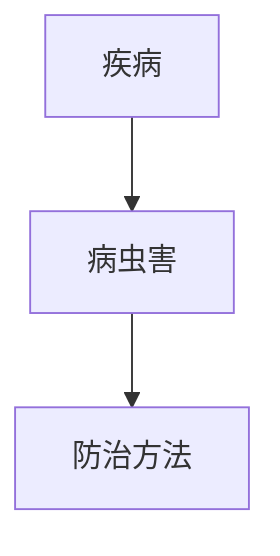
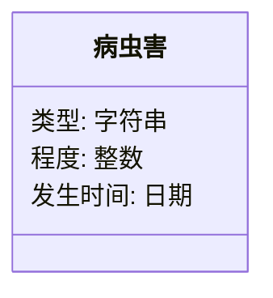
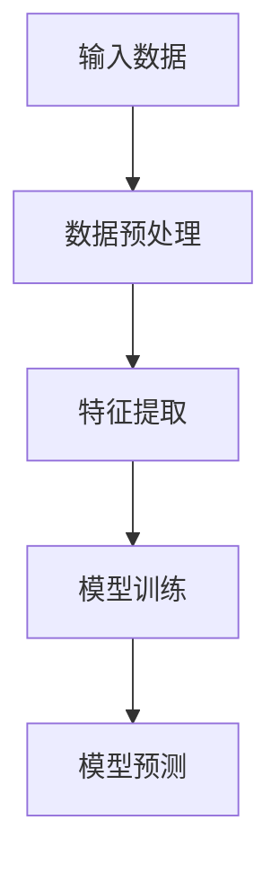
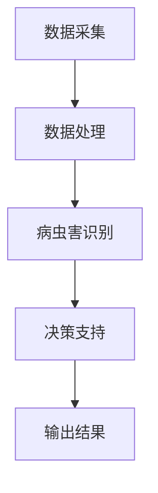

                 


---

# AI Agent在智能农业病虫害防控中的实践

> 关键词：AI Agent，智能农业，病虫害防控，多智能体系统，机器学习，农业优化

> 摘要：本文详细探讨了AI Agent在智能农业病虫害防控中的实践应用，从基础理论到算法实现，再到系统设计和项目实战，全面解析AI Agent如何助力农业病虫害的精准监测与防控，为农业智能化提供新的思路和解决方案。

---

# 第一部分：AI Agent与智能农业概述

# 第1章：AI Agent的基本概念与应用背景

## 1.1 AI Agent的定义与特点

### 1.1.1 AI Agent的定义
AI Agent（人工智能代理）是指在计算机系统中，能够感知环境、自主决策并执行任务的智能实体。它可以理解为一种能够独立完成特定任务的智能体。

### 1.1.2 AI Agent的特点
- **自主性**：AI Agent能够在没有外部干预的情况下自主完成任务。
- **反应性**：能够实时感知环境变化并做出反应。
- **学习能力**：通过数据和经验不断优化自身的决策能力。
- **协作性**：能够与其他AI Agent或人类进行协作，共同完成复杂任务。

### 1.1.3 AI Agent的核心技术
- **知识表示**：将知识以结构化的方式表示，以便AI Agent理解和推理。
- **推理与决策**：基于知识库和环境信息，进行逻辑推理和决策。
- **学习与优化**：通过机器学习算法不断优化自身的行为模式。

## 1.2 智能农业的定义与发展

### 1.2.1 智能农业的定义
智能农业是利用信息技术、物联网、大数据和人工智能等技术，实现农业生产的智能化、自动化和精准化。

### 1.2.2 智能农业的发展趋势
- **数据驱动**：通过传感器和物联网技术，实时采集农田数据。
- **智能化决策**：利用AI技术进行病虫害预测、作物管理等决策。
- **自动化操作**：通过智能设备实现农业生产的自动化。

## 1.3 AI Agent在农业中的应用背景

### 1.3.1 病虫害防控的传统方法
传统病虫害防控主要依赖人工观察和化学防治，存在效率低、成本高、环境污染等问题。

### 1.3.2 AI技术在农业病虫害防控中的优势
- **精准监测**：通过AI Agent实时监测农田环境，提前发现病虫害。
- **智能识别**：利用图像识别技术快速识别病虫害类型和严重程度。
- **决策支持**：基于AI算法提供最优的防治方案。

### 1.3.3 AI Agent在农业中的应用场景
- **病虫害早期预警**
- **精准施药与作物管理**
- **农业资源优化配置**

---

# 第二部分：AI Agent的核心技术与实现原理

# 第2章：多智能体系统与协作

## 2.1 多智能体系统的基本概念

### 2.1.1 多智能体系统的定义
多智能体系统是指由多个相互协作的智能体组成的系统，每个智能体都有自己的目标和任务。

### 2.1.2 多智能体系统的特点
- **分布式智能**：每个智能体独立运行，共同完成复杂任务。
- **协作性**：智能体之间通过通信和协作完成任务。
- **动态性**：系统能够适应环境的变化。

### 2.1.3 多智能体系统与单智能体系统的区别
| 特性 | 单智能体系统 | 多智能体系统 |
|------|--------------|--------------|
| 智能体数量 | 1            | 多            |
| 任务分配 | 单一任务      | 分布式任务    |
| 协作性  | 无            | 高            |

## 2.2 多智能体系统的实现原理

### 2.2.1 通信机制
- **直接通信**：智能体之间直接交换信息。
- **间接通信**：通过共享数据库或中间件进行通信。

### 2.2.2 任务分配与协调
- **任务分配**：根据智能体的能力和环境需求分配任务。
- **协调机制**：确保智能体之间的协作和资源共享。

### 2.2.3 冲突解决与优化
- **冲突检测**：识别智能体之间的冲突。
- **冲突解决**：通过协商或优先级机制解决冲突。

## 2.3 多智能体系统在农业病虫害防控中的应用

### 2.3.1 多智能体系统在病虫害监测中的应用
- **分布式监测**：多个智能传感器协同工作，覆盖大面积农田。
- **数据融合**：将多个传感器的数据进行融合，提高监测精度。

### 2.3.2 多智能体系统在农业决策支持中的应用
- **协同决策**：多个智能体共同分析数据，提供最优决策方案。
- **动态调整**：根据环境变化实时调整决策策略。

### 2.3.3 多智能体系统在精准农业中的应用
- **精准施药**：根据病虫害分布情况，精准喷洒农药。
- **资源优化**：合理分配农业资源，提高生产效率。

---

# 第三部分：AI Agent的算法原理与数学模型

# 第3章：知识表示与推理

## 3.1 知识表示的基本概念

### 3.1.1 知识表示的形式
- **语义网络**：通过节点和边表示知识。
- **框架表示**：通过对象和属性表示知识。

### 3.1.2 知识表示的语义网络与框架表示

#### 语义网络示例


#### 框架表示示例


## 3.2 知识表示的推理与应用

### 3.2.1 推理的基本概念
- **推理**：基于已有的知识，推导出新的结论。
- **推理类型**：包括演绎推理、归纳推理和默认推理。

### 3.2.2 知识表示的推理应用
- **病虫害诊断**：基于病虫害的症状和环境数据，推断出病虫害的类型和原因。
- **决策支持**：基于推理结果，提供防治建议。

---

# 第四部分：AI Agent在病虫害防控中的实践应用

# 第4章：AI Agent的算法实现

## 4.1 机器学习算法在病虫害识别中的应用

### 4.1.1 支持向量机（SVM）算法
- **原理**：通过构建超平面，将数据分为不同的类别。
- **数学模型**：$$ \text{目标函数} = \sum_{i=1}^n \alpha_i y_i \cdot \text{sign}(w \cdot x_i + b) $$

### 4.1.2 算法实现流程


## 4.2 算法实现的代码示例

### 4.2.1 SVM算法实现
```python
from sklearn import svm

# 创建训练数据
X_train = [[1, 1], [0, 0], [1, 0], [0, 1]]
y_train = [1, 0, 0, 0]

# 训练模型
model = svm.SVC()
model.fit(X_train, y_train)

# 预测
X_test = [[1, 1], [0, 0]]
y_test = model.predict(X_test)
print(y_test)  # 输出：[1, 0]
```

---

# 第五部分：系统设计与实现

# 第5章：AI Agent系统的架构设计

## 5.1 系统功能设计

### 5.1.1 系统功能模块
- **数据采集模块**：采集农田环境数据。
- **病虫害识别模块**：识别病虫害类型和程度。
- **决策支持模块**：提供防治建议。

### 5.1.2 系统功能流程


## 5.2 系统架构设计

### 5.2.1 系统架构图
```mermaid
classDiagram
class 病虫害识别系统 {
    数据采集模块
    数据处理模块
    识别模块
    决策模块
}

病虫害识别系统 -> 数据采集模块: 采集数据
病虫害识别系统 -> 数据处理模块: 处理数据
病虫害识别系统 -> 识别模块: 识别病虫害
病虫害识别系统 -> 决策模块: 提供决策
```

---

# 第六部分：项目实战与优化

# 第6章：AI Agent在病虫害防控中的项目实战

## 6.1 项目环境搭建

### 6.1.1 开发工具安装
- **Python**：安装Python 3.x
- **库的安装**：安装scikit-learn、OpenCV等库。

## 6.2 核心代码实现

### 6.2.1 病虫害识别模块实现
```python
import cv2
import numpy as np

# 读取图像
img = cv2.imread('insect.jpg')

# 转换为灰度图
gray = cv2.cvtColor(img, cv2.COLOR_BGR2GRAY)

# 使用SVM进行分类
# （假设X_train和y_train已经训练好）
result = model.predict(gray.reshape(-1, gray.size))
print(result)
```

## 6.3 项目优化与扩展

### 6.3.1 系统优化
- **数据优化**：增加数据的多样性和质量。
- **算法优化**：尝试不同的算法，如随机森林、神经网络等。

### 6.3.2 系统扩展
- **移动端应用**：开发手机App，方便农民使用。
- **云平台集成**：将系统部署到云平台，实现远程监控。

---

# 第七部分：总结与展望

## 7.1 本章总结
本文详细介绍了AI Agent在智能农业病虫害防控中的应用，从基础理论到算法实现，再到系统设计和项目实战，全面解析了AI Agent在农业中的重要性。

## 7.2 未来展望
随着AI技术的不断发展，AI Agent在农业中的应用将更加广泛和深入。未来的研究方向包括更高效的算法、更智能的系统架构以及更广泛的应用场景。

---

# 作者

作者：AI天才研究院/AI Genius Institute  
联系邮箱：[contact@aiagent.com](mailto:contact@aiagent.com)  
GitHub：[https://github.com/AI-Genius-Institute](https://github.com/AI-Genius-Institute)  

---

