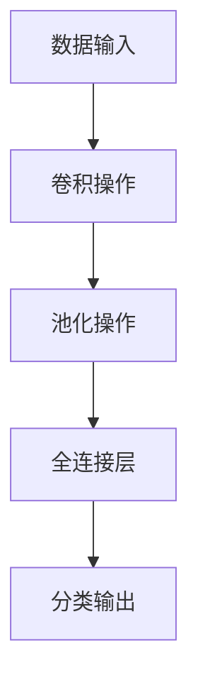
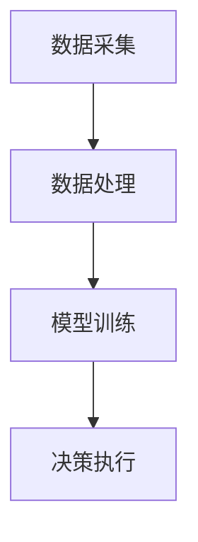
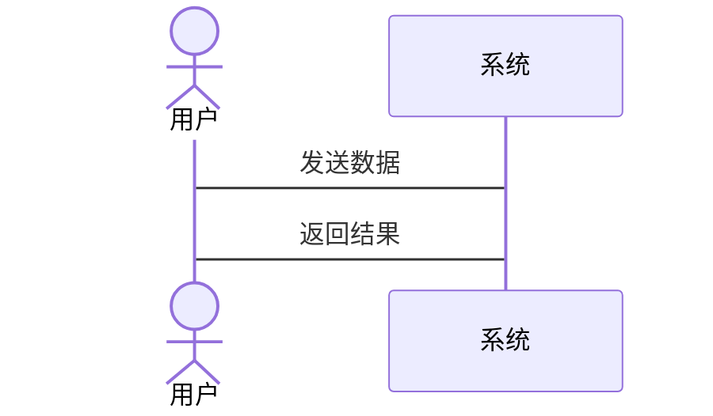

                 


# AI Agent在智能农业病虫害防控中的应用

> 关键词：AI Agent，智能农业，病虫害防控，算法原理，系统架构

> 摘要：本文深入探讨AI Agent在智能农业病虫害防控中的应用，从背景介绍、核心概念、算法原理到系统设计和项目实战，系统地分析了AI Agent在农业病虫害防控中的潜力和实现方法。通过详细的技术解析和实际案例，展示了如何利用AI Agent技术提升农业病虫害防控的效率和精准度。

---

## 第一部分: 背景介绍

### 第1章: 问题背景

#### 1.1 病虫害对农业的危害
农业是人类生存和发展的基础，但病虫害却严重威胁着农作物的产量和质量。据统计，全球每年因病虫害导致的农业损失高达数千亿美元。传统的病虫害防控方法效率低下，且难以应对复杂多变的病虫害情况。

#### 1.2 传统病虫害防控的局限性
传统病虫害防控主要依赖人工观察和化学农药喷洒。这种方法不仅成本高、效率低，还可能导致环境污染和农药残留问题。此外，病虫害的种类繁多，传统的防控手段难以实现精准识别和高效应对。

#### 1.3 AI Agent在农业中的潜力
AI Agent（人工智能代理）是一种能够自主感知环境、做出决策并采取行动的智能体。在农业领域，AI Agent可以通过实时监测、数据分析和智能决策，帮助农民更高效地进行病虫害防控。AI Agent的应用可以显著提高病虫害防控的精准度和效率，减少资源浪费和环境污染。

### 第2章: 问题描述

#### 2.1 病虫害防控的复杂性
病虫害的种类繁多，且其发生和发展受多种因素影响，如气候、土壤条件、植物生长阶段等。传统的病虫害防控方法难以应对这种复杂性。

#### 2.2 现有技术的不足
现有的病虫害防控技术主要依赖人工经验和简单的自动化设备。这些方法在面对复杂的病虫害情况时显得力不从心，难以实现精准识别和快速响应。

#### 2.3 AI Agent的应用场景
AI Agent可以在农业病虫害防控的各个环节中发挥作用，如实时监测、病虫害识别、决策支持和自动化防控。通过AI Agent，农民可以更快速、准确地识别病虫害，制定科学的防控策略。

### 第3章: 问题解决

#### 3.1 AI Agent的核心优势
AI Agent具有强大的数据处理能力和智能决策能力。它可以实时分析大量的农业数据，识别潜在的病虫害风险，并提出最优的防控方案。

#### 3.2 AI Agent在病虫害防控中的具体应用
AI Agent可以通过图像识别技术识别病虫害的早期症状，通过数据分析预测病虫害的发生趋势，并通过自动化设备进行精准喷洒，减少农药的使用。

#### 3.3 系统化解决方案的提出
为了实现AI Agent在病虫害防控中的应用，需要构建一个完整的系统。该系统包括数据采集、数据分析、决策支持和执行反馈等环节。

### 第4章: 边界与外延

#### 4.1 系统边界
AI Agent在病虫害防控中的应用需要与农业环境、农作物种类和病虫害类型等因素相结合。系统边界包括数据输入、模型训练和决策输出等部分。

#### 4.2 相关领域的联系
AI Agent的应用不仅涉及农业领域，还与计算机视觉、机器学习、物联网等技术密切相关。这些技术的结合可以进一步提升AI Agent的功能和性能。

#### 4.3 技术的局限性与未来发展方向
尽管AI Agent在病虫害防控中具有巨大的潜力，但目前仍面临数据不足、模型泛化能力差等问题。未来的发展方向包括提高数据质量和模型的泛化能力，以及与其他技术的深度融合。

### 第5章: 概念结构与核心要素组成

#### 5.1 AI Agent的核心要素
AI Agent的核心要素包括感知能力、决策能力、执行能力和学习能力。这些能力共同构成了AI Agent在病虫害防控中的应用基础。

#### 5.2 病虫害防控系统的主要组成部分
病虫害防控系统包括数据采集模块、数据处理模块、模型训练模块和决策执行模块。这些模块协同工作，实现病虫害的实时监测和精准防控。

#### 5.3 系统的输入输出关系
系统的输入包括农业环境数据、农作物生长数据和病虫害监测数据。系统的输出包括病虫害风险评估、防控策略和执行反馈。

---

## 第二部分: 核心概念与联系

### 第6章: 核心概念原理

#### 6.1 AI Agent的定义与特征
AI Agent是一种能够自主感知环境、做出决策并采取行动的智能体。其核心特征包括自主性、反应性、目标导向性和学习能力。

#### 6.2 知识图谱的构建与应用
知识图谱是将实体及其关系以结构化形式表示的知识库。在病虫害防控中，知识图谱可以用于存储病虫害的特征、传播途径和防控方法等信息。

#### 6.3 多模态数据处理机制
多模态数据处理机制是指同时处理多种类型的数据（如图像、文本、传感器数据等）的能力。在病虫害防控中，多模态数据处理机制可以提高识别的准确性和全面性。

### 第7章: 概念属性特征对比表格

| 概念       | 特性               | 描述                               |
|------------|--------------------|------------------------------------|
| AI Agent   | 智能性             | 能够自主学习和决策                 |
| 知识图谱    | 结构化表达         | 用于表示实体及其关系               |
| 多模态数据  | 综合性             | 包括图像、文本、传感器数据等多种形式 |

### 第8章: ER实体关系图架构

```mermaid
er
actor(AI Agent,
       [可以处理多种类型的数据],
       [能够自主学习和决策],
       [能够进行实时监测和预测]
       )
```

---

## 第三部分: 算法原理讲解

### 第9章: 算法原理

#### 9.1 卷积神经网络（CNN）
卷积神经网络是一种常用的图像识别算法。通过多层卷积操作，CNN可以提取图像中的特征，并进行分类。

#### 9.2 循环神经网络（RNN）
循环神经网络适用于处理序列数据。在病虫害防控中，RNN可以用于时间序列数据分析，预测病虫害的发生趋势。

#### 9.3 算法流程图


#### 9.4 算法实现代码
```python
import tensorflow as tf
from tensorflow.keras import layers

model = tf.keras.Sequential([
    layers.Conv2D(32, (3,3), activation='relu', input_shape=(224, 224, 3)),
    layers.MaxPooling2D((2,2)),
    layers.Conv2D(64, (3,3), activation='relu'),
    layers.MaxPooling2D((2,2)),
    layers.Flatten(),
    layers.Dense(64, activation='relu'),
    layers.Dense(10, activation='softmax')
])
```

#### 9.5 数学模型和公式
卷积层的数学模型如下：
$$
y_{i,j} = \sum_{k=1}^{n} w_{k} \cdot x_{i+k,j+l}
$$
其中，\( w_k \) 是卷积核的权重，\( x_{i+k,j+l} \) 是输入数据。

---

## 第四部分: 系统分析与架构设计方案

### 第10章: 系统架构设计

#### 10.1 问题场景介绍
病虫害防控系统需要实时监测农田中的病虫害情况，并根据监测数据做出决策。

#### 10.2 系统功能设计
系统功能包括数据采集、数据处理、模型训练和决策执行。

#### 10.3 系统架构图


#### 10.4 系统接口设计
系统接口包括数据采集接口、模型训练接口和决策执行接口。

#### 10.5 系统交互流程图


---

## 第五部分: 项目实战

### 第11章: 项目实战

#### 11.1 环境搭建
需要安装Python、TensorFlow和相关库。

#### 11.2 核心代码实现
```python
import tensorflow as tf
from tensorflow.keras import layers

model = tf.keras.Sequential([
    layers.Conv2D(32, (3,3), activation='relu', input_shape=(224, 224, 3)),
    layers.MaxPooling2D((2,2)),
    layers.Conv2D(64, (3,3), activation='relu'),
    layers.MaxPooling2D((2,2)),
    layers.Flatten(),
    layers.Dense(64, activation='relu'),
    layers.Dense(10, activation='softmax')
])
```

#### 11.3 实际案例分析
通过实际案例分析，展示AI Agent在病虫害防控中的应用效果。

#### 11.4 项目总结
总结项目实现的过程和成果，提出改进建议。

---

## 第六部分: 最佳实践

### 第12章: 最佳实践

#### 12.1 小结
AI Agent在病虫害防控中的应用具有重要意义，可以显著提高防控的效率和精准度。

#### 12.2 注意事项
在实际应用中，需要注意数据质量、模型泛化能力和系统的可扩展性。

#### 12.3 拓展阅读
推荐相关书籍和论文，供读者进一步学习。

---

## 作者：AI天才研究院/AI Genius Institute & 禅与计算机程序设计艺术/Zen And The Art of Computer Programming

