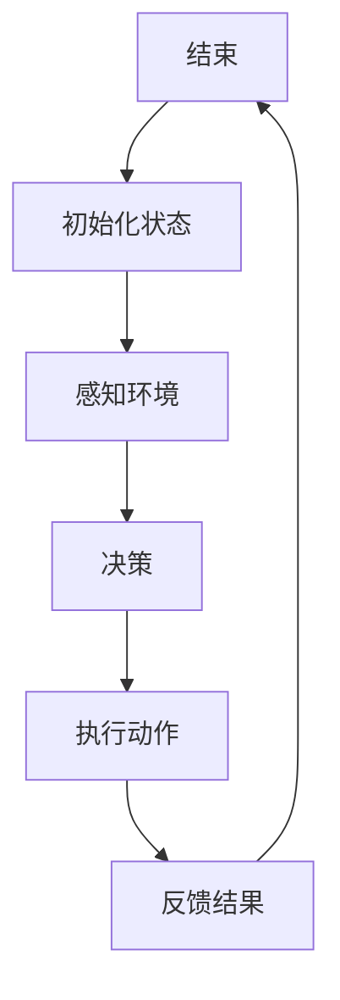

                 


# AI Agent在智能农业规划中的实践

> **关键词**：AI Agent，智能农业，农业规划，强化学习，机器学习，农业优化

> **摘要**：  
本文系统地探讨了AI Agent在智能农业规划中的应用与实践。首先，我们从AI Agent的基本概念和农业规划的背景出发，分析了AI Agent在农业中的潜力。接着，详细介绍了AI Agent的核心概念、算法原理及其在农业规划中的数学模型。随后，我们从系统架构的角度，设计了一个基于AI Agent的农业规划系统，并通过实际案例展示了系统的实现与优化。最后，我们总结了AI Agent在智能农业规划中的优势与挑战，并提出了未来的研究方向。

---

## 第一部分: AI Agent与智能农业规划的背景与基础

### 第1章: AI Agent与智能农业规划概述

#### 1.1 AI Agent的基本概念

- **1.1.1 人工智能代理（AI Agent）的定义**  
  AI Agent（人工智能代理）是指能够感知环境、做出决策并执行行动的智能实体。它能够通过与环境交互，优化自身的行为以实现特定目标。

- **1.1.2 AI Agent的核心特征与分类**  
  AI Agent的核心特征包括自主性、反应性、目标导向性和学习能力。根据智能水平，AI Agent可以分为简单反射型、基于模型的反射型、目标驱动型和实用驱动型。

- **1.1.3 AI Agent在农业中的应用潜力**  
  在农业中，AI Agent可以用于作物种植优化、资源分配、天气预测、病虫害监测等领域，帮助农民提高生产效率并降低成本。

#### 1.2 智能农业规划的背景与挑战

- **1.2.1 现代农业的发展趋势**  
  现代农业正朝着智能化、数字化和可持续化的方向发展，AI技术的应用成为推动农业现代化的重要力量。

- **1.2.2 农业规划中的关键问题**  
  农业规划面临资源分配不均、天气不可预测、病虫害频发等问题，传统的规划方法难以应对复杂的动态环境。

- **1.2.3 AI Agent在农业规划中的作用**  
  AI Agent能够通过实时感知环境、优化决策并执行行动，帮助农民解决复杂问题，实现农业生产的智能化和精准化。

#### 1.3 本章小结  
本章介绍了AI Agent的基本概念及其在农业规划中的潜力，分析了农业规划的背景与挑战，为后续章节奠定了基础。

---

## 第二部分: AI Agent的核心概念与算法原理

### 第2章: AI Agent的核心概念与原理

#### 2.1 AI Agent的感知、决策与执行机制

- **2.1.1 感知模块：数据采集与特征提取**  
  感知模块通过传感器、摄像头等设备采集环境数据，并对数据进行特征提取，为决策提供依据。

- **2.1.2 决策模块：基于模型的策略选择**  
  决策模块基于感知数据，结合预设的模型或算法，生成最优策略。

- **2.1.3 执行模块：行动优化与反馈机制**  
  执行模块根据决策结果执行具体行动，并通过反馈机制优化后续行为。

#### 2.2 AI Agent的数学模型与算法基础

- **2.2.1 状态空间与动作空间的定义**  
  状态空间是环境所有可能的状态集合，动作空间是AI Agent在给定状态下可以执行的所有动作。

- **2.2.2 基于强化学习的AI Agent算法**  
  强化学习是一种通过试错机制优化决策的算法。经典的强化学习算法包括Q-Learning、Deep Q-Network（DQN）等。

- **2.2.3 深度学习在AI Agent中的应用**  
  深度学习通过神经网络模型学习复杂的环境特征，提升AI Agent的感知和决策能力。

#### 2.3 AI Agent的算法流程图



#### 2.4 本章小结  
本章详细介绍了AI Agent的核心概念与算法原理，为后续章节的系统设计与实现奠定了理论基础。

---

## 第三部分: AI Agent在农业规划中的数学模型与算法实现

### 第3章: 农业规划中的数学模型与算法

#### 3.1 农业规划问题的数学建模

- **3.1.1 农业资源优化配置模型**  
  通过数学模型优化土地、水资源的分配，提高农业生产效率。

- **3.1.2 农作物种植决策模型**  
  基于环境数据和市场信息，制定农作物种植计划。

- **3.1.3 农业风险评估模型**  
  评估自然灾害、病虫害等风险，制定应对策略。

#### 3.2 基于强化学习的AI Agent算法实现

- **3.2.1 强化学习算法（如Q-Learning）的数学模型**  
  $$ Q(s,a) = r + \gamma \max Q(s',a') $$  
  其中，$s$是当前状态，$a$是动作，$r$是奖励，$\gamma$是折扣因子。

- **3.2.2 算法实现步骤**  
  1. 初始化Q表。  
  2. 环境感知，获取当前状态$s$。  
  3. 根据策略选择动作$a$。  
  4. 执行动作，获取反馈，更新Q值。

- **3.2.3 算法的收敛性分析**  
  强化学习算法的收敛性取决于环境的马尔可夫性质和策略的稳定性。

#### 3.3 AI Agent在农业规划中的数学模型实现

- **3.3.1 状态空间的定义与表示**  
  状态空间可以包括天气、土壤湿度、作物生长阶段等特征。

- **3.3.2 动作空间的定义与表示**  
  动作空间可以包括浇水、施肥、调整灌溉等具体操作。

- **3.3.3 奖励函数的设计与实现**  
  奖励函数用于衡量AI Agent的行为是否符合目标，例如，$$ R = 0.5 \times 收益 + 0.5 \times 成本 $$

#### 3.4 本章小结  
本章通过数学建模和算法实现，展示了AI Agent在农业规划中的具体应用，为后续章节的系统设计提供了技术支持。

---

## 第四部分: AI Agent在农业规划中的系统架构与实现

### 第4章: 系统架构设计与实现

#### 4.1 农业规划系统的总体架构

- **4.1.1 系统功能模块划分**  
  系统主要包括数据采集模块、数据处理模块、AI Agent决策模块和执行模块。

- **4.1.2 系统架构图**  
  ```mermaid
  graph TD
      A[用户] --> B[数据采集模块]
      B --> C[数据处理模块]
      C --> D[AI Agent决策模块]
      D --> E[执行模块]
      E --> F[反馈模块]
      F --> A[用户]
  ```

#### 4.2 系统功能设计

- **4.2.1 数据采集模块**  
  通过传感器采集土壤湿度、温度、光照强度等数据。

- **4.2.2 数据处理模块**  
  对采集数据进行清洗、特征提取和预处理。

- **4.2.3 AI Agent决策模块**  
  基于强化学习算法生成最优决策。

- **4.2.4 执行模块**  
  根据决策结果执行具体操作，例如浇水、施肥等。

#### 4.3 系统实现与优化

- **4.3.1 环境安装**  
  安装Python、TensorFlow、Keras等开发环境。

- **4.3.2 核心代码实现**  
  ```python
  import numpy as np
  from collections import defaultdict

  class AI_Agent:
      def __init__(self, state_space, action_space):
          self.Q = defaultdict(lambda: np.zeros(len(action_space)))
          self.state_space = state_space
          self.action_space = action_space
          self.gamma = 0.99

      def get_action(self, state):
          q_values = self.Q[state]
          max_q_index = np.argmax(q_values)
          return self.action_space[max_q_index]

      def update_Q(self, state, action, reward, next_state):
          self.Q[state][action] = reward + self.gamma * np.max(self.Q[next_state])
  ```

- **4.3.3 案例分析**  
  以作物灌溉为例，通过AI Agent优化灌溉策略，减少水资源浪费。

#### 4.4 本章小结  
本章详细设计并实现了基于AI Agent的农业规划系统，展示了AI技术在农业中的实际应用价值。

---

## 第五部分: 总结与展望

### 第5章: 总结与展望

#### 5.1 总结  
本文系统地探讨了AI Agent在智能农业规划中的应用，从理论到实践，详细介绍了AI Agent的核心概念、算法原理、系统架构与实现。

#### 5.2 展望  
未来，随着AI技术的不断发展，AI Agent在农业中的应用将更加广泛和深入。我们需要进一步研究AI Agent的优化算法，探索其在农业自动化、智能化中的潜力。

#### 5.3 最佳实践 Tips  
- 在实际应用中，建议结合具体场景选择合适的AI算法。  
- 确保数据质量和多样性，以提高AI Agent的泛化能力。  
- 定期更新模型参数，以应对环境变化。

#### 5.4 本章小结  
本文总结了AI Agent在农业规划中的应用成果，并展望了未来的研究方向。

---

## 附录: 参考文献与拓展阅读

### 附录A: 参考文献

1. Russell, S., & Norvig, P. (2010). Artificial Intelligence: A Modern Approach.  
2. Sutton, R. S., & Barto, A. G. (2018). Reinforcement Learning: Theory and Algorithms.  
3. LeCun, Y., Bengio, Y., & Hinton, G. (2015). Deep Learning.

### 附录B: 拓展阅读

- 《机器学习实战》  
- 《强化学习：原理与应用》  
- 《智能农业：技术与实践》  

---

**作者：AI天才研究院/AI Genius Institute & 禅与计算机程序设计艺术 /Zen And The Art of Computer Programming**

