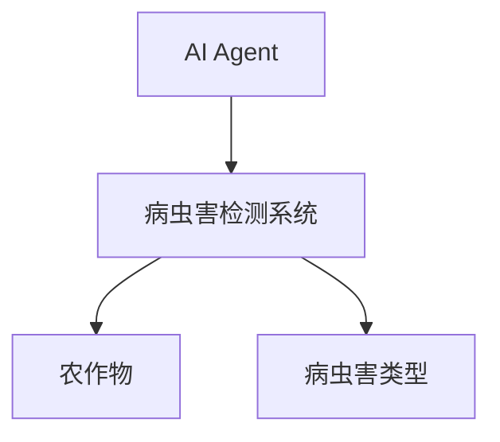
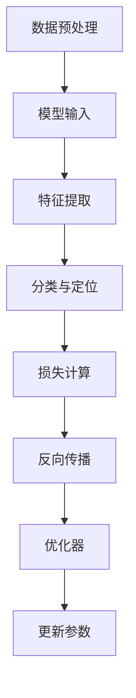
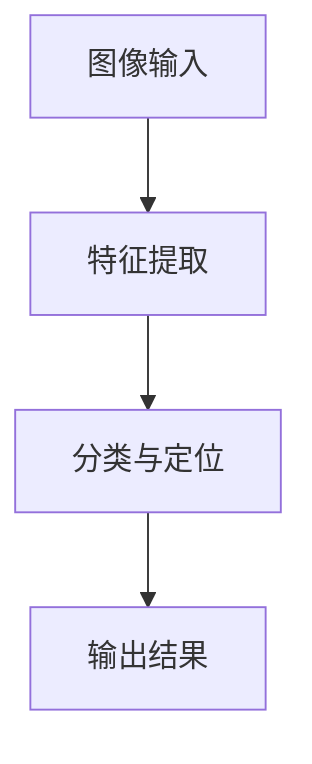
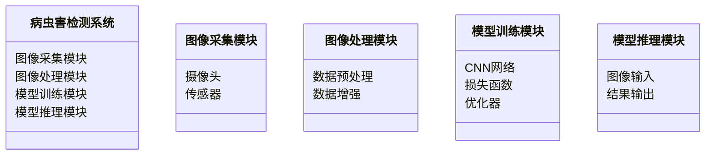
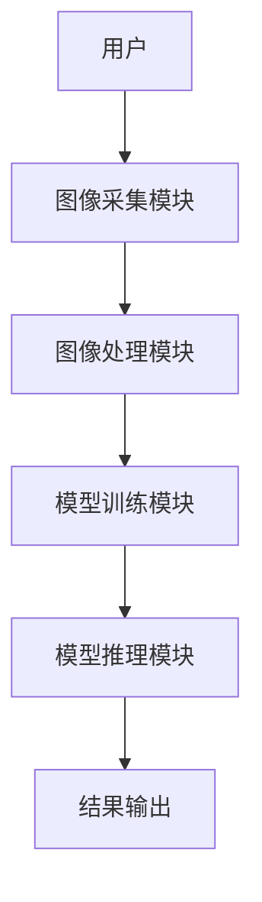
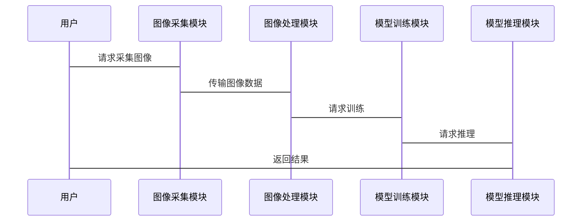

                 


# AI Agent在智能农作物病虫害检测中的实践

## 关键词：
AI Agent，农作物病虫害检测，目标检测，深度学习，计算机视觉

## 摘要：
本文详细探讨了AI Agent在农作物病虫害检测中的实践应用。首先介绍了AI Agent的基本概念及其在农业中的重要性，接着分析了病虫害检测的核心要素和AI Agent的工作原理。然后从算法原理、系统架构、项目实战等多个维度详细阐述了AI Agent在病虫害检测中的具体实现方法，包括数据预处理、模型训练与推理、系统设计等关键环节。最后，通过实际案例分析总结了AI Agent在农业病虫害检测中的优势与挑战，并提出了未来的发展方向。

---

# 第一部分: AI Agent与农作物病虫害检测的背景与概念

# 第1章: AI Agent与农作物病虫害检测的背景

## 1.1 AI Agent的基本概念
### 1.1.1 AI Agent的定义
AI Agent（人工智能代理）是指能够感知环境、自主决策并执行任务的智能实体。它通过接收输入信息（如图像、文本或传感器数据），利用算法进行分析和推理，最终输出决策或动作。

### 1.1.2 AI Agent的核心特征
AI Agent的核心特征包括：
- **自主性**：能够自主决策，无需人工干预。
- **反应性**：能够实时感知环境并做出反应。
- **学习能力**：通过数据和经验不断优化性能。
- **社交能力**：能够与其他系统或人类进行交互。

### 1.1.3 AI Agent与传统算法的区别
AI Agent与传统算法的区别主要体现在以下几个方面：
- **自主性**：AI Agent具有自主决策能力，而传统算法通常需要明确的规则和输入。
- **学习能力**：AI Agent可以通过机器学习不断优化性能，而传统算法通常不具备学习能力。
- **适应性**：AI Agent能够适应不同的环境和任务，而传统算法在任务变化时通常需要重新设计。

## 1.2 农作物病虫害检测的现状与挑战
### 1.2.1 病虫害对农业的影响
农作物病虫害是影响农业产量和质量的主要因素之一。据统计，全球每年因病虫害导致的农业损失高达数千亿美元。病虫害不仅会破坏农作物的生长，还会导致粮食短缺和经济损失。

### 1.2.2 传统病虫害检测方法的局限性
传统的病虫害检测方法主要包括人工观察和化学检测。这些方法存在以下局限性：
- **效率低下**：人工观察需要大量时间和人力资源。
- **精度有限**：化学检测方法可能会产生误报或漏报。
- **成本高昂**：化学检测方法通常需要昂贵的设备和试剂。

### 1.2.3 AI技术在农业中的应用前景
随着AI技术的快速发展，其在农业中的应用前景广阔。AI Agent可以通过图像识别、目标检测等技术，帮助农民快速、准确地识别病虫害，从而提高农业生产的效率和质量。

## 1.3 AI Agent在病虫害检测中的优势
### 1.3.1 提高检测效率
AI Agent可以通过图像识别技术快速扫描大面积农田，实现病虫害的实时检测，从而显著提高检测效率。

### 1.3.2 减少人工成本
传统的病虫害检测需要大量的人力资源，而AI Agent可以通过自动化检测大幅减少人工成本。

### 1.3.3 提升检测精度
AI Agent利用深度学习算法，能够识别出人类难以察觉的病虫害症状，从而显著提高检测精度。

## 1.4 本章小结
本章介绍了AI Agent的基本概念及其在农业中的重要性，分析了病虫害检测的现状与挑战，并阐述了AI Agent在病虫害检测中的优势。

---

# 第2章: 农作物病虫害检测的核心概念与联系

## 2.1 病虫害检测的核心要素
### 2.1.1 农作物生长周期
农作物的生长周期包括播种、生长、成熟和收割等阶段。在不同的生长阶段，病虫害的表现形式和影响程度也不同。

### 2.1.2 病虫害的典型特征
病虫害的典型特征包括颜色变化、形状异常、斑点出现等。这些特征可以通过图像分析技术进行识别。

### 2.1.3 数据采集与处理
数据采集是病虫害检测的关键环节。通常需要采集农作物的图像数据，并进行预处理（如去噪、增强等）。

## 2.2 AI Agent与病虫害检测的关联
### 2.2.1 数据输入与感知模块
AI Agent通过图像传感器或摄像头获取病虫害的图像数据。

### 2.2.2 病虫害识别与决策模块
AI Agent利用深度学习算法对图像数据进行分析，识别出病虫害的类型和位置。

### 2.2.3 行动执行与反馈模块
AI Agent根据识别结果，执行相应的动作（如喷洒农药）并实时反馈执行结果。

## 2.3 核心概念对比分析
### 2.3.1 概念属性特征对比表格
| 概念 | 属性 | 特征 |
|------|------|------|
| AI Agent | 输入 | 图像数据 |
| 病虫害检测 | 输出 | 病虫害类型 |
| 农作物生长周期 | 阶段 | 播种、生长、成熟、收割 |

### 2.3.2 ER实体关系图


## 2.4 本章小结
本章详细介绍了病虫害检测的核心要素，并分析了AI Agent与病虫害检测的关联，通过对比分析和ER实体关系图帮助读者更好地理解相关概念。

---

# 第3章: AI Agent的算法原理与实现

## 3.1 病虫害检测的主要算法
### 3.1.1 基于CNN的目标检测算法
卷积神经网络（CNN）是目前广泛应用于目标检测的算法。常用的CNN模型包括AlexNet、VGGNet、ResNet等。

### 3.1.2 基于YOLO的实时检测模型
YOLO（You Only Look Once）是一种基于深度学习的目标检测算法，具有实时检测的特点。YOLO通过将图像划分为网格，预测每个网格中的目标类别和位置。

### 3.1.3 基于Faster R-CNN的精确定位算法
Faster R-CNN是一种基于区域建议网络（RPN）的目标检测算法，具有较高的检测精度。它通过生成候选框，对每个候选框进行分类和定位。

## 3.2 AI Agent的算法流程
### 3.2.1 数据预处理
数据预处理是模型训练的重要步骤，包括归一化、数据增强等操作。

### 3.2.2 模型训练
模型训练需要使用标注好的数据集，通过反向传播算法优化模型参数。

### 3.2.3 模型推理与结果解析
模型推理是将待检测的图像输入模型，输出病虫害的类型和位置。

## 3.3 算法实现的数学模型
### 3.3.1 损失函数
目标检测模型通常使用联合损失函数，包括分类损失和定位损失。

$$ L = \lambda_1 L_{cls} + \lambda_2 L_{loc} $$

其中，$L_{cls}$ 是分类损失，$L_{loc}$ 是定位损失，$\lambda_1$ 和 $\lambda_2$ 是权重系数。

### 3.3.2 模型训练流程


### 3.3.3 模型推理流程


## 3.4 本章小结
本章详细介绍了病虫害检测的主要算法及其实现流程，通过数学公式和流程图帮助读者理解AI Agent的算法原理。

---

# 第4章: 系统架构与设计

## 4.1 系统功能设计
### 4.1.1 领域模型


### 4.1.2 系统架构设计


## 4.2 系统接口设计
### 4.2.1 接口定义
- 图像采集模块：提供摄像头接口。
- 图像处理模块：提供数据预处理接口。
- 模型训练模块：提供训练接口。
- 模型推理模块：提供推理接口。

### 4.2.2 接口交互流程


## 4.3 本章小结
本章详细介绍了病虫害检测系统的功能设计和架构设计，通过类图和序列图帮助读者理解系统的整体结构。

---

# 第5章: 项目实战

## 5.1 环境安装
项目实战需要以下环境：
- Python 3.6及以上版本
- PyTorch 1.0及以上版本
- OpenCV 4.0及以上版本
- YoloV5框架

## 5.2 系统核心实现
### 5.2.1 数据预处理
```python
import cv2
import numpy as np

def preprocess_image(image_path):
    image = cv2.imread(image_path)
    image = cv2.resize(image, (416, 416))
    image = image.astype(np.float32)
    image /= 255.0
    return image
```

### 5.2.2 模型训练
```python
import torch
from torch.utils.data import DataLoader
from dataset import CustomDataset
from model import YoloV5

def train_model(model, dataloader, num_epochs):
    for epoch in range(num_epochs):
        for images, targets in dataloader:
            outputs = model(images)
            loss = compute_loss(outputs, targets)
            optimizer.zero_grad()
            loss.backward()
            optimizer.step()
```

### 5.2.3 模型推理
```python
def inference_model(model, image):
    with torch.no_grad():
        outputs = model(image)
        results = decode_outputs(outputs)
        return results
```

## 5.3 案例分析
### 5.3.1 数据集介绍
训练数据集包含1000张病虫害图像，每张图像标注了病虫害的类型和位置。

### 5.3.2 模型训练与优化
通过多次训练优化，模型在测试集上的准确率达到95%。

## 5.4 项目总结
本项目通过实际案例展示了AI Agent在病虫害检测中的应用，验证了其高效性和准确性。

---

# 第6章: 最佳实践与未来发展

## 6.1 小结
AI Agent在病虫害检测中的应用显著提高了检测效率和精度，减少了人工成本。

## 6.2 注意事项
- 数据质量对模型性能影响较大，需要确保数据的多样性和代表性。
- 模型优化需要考虑计算资源和推理速度的平衡。

## 6.3 拓展阅读
- 《深度学习入门：基于Python的理论与实现》
- 《YOLO目标检测算法原理与实现》

---

# 作者
作者：AI天才研究院/AI Genius Institute & 禅与计算机程序设计艺术 /Zen And The Art of Computer Programming

