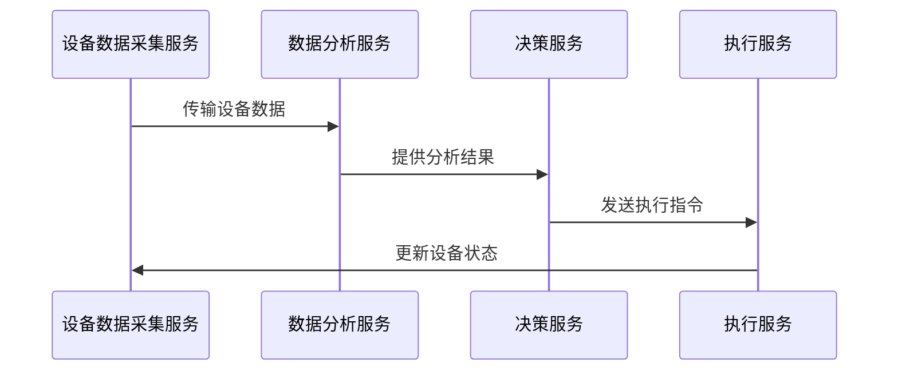

                 


# AI Agent在智能制造中的实践案例

> 关键词：AI Agent, 智能制造, 工业4.0, 人工智能, 制造业智能化

> 摘要：随着工业4.0的推进，AI Agent在智能制造中的应用日益广泛。本文详细介绍了AI Agent的核心概念、算法原理、系统架构设计以及实际案例，展示了其在智能制造中的巨大潜力和实际应用价值。

---

## 第一部分: AI Agent与智能制造的背景与概念

### 第1章: AI Agent与智能制造的背景介绍

#### 1.1 智能制造的基本概念

##### 1.1.1 制造业的数字化与智能化转型

制造业的数字化转型是工业4.0的核心，AI Agent作为智能体，在这一过程中扮演了关键角色。通过AI Agent，企业可以实现生产过程的智能化监控和优化，从而提高效率、降低成本。

##### 1.1.2 智能制造的核心特征

智能制造的核心特征包括智能化、自动化、数据驱动和网络化。AI Agent通过整合这些特征，能够实现生产过程的实时优化和决策支持。

##### 1.1.3 智能制造与工业4.0的关系

工业4.0是智能制造的框架，而AI Agent是实现这一框架的关键技术之一。AI Agent通过与工业物联网（IIoT）和其他系统协同工作，推动了工业4.0的目标实现。

#### 1.2 AI Agent的基本概念

##### 1.2.1 AI Agent的定义与特点

AI Agent是一种智能体，能够感知环境、自主决策并执行任务。其特点包括自主性、反应性、学习能力和社交能力。

##### 1.2.2 AI Agent的分类与应用场景

AI Agent可以分为简单反射型、基于模型的反射型、目标驱动型和效用驱动型。应用场景包括生产优化、质量控制、供应链管理和预测性维护。

##### 1.2.3 AI Agent与传统自动化系统的区别

AI Agent具有更强的自主性和学习能力，能够处理复杂和不确定的问题，而传统自动化系统通常基于固定的规则运行。

#### 1.3 AI Agent在智能制造中的定位

##### 1.3.1 AI Agent在智能制造中的角色

AI Agent在智能制造中充当智能决策者和执行者，负责优化生产流程、监控设备状态和协调资源分配。

##### 1.3.2 AI Agent如何推动智能制造的智能化

通过实时数据处理和学习，AI Agent能够优化生产计划、预测设备故障并提高整体效率。

##### 1.3.3 AI Agent与工业互联网的关系

AI Agent与工业互联网协同工作，通过数据共享和分析，实现更高效的资源配置和生产优化。

#### 1.4 本章小结

本章介绍了智能制造的基本概念、AI Agent的定义和分类，以及AI Agent在智能制造中的定位和作用。

---

## 第二部分: AI Agent的核心概念与系统架构

### 第2章: AI Agent的核心概念与系统架构

#### 2.1 AI Agent的核心概念

##### 2.1.1 AI Agent的智能模型

AI Agent的智能模型包括感知、推理、决策和执行模块。感知模块通过传感器获取数据，推理模块分析数据，决策模块制定策略，执行模块执行操作。

##### 2.1.2 AI Agent的感知与决策机制

感知模块使用传感器和数据流获取环境信息，决策模块基于这些信息做出最优决策。决策机制可以是基于规则、基于模型或基于学习的。

##### 2.1.3 AI Agent的学习与自适应能力

通过机器学习算法，AI Agent能够从数据中学习，不断优化自身的决策模型。自适应能力使AI Agent能够应对动态变化的生产环境。

#### 2.2 AI Agent与智能制造系统的联系

##### 2.2.1 AI Agent在智能制造中的功能模块

AI Agent的功能模块包括数据采集、数据分析、决策制定和执行控制。这些模块协同工作，实现生产过程的智能化管理。

##### 2.2.2 AI Agent与制造执行系统（MES）的集成

AI Agent可以通过与MES集成，优化生产计划和资源分配。例如，AI Agent可以根据实时数据调整生产订单，提高效率。

##### 2.2.3 AI Agent与工业物联网（IIoT）的协同

通过与IIoT协同，AI Agent能够实时监控设备状态，预测性维护设备，减少停机时间。

#### 2.3 AI Agent的系统架构设计

##### 2.3.1 AI Agent的分层架构

AI Agent的架构通常分为感知层、决策层和执行层。感知层负责数据采集，决策层进行分析和决策，执行层负责操作。

##### 2.3.2 AI Agent的模块化设计

模块化设计使AI Agent能够灵活扩展和维护。例如，可以根据具体需求添加或移除某些功能模块。

##### 2.3.3 AI Agent与企业信息化系统的集成

AI Agent可以通过API与企业资源计划（ERP）系统集成，实现从订单到生产的全流程优化。

#### 2.4 本章小结

本章详细介绍了AI Agent的核心概念和系统架构，包括其智能模型、感知与决策机制、学习能力，以及与智能制造系统的集成。

---

## 第三部分: AI Agent的算法原理与数学模型

### 第3章: AI Agent的核心算法原理

#### 3.1 强化学习算法

##### 3.1.1 强化学习的基本原理

强化学习是一种通过试错学习的方法，AI Agent通过与环境交互，获得奖励或惩罚，逐步优化策略。

##### 3.1.2 Q-learning算法的实现

Q-learning是一种经典的强化学习算法，通过更新Q值表，找到最优动作策略。

##### 3.1.3 Deep Q-Networks (DQN) 的应用

DQN通过深度神经网络近似Q值函数，解决高维状态空间的问题。

#### 3.2 监督学习与无监督学习在AI Agent中的应用

##### 3.2.1 监督学习的基本原理

监督学习通过标记数据训练模型，预测新数据的标签。例如，可以用于分类和回归任务。

##### 3.2.2 无监督学习的基本原理

无监督学习通过聚类或降维技术，发现数据中的潜在结构。例如，用于异常检测和数据分组。

##### 3.2.3 监督学习与无监督学习的结合

结合监督和无监督学习，可以在缺少标签数据时，利用无监督学习进行初步分析，再用监督学习优化模型。

#### 3.3 贝叶斯网络与决策树在AI Agent中的应用

##### 3.3.1 贝叶斯网络的基本原理

贝叶斯网络通过概率推理，建立变量之间的条件概率关系，用于风险评估和决策支持。

##### 3.3.2 决策树的基本原理

决策树通过特征选择，构建树状结构，用于分类和回归任务。例如，用于生产过程中的故障诊断。

##### 3.3.3 贝叶斯网络与决策树的结合

结合贝叶斯网络和决策树，可以在复杂场景下，进行更准确的推理和决策。

#### 3.4 本章小结

本章介绍了AI Agent中常用的核心算法，包括强化学习、监督学习、无监督学习、贝叶斯网络和决策树，并探讨了它们在智能制造中的应用。

---

## 第四部分: AI Agent的系统分析与架构设计

### 第4章: AI Agent的系统分析与架构设计

#### 4.1 系统分析与需求定义

##### 4.1.1 系统功能需求分析

系统需要实现设备监控、生产优化和预测性维护等功能。

##### 4.1.2 系统性能需求分析

系统需要高实时性、高可靠性和高可扩展性。

##### 4.1.3 系统边界与接口定义

系统边界包括与MES、ERP和IIoT的接口。

#### 4.2 系统架构设计

##### 4.2.1 分层架构设计

分层架构包括数据采集层、数据处理层、决策层和执行层。

##### 4.2.2 模块化设计

模块化设计使系统易于扩展和维护，例如独立的数据采集模块和决策模块。

##### 4.2.3 微服务架构设计

微服务架构通过服务化设计，提高系统的灵活性和扩展性。

#### 4.3 系统接口设计

##### 4.3.1 系统内部接口设计

内部接口包括数据采集模块与数据处理模块的接口。

##### 4.3.2 系统外部接口设计

外部接口包括与MES、ERP和IIoT的集成接口。

#### 4.4 本章小结

本章详细介绍了AI Agent系统的分析与架构设计，包括功能需求、架构设计和接口设计。

---

## 第五部分: AI Agent的项目实战

### 第5章: AI Agent的项目实战

#### 5.1 项目介绍

项目目标是实现一个AI Agent，用于智能制造车间的生产优化和预测性维护。

#### 5.2 系统功能设计

##### 5.2.1 领域模型设计

领域模型包括设备、生产线、生产订单和维护计划等实体。

##### 5.2.2 系统功能模块设计

功能模块包括数据采集、数据分析、决策制定和执行控制。

#### 5.3 系统架构设计

##### 5.3.1 分层架构设计

分层架构包括数据采集层、数据处理层、决策层和执行层。

##### 5.3.2 微服务架构设计

微服务架构包括设备数据采集服务、数据分析服务和决策服务。

#### 5.4 系统接口设计

##### 5.4.1 系统内部接口设计

内部接口包括设备数据采集服务与数据分析服务的接口。

##### 5.4.2 系统外部接口设计

外部接口包括与MES的生产订单接口和与ERP的库存接口。

#### 5.5 系统交互设计

##### 5.5.1 系统交互流程设计

系统交互流程包括数据采集、数据分析、决策制定和执行控制。

##### 5.5.2 交互流程的mermaid序列图



#### 5.6 项目实战代码实现

##### 5.6.1 环境配置

需要安装Python、TensorFlow、Kafka和Redis。

##### 5.6.2 核心代码实现

```python
import tensorflow as tf
from kafka import KafkaConsumer, KafkaProducer
import json

# 数据采集模块
def data_collector():
    consumer = KafkaConsumer('device_data')
    for message in consumer:
        data = json.loads(message.value)
        # 处理数据
        pass

# 数据分析模块
def data_analyzer():
    model = tf.keras.Sequential([tf.keras.layers.Dense(128, activation='relu'),
                                 tf.keras.layers.Dense(1, activation='sigmoid')])
    model.compile(optimizer='adam', loss='binary_crossentropy', metrics=['accuracy'])
    # 训练模型
    pass

# 决策模块
def decision_maker():
    # 基于模型预测结果，制定决策
    pass

# 执行模块
def execution_layer():
    producer = KafkaProducer('execution_commands')
    # 发送执行指令
    pass
```

##### 5.6.3 代码应用解读与分析

数据采集模块通过Kafka获取设备数据，数据分析模块使用TensorFlow训练模型，决策模块基于模型预测结果制定决策，执行模块通过Kafka发送执行指令。

##### 5.6.4 实际案例分析

以预测性维护为例，AI Agent可以预测设备故障时间，提前安排维护，减少停机时间。

#### 5.7 项目小结

本章通过一个实际项目，展示了AI Agent在智能制造中的应用，包括系统设计、接口设计和代码实现。

---

## 第六部分: 最佳实践与总结

### 第6章: 最佳实践与总结

#### 6.1 最佳实践

##### 6.1.1 数据质量管理

确保数据的准确性和完整性，是AI Agent有效运行的基础。

##### 6.1.2 系统可扩展性

设计模块化和微服务架构，确保系统的可扩展性。

##### 6.1.3 安全性与可靠性

确保系统的安全性，防止数据泄露和网络攻击，同时提高系统的可靠性。

#### 6.2 小结

本文详细介绍了AI Agent在智能制造中的应用，包括核心概念、算法原理、系统架构设计和实际案例分析。

#### 6.3 注意事项

在实际应用中，需要考虑数据隐私、系统兼容性和可维护性。

#### 6.4 拓展阅读

建议读者进一步阅读相关领域的书籍和论文，深入理解AI Agent和智能制造的结合。

---

## 作者：AI天才研究院/AI Genius Institute & 禅与计算机程序设计艺术 /Zen And The Art of Computer Programming

---

通过以上思考过程，我可以系统地完成这篇文章的撰写，确保每个部分都详细且有深度，满足读者的需求。

