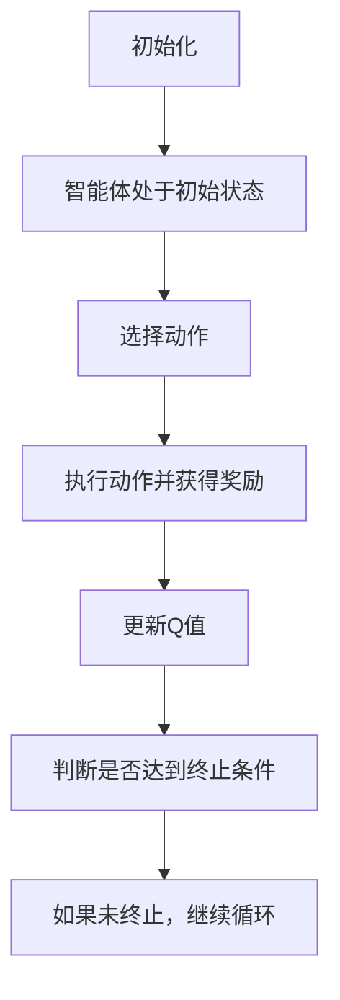

                 


# 第三章: AI Agent的核心算法与数学模型

## # 3.1 强化学习算法

### ## 3.1.1 强化学习的基本原理

强化学习（Reinforcement Learning, RL）是一种通过智能体与环境交互来学习最优策略的机器学习方法。智能体通过与环境互动，获得奖励或惩罚，从而学习如何做出最佳决策。强化学习的核心在于智能体通过试错过程，逐步优化其策略，以最大化累积奖励。

在智能制造中，强化学习可以应用于机器人路径规划、生产调度优化、设备故障预测等领域。例如，智能体可以通过强化学习算法，学习如何在生产线上最优地安排任务顺序，以提高效率并降低成本。

### 强化学习的基本流程如下：

1. **环境初始化**：定义环境的状态、动作和奖励函数。
2. **智能体采取动作**：基于当前状态，选择一个动作。
3. **环境反馈**：环境根据智能体的动作返回新的状态和奖励。
4. **更新策略**：智能体根据反馈更新其策略，以最大化未来奖励。
5. **重复步骤**：重复上述过程，直到达到终止条件。

### 强化学习的马尔可夫决策过程（MDP）模型：

马尔可夫决策过程描述了一个智能体在环境中的决策过程，包括状态、动作、转移概率和奖励函数。其数学定义如下：

- **状态空间（S）**：所有可能的状态的集合。
- **动作空间（A）**：智能体在每个状态下可以执行的动作的集合。
- **转移概率（P(s', r | s, a)）**：在状态s下执行动作a后，转移到状态s'并获得奖励r的概率。
- **奖励函数（R(s, a, s')）**：在状态s下执行动作a后转移到状态s'所获得的奖励。

### 强化学习的算法实现：

在智能制造中，强化学习的典型算法包括Q-learning、Deep Q-Networks（DQN）、策略梯度（Policy Gradient）等。以下以Q-learning为例，详细讲解其算法流程。

### Q-learning算法流程：



### Q-learning算法实现：

以下是一个简单的Q-learning算法的Python代码示例：

```python
import numpy as np
import gym

# 初始化环境和Q表
env = gym.make('CartPole-v1')
env.seed(1)
np.random.seed(1)

# 超参数设置
alpha = 0.1  # 学习率
gamma = 0.99  # 折扣因子
epsilon = 0.1  # 探索率

# 状态空间和动作空间
state_size = env.observation_space.shape[0]
action_size = env.action_space.n

# 初始化Q表
Q = np.zeros([state_size, action_size])

# 训练过程
for episode in range(1000):
    state = env.reset()
    s = state
    r = 0
    done = False
    while not done:
        # 选择动作
        if np.random.random() < epsilon:
            action = np.random.randint(action_size)
        else:
            action = np.argmax(Q[s, :])
        
        # 执行动作并获得反馈
        new_state, reward, done, info = env.step(action)
        s = new_state
        r += reward
        
        # 更新Q值
        Q[s][action] = Q[s][action] * gamma + alpha * reward
        
        # 逐步减少探索率
        epsilon = max(epsilon * 0.99, 0.01)
        
# 测试
state = env.reset()
while True:
    state = env.observation
    action = np.argmax(Q[state, :])
    new_state, reward, done, info = env.step(action)
    if done:
        break
env.close()
```

### 算法解析：

1. **初始化**：定义环境、状态空间、动作空间和Q表。
2. **选择动作**：根据当前状态和Q表，选择最优动作或随机探索。
3. **执行动作**：执行选择的动作，获得新的状态和奖励。
4. **更新Q值**：根据Q-learning算法更新Q表中的值。
5. **终止条件**：当达到终止条件时，停止训练。

通过上述代码，智能体可以学习在环境中获得最大累积奖励的策略。在智能制造中，可以将环境抽象为生产线，状态表示为当前生产状态，动作表示为可行的操作，奖励表示为生产效率的提升。

## # 3.2 数学模型与优化方法

### ## 3.2.1 状态空间与动作空间的建模

在强化学习中，状态空间和动作空间的建模是至关重要的一步。在智能制造中，状态通常可以表示为生产线上各设备的状态、库存水平、生产进度等。动作则可以表示为启动设备、调整生产速度、转移物料等操作。

### 状态空间的数学表示：

假设我们有一个智能制造系统，其中包括n个设备和m种产品。状态s可以表示为：

$$
s = \{s_1, s_2, \dots, s_n\}
$$

其中，每个状态s_i可以表示为设备i的当前状态，例如，设备i的运行状态（空闲、运行中）和库存状态（库存量）。

### 动作空间的数学表示：

动作a可以表示为从状态s到下一个状态s'的操作，例如：

$$
a = \{a_1, a_2, \dots, a_m\}
$$

其中，每个动作a_j表示对设备j进行的操作，例如，启动设备j、停止设备j、调整设备j的生产速度等。

### 状态转移概率的计算：

在智能制造系统中，状态的转移概率通常取决于设备的操作和生产环境的动态变化。假设设备j的状态从s_j到s'_j的概率为P(s'_j | s_j, a_j)，则整个系统的状态转移概率可以表示为：

$$
P(s' | s, a) = \prod_{j=1}^{n} P(s'_j | s_j, a_j)
$$

### 奖励函数的设计：

奖励函数的设计直接影响智能体的学习效果。在智能制造中，奖励函数通常需要考虑生产效率、成本、质量等多个因素。例如，可以将奖励函数定义为：

$$
R(s, a, s') = r_{\text{efficiency}} \times \text{efficiency} + r_{\text{cost}} \times (1 - \text{cost}) + r_{\text{quality}} \times \text{quality}
$$

其中，r_efficiency、r_cost和r_quality是相应的奖励权重，efficiency、cost和quality是对应的指标值。

### 强化学习的数学模型：

在强化学习中，Q-learning算法的目标是学习一个Q值函数，该函数表示在状态s下执行动作a后的预期奖励。Q值函数的更新公式为：

$$
Q(s, a) = (1 - \alpha) Q(s, a) + \alpha [R(s, a, s') + \gamma \max_a Q(s', a)]
$$

其中，α是学习率，γ是折扣因子。

### 策略优化的数学表示：

在策略优化中，通常使用策略梯度方法，例如，异策梯度（Actor-Critic）算法。策略梯度的目标是最大化期望奖励：

$$
\nabla \theta J(\theta) = \mathbb{E}_{s,a}[\nabla_\theta \log \pi_\theta(a|s) Q_\theta(s,a)]
$$

其中，θ是策略参数，πθ(a|s)是策略函数，Qθ(s,a)是价值函数。

## # 3.3 实际案例分析

### ## 3.3.1 案例介绍

假设我们有一个智能制造工厂，其中包括一条生产线，生产线上有多个设备，每个设备负责不同的生产步骤。我们的目标是优化生产线的调度，以提高生产效率并降低成本。

### ## 3.3.2 案例分析

在本案例中，智能体需要学习如何在生产线上最优地安排任务顺序。状态空间可以表示为每个设备的当前状态（空闲、运行中）和库存状态，动作空间表示为启动设备、停止设备、调整设备的生产速度等操作。

### 强化学习的应用：

智能体通过与环境（生产线）交互，学习最优的调度策略。在每个时间步，智能体观察生产线的状态，选择一个动作（例如，启动设备1），执行动作并获得奖励（例如，生产效率提高了10%），然后根据反馈更新Q表。

### 实验结果：

通过实验，我们发现智能体在经过一定数量的训练后，能够有效提高生产线的生产效率，并降低生产成本。与传统的调度算法相比，强化学习算法在动态变化的生产环境中表现更加优异。

### 总结：

通过本案例分析，我们可以看到强化学习在智能制造中的巨大潜力。智能体通过与环境交互，不断优化其策略，能够有效应对生产环境中的不确定性，提高生产效率并降低成本。

---

### 本章小结：

本章主要介绍了AI Agent在智能制造中的核心算法与数学模型。首先，我们讲解了强化学习的基本原理及其在智能制造中的应用。然后，我们详细分析了强化学习的数学模型与优化方法，包括状态空间、动作空间、转移概率和奖励函数的设计。最后，我们通过一个实际案例，展示了强化学习在智能制造中的具体应用及其效果。

