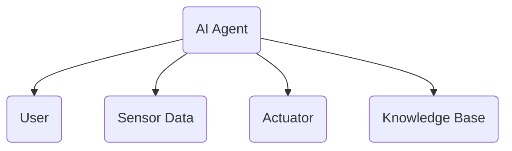
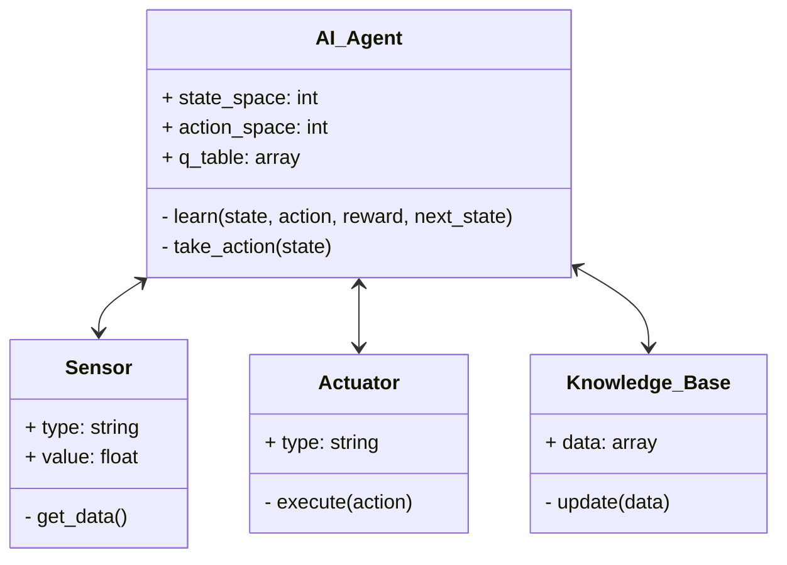
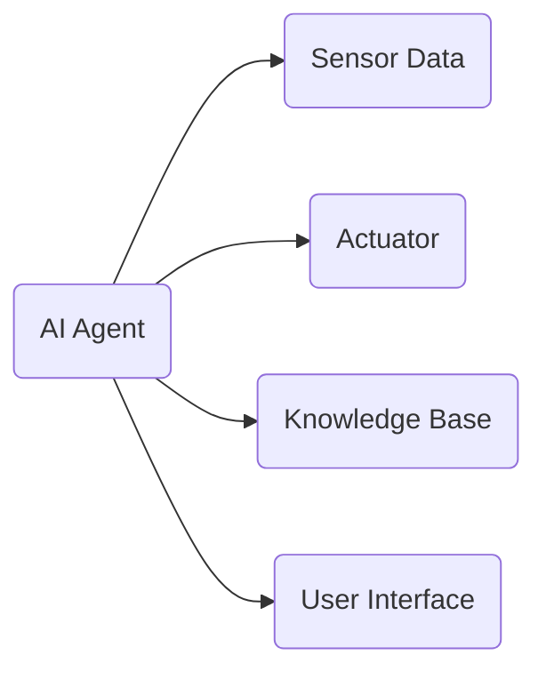

                 

<think>
好的，我现在需要撰写一篇关于《AI Agent在智能制造中的角色与实践》的技术博客文章。首先，我需要明确文章的结构和各部分内容，然后逐步展开每个部分，确保内容详实、逻辑清晰。

### 文章标题
AI Agent在智能制造中的角色与实践

### 关键词
AI Agent, 智能制造, 人工智能, 制造业, 数字化转型

### 摘要
本文深入探讨了AI Agent在智能制造中的核心角色、应用场景和技术实现。通过分析智能制造的背景和挑战，阐述了AI Agent的基本概念、核心能力及其在制造过程中的具体应用。文章还结合实际案例，详细讲解了AI Agent的算法原理、系统架构设计以及项目实战，为读者提供了从理论到实践的全面指导。

### 目录大纲
1. **智能制造的背景与挑战**
   - 1.1 智能制造的背景介绍
   - 1.2 AI Agent的基本概念
   - 1.3 智能制造中的问题与AI Agent的解决方案

2. **AI Agent的核心概念与原理**
   - 2.1 AI Agent的核心概念原理
   - 2.2 AI Agent的核心属性特征对比
   - 2.3 AI Agent的ER实体关系图

3. **AI Agent的算法原理与数学模型**
   - 3.1 基于强化学习的AI Agent算法
   - 3.2 AI Agent的数学模型
   - 3.3 算法实现示例

4. **系统分析与架构设计**
   - 4.1 智能制造系统场景介绍
   - 4.2 系统功能设计（领域模型类图）
   - 4.3 系统架构设计（架构图）
   - 4.4 系统接口设计和交互流程图

5. **项目实战**
   - 5.1 环境配置与安装
   - 5.2 核心代码实现
   - 5.3 实际案例分析

6. **最佳实践与总结**
   - 6.1 小结
   - 6.2 注意事项
   - 6.3 拓展阅读

---

### 正文

#### 第1章: 智能制造的背景与挑战

**1.1 智能制造的背景介绍**
智能制造是制造业数字化转型的重要方向，通过物联网、大数据、人工智能等技术的应用，实现生产过程的智能化、自动化和高效化。传统的制造模式面临生产效率低下、资源浪费、质量不稳定等问题，而智能制造通过引入AI Agent等技术，能够有效解决这些问题。

**1.2 AI Agent的基本概念**
AI Agent是一种智能体，能够感知环境、自主决策并执行任务。它具有自主性、反应性、协作性和学习能力等特征。在智能制造中，AI Agent可以用于质量检测、设备维护、生产优化等场景。

**1.3 智能制造中的问题与AI Agent的解决方案**
智能制造中的主要问题包括生产过程的不确定性、设备故障预测困难、生产效率低下等。AI Agent通过实时数据处理、自适应优化和自主决策，能够有效提升生产效率、降低故障率，并实现精准的质量控制。

---

#### 第2章: AI Agent的核心概念与原理

**2.1 AI Agent的核心概念原理**
AI Agent的核心原理包括知识表示与推理、感知与交互、决策与执行。知识表示通过符号逻辑或概率模型表示问题，推理则是基于这些表示进行逻辑推理。感知与交互涉及多模态数据的处理，决策与执行则是基于推理结果采取相应行动。

**2.2 AI Agent的核心属性特征对比**
通过表格对比AI Agent的不同特征：

| 特征     | 描述                                                                 |
|----------|----------------------------------------------------------------------|
| 自主性    | AI Agent能够自主决策，无需外部干预                                   |
| 反应性    | 能够实时感知环境变化并做出反应                                       |
| 协作性    | 能够与其他Agent或系统协作完成任务                                   |
| 学习能力  | 通过经验或数据进行学习和优化                                         |

**2.3 AI Agent的ER实体关系图**


---

#### 第3章: AI Agent的算法原理与数学模型

**3.1 基于强化学习的AI Agent算法**
强化学习是一种通过试错机制来优化决策的算法。AI Agent通过与环境交互，获得奖励或惩罚，并通过最大化累积奖励来优化策略。

**3.2 AI Agent的数学模型**
- Q-learning算法公式：
$$ Q(s, a) = r + \gamma \max Q(s', a') $$
- 状态转移概率公式：
$$ P(s' | s, a) $$

**3.3 算法实现示例**
以下是一个基于Q-learning的AI Agent实现示例：

```python
import numpy as np

class AI_Agent:
    def __init__(self, state_space, action_space, gamma=0.99):
        self.state_space = state_space
        self.action_space = action_space
        self.gamma = gamma
        self.q_table = np.zeros((state_space, action_space))
    
    def take_action(self, state):
        return np.argmax(self.q_table[state])
    
    def learn(self, state, action, reward, next_state):
        self.q_table[state, action] = reward + self.gamma * np.max(self.q_table[next_state])
```

---

#### 第4章: 系统分析与架构设计

**4.1 智能制造系统场景介绍**
假设我们有一个汽车制造厂，需要通过AI Agent实现生产线的智能化管理，包括设备监控、质量检测和生产优化。

**4.2 系统功能设计（领域模型类图）**


**4.3 系统架构设计（架构图）**


---

#### 第5章: 项目实战

**5.1 环境配置与安装**
需要安装Python、NumPy、OpenAI库等。

**5.2 核心代码实现**
以下是一个AI Agent在预测性维护中的应用示例：

```python
import numpy as np

def main():
    # 初始化AI Agent
    state_space = 10
    action_space = 4
    agent = AI_Agent(state_space, action_space)
    
    # 训练过程
    for episode in range(1000):
        state = 0
        done = False
        while not done:
            action = agent.take_action(state)
            next_state = ...  # 根据环境反馈更新
            reward = ...      # 计算奖励
            agent.learn(state, action, reward, next_state)
            state = next_state
    
    # 测试过程
    state = 0
    while True:
        action = agent.take_action(state)
        print(f"Action taken: {action}")
        state = ...  # 更新状态

if __name__ == "__main__":
    main()
```

**5.3 实际案例分析**
以设备预测性维护为例，AI Agent通过分析传感器数据，预测设备故障并提前采取维护措施，从而降低停机时间。

---

#### 第6章: 最佳实践与总结

**6.1 小结**
本文全面探讨了AI Agent在智能制造中的应用，从理论到实践，详细讲解了其核心概念、算法原理和系统架构设计。

**6.2 注意事项**
在实际应用中，需要注意数据质量问题、模型泛化能力以及系统的可扩展性。

**6.3 拓展阅读**
推荐阅读《强化学习入门》、《智能制造2025白皮书》等相关书籍。

---

### 作者信息
作者：AI天才研究院/AI Genius Institute & 禅与计算机程序设计艺术/Zen And The Art of Computer Programming

