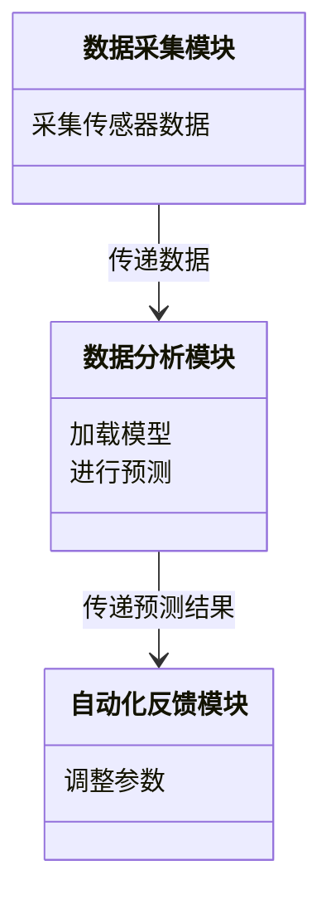
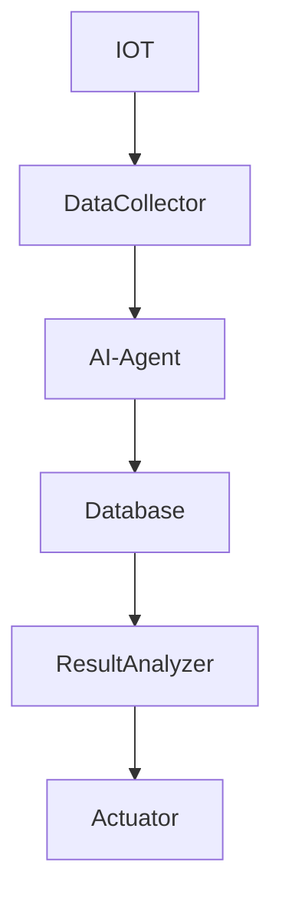
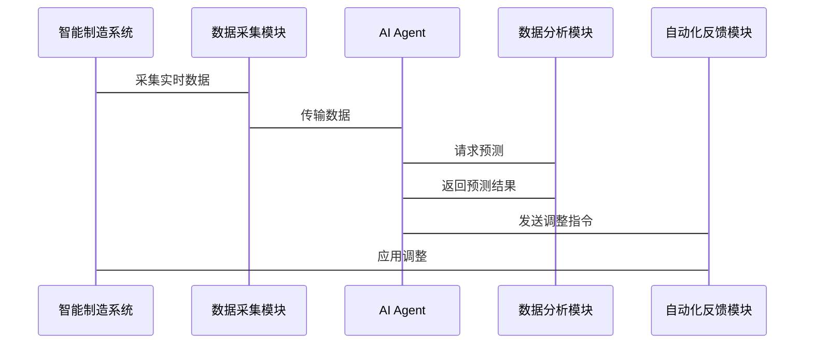

                 


# AI Agent在智能制造质量预测中的角色

> 关键词：AI Agent，智能制造，质量预测，实时反馈，数据分析，机器学习，边缘计算

> 摘要：本文探讨了AI Agent在智能制造质量预测中的核心作用，分析了其在智能制造环境下的工作原理，结合实际应用场景，详细阐述了AI Agent在质量预测中的算法原理、系统架构设计、项目实现过程以及实际案例分析。通过对比传统质量预测方法，本文展示了AI Agent在智能制造中的独特优势和广阔的应用前景。

---

# 第一部分：智能制造与AI Agent概述

## 第1章：智能制造与AI Agent的背景

### 1.1 智能制造的背景与发展趋势

#### 1.1.1 智能制造的定义与特点
智能制造是一种以数据驱动、自动化和智能化为特征的生产模式，通过物联网（IoT）、大数据、人工智能（AI）和云计算等技术，实现从设计、生产到供应链管理的全生命周期智能化管理。

#### 1.1.2 智能制造的核心技术与应用领域
- **核心技术**：物联网、大数据分析、人工智能、机器人技术、数字孪生。
- **应用领域**：汽车制造、电子设备生产、航空航天、医疗设备制造等。

#### 1.1.3 智能制造的发展趋势与挑战
- **趋势**：向智能化、绿色化、服务化方向发展，强调灵活性和可持续性。
- **挑战**：数据孤岛、系统集成复杂、数据安全问题、人才短缺。

### 1.2 AI Agent的基本概念与特点

#### 1.2.1 AI Agent的定义与分类
AI Agent是一种能够感知环境、自主决策并采取行动的智能实体，分为简单反射Agent、基于模型的反射Agent、目标驱动Agent和效用驱动Agent。

#### 1.2.2 AI Agent的核心技术与实现方式
- **核心技术**：感知与推理、决策与规划、学习与优化。
- **实现方式**：基于规则的推理、基于模型的推理、基于机器学习的推理。

#### 1.2.3 AI Agent在智能制造中的应用潜力
- **潜力**：实时监控生产过程、预测设备故障、优化生产参数、提高产品质量。

### 1.3 智能制造质量预测的挑战与需求

#### 1.3.1 智能制造中的质量问题
- **质量问题**：产品缺陷、生产偏差、材料浪费。
- **预测需求**：实时预测、高精度预测、多因素综合预测。

#### 1.3.2 AI Agent在质量预测中的角色
- **角色**：数据采集与处理、智能分析与决策、自动化执行与反馈。

---

# 第二部分：AI Agent在智能制造质量预测中的核心概念与联系

## 第2章：AI Agent的核心概念与原理

### 2.1 核心概念原理

#### 2.1.1 AI Agent的基本原理
AI Agent通过感知环境数据，利用算法进行分析和推理，制定决策并执行行动。

#### 2.1.2 质量预测的核心原理
质量预测基于历史数据和实时数据，利用统计学和机器学习模型预测未来质量状态。

#### 2.1.3 AI Agent与质量预测的结合原理
AI Agent通过实时数据采集、智能分析和决策优化，实现质量预测的动态调整和优化。

### 2.2 核心概念属性特征对比

| **属性**       | **传统质量预测方法**               | **AI Agent质量预测方法**              |
|----------------|----------------------------------|----------------------------------|
| 数据来源       | 主要依赖历史数据                 | 实时数据采集与历史数据结合         |
| 分析方式       | 基于统计分析                     | 基于机器学习与深度学习             |
| 决策方式       | 人工决策为主                     | 自主决策与人机协作                 |
| 响应时间       | 较长                            | 实时响应                          |
| 可扩展性       | 有限                           | 高度可扩展                        |

### 2.3 ER实体关系图架构

```mermaid
er
  %%{init: 'hide conf'}>
  classDiagram
    class 智能制造系统 {
      id
      name
      description
    }
    class AI Agent {
      id
      type
      function
    }
    class 质量预测模型 {
      id
      algorithm
      parameters
    }
    class 实时数据 {
      id
      timestamp
      value
    }
    智能制造系统 --> AI Agent: 包含
    AI Agent --> 质量预测模型: 使用
    质量预测模型 --> 实时数据: 分析
```

---

# 第三部分：AI Agent在智能制造质量预测中的算法原理

## 第3章：算法原理讲解

### 3.1 数据预处理

#### 3.1.1 数据清洗
使用Python的Pandas库进行数据清洗，去除缺失值和异常值。

```python
import pandas as pd

# 读取数据
data = pd.read_csv('manufacturing_data.csv')

# 删除缺失值
data.dropna(inplace=True)

# 去除异常值（基于标准差）
mean = data['target'].mean()
std = data['target'].std()
data = data[(data['target'] >= mean - std) & (data['target'] <= mean + std)]
```

#### 3.1.2 数据标准化
使用标准差标准化方法。

$$ z = \frac{x - \mu}{\sigma} $$

其中，$\mu$ 是均值，$\sigma$ 是标准差。

### 3.2 模型训练

#### 3.2.1 算法选择
选择随机森林（Random Forest）作为预测模型。

#### 3.2.2 模型训练代码

```python
from sklearn.ensemble import RandomForestRegressor
from sklearn.metrics import mean_squared_error

# 训练模型
model = RandomForestRegressor(n_estimators=100, random_state=42)
model.fit(X_train, y_train)

# 预测结果
y_pred = model.predict(X_test)

# 评估指标
mse = mean_squared_error(y_test, y_pred)
print(f'Mean Squared Error: {mse}')
```

### 3.3 结果分析

#### 3.3.1 模型评估
使用均方误差（MSE）和决定系数（R²）评估模型性能。

$$ R² = 1 - \frac{\sum (y_i - \hat{y}_i)^2}{\sum (y_i - \bar{y})^2} $$

#### 3.3.2 可视化分析
使用Matplotlib绘制实际值与预测值的对比图。

```python
import matplotlib.pyplot as plt

plt.scatter(y_test, y_pred)
plt.xlabel('Actual Values')
plt.ylabel('Predicted Values')
plt.title('Actual vs Predicted Values')
plt.show()
```

---

# 第四部分：系统分析与架构设计方案

## 第4章：系统分析与架构设计

### 4.1 问题场景介绍

#### 4.1.1 项目背景
某汽车制造厂希望利用AI Agent实时预测生产线上的焊接质量。

### 4.2 系统功能设计

#### 4.2.1 功能模块
- 数据采集模块：实时采集焊接参数。
- 数据分析模块：基于机器学习模型预测焊接质量。
- 自动化反馈模块：根据预测结果调整焊接参数。

#### 4.2.2 领域模型设计



### 4.3 系统架构设计

#### 4.3.1 系统架构图



### 4.4 系统交互设计

#### 4.4.1 系统交互流程



---

# 第五部分：项目实战

## 第5章：项目实战

### 5.1 环境安装

#### 5.1.1 安装Python环境
使用Anaconda安装Python 3.8及以上版本。

#### 5.1.2 安装依赖库
安装Pandas、Scikit-learn、Matplotlib等库。

```bash
pip install pandas scikit-learn matplotlib
```

### 5.2 核心代码实现

#### 5.2.1 数据预处理代码

```python
import pandas as pd
import numpy as np

# 数据加载与清洗
data = pd.read_csv('welding_quality.csv')
data.dropna(inplace=True)
data = data[(data['target'] >= data['target'].mean() - data['target'].std()) & 
            (data['target'] <= data['target'].mean() + data['target'].std())]
```

#### 5.2.2 模型训练代码

```python
from sklearn.ensemble import RandomForestRegressor
from sklearn.model_selection import train_test_split

# 划分训练集与测试集
X = data.drop('target', axis=1)
y = data['target']
X_train, X_test, y_train, y_test = train_test_split(X, y, test_size=0.2, random_state=42)

# 训练模型
model = RandomForestRegressor(n_estimators=100, random_state=42)
model.fit(X_train, y_train)

# 预测结果
y_pred = model.predict(X_test)
```

### 5.3 项目小结

#### 5.3.1 项目总结
通过本项目，我们实现了基于AI Agent的智能制造质量预测系统，验证了AI Agent在实时预测中的有效性。

#### 5.3.2 注意事项
- 数据质量对模型性能影响重大，需确保数据采集的实时性和准确性。
- 模型需要定期更新，以适应生产环境的变化。

---

# 第六部分：总结与展望

## 第6章：总结与展望

### 6.1 总结

通过本文的详细讲解，我们了解了AI Agent在智能制造质量预测中的核心作用，包括其工作原理、算法实现、系统架构设计和实际应用案例。AI Agent通过实时数据采集、智能分析和自主决策，显著提升了质量预测的效率和精度。

### 6.2 展望

未来，随着AI技术的不断进步，AI Agent在智能制造中的应用将更加广泛和深入。以下是未来的发展方向：

1. **多模态数据融合**：结合图像、声音等多种数据源，提升预测的准确性和全面性。
2. **边缘计算的应用**：通过边缘计算优化实时响应速度，降低数据传输延迟。
3. **自适应学习**：开发能够自适应调整模型参数的AI Agent，适应动态变化的生产环境。

---

# 作者：AI天才研究院/AI Genius Institute & 禅与计算机程序设计艺术 /Zen And The Art of Computer Programming

---

**注**：以上内容为《AI Agent在智能制造质量预测中的角色》的技术博客文章大纲，具体内容请根据实际需求进行扩展和补充。

