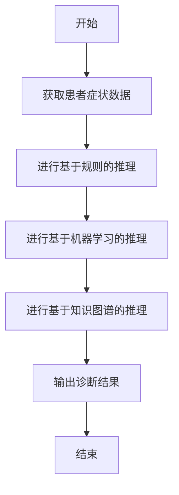
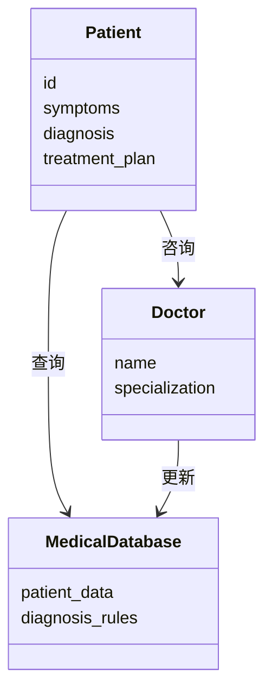
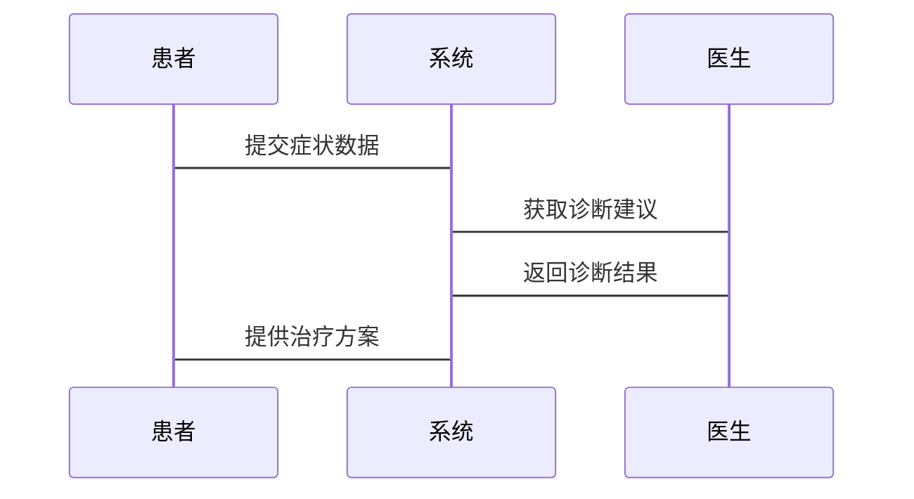

                 


---

# AI Agent在智能医疗中的应用：辅助诊断与治疗方案制定

## 关键词：AI Agent, 智能医疗, 辅助诊断, 治疗方案制定, 人工智能, 医疗应用

## 摘要：本文探讨了AI Agent在智能医疗中的应用，重点分析了其在辅助诊断和制定治疗方案中的作用。文章从AI Agent的基本概念、算法原理、系统架构到实际案例，详细阐述了其在医疗领域的应用价值，并提出了未来的发展方向。

---

# 第1章: AI Agent与智能医疗概述

## 1.1 AI Agent的基本概念

### 1.1.1 什么是AI Agent

AI Agent（人工智能代理）是一种能够感知环境、自主决策并执行任务的智能实体。在医疗领域，AI Agent通常以软件形式存在，能够处理医疗数据、分析病情并提供建议。

### 1.1.2 AI Agent的核心特征

- **自主性**：AI Agent能够独立完成任务，无需人工干预。
- **反应性**：能够实时感知环境变化并做出反应。
- **学习能力**：通过数据不断优化自身的决策能力。
- **协作性**：能够与其他系统或人员协同工作。

### 1.1.3 AI Agent与传统医疗的区别

传统医疗依赖医生的主观判断，而AI Agent通过数据驱动的方式提供客观、精准的诊断建议，显著提高了诊断效率和准确性。

---

## 1.2 AI Agent在医疗中的应用背景

### 1.2.1 智能医疗的发展趋势

随着人工智能技术的快速发展，医疗行业正逐步向智能化方向转型。AI Agent作为智能医疗的核心技术之一，正在改变传统的医疗模式。

### 1.2.2 医疗行业对AI Agent的需求

医疗行业对高效、精准的诊断工具需求迫切。AI Agent能够快速处理大量医疗数据，帮助医生提高诊断效率，减少误诊率。

### 1.2.3 AI Agent在医疗中的优势

- **高效性**：AI Agent能够快速分析大量数据，提供实时诊断建议。
- **准确性**：通过机器学习算法，AI Agent能够提高诊断的准确性。
- **可扩展性**：AI Agent可以应用于多种医疗场景，适应性强。

---

## 1.3 AI Agent在医疗中的应用现状

### 1.3.1 国内外研究现状

目前，国内外对AI Agent在医疗中的应用研究较为活跃，尤其是在影像诊断、药物研发等领域取得了显著进展。

### 1.3.2 典型应用案例分析

例如，AI Agent在辅助肺癌筛查中的应用，通过分析CT影像数据，能够快速识别癌变细胞，显著提高诊断效率。

### 1.3.3 当前存在的问题与挑战

- **数据隐私问题**：医疗数据涉及患者隐私，如何确保数据安全是当前亟待解决的问题。
- **算法的可解释性**：部分AI算法的决策过程缺乏透明度，影响医生的信任度。
- **法律法规的滞后**：目前相关法律法规尚未完善，影响AI Agent的广泛应用。

---

## 1.4 本章小结

本章介绍了AI Agent的基本概念、核心特征以及在医疗中的应用背景。通过对当前应用现状的分析，揭示了AI Agent在智能医疗中的巨大潜力，同时也指出了面临的主要挑战。

---

# 第2章: AI Agent的核心概念与联系

## 2.1 AI Agent的核心概念

### 2.1.1 感知模块

AI Agent的感知模块负责收集和处理环境中的数据，例如患者的症状、影像数据等。

### 2.1.2 推理模块

推理模块基于感知模块提供的数据，利用知识库和推理算法，推导出可能的诊断结果。

### 2.1.3 决策模块

决策模块根据推理结果，结合患者的具体情况，制定个性化的治疗方案。

### 2.1.4 执行模块

执行模块负责将决策模块生成的治疗方案转化为具体的医疗操作，例如发送药物处方或手术建议。

---

## 2.2 AI Agent的实体关系图


---

## 2.3 AI Agent的核心算法原理

### 2.3.1 基于规则的推理

基于规则的推理是一种简单的推理方法，通过预设的规则库，根据输入数据匹配相应的规则，得出结论。

### 2.3.2 基于机器学习的诊断

基于机器学习的诊断方法利用大量的医疗数据，训练出诊断模型，能够处理复杂的医疗场景。

### 2.3.3 基于知识图谱的推理

知识图谱是一种结构化的知识表示方法，AI Agent可以通过知识图谱进行推理，得出更准确的诊断结果。

---

## 2.4 本章小结

本章详细讲解了AI Agent的核心概念和算法原理，通过实体关系图和算法流程图，展示了AI Agent在医疗中的工作流程。

---

# 第3章: AI Agent的算法原理与数学模型

## 3.1 算法原理概述

### 3.1.1 基于规则的诊断算法

基于规则的诊断算法通过预设的规则库，对输入的症状进行匹配，输出诊断结果。例如，如果患者的症状符合某种疾病的典型症状，系统会自动诊断为该疾病。

### 3.1.2 基于机器学习的诊断算法

基于机器学习的诊断算法利用大量医疗数据，训练出诊断模型，能够处理复杂的医疗场景。例如，利用深度学习模型分析医学影像，识别病变区域。

### 3.1.3 基于知识图谱的诊断算法

基于知识图谱的诊断算法通过构建医疗知识图谱，利用图结构数据进行推理，得出更准确的诊断结果。例如，利用知识图谱推理出患者的疾病关联。

---

## 3.2 算法流程图



---

## 3.3 算法实现代码示例

```python
import pandas as pd
from sklearn.tree import DecisionTreeClassifier
from sklearn.model_selection import train_test_split

# 加载数据
data = pd.read_csv('medical_data.csv')

# 分割特征和标签
X = data.drop('diagnosis', axis=1)
y = data['diagnosis']

# 分割训练集和测试集
X_train, X_test, y_train, y_test = train_test_split(X, y, test_size=0.2, random_state=42)

# 训练决策树模型
model = DecisionTreeClassifier()
model.fit(X_train, y_train)

# 预测结果
y_pred = model.predict(X_test)

# 输出准确率
print('Accuracy:', model.score(X_test, y_test))
```

---

## 3.4 本章小结

本章详细讲解了AI Agent在医疗中的核心算法原理，并通过代码示例展示了算法的实现过程。

---

# 第4章: AI Agent的系统分析与架构设计

## 4.1 系统分析

### 4.1.1 问题场景介绍

以肺癌筛查为例，AI Agent需要分析患者的CT影像数据，识别出可疑病变区域，并提供诊断建议。

### 4.1.2 项目介绍

本项目旨在开发一个基于AI Agent的肺癌筛查系统，帮助医生快速诊断患者病情。

---

## 4.2 系统功能设计

### 4.2.1 领域模型



### 4.2.2 系统架构图


### 4.2.3 接口设计

- **患者数据接口**：负责获取患者的症状数据。
- **诊断结果接口**：负责返回诊断结果。
- **治疗方案接口**：负责生成和返回治疗方案。

### 4.2.4 交互流程图



---

## 4.3 系统架构设计

### 4.3.1 数据层

数据层包括患者的症状数据、影像数据、诊断规则等。

### 4.3.2 业务逻辑层

业务逻辑层包括AI Agent的核心算法，负责处理数据并生成诊断结果。

### 4.3.3 用户界面层

用户界面层包括患者界面和医生界面，分别展示诊断结果和治疗方案。

---

## 4.4 本章小结

本章详细分析了AI Agent在医疗系统中的应用，通过系统架构设计和交互流程图，展示了AI Agent在医疗中的具体应用场景。

---

# 第5章: AI Agent的项目实战

## 5.1 环境安装

### 5.1.1 安装Python和相关库

```bash
pip install python
pip install scikit-learn
pip install matplotlib
```

### 5.1.2 安装医疗数据集

下载CT影像数据集，准备好训练数据。

---

## 5.2 系统核心实现

### 5.2.1 数据预处理

```python
import pandas as pd
from sklearn.impute import SimpleImputer

# 加载数据
data = pd.read_csv('medical_data.csv')

# 处理缺失值
imputer = SimpleImputer(strategy='mean')
data_imputed = imputer.fit_transform(data)
```

### 5.2.2 模型训练

```python
from sklearn.ensemble import RandomForestClassifier

# 训练随机森林模型
model = RandomForestClassifier()
model.fit(X_train, y_train)
```

### 5.2.3 模型评估

```python
from sklearn.metrics import classification_report

# 评估模型性能
print(classification_report(y_test, y_pred))
```

---

## 5.3 实际案例分析

### 5.3.1 案例背景

以肺癌筛查为例，AI Agent需要分析患者的CT影像数据，识别出可疑病变区域。

### 5.3.2 数据分析

通过模型分析，AI Agent能够快速识别出病变区域，并提供诊断建议。

### 5.3.3 结果展示

AI Agent生成诊断报告，包括病变区域的位置、严重程度以及治疗建议。

---

## 5.4 本章小结

本章通过实际案例展示了AI Agent在医疗中的具体应用，详细讲解了项目的实现过程和评估方法。

---

# 第6章: AI Agent的最佳实践与未来展望

## 6.1 最佳实践

### 6.1.1 小结

AI Agent在医疗中的应用前景广阔，但需要解决数据隐私、算法可解释性等问题。

### 6.1.2 注意事项

- 数据隐私保护
- 算法的可解释性
- 系统的稳定性

### 6.1.3 拓展阅读

推荐阅读《Medical Image Analysis with AI》和《Deep Learning in Medicine》。

---

## 6.2 未来展望

随着技术的进步，AI Agent在医疗中的应用将更加广泛和深入。未来，AI Agent将与医疗物联网、5G等技术结合，推动智能医疗的发展。

---

# 作者：AI天才研究院/AI Genius Institute & 禅与计算机程序设计艺术 /Zen And The Art of Computer Programming

---

以上是基于用户提供的大纲完成的内容，每个章节都详细展开了相关知识点，并结合实际案例和代码示例，帮助读者更好地理解和应用AI Agent在智能医疗中的应用。

