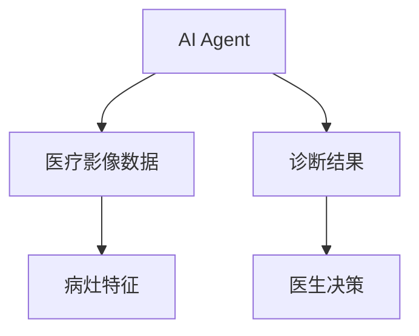
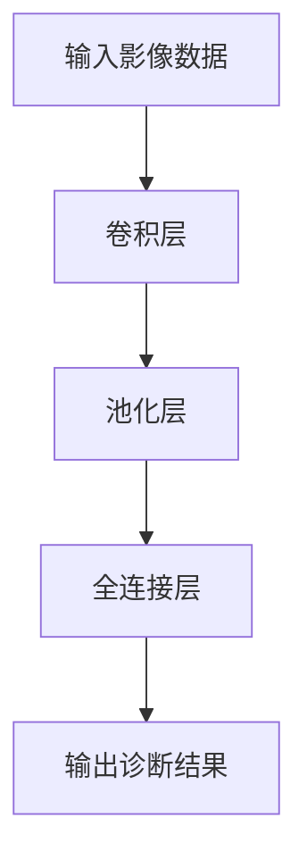
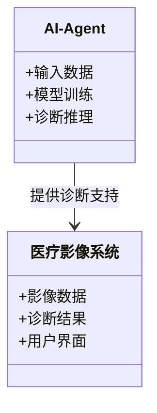
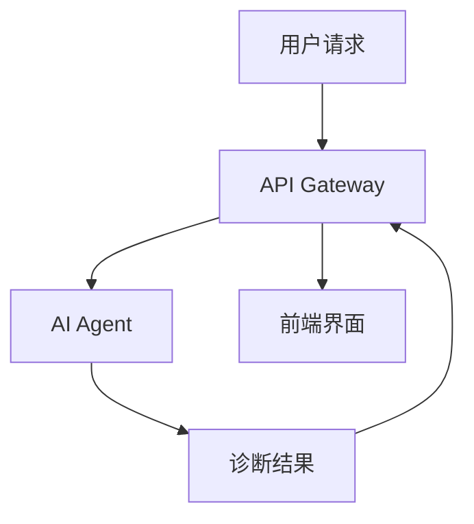

                 


```markdown
# AI Agent在智能医疗影像分析与诊断中的角色

> 关键词：AI Agent, 智能医疗, 影像分析, 诊断系统, 人工智能

> 摘要：AI Agent在医疗影像分析中的应用日益广泛，通过智能化手段提高诊断准确性和效率。本文从AI Agent的基本概念出发，分析其在医疗影像分析中的角色与作用，探讨其算法原理、系统架构、项目实现及应用价值，最后总结AI Agent在智能医疗影像分析中的未来发展方向。

---

## 第一部分: AI Agent与智能医疗影像分析概述

### 第1章: AI Agent的基本概念

#### 1.1 AI Agent的核心特征
AI Agent是一种能够感知环境、自主决策并执行任务的智能实体。其核心特征包括：
- **自主性**：能够在没有外部干预的情况下独立运行。
- **反应性**：能够实时感知环境变化并做出反应。
- **目标导向性**：基于目标驱动行为。
- **学习能力**：能够通过经验优化自身性能。

#### 1.2 医疗影像分析的现状
传统医疗影像分析依赖人工检查，存在效率低、误诊率高等问题。AI Agent的引入能够显著提升诊断效率和准确性。

#### 1.3 AI Agent在医疗影像中的角色
AI Agent在医疗影像分析中的角色主要体现在：
- **辅助诊断**：帮助医生快速识别病灶。
- **数据处理**：高效处理海量影像数据。
- **决策支持**：提供基于数据的诊断建议。

---

### 第2章: 医疗影像分析的核心问题与解决思路

#### 2.1 医疗影像分析的核心问题
- **数据复杂性**：医疗影像数据量大且结构复杂。
- **诊断准确性**：需要高精度的诊断结果。
- **可解释性**：诊断过程需要可追溯和解释。

#### 2.2 AI Agent解决医疗影像分析问题的思路
- **数据驱动**：利用深度学习模型处理影像数据。
- **模型优化**：通过迁移学习和增强训练提升诊断精度。
- **人机协同**：结合医生的经验和AI的高效性。

---

### 第3章: AI Agent的核心概念与原理

#### 3.1 AI Agent的核心概念
- **知识表示**：将医学知识转化为可计算的形式。
- **行为推理**：基于知识和数据进行推理和决策。
- **状态感知**：实时感知和分析医疗影像数据。

#### 3.2 AI Agent在医疗影像中的属性特征对比
| 属性 | AI Agent | 传统医疗影像分析 |
|------|-----------|-------------------|
| 数据处理能力 | 高效处理 | 人工逐个分析 |
| 准确性 | 高 | 易受主观影响 |
| 可扩展性 | 强 | 较低 |

#### 3.3 实体关系图（Mermaid）


---

## 第4章: AI Agent的算法原理

### 4.1 算法原理概述
AI Agent在医疗影像分析中主要采用深度学习算法，尤其是卷积神经网络（CNN）。

### 4.2 卷积神经网络（CNN）的流程（Mermaid）


### 4.3 算法实现代码示例（Python）
```python
import tensorflow as tf
from tensorflow.keras import layers

model = tf.keras.Sequential([
    layers.Conv2D(32, (3,3), activation='relu', input_shape=(256, 256, 3)),
    layers.MaxPooling2D((2,2)),
    layers.Conv2D(64, (3,3), activation='relu'),
    layers.MaxPooling2D((2,2)),
    layers.Flatten(),
    layers.Dense(128, activation='relu'),
    layers.Dense(2, activation='softmax')
])
```

### 4.4 数学公式
模型的损失函数为：
$$ L = -\sum_{i} y_i \log(p_i) + (1-y_i)\log(1-p_i) $$

---

## 第5章: 系统分析与架构设计

### 5.1 应用场景
AI Agent在医疗影像分析中的应用场景包括：
- **肺部结节检测**
- **乳腺癌筛查**
- **眼底病变诊断**

### 5.2 系统功能设计（Mermaid类图）


### 5.3 系统架构设计（Mermaid架构图）


---

## 第6章: 项目实战

### 6.1 环境安装
```bash
pip install tensorflow keras matplotlib
```

### 6.2 核心代码实现
```python
def preprocess_image(image_path):
    # 图像预处理代码
    pass

def load_model():
    # 加载训练好的模型
    pass

def predict_disease(image_path):
    preprocessed = preprocess_image(image_path)
    prediction = load_model().predict(preprocessed)
    return prediction
```

### 6.3 案例分析
以肺部结节检测为例，AI Agent能够快速定位病灶并提供诊断建议。

---

## 第7章: 最佳实践与未来展望

### 7.1 最佳实践
- **数据质量**：确保训练数据的多样性和高质量。
- **模型优化**：定期更新模型以提升诊断精度。
- **人机协同**：AI Agent辅助医生，而非取代医生。

### 7.2 未来展望
随着AI技术的发展，AI Agent在医疗影像分析中的应用将更加广泛，诊断精度也将进一步提升。

---

## 总结

AI Agent在智能医疗影像分析中的角色日益重要，其高效性、准确性及可扩展性为医疗行业带来了巨大价值。未来，随着技术的进步，AI Agent将在医疗影像分析中发挥更大的作用。

---

## 作者：AI天才研究院（AI Genius Institute） & 禅与计算机程序设计艺术（Zen And The Art of Computer Programming）
```

