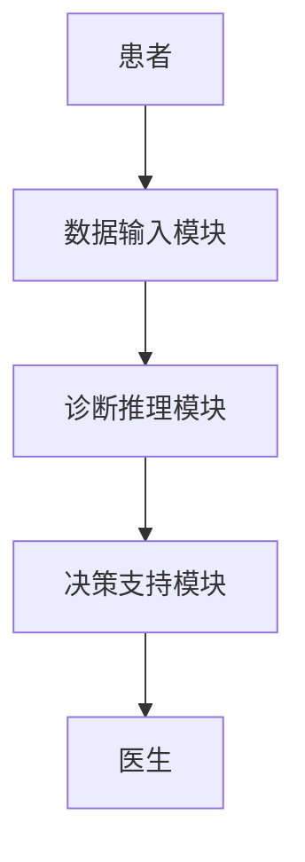

                 


# AI Agent在智能医疗诊断中的突破

> 关键词：AI Agent, 智能医疗, 诊断推理, 强化学习, 知识图谱

> 摘要：AI Agent在智能医疗诊断中的应用正逐渐改变传统医疗行业的诊断方式。通过结合自然语言处理、强化学习和知识图谱等技术，AI Agent能够高效地进行病症识别、诊断推理和决策支持。本文将从AI Agent的核心概念、技术原理、系统架构到实际应用案例进行全面分析，探讨其在智能医疗诊断中的突破与未来发展方向。

---

# 第一部分: AI Agent在智能医疗诊断中的背景与基础

## 第1章: AI Agent与智能医疗诊断概述

### 1.1 AI Agent的基本概念

#### 1.1.1 AI Agent的定义与特点

AI Agent（人工智能代理）是一种智能系统，能够感知环境、自主决策并执行任务。其特点包括：

1. **自主性**：能够在无外部干预的情况下运行。
2. **反应性**：能够实时感知环境并做出反应。
3. **学习能力**：通过数据和经验不断优化性能。
4. **社交能力**：能够与人类或其他系统进行交互。

#### 1.1.2 AI Agent的核心原理

AI Agent的核心原理是通过感知、推理和行动来完成任务。感知阶段通过传感器或数据输入获取信息，推理阶段通过算法对信息进行处理和分析，行动阶段则通过执行器或输出模块将结果反馈给环境。

#### 1.1.3 医疗诊断中的AI Agent应用前景

在医疗诊断中，AI Agent可以通过分析病人的症状、病史和检查结果，辅助医生进行诊断推理和决策支持。其优势在于能够快速处理大量医疗数据，提供精准的诊断建议。

---

### 1.2 智能医疗诊断的背景与挑战

#### 1.2.1 医疗诊断的现状与痛点

传统的医疗诊断依赖于医生的经验和知识，存在以下痛点：

1. **效率低下**：医生需要手动分析大量数据，耗时且容易出错。
2. **经验依赖**：诊断结果受到医生个人经验的限制。
3. **数据孤岛**：医疗数据分散在不同的系统中，难以有效整合。

#### 1.2.2 AI技术在医疗诊断中的优势

AI技术能够通过大数据分析和机器学习模型，快速识别病症并提供诊断建议。其优势包括：

1. **高效性**：能够在短时间内处理大量数据。
2. **准确性**：通过模型优化，提高诊断的准确性。
3. **可扩展性**：能够同时处理大量患者的数据。

#### 1.2.3 AI Agent在医疗诊断中的独特价值

AI Agent在医疗诊断中的独特价值在于其能够实现人机协作，通过实时交互和动态推理，提供个性化的诊断方案。

---

### 1.3 本章小结

本章介绍了AI Agent的基本概念和核心原理，并分析了AI Agent在医疗诊断中的应用前景。通过对比传统医疗诊断的痛点和AI技术的优势，展示了AI Agent在智能医疗诊断中的独特价值。

---

# 第二部分: AI Agent的核心概念与技术原理

## 第2章: AI Agent的核心概念与原理

### 2.1 AI Agent的定义与分类

#### 2.1.1 AI Agent的定义

AI Agent是一种能够感知环境、自主决策并执行任务的智能系统。其核心在于通过数据驱动和模型推理，实现智能化的诊断和决策。

#### 2.1.2 AI Agent的分类与应用场景

AI Agent可以分为以下几类：

1. **基于规则的AI Agent**：通过预定义的规则进行推理和决策。
2. **基于模型的AI Agent**：通过机器学习模型进行推理和决策。
3. **混合型AI Agent**：结合规则和模型的双重优势。

在医疗诊断中的应用场景包括病症识别、诊断推理和治疗方案推荐。

#### 2.1.3 医疗诊断中的AI Agent类型

在医疗诊断中，AI Agent主要分为以下几种类型：

1. **症状分析AI Agent**：通过分析患者的症状，推荐可能的诊断。
2. **影像识别AI Agent**：通过分析医学影像，辅助医生进行诊断。
3. **治疗方案推荐AI Agent**：根据患者的病情，推荐最佳的治疗方案。

---

### 2.2 AI Agent的工作原理

#### 2.2.1 数据输入与处理

AI Agent通过传感器或数据接口获取医疗数据，包括患者的症状、病史、检查结果等。这些数据经过预处理和特征提取后，输入到模型中进行推理。

#### 2.2.2 知识表示与推理

AI Agent通过知识表示技术，将医疗知识转化为数据结构，例如知识图谱。推理过程基于这些数据结构，通过逻辑推理或机器学习模型，得出诊断结论。

#### 2.2.3 行为决策与输出

AI Agent根据推理结果，生成诊断建议或治疗方案，并通过人机交互界面输出给医生或患者。

---

### 2.3 AI Agent在医疗诊断中的核心能力

#### 2.3.1 病症识别与诊断推理

AI Agent通过自然语言处理和知识图谱技术，能够识别患者的症状，并进行诊断推理。

#### 2.3.2 数据分析与决策支持

AI Agent能够快速分析大量医疗数据，提供决策支持，帮助医生制定最佳的治疗方案。

#### 2.3.3 人机交互与协作

AI Agent通过自然语言处理技术，能够与医生或患者进行交互，提供实时的诊断建议和决策支持。

---

### 2.4 本章小结

本章详细介绍了AI Agent的核心概念和工作原理，并分析了其在医疗诊断中的核心能力。通过对比不同类型的AI Agent，展示了其在医疗诊断中的广泛应用。

---

# 第三部分: AI Agent在医疗诊断中的技术实现

## 第3章: AI Agent的算法原理与数学模型

### 3.1 基于自然语言处理的诊断推理

#### 3.1.1 NLP技术在医疗文本处理中的应用

自然语言处理（NLP）技术在医疗文本处理中的应用包括：

1. **文本分割**：将患者的病历文本分割成句子或段落。
2. **实体识别**：识别病历中的医疗实体，例如疾病名称、症状等。
3. **关系抽取**：抽取病历中实体之间的关系。

#### 3.1.2 基于Transformer的医疗诊断模型

基于Transformer的医疗诊断模型通过自注意力机制，能够捕捉病历文本中的关键信息，进行诊断推理。其核心公式为：

$$
\text{Attention}(Q, K, V) = \text{softmax}\left(\frac{QK^T}{\sqrt{d_k}}\right)V
$$

其中，$Q$、$K$和$V$分别是查询、键和值向量，$d_k$是键的维度。

#### 3.1.3 诊断推理的数学模型

诊断推理的数学模型可以通过概率图模型进行建模，例如贝叶斯网络。其核心公式为：

$$
P(diagnosis|symptoms) = \frac{P(symptoms|diagnosis)P(diagnosis)}{P(symptoms)}
$$

---

### 3.2 基于强化学习的诊断决策

#### 3.2.1 强化学习在AI Agent中的应用

强化学习通过定义状态、动作和奖励，训练AI Agent在医疗诊断中的决策能力。其核心公式为：

$$
Q(s, a) = r + \gamma \max_{a'} Q(s', a')
$$

其中，$s$是当前状态，$a$是当前动作，$r$是奖励，$\gamma$是折扣因子。

#### 3.2.2 医疗诊断中的强化学习模型

在医疗诊断中，强化学习模型可以用于动态诊断推理，例如根据患者的实时症状调整诊断策略。

#### 3.2.3 决策树与策略网络的实现

决策树是一种直观的诊断模型，通过树状结构表示诊断过程。策略网络则通过深度学习模型进行诊断推理。

---

### 3.3 基于知识图谱的医疗推理

#### 3.3.1 知识图谱的构建与应用

知识图谱通过将医疗知识结构化为实体和关系，能够支持高效的诊断推理。其构建过程包括数据抽取、实体识别和关系抽取。

#### 3.3.2 基于图神经网络的医疗推理

图神经网络（GNN）通过处理图结构数据，能够进行高效的诊断推理。其核心公式为：

$$
score(head, relation, tail) = \text{similarity}(head, relation) + \text{similarity}(relation, tail)
$$

---

### 3.4 本章小结

本章详细介绍了AI Agent在医疗诊断中的算法原理，包括自然语言处理、强化学习和知识图谱的应用。通过数学模型和算法流程图，展示了AI Agent在诊断推理中的技术实现。

---

# 第四部分: AI Agent在医疗诊断中的系统架构与实现

## 第4章: AI Agent的系统架构与实现

### 4.1 系统功能设计

#### 4.1.1 问题场景介绍

在医疗诊断中，AI Agent需要实现以下功能：

1. **症状分析**：通过患者的症状，推荐可能的诊断。
2. **影像识别**：通过医学影像，辅助医生进行诊断。
3. **治疗方案推荐**：根据患者的病情，推荐最佳的治疗方案。

#### 4.1.2 系统功能模块划分

AI Agent的系统功能模块包括：

1. **数据输入模块**：接收患者的症状、病史和检查结果。
2. **诊断推理模块**：通过算法进行诊断推理。
3. **决策支持模块**：生成诊断建议或治疗方案。
4. **人机交互模块**：与医生或患者进行交互。

---

### 4.2 系统架构设计

#### 4.2.1 系统架构图

以下是AI Agent在医疗诊断中的系统架构图：



---

### 4.3 接口设计与交互流程

#### 4.3.1 接口设计

AI Agent需要与医院的信息系统对接，包括电子病历系统和影像系统。

#### 4.3.2 交互流程

1. **患者输入症状**：患者通过移动终端输入症状。
2. **数据处理**：数据输入模块对症状进行预处理。
3. **诊断推理**：诊断推理模块通过算法进行推理。
4. **生成建议**：决策支持模块生成诊断建议。
5. **反馈结果**：医生通过人机交互模块查看建议。

---

### 4.4 本章小结

本章详细介绍了AI Agent在医疗诊断中的系统架构与实现，包括功能模块划分、系统架构设计和交互流程。通过图表和流程图，展示了系统的整体结构和工作流程。

---

# 第五部分: AI Agent在医疗诊断中的项目实战

## 第5章: 项目实战

### 5.1 项目背景与目标

#### 5.1.1 项目背景

本项目旨在开发一个基于AI Agent的智能医疗诊断系统，通过自然语言处理和强化学习技术，辅助医生进行诊断推理。

#### 5.1.2 项目目标

1. 实现症状分析功能。
2. 实现诊断推理功能。
3. 实现治疗方案推荐功能。

---

### 5.2 核心代码实现

#### 5.2.1 环境安装

项目所需环境包括Python 3.8及以上版本，TensorFlow 2.0及以上版本，以及自然语言处理库如spaCy。

```bash
pip install python>=3.8
pip install tensorflow>=2.0
pip install spacy
```

#### 5.2.2 诊断推理模块实现

以下是诊断推理模块的核心代码：

```python
import tensorflow as tf
import spacy

# 加载预训练模型
nlp = spacy.load("en_core_web_sm")

# 定义诊断推理函数
def diagnose(symptoms):
    # 对症状进行分词处理
    doc = nlp(symptoms)
    # 提取症状实体
    entities = [token.text for token in doc if token.ent_type_]
    # 返回诊断建议
    return entities
```

#### 5.2.3 治疗方案推荐模块实现

以下是治疗方案推荐模块的核心代码：

```python
import tensorflow as tf
import spacy

# 加载预训练模型
nlp = spacy.load("en_core_web_sm")

# 定义治疗方案推荐函数
def recommend_treatment(diagnosis):
    # 对诊断结果进行分词处理
    doc = nlp(diagnosis)
    # 提取治疗方案实体
    treatments = [token.text for token in doc if token.ent_type_]
    # 返回治疗方案
    return treatments
```

---

### 5.3 项目小结

本章通过项目实战，详细介绍了AI Agent在医疗诊断中的实现过程，包括环境安装、核心代码实现和项目总结。通过具体案例，展示了AI Agent在医疗诊断中的实际应用。

---

# 第六部分: 总结与展望

## 第6章: 总结与展望

### 6.1 总结

AI Agent在智能医疗诊断中的应用正在逐步改变传统的诊断方式。通过自然语言处理、强化学习和知识图谱等技术，AI Agent能够高效地进行诊断推理和决策支持，帮助医生提高诊断效率和准确性。

---

### 6.2 展望

未来，AI Agent在医疗诊断中的应用将更加广泛。随着技术的不断进步，AI Agent将具备更强的自主学习能力和人机协作能力，进一步提升医疗诊断的智能化水平。

---

## 作者：AI天才研究院/AI Genius Institute & 禅与计算机程序设计艺术 /Zen And The Art of Computer Programming

---

**[本文完]**

