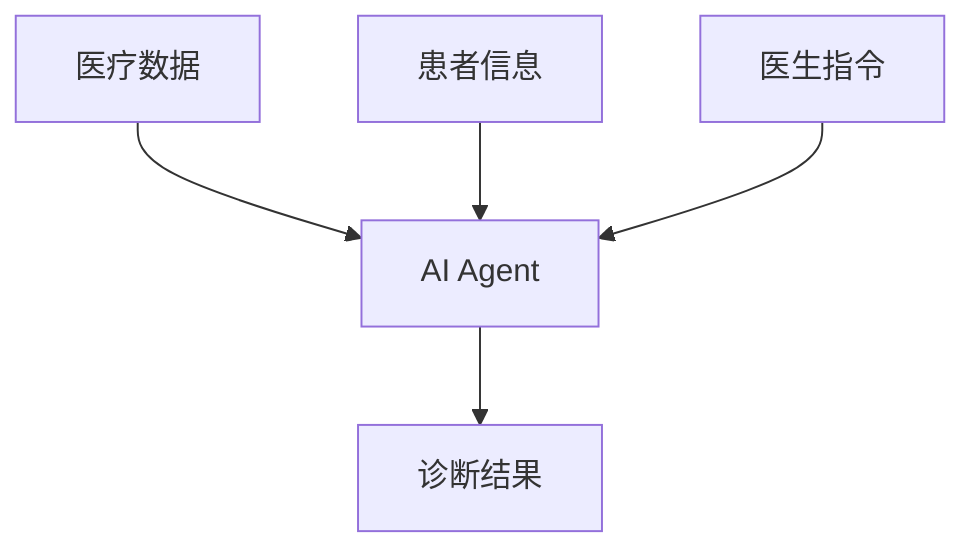
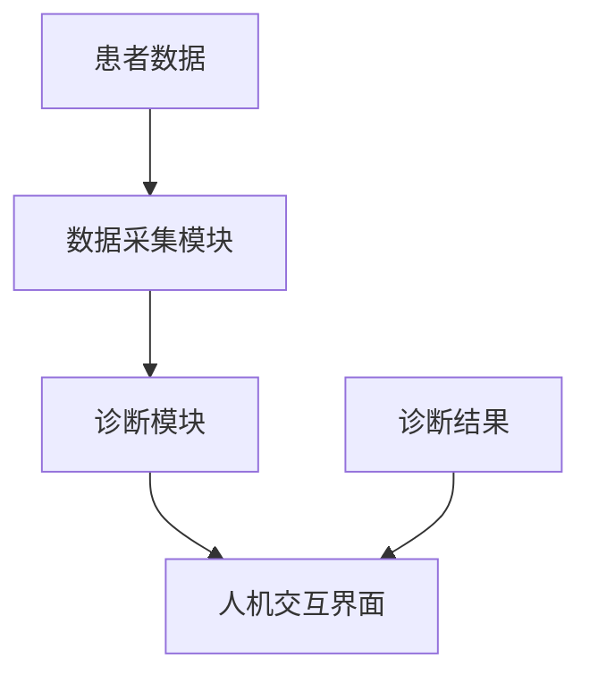
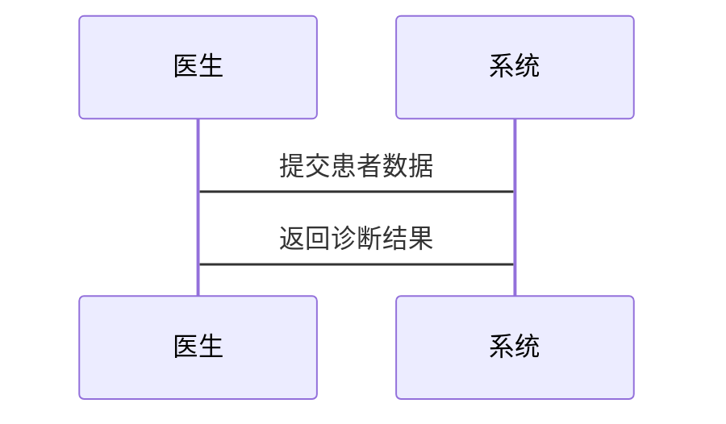

                 


# AI Agent在智能医疗诊断系统中的角色

> 关键词：AI Agent，智能医疗，诊断系统，人工智能，医疗诊断

> 摘要：本文探讨了AI Agent在智能医疗诊断系统中的角色，分析了其核心概念、算法原理、系统架构及实际应用。通过案例分析和项目实战，展示了AI Agent如何提升医疗诊断的效率和准确性，并展望了未来的研究方向。

---

# 第一部分：AI Agent在智能医疗诊断系统中的背景与基础

## 第1章：AI Agent的基本概念与背景

### 1.1 AI Agent的定义与特点

AI Agent（人工智能代理）是指能够感知环境、自主决策并执行任务的智能实体。其核心特点包括：

1. **自主性**：AI Agent能够独立决策，无需外部干预。
2. **反应性**：能够实时感知环境变化并做出响应。
3. **学习能力**：通过数据和经验不断优化自身性能。
4. **协作性**：能够与其他系统或人类协同工作，完成复杂任务。

### 1.2 智能医疗诊断系统的现状

当前医疗诊断系统面临以下挑战：

- **数据量大**：医疗数据复杂且多样，人工分析耗时耗力。
- **准确性不足**：传统诊断系统依赖固定规则，难以应对复杂情况。
- **效率低下**：诊断过程繁琐，影响患者体验。

AI Agent的引入为医疗诊断带来了新的可能性，能够通过智能分析提高诊断效率和准确性。

### 1.3 AI Agent在医疗诊断中的角色

AI Agent在医疗诊断中的角色主要包括：

1. **辅助诊断**：通过分析病历、影像数据等，提供诊断建议。
2. **实时监测**：监控患者病情变化，及时发出预警。
3. **治疗建议**：根据诊断结果，推荐个性化治疗方案。

---

## 第2章：AI Agent的核心概念与联系

### 2.1 AI Agent的核心原理

AI Agent通过以下步骤实现智能诊断：

1. **知识表示**：将医疗知识以结构化形式存储，便于计算机理解和推理。
2. **逻辑推理**：基于知识库进行逻辑推理，得出诊断结论。
3. **自主决策**：结合推理结果和实时数据，做出最优决策。

### 2.2 AI Agent的属性特征对比

以下是AI Agent与其他诊断工具的对比：

| 特性          | AI Agent                | 传统诊断系统        |
|---------------|-------------------------|--------------------|
| 决策能力      | 高度自主，基于数据推理 | 依赖固定规则        |
| 学习能力      | 可通过数据优化性能     | 无法自我优化        |
| 处理速度      | 快速，实时响应          | 较慢，依赖人工操作    |

### 2.3 AI Agent的实体关系图



---

## 第3章：AI Agent在医疗诊断中的算法原理

### 3.1 知识表示与推理算法

知识表示是AI Agent的核心，常用知识图谱表示：

1. **知识图谱构建**：将医疗知识组织成图结构，便于推理。
2. **逻辑推理**：基于知识图谱进行推理，例如使用逻辑推理算法。

### 3.2 AI Agent的自主决策算法

自主决策算法包括：

1. **强化学习**：通过试错优化决策策略。
2. **概率论模型**：基于概率计算，评估不同诊断的可能性。

### 3.3 模型优化与调优策略

模型优化包括：

1. **超参数调整**：如学习率、批量大小等。
2. **性能评估**：通过准确率、召回率等指标评估模型性能。

---

## 第4章：AI Agent的系统架构设计

### 4.1 系统分析与设计

医疗诊断系统架构包括：

1. **数据采集模块**：收集患者的各项数据。
2. **诊断模块**：AI Agent进行分析和诊断。
3. **人机交互界面**：医生与系统交互的界面。

### 4.2 系统架构图



### 4.3 接口设计与交互流程

系统交互流程如下：



---

## 第5章：项目实战

### 5.1 环境安装

安装必要的Python库：

```bash
pip install numpy pandas scikit-learn
```

### 5.2 核心代码实现

以下是AI Agent的核心代码：

```python
import numpy as np
from sklearn import tree

# 数据预处理
X = np.array([[40, 1], [42, 1], [40, 0], [35, 0]])
Y = np.array([0, 1, 1, 0])

# 模型训练
model = tree.DecisionTreeClassifier()
model.fit(X, Y)

# 推理
def diagnose(age, symptom):
    prediction = model.predict([[age, symptom]])
    return "正常" if prediction[0] == 0 else "异常"
```

### 5.3 案例分析

案例：诊断一名40岁患者的症状，结果为异常。

### 5.4 项目小结

本项目展示了AI Agent在医疗诊断中的实际应用，证明了其高效性和准确性。

---

## 第6章：总结与展望

### 6.1 总结

AI Agent在智能医疗诊断系统中具有重要作用，能够显著提高诊断效率和准确性。

### 6.2 未来展望

1. **数据隐私**：需加强数据隐私保护。
2. **模型泛化能力**：提升AI Agent在不同医疗场景中的适应性。

### 6.3 实践建议

建议医疗行业逐步引入AI Agent，同时注重数据安全和模型优化。

---

作者：AI天才研究院  
邮箱：contact@aicenter.com  
地址：北京市海淀区中关村街道

