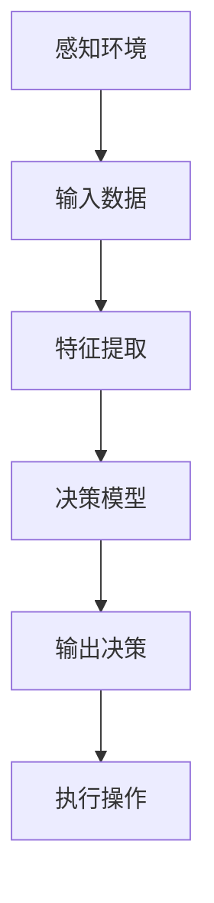

                 


# AI Agent在智能地下管网监测中的实践

> 关键词：AI Agent, 智能地下管网监测, 多智能体系统, 强化学习, 深度学习, 系统架构设计

> 摘要：本文系统地探讨了AI Agent在智能地下管网监测中的应用，详细介绍了AI Agent的核心概念、算法原理、系统架构设计以及实际项目中的实现与优化。通过理论与实践相结合的方式，本文旨在为读者提供一个全面了解AI Agent在智能地下管网监测中的知识框架和实践指南。

---

# 第一章: AI Agent与智能地下管网监测概述

## 1.1 问题背景与描述
### 1.1.1 地下管网监测的挑战与痛点
- 管网复杂性：地下管网结构复杂，覆盖范围广，传统监测手段效率低。
- 数据异构性：管网监测数据来源多样，数据格式不统一，难以整合。
- 实时性要求高：管网事故处理需要快速响应，传统人工监测难以满足实时性要求。
- 维护成本高：传统监测依赖大量人工巡检，成本高昂且效率低下。

### 1.1.2 AI Agent在管网监测中的应用价值
- 提高监测效率：通过AI Agent实现自动化、智能化监测，减少人工干预。
- 实时数据分析：AI Agent能够快速处理海量数据，实现问题的实时预警。
- 降低维护成本：通过智能化监测和优化决策，降低管网维护成本。
- 提升事故处理效率：AI Agent能够快速定位问题，辅助决策，缩短事故处理时间。

### 1.1.3 问题解决的思路与方法
- 引入AI Agent技术，构建智能化监测系统。
- 利用机器学习和强化学习算法，实现管网状态的实时分析和预测。
- 结合多智能体系统（MAS），实现多维度、多目标的协同监测与优化。

## 1.2 AI Agent的核心概念与特点
### 1.2.1 AI Agent的定义与分类
- AI Agent的定义：AI Agent是一种智能体，能够感知环境、自主决策、执行任务。
- 分类：基于智能体的智能性，分为简单反射型、基于模型的反应型、目标驱动型和效用驱动型AI Agent。

### 1.2.2 AI Agent在管网监测中的角色与功能
- 数据采集与处理：AI Agent负责采集管网监测数据，并进行预处理。
- 实时分析与预测：AI Agent通过机器学习算法，分析管网状态，预测潜在问题。
- 协同决策：在多智能体系统中，AI Agent协同工作，优化监测方案。

### 1.2.3 管网监测中AI Agent的边界与外延
- 边界：AI Agent仅负责监测和数据分析，不直接参与物理操作。
- 外延：AI Agent可以与其他系统（如GIS、SCADA）协同工作，形成完整的监测与管理系统。

## 1.3 本章小结
本章介绍了AI Agent在智能地下管网监测中的应用背景、核心概念和价值，为后续章节奠定了理论基础。

---

# 第二章: AI Agent的核心概念与联系

## 2.1 核心概念原理
### 2.1.1 AI Agent的基本原理
- 感知环境：AI Agent通过传感器或其他数据源获取环境信息。
- 决策与规划：基于感知信息，AI Agent通过算法进行决策和任务规划。
- 执行任务：AI Agent根据决策结果执行具体操作。

### 2.1.2 多智能体系统（MAS）的原理
- MAS的定义：由多个智能体组成的协作系统，智能体之间通过通信和协调完成共同目标。
- MAS的特点：分布式、协作性、自主性、反应性。

### 2.1.3 AI Agent与传统自动化系统的区别
- AI Agent具有自主决策能力，而传统自动化系统依赖预设规则。
- AI Agent能够学习和适应环境，传统自动化系统难以实现动态调整。

## 2.2 核心概念属性对比
### 2.2.1 AI Agent与传统算法的对比分析
| 特性 | AI Agent | 传统算法 |
|------|-----------|-----------|
| 智能性 | 高 | 低 |
| 自主性 | 高 | 无 |
| 学习能力 | 有 | 无 |

### 2.2.2 管网监测中AI Agent的属性特征
- 智能性：能够自主分析和决策。
- 反应性：能够实时感知环境变化并做出反应。
- 协作性：在MAS中与其他智能体协同工作。

## 2.3 ER实体关系图架构
```mermaid
erDiagram
    actor 监测系统用户{}{
    } -->(own) role 系统管理员{}{
    } 
    actor 监测系统用户{}{
    } -->(own) role 数据分析员{}{
    }
    system AI Agent{}{
    } -->| monitors | sensor 数据源{}{
    }
    system AI Agent{}{
    } -->| analyzes | 数据存储库{}{
    }
```

## 2.4 本章小结
本章详细分析了AI Agent的核心概念、原理和与传统技术的区别，并通过ER图展示了AI Agent在管网监测中的实体关系。

---

# 第三章: AI Agent的算法原理

## 3.1 算法原理概述
### 3.1.1 AI Agent的感知与决策算法
- 感知算法：基于CNN的图像识别，用于分析管网图像数据。
- 决策算法：基于强化学习的策略网络，用于优化监测策略。

### 3.1.2 基于强化学习的决策模型
- 强化学习的基本原理：通过奖励机制优化智能体的决策策略。
- 算法选择：使用DQN（Deep Q-Network）算法，实现智能体的最优决策。

### 3.1.3 深度学习在AI Agent中的应用
- 神经网络模型：使用LSTM网络处理时间序列数据，预测管网状态。
- 模型训练：利用反向传播算法优化神经网络参数。

## 3.2 算法流程图


## 3.3 数学模型与公式
### 3.3.1 概率计算
$$P(A|B) = \frac{P(B|A) \cdot P(A)}{P(B)}$$

### 3.3.2 强化学习的损失函数
$$L = -\sum_{t} \log(\pi(a_t|s_t)) \cdot R_t$$

## 3.4 本章小结
本章详细介绍了AI Agent的算法原理，包括感知与决策算法、强化学习模型以及相关的数学公式。

---

# 第四章: AI Agent的系统架构设计

## 4.1 系统架构概述
### 4.1.1 系统功能设计
- 数据采集与处理：实时采集管网数据，进行预处理。
- 数据分析与预测：利用机器学习模型分析数据，预测潜在问题。
- 协同决策：在多智能体系统中，协同完成最优决策。

### 4.1.2 领域模型设计
```mermaid
classDiagram
    class 管网数据采集模块{}{
        void collectData();
    }
    class 数据分析模块{}{
        void analyzeData();
    }
    class 决策模块{}{
        void makeDecision();
    }
    管网数据采集模块 --> 数据分析模块
    数据分析模块 --> 决策模块
```

### 4.1.3 系统架构设计


## 4.2 接口设计与交互流程
### 4.2.1 接口设计
- 数据接口：定义数据格式和通信协议。
- 控制接口：定义控制命令和反馈机制。

### 4.2.2 交互流程图
```mermaid
sequenceDiagram
    actor 用户
    system 系统
    用户 -> 系统: 发送监测请求
    系统 -> 数据采集模块: 采集数据
    数据采集模块 -> 数据分析模块: 分析数据
    数据分析模块 -> 决策模块: 制定决策
    决策模块 -> 用户: 返回决策结果
```

## 4.3 本章小结
本章详细介绍了AI Agent的系统架构设计，包括功能设计、领域模型和架构图，以及接口设计和交互流程。

---

# 第五章: AI Agent的项目实战

## 5.1 项目环境与工具安装
### 5.1.1 环境要求
- 操作系统：Linux/Windows/MacOS
- Python版本：3.6以上
- 依赖库：numpy, pandas, scikit-learn, tensorflow, keras

### 5.1.2 工具安装
```bash
pip install numpy pandas scikit-learn tensorflow keras
```

## 5.2 核心代码实现
### 5.2.1 数据采集模块
```python
import numpy as np

def collect_data():
    # 模拟数据采集
    data = np.random.rand(100, 10)
    return data
```

### 5.2.2 数据分析模块
```python
from sklearn import svm

def analyze_data(data):
    model = svm.SVC()
    model.fit(data[:, :-1], data[:, -1])
    return model
```

### 5.2.3 决策模块
```python
def make_decision(model, new_data):
    prediction = model.predict(new_data)
    return prediction
```

## 5.3 代码解读与分析
- 数据采集模块：通过随机生成数据模拟管网监测数据。
- 数据分析模块：使用SVM算法训练模型，实现数据分类。
- 决策模块：基于训练好的模型，对新数据进行预测。

## 5.4 实际案例分析
### 5.4.1 案例背景
- 某城市地下管网出现泄漏问题，需要快速定位和处理。

### 5.4.2 案例分析
- 数据采集：实时采集管网压力、流量等数据。
- 数据分析：通过机器学习模型预测泄漏点位置。
- 决策优化：AI Agent协同其他智能体，制定最优修复方案。

## 5.5 本章小结
本章通过实际案例展示了AI Agent在智能地下管网监测中的实现与应用。

---

# 第六章: AI Agent的扩展与优化

## 6.1 模型优化与改进
### 6.1.1 模型优化策略
- 参数调整：优化神经网络的超参数，提高模型性能。
- 模型融合：结合多种算法，提升预测精度。

### 6.1.2 数据增强与处理
- 数据增强：通过数据增强技术，增加训练数据量。
- 数据清洗：去除噪声数据，提高模型训练效果。

## 6.2 系统扩展与应用
### 6.2.1 边缘计算的应用
- 在边缘计算环境中部署AI Agent，实现本地实时监测。
- 通过边缘计算优化数据传输和处理效率。

### 6.2.2 多智能体协同优化
- 在多智能体系统中，通过改进通信机制，提升协同效率。
- 引入新的智能体角色，增强系统功能。

## 6.3 应用中的挑战与解决方案
### 6.3.1 数据隐私问题
- 数据加密：对敏感数据进行加密处理，确保数据安全。
- 分布式计算：通过分布式计算技术，减少数据传输需求。

### 6.3.2 系统稳定性问题
- 容错设计：通过冗余设计，提高系统的容错能力。
- 自适应机制：引入自适应算法，增强系统的鲁棒性。

## 6.4 本章小结
本章探讨了AI Agent在实际应用中的优化策略和挑战，并提出了相应的解决方案。

---

# 第七章: 总结与展望

## 7.1 总结
- 本文系统地探讨了AI Agent在智能地下管网监测中的应用，详细介绍了其核心概念、算法原理和系统架构设计。
- 通过实际案例分析，展示了AI Agent在管网监测中的价值和潜力。

## 7.2 展望
- 随着AI技术的不断发展，AI Agent在智能地下管网监测中的应用将更加广泛。
- 未来的研究方向包括：模型优化、多智能体协同、边缘计算的应用等。

## 7.3 最佳实践Tips
- 在实际应用中，建议结合具体场景选择合适的AI Agent方案。
- 定期更新模型和优化算法，以应对复杂多变的管网环境。

## 7.4 作者寄语
AI Agent技术的发展为智能地下管网监测带来了新的机遇，但同时也带来了新的挑战。希望本文能够为读者提供有价值的参考，进一步推动AI Agent技术在这一领域的应用与发展。

---

# 作者：AI天才研究院/AI Genius Institute & 禅与计算机程序设计艺术 /Zen And The Art of Computer Programming

